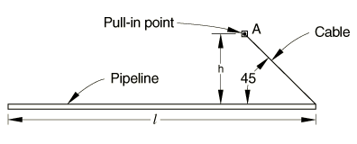
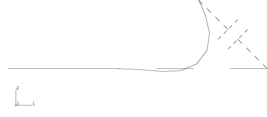

# 1.13.1 直接铺设于海底的管道拉入

**产品：** Abaqus/Standard  Abaqus/Aqua

在海上管道安装中遇到的一个问题是直接铺设于海底的管道响应，管道通过绞车将一端拉向某点。由于管道直接铺设于地面或海底，摩擦效应很重要。现场测量表明，对于直接铺设于海底的管道，横向运动的单位长度阻力（摩擦系数）高于纵向运动的阻力。Abaqus 允许通过其各向异性摩擦选项对这种效应进行建模。这是一个库仑摩擦模型，具有不同的横向和纵向运动摩擦系数。本模型使用刚度法；默认情况下，Abaqus 将选择"弹性滑移"发生在粘着期间。弹性滑移的值选择为模型中平均界面单元长度的一小部分。或者，用户可以选择指定粘着摩擦期间发生的弹性滑移量。应该指定一个相当小的弹性滑移值以获得适当的摩擦界面行为。太小的值将导致过多的迭代。选择这个弹性滑移的合理值是一个典型的小模型尺寸——例如，梁的直径。摩擦系数通常取自现场数据。我们在本例中选择用户指定的弹性滑移方法，因为模型中的平均界面单元长度只考虑梁单元长度而不是其直径。

使用球形间隙单元来建模无重电缆，电缆连接在管道端部和固定点之间，用于将管道绞入固定点。然后通过指定接触干涉将电缆长度指定为时间的函数。电缆只能承受拉力：如果电缆中的力变为压力，电缆变得松弛，并保持松弛状态，直到两点的相对位置使得电缆再次承受拉力。这种松弛电缆概念允许通过指定非常大的长度使任何电缆在任何时候失效。

### 问题描述

管道长 228.6 m（750 ft），外径 254 mm（10 in），壁厚 25.4 mm（1 in），最初为直管且无应力，假设铺设于坚硬海底。管道的一端通过无重电缆连接到固定点 *A*，*A* 相对于管道端部的偏移量如图 1.13.1-1](ch01s13ach95.md#sxmseafloor-geom) 所示。电缆逐渐缩短以模拟绞车过程，在此过程中管道端部被拉向 *A*。使用上述讨论的各向异性海底摩擦能力对管-海底相互作用进行建模；横向摩擦系数为 1.0，切向摩擦系数为 0.6。假设运动仅发生在模型平面内。使用十五个混合梁单元（B31H 类型）对管道进行建模。混合梁单元专门为建模非常细长的梁而制定，通常推荐用于此类管道建模。

### 海底建模

管道和海底之间的接触使用接触对进行建模。海底被建模为解析刚性表面。它是垂直于全局 *z* 轴的无限刚性平面，拉入运动发生在该平面上。

管道表面和海底之间的机械相互作用假设为各向异性摩擦接触，如前所述，具有"软化"接触（非线性压力-间隙表面相互作用模型）。对于这类问题，这种机械相互作用模型通常比完全硬表面的默认假设更现实。

由于假设拉入运动仅发生在  常数平面中，管道被定义为位于海底上方 0.2642 m（0.861 ft）处，并在垂直方向上被约束。这导致管道和海底之间的压力为 875.63 N/m（60.32 lb/ft）。只有在使用软化接触时，才能在垂直于刚性表面的方向上对管道进行这种约束。默认的硬接触只要从节点位于刚性表面上就会自动引入这种约束。

### 材料

管道由钢制成，弹性模量为 206.8 GPa（4.32×10⁹ lb/ft²），剪切模量为 103.4 GPa（2.16×10⁹ lb/ft²）。材料响应假设为弹性，因此使用通用梁截面来指定管道截面描述。这避免了对梁截面的数值积分。如果必须考虑材料非线性，则需要使用数值积分的梁截面。

### 边界条件

点 *A*（管道被绞入的点）被约束。管道的垂直位移被约束，以及关于 *x* 和 *y* 方向的旋转也被约束。

### 增量

使用自动增量选项来获得响应历史。由于解涉及摩擦，它是路径相关的；因此，需要相当数量的增量以确保解紧密跟踪实际响应路径。出于这个原因，指定了增量大小上限为总拉入量的 0.1。

### 结果和讨论

拉入完成时管道的构型如图 1.13.1-2](ch01s13ach95.md#sxmseafloor-finconfig) 所示。图中显示只有部分管道受到拉入的影响。这是所选摩擦系数值和管道柔性的结果。对于较低的摩擦系数（或较硬的管道），更多的管道将被绞车过程移动。

### 输入文件

[pipelinepullin.inp](../eif/pipelinepullin.inp)

本例的输入数据。

### 图形

**图 1.13.1-1** 摩擦海底上的管道拉入。

**图 1.13.1-2** 管道最终构型——各向异性摩擦。

