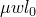
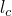
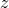
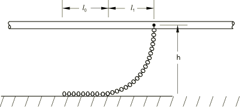
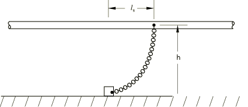
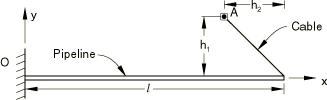
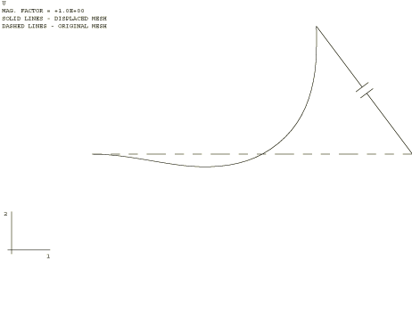
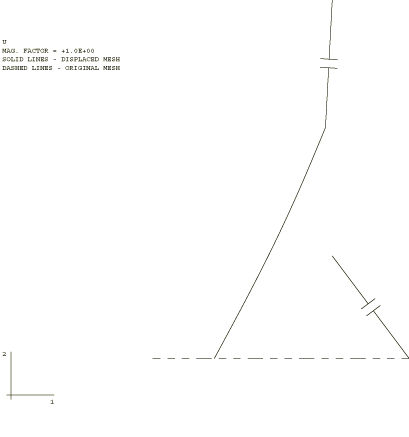

# 1.13.2 海底管道拉入和拖曳

**产品：** Abaqus/Standard  Abaqus/Aqua

海底管道安装的一种技术是"近底弯曲"方法。在这种方案中，沿着管道长度方向间隔一定距离安装链条，通常长 5-10 m（20-30 ft）。当管道下放到距海底约 3 m（10 ft）的位置时，链条的重量与安装在管道上的浮力装置相平衡。然后在每端将管道绞入位置，铺设于海底的链条长度作为运动的约束，从而对过程提供一些控制。本示例中的一个分析是预测整个"拉入"过程中管道的构型和应力，通常关注的是在不发生屈曲或在任何时候对管道过度应力的情况下实现令人满意的最终构型。作为第二个近海底管道安装示例，假设电缆长度保持不变，在未连接的端部规定运动，从而模拟拖曳过程。

在拉入或拖曳过程中，链条通常呈现如图 1.13.2-1](ch01s13ach96.md#sxmnearbot-dragchain) 所示的构型：连接点和海底之间的悬链线，以及沿着海底的一段长度（链条的这部分可能不沿海底直线铺设：其构型取决于之前的运动）。在 Abaqus 中，这被理想化为海底上的单个锚块，通过悬链线连接到连接点（图 1.13.2-2](ch01s13ach96.md#sxmnearbot-model)）。当使用二维拖曳链条时，模型需要指定两个参数：当系统滑动时连接点和锚块之间的水平距离 （即这些点之间可能的最大水平距离，因为水平力受摩擦力限制）以及这个最大摩擦力。通常， 选择为连接点和沿海底水平链条中点之间的水平距离，而最大摩擦力为 ，其中  是摩擦系数，*w* 是单位长度（水中）链条的重量， 是实际构型中海底上链条的长度。也可以使用三维拖曳链条。在这种情况下，模型需要指定三个参数：链条的总长度、摩擦系数和单位长度链条的重量。链条的总长度是海底上链条长度和悬挂长度之和。此外，对于三维分析，海底必须使用刚性表面定义，必须是平面且平行于全局 *X-Y* 平面。

这种拖曳链条的理想化通常对于比这些链条典型长度大几倍的运动是令人满意的（）。对于小运动（与  同阶），模型过于理想化，必须对链条本身进行建模。由于大多数安装程序涉及相当大的运动，该模型通常足够。

### 问题描述

这里用于说明该过程的示例包括一根长 304.8 m（1000 ft）、外径 228.6 mm（0.75 ft）、壁厚 7.62 mm（0.025 ft）的管道。这是一根相当细长的梁，因此选择了混合梁单元类型 B23H。（"混合"梁是混合公式单元，专为非常细长或非常刚性的系统设计。）管道的一端被绞入一个锚点，该点最初偏离管道一侧 121.92 m（400 ft），并从管道端部向后 91.44 m（300 ft）。管道的另一端假设是埋入的——即已经完整连接到某个刚性固定装置上，如图 1.13.2-3](ch01s13ach96.md#sxmnearbot-geom) 所示。

管道上有六个等间距的拖曳链条，因此为方便起见，使用五个单元对管道进行理想化。拖曳链条连接到节点。被绞入端的链条具有滑动时平均长度  为 7.62 m（25 ft），需要 556 N（125 lb）的力才能滑动。其他链条大小相同，滑动时平均长度为 1.524 m（5 ft），滑动力为 111 N（25 lb）。

为便于比较，也使用三维拖曳链条进行了分析。对于这种情况，使用混合梁单元类型 B33H，并对所有梁节点约束 *z* 方向位移以再现二维情况。等效的三维参数基于["拖曳链条"，《Abaqus 分析用户指南》第 32.11.1 节](../usb/usb-link.md#usb-elm-edragchain) 中概述的描述获得。管道端部的链条总长度  为 39.9 m（131 ft），摩擦系数  为 0.3，单位长度重量为 58.2 N/m（4.0 lb/ft）。其余链条总长度  为 7.98 m（26.2 ft），摩擦系数  为 0.1，单位长度重量为 1455 N/m（100 lb/ft）。梁在海底上方的高度 *h* 为 3.05 m（10 ft）。使用具有固定参考节点的圆柱形解析表面来模拟海底。参考节点用作 DRAG3D 单元的第二个节点，以将拖曳链条与海底关联。

电缆建模为球形间隙单元，提供不可伸长的电缆，只承受拉力不承受压力。可以通过使用接触干涉在整个步骤中改变电缆的长度。这里使用此功能在该步骤中将长度减小到零，从而实现拉入。

### 材料

管道由钢制成，弹性模量为 206.8 GPa（4.32×10⁹ lb/ft²）。由于假设材料响应在整个过程中保持弹性，使用了通用梁截面：使用此截面，Abaqus 精确积分弹性截面响应。如果涉及非线性材料响应，则需要截面的数值积分；因此，应改用梁截面。

### 边界条件

对于拉入分析，假设管道左端被刚性固定，包括完全旋转约束。对于三维分析，梁节点也在  方向被约束以模拟二维情况。刚性表面参考节点在所有六个自由度上被完全约束。在这种情况下，锚点节点在所有方向上被约束，因为拉入是朝向固定点的。

对于近海底拖曳分析，当使用 DRAG2D 单元时管道没有约束；然而，当使用 DRAG3D 单元时，管道如上所述在  方向被约束。拖曳沿 *y* 轴向上：锚点在 *x* 方向固定，在 *y* 方向规定 304.8 m（1000 ft）的运动。这意味着管道在初始构型中没有约束（因此是奇异的），直到拖曳链条充分延伸以稳定管道。为了克服分析早期阶段的数值困难，软弹簧连接到两个管道节点。当系统不再奇异时，解顺利 진행，自动时间增量算法控制增量大小。

### 结果和讨论

二维和三维拖曳链条单元产生相同的响应。以下讨论了两个示例的结果。

#### 拉入分析

拉入分析结束时管道的构型如图 1.13.2-4](ch01s13ach96.md#sxmnearbot-pull-in) 所示。观察管道的部分旋转很有趣：管道的一部分沿负 *y* 方向移动，高达 12.2 m（40 ft）。这可能是因为拉入的方向和拖曳链条提供的点状运动阻力。将此与["直接铺设于海底的管道拉入"第 1.13.1 节](ch01s13ach95.md)的结果进行对比是有益的，其中模拟了直接铺设于海底的管道的拉入。

#### 拖曳分析

在这种情况下，模拟因管道在其初始构型中缺乏约束而复杂化。在分析开始时，当点 *A*（参见图 1.13.2-3](ch01s13ach96.md#sxmnearbot-geom)）沿正 *y* 方向移动时，管道略微沿负 *x* 方向移动，远离电缆的管道部分也沿负 *y* 方向移动。然后，随着分析的进行，管道变直，在规定的拖曳运动结束时呈现如图 1.13.2-5](ch01s13ach96.md#sxmnearbot-tow) 所示的构型。

实际安装过程通常涉及比这里所示更复杂的绞车和对准历史。这样的复杂历史可以在一系列步骤中模拟，每个步骤指定安装的一个阶段。

### 输入文件

[nearbottompipeline_pullin.inp](../eif/nearbottompipeline_pullin.inp)

使用 DRAG2D 单元的拉入模拟。

[nearbottompipeline_tow.inp](../eif/nearbottompipeline_tow.inp)

使用 DRAG2D 单元的拖曳分析。

[nearbottompipeline_pullin_3d.inp](../eif/nearbottompipeline_pullin_3d.inp)

使用 DRAG3D 单元的拉入模拟。

[nearbottompipeline_tow_3d.inp](../eif/nearbottompipeline_tow_3d.inp)

使用 DRAG3D 单元的拖曳分析。

### 图形

**图 1.13.2-1** 实际拖曳链条。

**图 1.13.2-2** 拖曳链条模型。

**图 1.13.2-3** 管道拉入和拖曳问题（仅用于拉入分析的边界条件）。

**图 1.13.2-4** 最终构型——管道拉入，拖曳链条。

**图 1.13.2-5** 最终构型——使用拖曳链条的管道拖曳。

