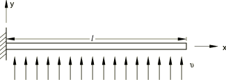
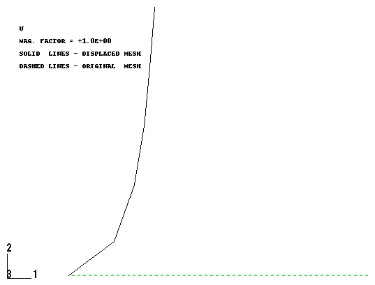

# 1.13.3 承受曳引的细长管道："风中的芦苇"

**产品：** Abaqus/Standard  Abaqus/Aqua

流过管道的流产生曳引载荷，在设计管道的约束和系泊时必须考虑这个载荷。曳引载荷大致与相对法向速度的平方（管道和流体速度之间的差异）成正比，其效应可能很显著，如本例所示。在数值上，曳引载荷产生非对称的载荷刚度贡献，因此得到的有限元方程也是非对称的。

Abaqus 使用 Morison 等人（1950）的方程来考虑曳引载荷。总曳 lực 分为切向、横向、惯性和升力贡献。前两个通过实验确定的切向和横向曳引系数分别将曳 lực 与相对速度的平方联系起来。惯性曳 lực 是基于相对加速度的"附加质量"贡献。当管道位于海底或平台附近时，升力项是相关的，因此当前速度在管道上发生变化。关于 Morison 曳 lực 公式的详细信息，请参见["曳引、惯性和浮力载荷"，《Abaqus 理论指南》第 6.2.1 节](../stm/stm-link.md#stm-ldc-dragbouyancy)。

### 问题描述

一根长 304.8 m（1000 ft）、最初为直管且无应力的管道，受到如图 1.13.3-1](ch01s13ach97.md#sxmslenpipe-geom) 所示的均匀横流 0.762 m/s（2.5 ft/sec）的作用。管道外半径为 76.2 mm（0.25 ft），壁厚为 15.24 mm（0.05 ft），因此管道是"细长的"且实际上不可伸长（其轴向刚度远大于弯曲刚度）。Abaqus 提供了一系列二维和三维混合梁单元，专为此类情况设计。在本例中，使用五个 B23H 单元对管道进行建模。

管道由线弹性材料制成，弹性模量为 206.8 GPa（4.32×10⁹ lb/ft²）。使用通用梁截面进行管道截面规格。这个选择避免了在分析过程中对管道截面进行数值积分，因此降低了计算成本。如果要考虑塑性或其他材料非线性，则需要对梁截面进行数值积分。

作用于管道的载荷来自沿全局 *y* 方向流动的均匀水流，如图 1.13.3-1](ch01s13ach97.md#sxmslenpipe-geom) 所示。水流速度为 0.762 m/s（2.5 ft/s），水的密度为 1000 kg/m³（1.94 slug/ft³）。横向曳引系数为 1.2，切向曳引系数为 0.002。这些系数之间的显著差异反映了横向和切向流动对管道的不同影响，切向曳引主要是表面摩擦效应。假设管道在一端埋入，如图 1.13.3-1](ch01s13ach97.md#sxmslenpipe-geom) 所示。

### 结果和讨论

由水流引起的曳引载荷产生的管道最终构型如图 1.13.3-2](ch01s13ach97.md#sxmslenpipe-dispconfig) 所示。曳引载荷的显著效应是显而易见的。对于这种单调加载、几何非线性问题，在分析早期阶段需要较小的载荷增量以实现收敛，并且随着分析进行，载荷增量可以增加。这是因为系统在原始构型中最为灵活。通过在收敛困难时减小载荷步，Abaqus 中的自动加载选项避免了用户实验以获得收敛解。这大大减轻了获得解的任务，通常降低了生成此类解的计算成本。因此，建议对此类问题使用自动增量。

### 输入文件

[slenderpipedrag.inp](../eif/slenderpipedrag.inp)

本分析使用的输入数据。

### 参考文献

Morison,  J. R., L. W. Johnson, M. P. O'Brien, and S. A. Schaaf, "The Force Exerted by Surface Waves on Piles," Transactions, American Institute of Mining, Metallurgical and Petroleum Engineers, Inc., vol. 189, pp. 149–154, 1950.

### 图形

**图 1.13.3-1** 承受曳引的细长管道。

**图 1.13.3-2** 承受曳引的管道位移构型。

