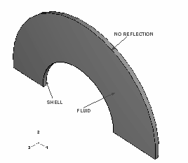
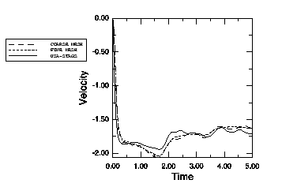
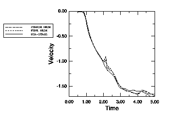
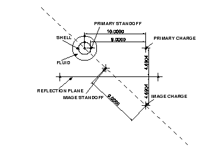
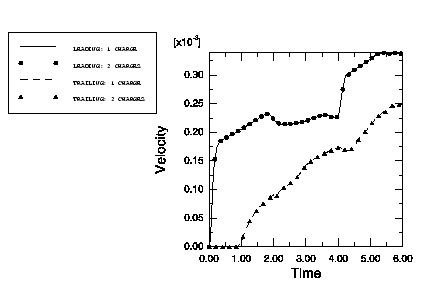

# 1.14.3 浸没无限圆柱问题

**产品：** Abaqus/Explicit

在此例中，我们分析受到具有阶跃函数轮廓（平面波）的平面冲击波激励的无限圆柱的弹性响应。USA-STAGS 程序（DeRuntz 和 Brogan，1980）计算的响应可以在 DeRuntz（1989）的论文中找到。Geers（1972）给出了无限圆柱的解析解。问题使用散射和总波公式进行分析，Abaqus/Explicit 计算的响应与 DeRuntz（1989）给出的结果进行比较。

在此问题的第二部分中，我们分析在具有底面的流体中无限圆柱的弹性响应。圆柱受到单个球形冲击波和来自底面的压力波反射的激励。Abaqus/Explicit 计算的此分析的响应与多次冲击波分析进行比较。

### 无限流体中的无限圆柱壳

### 问题描述

受到平面波激励的无限圆柱是一个具有单一对称平面的二维问题。此问题的半模型如图 1.14.3-1（[图 1.14.3-1](ch01s14ach100.md#model)）所示。沿圆柱轴施加平面应变边界条件，在 *x*–*z* 平面上施加对称边界条件。对结构模型施加边界条件。不需要为流体提供一致的边界条件集，因为它们默认应用。结构被包含在模拟周围流体的流体网格中。选择两种不同的网格并比较结果。假定无限圆柱完全浸没在流体中使得自由表面效应可忽略。假定圆柱壳由钢制成，流体假定为水；然而，材料特性已被无量纲化。结构和流体之间的耦合使用绑定约束来强制执行，这不需要兼容的网格。流体的网格密度选择使得冲击被准确捕获。非反射条件通过预定义的圆形辐射边界条件应用于流体网格的外表面。

爆炸发生在远离结构的 *x* 轴上。入射波载荷作为历史数据的一部分施加到结构和流体的界面，规定炸药位置和 standoff 点。由于波前是平面的，炸药位置仅用于计算入射冲击的方向。standoff 点选择为结构上最接近炸药的点，使得模拟开始于波前即将撞击结构之际。在炸药 standoff 点测量的冲击波的压力轮廓由幅值曲线给出。对于此问题，压力轮廓是幅值为 1.0×10⁴ 的阶跃函数。

半圆柱用 4 节点四边形壳单元建模。在两个模型中，结构都用 36 个 S4R 单元网格划分。流体网格在显示网格密度变化的模型中不同。流体网格用 AC3D8R 单元建模。分析在 Abaqus/Explicit 中以双精度运行，使用时间间隔的直接用户控制。体积粘性和间隔大小已被规定以优化求解效率，通过减少运行时间并准确捕获冲击。

### 结果与讨论

粗模型在径向使用平均网格尺寸 0.035 个单位，每个单元跨越 10°。在细模型中，径向平均网格尺寸为 0.02 个单位，每个单元跨越 5°。辐射表面距离壳结构中心 2 个单位。结果以领先节点（最接近炸药，参见[图 1.14.3-2](ch01s14ach100.md#leading)）和尾随节点（最远离炸药，参见[图 1.14.3-3](ch01s14ach100.md#trailing)）的径向速度值给出。Abaqus 结果与使用 USA-STAGS 程序获得的结果进行比较。代码之间有良好的一致性。

### 输入文件

[uc_xpl_coarse.inp](../eif/uc_xpl_coarse.inp)

粗网格模型，散射波公式。

[uc_xpl_fine.inp](../eif/uc_xpl_fine.inp)

细网格模型，散射波公式。

[uc_xpl_tot_coarse.inp](../eif/uc_xpl_tot_coarse.inp)

粗网格模型，总波公式。

[uc_xpl_tot_fine.inp](../eif/uc_xpl_tot_fine.inp)

细网格模型，总波公式。

### 参考

DeRuntz, J. A., Jr., Private Communication, 1990.

DeRuntz, J. A., Jr., "The Underwater Shock Analysis Code and its Applications," 60th Shock and Vibration Symposium Proceedings, vol. 1, pp. 89–107, 1989.

DeRuntz, J. A., Jr., and F. A. Brogan, "Underwater Shock Analysis of Nonlinear Structures, A Reference Manual for the USA-STAGS Code (Version 3)," DNA 5545F, Defense Nuclear Agency, Washington D.C., 1980.

Geers, T. L., "Scattering of a Transient Acoustic Wave by an Elastic Cylindrical Shell," Journal of the Acoustical Society of America, vol. 51, no.5 (part 2), pp. 1640–1651, 1972.

### 图表

**图 1.14.3-1** 圆柱壳模型。

**图 1.14.3-2** 前缘速度时间历史。

**图 1.14.3-3** 后缘速度时间历史。

### 带底面反射的无限圆柱壳

### 问题描述

无限圆柱受到来自相对接近结构的炸药的冲击波激励。包括来自底面的压力波反射效应。底面效应在 Abaqus 中使用成像技术处理，其中入射压力波由具有适当时间延迟的主要和图像贡献组成，自动计算。分析在 Abaqus/Explicit 中使用总波和散射波公式进行。

圆柱几何和流体特性与此例第一部分定义的那些相同。虽然结构是对称的，但载荷不是。因此，分析中不使用对称性。全圆柱模型的横截面如图 1.14.3-4（[图 1.14.3-4](ch01s14ach100.md#bottom-model)）所示。单个炸药位于 *x* 轴上距离圆柱（*z*）轴 10 个长度单位处。底面位于圆柱轴下方 4.6904 个长度单位处。假定 80% 的入射波从"软"底面反射。炸药位置与入射波特性一起作为数据包含。底面位置使用入射波反射规定。表面的反射特性被转换为等效阻抗特性并使用阻抗特性规定。模型由 72 个 4 节点四边形壳单元和 2880 个 AC3D8R 流体单元组成。standoff 点沿 *x* 轴放置在结构和流体接触的点处。

还考虑了双炸药模型，其中除了原始主要炸药外，底面由第二个"图像"炸药表示。图像炸药位于与主要炸药使用的相同 *x* 方向坐标处，但位于下方距离底面的两倍距离处。底面定义有意从此模型中排除。多次炸药由分析步骤内的多次入射波载荷定义表示。为了正确规定由于反射时的时间延迟，图像炸药与其 standoff 点之间的距离设置为等于主要炸药与其 standoff 点之间的距离。此外，standoff 点位于连接图像炸药与圆中心的线上。为了模拟部分反射要求，图像炸药幅值按反射系数 0.8 缩放。

### 结果与讨论

底面分析 [uc_xpl_1ch.inp](../eif/uc_xpl_1ch.inp) 和 [uc_xpl_tot_1ch.inp](../eif/uc_xpl_tot_1ch.inp) 使用恒定时间增量并在单一步骤中进行。结果以[图 1.14.3-5](ch01s14ach100.md#bottom-vel) 中领先节点（最接近主要炸药）的径向和切向速度值给出。由于更长的有效 standoff 距离，来自底面反射的压力波效应被延迟。多次炸药分析 [uc_xpl_2ch.inp](../eif/uc_xpl_2ch.inp) 和 [uc_xpl_tot_2ch.inp](../eif/uc_xpl_tot_2ch.inp) 的结果显示与底面分析完全一致。

### 输入文件

[uc_xpl_1ch.inp](../eif/uc_xpl_1ch.inp)

带单个炸药和底面的全圆柱模型。

[uc_xpl_2ch.inp](../eif/uc_xpl_2ch.inp)

带两个炸药且无底面的全圆柱模型。

[uc_xpl_tot_1ch.inp](../eif/uc_xpl_tot_1ch.inp)

带单个炸药的全圆柱模型，总波公式。

[uc_xpl_tot_2ch.inp](../eif/uc_xpl_tot_2ch.inp)

带两个炸药的全圆柱模型，总波公式。

### 图表

**图 1.14.3-4** 全圆柱底面模型。

**图 1.14.3-5** 速度时间历史比较。

