# 1.14.4 一维空化问题

**产品：** Abaqus/Explicit

当水下爆炸发生时，会产生压缩波。如果波到达水的自由表面，反射波是膨胀的，导致水中的拉应力。水无法承受高值拉力，可以离解，产生空化区域，这对海洋结构的响应有重大影响。在此例中，使用一维问题说明 Abaqus/Explicit 准确模拟这种情况的能力。研究了支撑漂浮质量-弹簧系统的流体柱，并将使用 Abaqus/Explicit 获得的结果与 Bleich 和 Sandler（1970）以及 Sprague 和 Geers（2001）获得的结果进行了比较。

### 问题描述

使用 AC2D4R 单元对具有恒定横截面积的刚性管道中的一维流体柱进行建模。在柱顶部，流体耦合到理想化漂浮结构，该结构由两个垂直定向的质量（ 和 ）通过刚度为 *K* 的弹簧连接。[图 1.14.4-1](ch01s14ach101.md#basic) 显示了模型的示意图。流体-固体系统受到在流体柱底部施加的平面、向上传播的阶跃-指数波的激励。平面波吸收边界也施加在柱底部，这对于一维声波是精确的。

为了模拟质量 ，将一个点质量单元附加到与流体柱最顶部两个节点垂直对齐的节点上。在质量-弹簧模型中，另外两个点质量附加到最顶部流体节点上方 5.08 m 处的节点上，以模拟质量 ，相应的点质量节点通过弹簧单元链接。在流体柱顶部，使用绑定约束将流体响应与结构响应耦合。在流体柱底部，施加平面波非反射边界条件。阶跃-指数波使用入射波载荷施加在流体柱的底面上，该载荷引用包含 standoff 点（流体柱底部）处波的离散压力-时间历史的幅值曲线。点质量在除垂直方向（自由度 2）外的所有方向上受到约束。使用非默认的总波公式来捕获空化效应。声学介质的空化压力极限设置为零，从而当绝对压力（入射波、散射波和静压力之和）变为负时引发空化。指定了流体中的初始声学静压力。

#### 单质量情况

在此例的第一部分中， 设置为零，复制了 Bleich 和 Sandler（1970）发布的模型问题。

流体柱深度为 3.81 m。使用单个 AC2D4R 单元堆栈对该柱进行网格划分，所有单元宽度为 38.1 mm，平面外厚度为 1.0 m。漂浮质量的吃水为 0.145 m。大气压为 0.101 MPa。流体密度为 989.0 kg/m³，声速为 1451.0 m/s，重力加速度为 9.81 m/s²。流体特性给出体积模量为 2.082242 GPa，这是与流体密度一起指定的值。初始条件的指定方式使得自由表面处的压力是大气压与漂浮质量引起的压力之和。因此，初始压力施加为从高度 0.145 m 处 *p* = 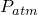 = 0.101 MPa（以包含漂浮质量的影响）到流体柱底部 *p* = 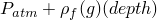 = 0.13937177 MPa 的线性变化。阶跃-指数波的最大压力为 0.7106 MPa，衰减时间为 0.9958 ms。此模型使用 100 个单元、每个单元高度为 38.1 mm 的粗网格和 381 个单元、每个单元高度为 10 mm 的细网格进行研究。

此外，比较了两种时间间隔尺寸确定方法：Sprague 和 Geers 使用的方法，以及 Abaqus/Explicit 自动计算的时间间隔尺寸。Sprague 和 Geers 使用固定时间间隔 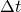 = 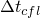/2，其中  是 Courant-Friedrichs-Lewy 时间增量极限，计算为  = 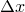/c，其中  是单元高度。因此，对于 38.1 mm 情况，此要求给出时间间隔为 13.12887 s，而对于 10 mm 情况，得出时间间隔为 3.445889 s。

#### 多质量情况

在此例的第二部分中，/ 的比值变化，以研究 Sprague 和 Geers（2001）的案例。检查了四种情况：/ = 0、/ = 1、/ = 5 和 / = 25。将获得的结果与 Sprague 和 Geers（2001）使用空化声学有限元（CAFE）模型获得的结果进行了比较。

流体柱深度为 3.0 m。使用单个 AC2D4R 单元堆栈对该柱进行网格划分，所有单元高度为 2.5 mm，宽度为 10 mm，平面外厚度为 1.0 m。大气压为 0.101 MPa。流体密度为 1025.0 kg/m³，声速为 1500.0 m/s，重力加速度为 9.81 m/s²。所有模型的吃水为 5.08 m，因此排开流体的质量等于排开体积乘以流体质量密度，即 52.07 kg。在 / = 0 的情况下，此质量全部分配给 。在第二种情况下 / = 1。为了将吃水保持在 5.08 m， 和  的总质量必须等于 52.07 kg。在  和  之间平均分配，得到  =  = 26.035 kg。对于 / = 5 的情况， 被分配质量 8.678333 kg，而  被分配质量 43.391667 kg。对于第四种情况 / = 25；因此， 为 2.0026923 kg，而  为 50.067308 kg。

参考论文中定义的弹簧常数使得质量  的固定基础固有频率在所有情况下都为 5 Hz：*K* = (5·2·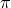)·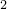·。因此，对于 / = 1 的情况，*K* = 12847.758 kg/s²；对于 / = 5，*K* = 21412.929 kg/s²；以及对于 / = 25，*K* = 24707.226 kg/s²。

初始条件的指定方式与单质量情况相同，在自由表面上方 5.08 m 处施加 0.101 MPa 的大气压，在 6 m 深度处施加 0.212412 MPa。阶跃-指数波的最大压力为 16.15 MPa，衰减时间为 0.423 ms。

对于所有质量比情况，使用固定时间间隔尺寸  = /2 = 0.8333 s 进行分析。对于 / = 5 的情况，在保持所有其他参数不变的情况下，还分析了使用较小时间间隔尺寸（ = /20 = 0.08333 s）的效果。

#### 子模型

此类分析也可以使用声学-结构子模型技术执行；本研究包括将使用子模型技术获得的结果与使用默认全局分析技术获得的结果进行比较的案例。此处说明的子模型技术在上要分析结构响应且流体的存在主要用于施加水下爆炸载荷到结构上的情况中很有用。在这种情况下，可以执行带有流体网格的单个全局分析，然后执行多个没有流体网格的子模型分析，其中结构参数变化并分析效果。由于子模型分析中没有流体网格，计算工作量可能显著减少。在本研究中，对于 / = 5 的情况说明了子模型技术，并运行 5 ms 的阶跃时间。首先，执行全局分析，并将流体堆栈顶部的结构位移（U）和声学压力（POR）写入结果文件。在全局分析完成后，执行子模型分析，其中模型仅包含结构，没有流体网格存在。此结构子模型由从全局分析提取的声学压力结果驱动。

#### 使用基于位移的单元建模空化

在某些水下爆炸情况中——例如，当水下爆炸发生在潜艇附近时——爆炸可能导致潜艇船体的大的结构位移。在结构位移非常大的情况下（如船体塑性破坏时），流体会迁移以填充位移体积。这种流体的大的运动最好使用基于位移的连续体单元进行建模，这些单元可以在 Abaqus/Explicit 中进行自适应网格划分以避免极端的网格变形。为了演示这种建模技术，使用单个 CPE4R 单元堆栈而不是 AC2D4R 单元对一维流体柱的空化进行建模。使用的几何和材料特性与多质量情况相同。使用重力载荷在流体柱上模拟静水压力的影响，并在流体柱顶部定义额外的分布压力载荷以考虑大气压和漂浮质量吃水的影响。为了建立初始平衡状态，指定了地静初始应力。使用线性  形式的状态方程材料来建模流体，并使用拉伸失效模型来模拟流体介质中的空化。选择材料参数以与用于声学单元模拟的声学介质特性密切匹配。在流体柱底部，通过定义类型为 CINPE4 的基于位移的无限单元来施加非反射边界条件。使用自适应网格划分来自适应地重新网格化流体域，以防止过度的网格变形。载荷与多质量情况使用的相同。

### 结果与讨论

通过将运行双精度 Abaqus/Explicit 做出的预测与参考文献中的预测进行比较来分析结果。

#### 单质量情况

我们将质量  的向上速度和 Abaqus/Explicit 获得的流体中空化区域时空变化与 Bleich 和 Sandler 获得的相同量进行比较。[图 1.14.4-2](ch01s14ach101.md#v1-38mm) 显示了 Abaqus/Explicit 获得的结果与 Bleich 和 Sandler 对由 38.1 mm 单元组成的粗网格的分析结果并排绘制。[图 1.14.4-3](ch01s14ach101.md#v1-10mm) 显示了由 10 mm 单元组成的较细网格的比较，而[图 1.14.4-4](ch01s14ach101.md#cavregion-1-mass) 显示了空化区域的比较。Abaqus/Explicit 获得的结果与理论结果显示出良好的比较。还发现，使用预定的固定时间间隔尺寸与 Abaqus/Explicit 中的自动时间间隔方案之间存在的结果差异不显著。

#### 多质量情况

[图 1.14.4-5](ch01s14ach101.md#v1-0-1) 到[图 1.14.4-11](ch01s14ach101.md#v2-25-1) 显示了 Abaqus/Explicit 结果与 Sprague 和 Geers 数值计算的结果并排显示。我们比较了速度 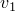 和  以及空化区域。在所有情况下都有良好的一致性。在 / = 5 的情况下，还显示了使用减小的时间间隔尺寸获得的速度。在 Abaqus/Explicit 中减小时间间隔尺寸对速度  和  没有显著影响。[图 1.14.4-12](ch01s14ach101.md#cavregion-0-1) 到[图 1.14.4-16](ch01s14ach101.md#cavregion-5-1-smalltime) 显示了四种不同质量比的空化区域比较。通过比较[图 1.14.4-14](ch01s14ach101.md#cavregion-5-1) 和[图 1.14.4-16](ch01s14ach101.md#cavregion-5-1-smalltime)，我们看到 Abaqus/Explicit 计算的空化区域显示对时间间隔尺寸的依赖性，这与 Sprague 和 Geers 的发现一致。

#### 子模型

[图 1.14.4-17](ch01s14ach101.md#v1-glob-sub) 和[图 1.14.4-18](ch01s14ach101.md#v2-glob-sub) 显示了对于 / = 5 的情况，全局分析和子模型分析结果之间的比较。可以看出，结果是一致的。

#### 使用基于位移的单元建模空化

[图 1.14.4-19](ch01s14ach101.md#v1-displbased) 和[图 1.14.4-20](ch01s14ach101.md#v2-displbased) 显示了使用声学单元和使用基于位移的单元的多质量情况分析结果之间的比较。结果显示了质量比 / = 5 的情况。两种分析的结果显示出良好的一致性。

### 输入文件

[1_mass_coarse.inp](../eif/1_mass_coarse.inp)

Bleich 和 Sandler 模型，粗网格。

[1_mass_fine.inp](../eif/1_mass_fine.inp)

Bleich 和 Sandler 模型，细网格。

[2_mass_0_1.inp](../eif/2_mass_0_1.inp)

/ = 0。

[2_mass_1_1.inp](../eif/2_mass_1_1.inp)

/ = 1。

[2_mass_5_1.inp](../eif/2_mass_5_1.inp)

/ = 5。

[2_mass_25_1.inp](../eif/2_mass_25_1.inp)

/ = 25。

[2_mass_5_1_global.inp](../eif/2_mass_5_1_global.inp)

/ = 5，全局模型。

[2_mass_5_1_sub.inp](../eif/2_mass_5_1_sub.inp)

/ = 5，子模型。

[2_mass_5_1_displbased.inp](../eif/2_mass_5_1_displbased.inp)

/ = 5，基于位移的单元。

### 参考

Bleich, H. H., and I. S. Sandler, "Interaction between Structures and Bilinear Fluids," International Journal of Solids and Structures, vol. 6, pp. 617–639, 1970.

Sprague, M. A., and T. L. Geers, "Computational Treatments of Cavitation Effects in Near-Free-Surface Underwater Shock Analysis," 72nd Shock and Vibration Symposium Proceedings, 2001.

### 图表

**图 1.14.4-1** 漂浮在流体柱上的双质量振子示意图。

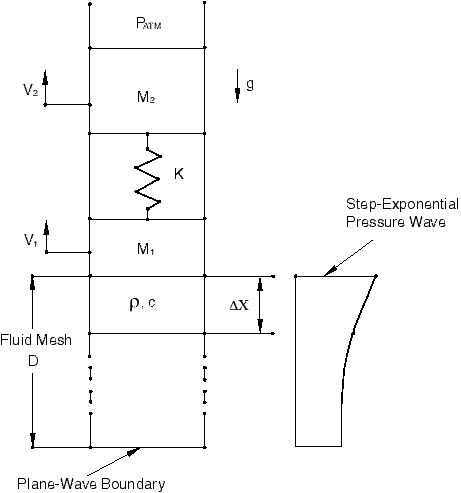

**图 1.14.4-2** Bleich 和 Sandler 模型粗网格的速度  比较。

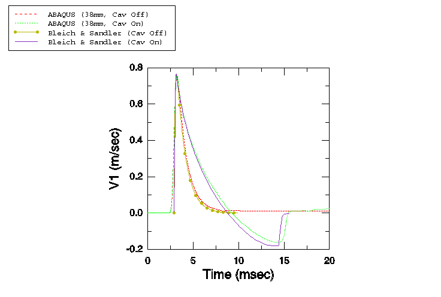

**图 1.14.4-3** Bleich 和 Sandler 模型细网格的速度  比较。

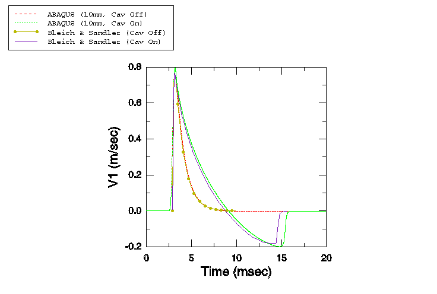

**图 1.14.4-4** Bleich 和 Sandler 模型的空化区域比较。

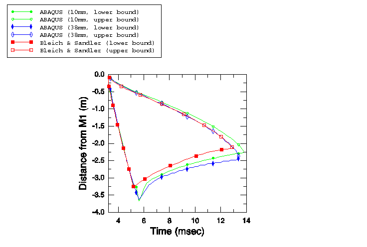

**图 1.14.4-5** / = 0 情况的速度  比较。

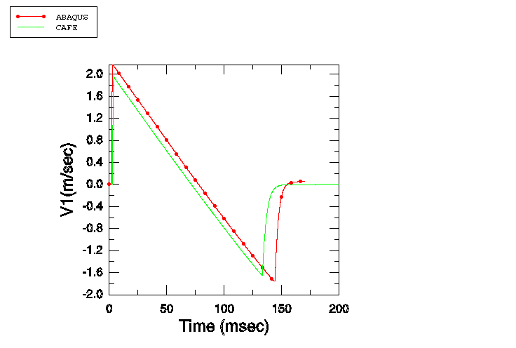

**图 1.14.4-6** / = 1 情况的速度  比较。

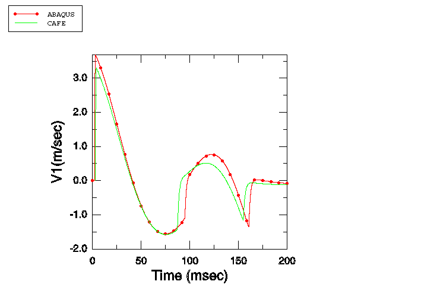

**图 1.14.4-7** / = 1 情况的速度  比较。

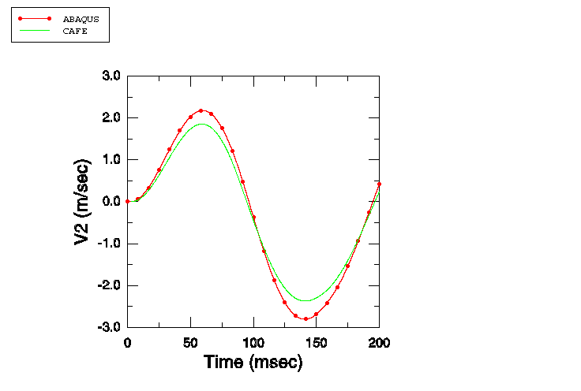

**图 1.14.4-8** / = 5 情况的速度  比较。

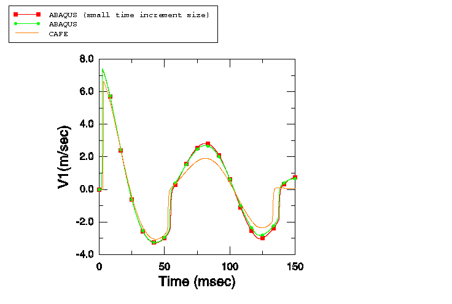

**图 1.14.4-9** / = 5 情况的速度  比较。

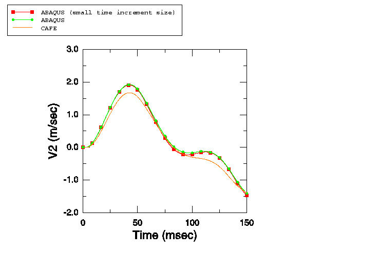

**图 1.14.4-10** / = 25 情况的速度  比较。

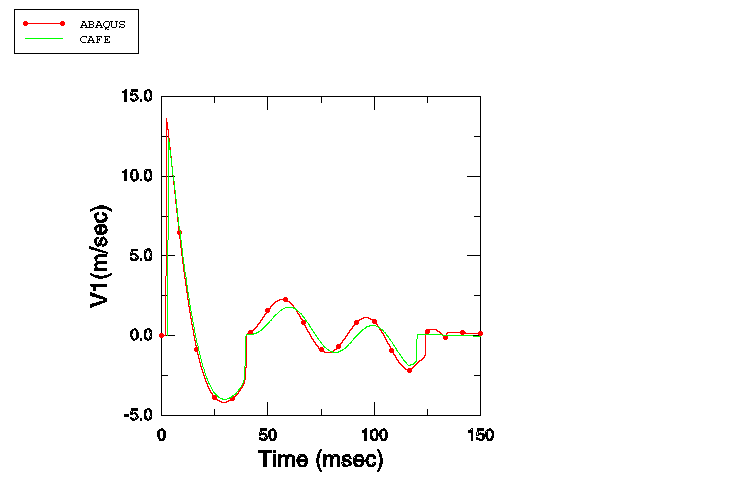

**图 1.14.4-11** / = 25 情况的速度  比较。

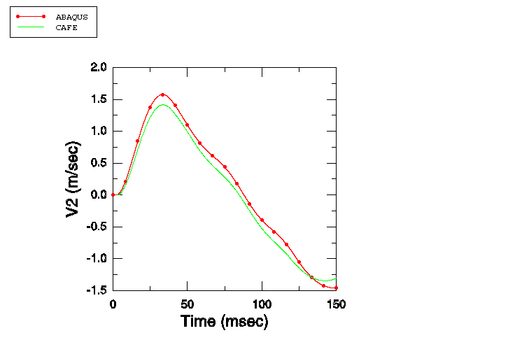

**图 1.14.4-12** / = 0 情况的空化区域比较。

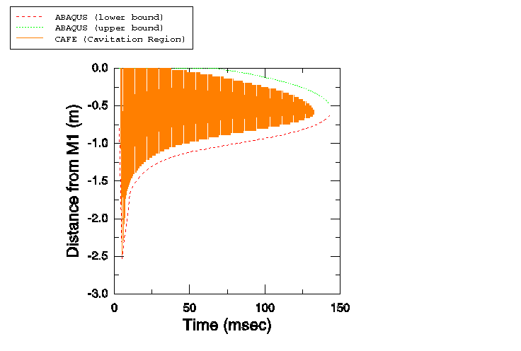

**图 1.14.4-13** / = 1 情况的空化区域比较。

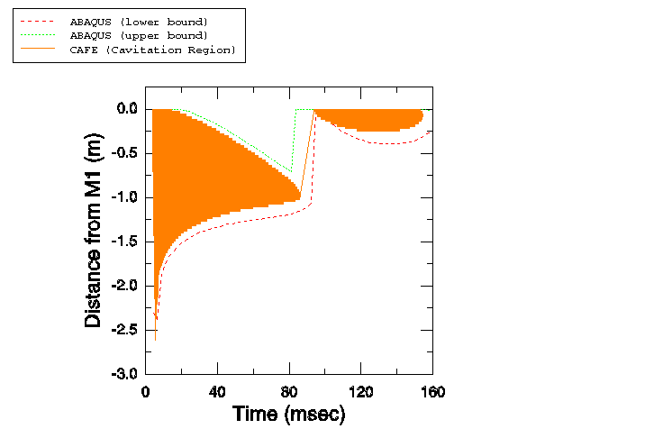

**图 1.14.4-14** / = 5 情况的空化区域比较。

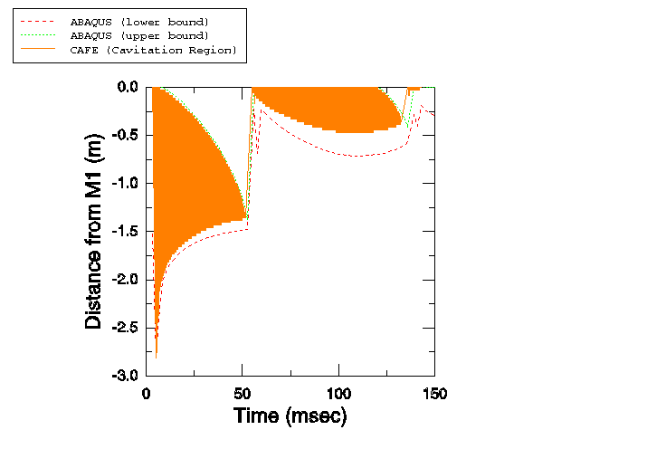

**图 1.14.4-15** / = 25 情况的空化区域比较。

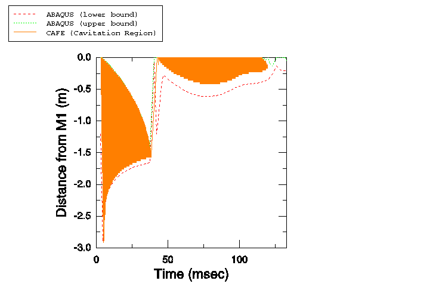

**图 1.14.4-16** 使用较小时间间隔尺寸的 / = 5 情况的空化区域比较。

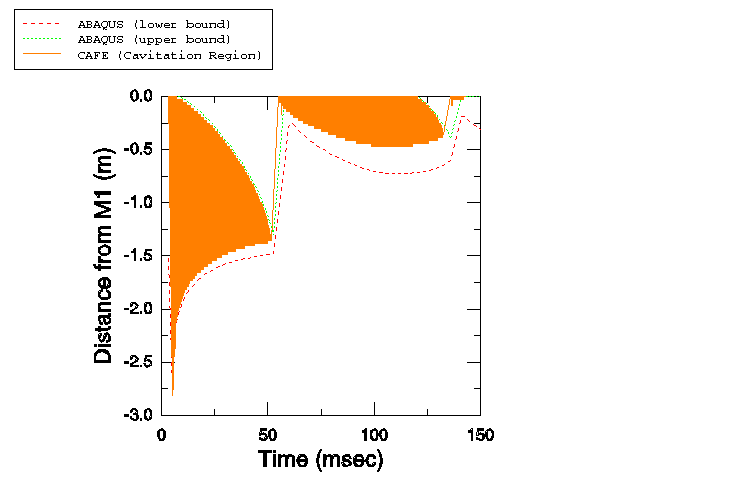

**图 1.14.4-17** 对于 / = 5 的情况，全局和子模型分析之间的速度  比较。

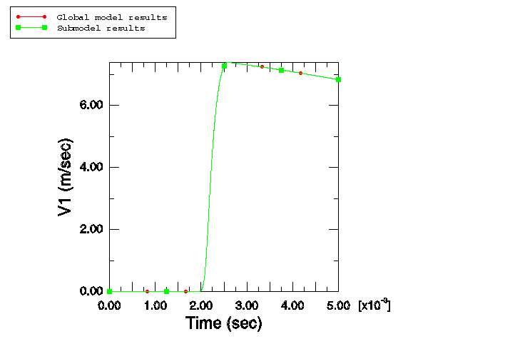

**图 1.14.4-18** 对于 / = 5 的情况，全局和子模型分析之间的速度  比较。

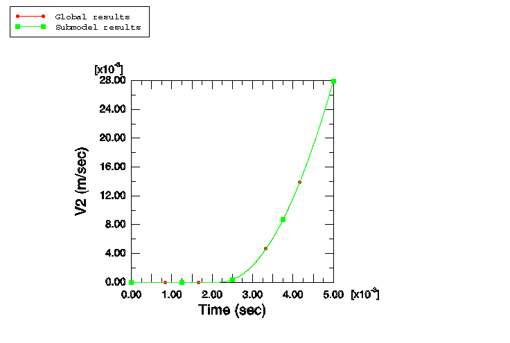

**图 1.14.4-19** 对于 / = 5 的情况，声学单元和基于位移的单元分析之间的速度  比较。

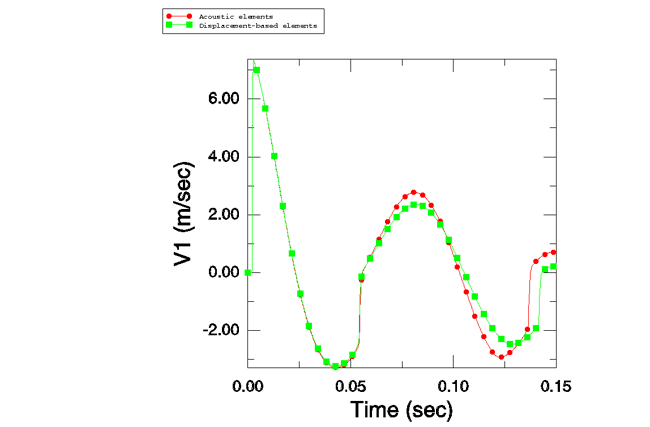

**图 1.14.4-20** 对于 / = 5 的情况，声学单元和基于位移的单元分析之间的速度  比较。

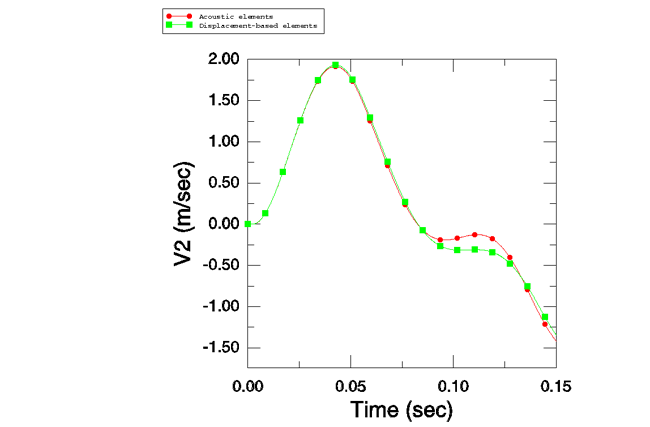
