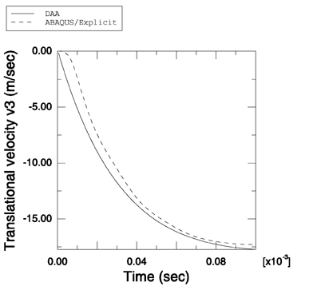

# 1.14.5 平板对平面指数衰减冲击波的响应

**产品：** Abaqus/Explicit

当水下爆炸发生时，会产生压缩波。该波可能对浸没结构产生重大影响。模拟简单几何形状的浸没结构对简单爆炸波前类型的响应构成了任何流固耦合代码验证的重要组成部分。在此例中，说明了 Abaqus/Explicit 建模空气背衬弹性板与平面指数衰减波之间相互作用的能力。使用 Abaqus/Explicit 获得的结果与使用双重渐近近似（Geers（1978），Abaqus/USA 6.1）独立获得的结果进行了比较。此问题已由 Taylor（1950）解析求解。

### 问题描述

此问题建模空气背衬弹性板与最大压力为 15.4 MPa、衰减时间为 0.433 ms 的弱平面指数衰减冲击波之间的相互作用。与 Taylor 的解不同，使用了流体和固体介质的工程材料参数。板是边长为 1 m、厚度为 0.00635 m 的方形板。板由钢制成，密度为 7850 kg/m³，弹性模量为 210.0 GPa，泊松比为 0.3。流体是水，密度为 1000 kg/m³，其中声速为 1461 m/s。板由单个 S4R 单元表示，周围的流体由从板延伸到入射冲击波方向距离板 5.5 m 的流体区域表示。流体区域由 400 个 AC3D8R 单元的单个堆栈建模。平面非反射阻抗边界条件施加在距离板最远的流体区域的外表面上。流体响应使用绑定约束耦合到结构上，绑定约束施加在离板最近的流体表面和板上。流体-固体系统使用入射波载荷施加在流体-固体界面上的平面指数衰减波激励。此外，通过连接到板节点的四个弹簧来约束板的运动，每个弹簧的刚度为 4.919 MN/m。使用线性体积黏性参数 0.25 和二次体积黏性参数 10.0。

### 结果与讨论

Abaqus/Explicit 的结果与参考文献中的结果显示出良好的定性比较。我们还比较了使用 Abaqus/Explicit 获得的板传递的平移速度与使用 Abaqus/USA 6.1 获得的速度。如[图 1.14.5-1](ch01s14ach102.md#undex-plate-ped) 所示，结果高度一致。

### 输入文件

[undex_plate_ped.inp](../eif/undex_plate_ped.inp)

此分析的输入数据。

### 参考

Geers, T., "Doubly Asymptotic Approximations for Transient Motions of Submerged Structures," Journal of the Acoustical Society of America, vol. 64, pp. 1500–1508, 1978.

Taylor, G. I., "The Pressure and Impulse of Submarine Explosion Waves on Plates," Underwater Explosion Research, Office of Naval Research, vol. 1, pp. 1155–1173, 1950.

### 图表

**图 1.14.5-1** 使用双重渐近近似方法和 Abaqus/Explicit 获得的板平移速度的比较。

