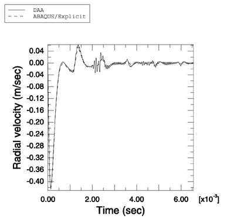
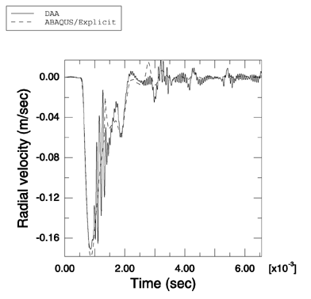

# 1.14.7 圆柱壳对平面指数衰减冲击波的响应

**产品：** Abaqus/Explicit

模拟简单几何形状的浸没结构对各种水下爆炸的响应构成了任何流固耦合代码验证的重要组成部分。在此例中，说明了 Abaqus/Explicit 建模空气背衬圆柱形弹性壳与平面指数衰减波之间相互作用的能力。使用 Abaqus/Explicit 获得的结果与使用双重渐近近似（Geers（1978），Abaqus/USA 6.1）独立获得的结果进行了比较。此问题已由 Huang（1970）解析求解。

### 问题描述

此问题建模空气背衬圆柱形弹性壳与最大压力为 1 MPa、衰减时间为 0.0137 ms 的弱平面指数衰减冲击波之间的相互作用。圆柱壳半径为 1 m，厚度为 0.029 m。壳由钢制成，密度为 7766 kg/m³，弹性模量为 206.4 GPa，泊松比为 0.3。流体是水，密度为 997 kg/m³，其中声速为 1524 m/s。使用半对称模型来研究此问题。宽度为 0.049 m 的薄轴向截面与对称边界条件一起用于表示实际圆柱体的无限长度。壳由 S4R 单元表示，周围的流体由从壳同心延伸且半径为 2.029 m 的流体区域表示。流体区域使用 AC3D8R 单元建模。流体网格密度在周向上与壳的密度相同；流体网格在径向上有 150 个单元/m。圆形非反射边界条件使用表面阻抗施加在流体的外表面上。流体响应使用绑定约束耦合到结构上，绑定约束施加在离壳最近的流体表面和壳本身上。流体-固体系统使用入射波载荷施加在流体-固体界面附近的平面指数衰减波激励。使用线性体积黏性参数 0.25 和二次体积黏性参数 10.0。

### 结果与讨论

通过将 Abaqus/Explicit 做出的预测与参考文献中的预测进行比较来分析结果。我们还比较了使用 Abaqus/Explicit 获得的圆柱壳前缘和后缘处径向速度的数值与使用 Abaqus/USA 6.1 获得的速度。如[图 1.14.7-1](ch01s14ach104.md#undex-cyl-ped-le) 和[图 1.14.7-2](ch01s14ach104.md#undex-cyl-ped-tr) 所示，结果高度一致。

### 输入文件

[undex_cyl_ped.inp](../eif/undex_cyl_ped.inp)

此分析的输入数据。

### 参考

Geers, T., "Doubly Asymptotic Approximations for Transient Motions of Submerged Structures," Journal of the Acoustical Society of America, vol. 64, pp. 1500–1508, 1978.

Huang, H., "An Exact Analysis of the Transient Interaction of Acoustic Plane Waves With a Cylindrical Elastic Shell," Journal of Applied Mechanics, vol. 37, pp. 1091–1099, December 1970.

### 图表

**图 1.14.7-1** 使用双重渐近近似方法和 Abaqus/Explicit 获得的圆柱壳前缘处径向速度的比较。

**图 1.14.7-2** 使用双重渐近近似方法和 Abaqus/Explicit 获得的圆柱壳后缘处径向速度的比较。

