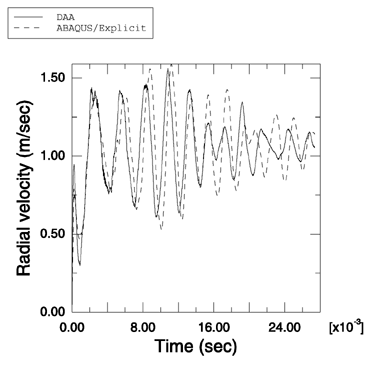
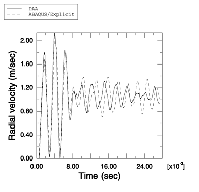

# 1.14.8 球壳对平面阶跃波的响应

**产品：** Abaqus/Explicit

模拟简单几何形状的浸没结构对各种水下爆炸的响应构成了任何流固耦合代码验证的重要组成部分。在此例中，说明了 Abaqus/Explicit 建模球形弹性壳与平面阶跃波之间相互作用的能力。使用 Abaqus/Explicit 获得的结果与使用双重渐近近似（Geers（1978），Abaqus/USA 6.1）独立获得的结果进行了比较。此问题已由 Huang（1969）解析求解。

### 问题描述

此问题建模空气背衬球形弹性壳与最大压力为 1 MPa 的弱平面阶跃冲击波之间的相互作用。与 Huang 的解不同，使用了流体和固体介质的工程材料参数。球体半径为 1 m，厚度为 0.02 m。球体由钢制成，密度为 7766 kg/m³，弹性模量为 210.0 GPa，泊松比为 0.3。流体是水，密度为 997 kg/m³，其中声速为 1462 m/s。对此分析使用轴对称模型。球壳由半圆形壳表示，周围的流体由两个同心半圆和对称轴界定的声学区域表示。球壳使用 SAX1 单元建模，周围的流体使用 ACAX4R 单元建模。界定流体区域的内半圆与壳体重合，外半圆半径为 3 m。球形非反射边界条件使用表面阻抗施加在外半圆上。流体响应使用绑定约束耦合到结构上。流体-固体系统使用入射波载荷在半圆壳与对称轴相交的点处施加的平面阶跃波激励。使用线性体积黏性参数 0.2 和二次体积黏性参数 1.2。

### 结果与讨论

Abaqus/Explicit 的结果与参考文献中的结果显示出良好的定性比较。我们还比较了使用 Abaqus/Explicit 获得的壳上前缘点和后缘点处径向速度的数值与使用 Abaqus/USA 6.1 获得的速度。如[图 1.14.8-1](ch01s14ach105.md#undex-sph-ps-le) 和[图 1.14.8-2](ch01s14ach105.md#undex-sph-ps-tr) 所示，结果高度一致。

### 输入文件

[undex_sph_ps.inp](../eif/undex_sph_ps.inp)

此分析的输入数据。

### 参考

Geers, T., "Doubly Asymptotic Approximations for Transient Motions of Submerged Structures," Journal of the Acoustical Society of America, vol. 64, pp. 1500–1508, 1978.

Huang, H., "Transient Interaction of Plane Acoustic Waves with a Spherical Elastic Shell," Journal of the Acoustical Society of America, vol. 45, pp. 661–670, 1969.

### 图表

**图 1.14.8-1** 使用双重渐近近似方法和 Abaqus/Explicit 获得的球壳前缘点处径向速度的比较。

**图 1.14.8-2** 使用双重渐近近似方法和 Abaqus/Explicit 获得的球壳后缘点处径向速度的比较。

