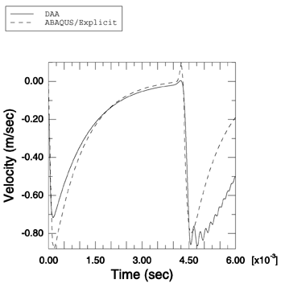
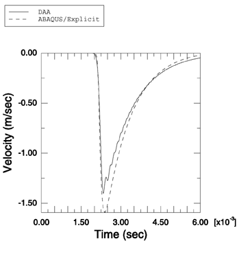

# 1.14.11 空气背衬耦合板对平面指数衰减波的响应

**产品：** Abaqus/Explicit

模拟简单几何形状的浸没结构对各种水下爆炸的响应构成了任何流固耦合代码验证的重要组成部分。在此例中，说明了 Abaqus/Explicit 建模两个流体耦合板与平面指数衰减波之间相互作用的能力。使用 Abaqus/Explicit 获得的结果与使用双重渐近近似（Geers（1978），Abaqus/USA 6.1）独立获得的结果进行了比较。此问题已由 Schechter 和 Bort（1981）解析求解。

### 问题描述

此问题建模两个流体耦合弹性板与最大压力为 1.57 MPa、衰减时间为 1.0 ms 的弱平面指数衰减冲击波之间的相互作用。第二块板（离冲击源更远的板）是空气背衬的。与 Schechter 和 Bort 的解不同，使用了流体和固体介质的工程材料参数。两块板都具有边长为 1 m、厚度为 0.016 m 的方形横截面。板之间的间距为 3.2 m。板由钢制成，密度为 7850 kg/m³，弹性模量为 210.0 GPa，泊松比为 0.3。流体是水，密度为 1026 kg/m³，其中声速为 1528 m/s。每块板用单个 S4R 单元建模。使用单个 AC3D8R 单元堆栈来建模第一块板前方和板之间的流体。使用表面阻抗在外部流体柱的端部施加平面非反射边界条件。流体响应使用绑定约束耦合到结构上，板表面作为主表面。流体-固体系统使用入射波载荷向第一块板施加的平面指数衰减波激励。使用线性体积黏性参数 0.02 和二次体积黏性参数 0.5。

### 结果与讨论

Abaqus/Explicit 的结果与参考文献中的结果显示出良好的定性比较。我们还比较了使用 Abaqus/Explicit 获得的板在波传播方向上的平移速度数值与使用 Abaqus/USA 6.1 获得的速度。如[图 1.14.11-1](ch01s14ach108.md#undex-coupled-plate-air-p2) 和[图 1.14.11-2](ch01s14ach108.md#undex-coupled-plate-air-p1) 所示，结果高度一致。

### 输入文件

[undex_coupled_plate_air.inp](../eif/undex_coupled_plate_air.inp)

此分析的输入数据。

### 参考

Geers, T., "Doubly Asymptotic Approximations for Transient Motions of Submerged Structures," Journal of the Acoustical Society of America, vol. 64, pp. 1500–1508, 1978.

Schechter, R. S., and R. L. Bort, "The Response of Two Fluid-Coupled Plates to an Incident Pressure Pulse," Naval Research Laboratory Memorandum Report, vol. 4647, October 1981.

### 图表

**图 1.14.11-1** 使用双重渐近近似方法和 Abaqus/Explicit 获得的第一块板平移速度的比较。

**图 1.14.11-2** 使用双重渐近近似方法和 Abaqus/Explicit 获得的第二块板平移速度的比较。

