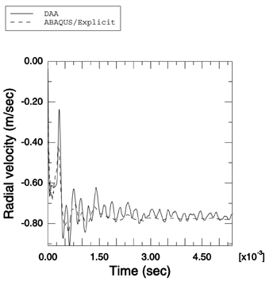
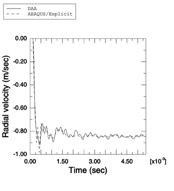

# 1.14.13 耦合圆柱壳对平面阶跃波的响应

**产品：** Abaqus/Explicit

模拟简单几何形状的浸没结构对各种水下爆炸的响应构成了任何流固耦合代码验证的重要组成部分。在此例中，说明了 Abaqus/Explicit 建模两个流体耦合同心圆柱与平面阶跃波之间相互作用的能力。使用 Abaqus/Explicit 获得的结果与使用双重渐近近似（Geers（1978），Abaqus/USA 6.1）独立获得的结果进行了比较。此问题已由 Huang（1979）解析求解。

### 问题描述

此问题建模两个流体耦合同心弹性圆柱与最大压力为 1.0 MPa 的弱平面阶跃冲击波之间的相互作用。内圆柱是空气背衬的。与 Huang 的解不同，使用了流体和固体介质的工程材料参数。内圆柱壳半径为 0.8 m，厚度为 23.24 mm，而外圆柱壳半径为 1 m，厚度为 5.81 mm。壳由钢制成，密度为 7766 kg/m³，弹性模量为 206.4 GPa，泊松比为 0.3。流体是水，密度为 997 kg/m³，其中声速为 1524 m/s。使用半对称模型。每个圆柱壳用 18 个 S4R 单元建模，每个单元在周向上跨越 10°，在轴向上跨越 175 mm。轴对称边界条件施加在壳单元的边缘上，以表示问题的无限轴向尺寸。圆柱之间和外部圆柱之外的流体用 AC3D8R 单元网格划分，每个声学单元在周向上跨越 10°。外部流体区域与圆柱同心，半径为 2.002 m。圆形非反射边界条件使用表面阻抗施加在外部流体区域的外表面上。流体响应使用绑定约束耦合到结构上。流体-固体系统使用入射波载荷在外圆柱壳上施加的平面阶跃波激励。使用线性体积黏性参数 0.25 和二次体积黏性参数 10.0。

### 结果与讨论

Abaqus/Explicit 的结果与参考文献中的结果显示出良好的定性比较。我们还比较了使用 Abaqus/Explicit 获得的内圆柱和外圆柱前缘处径向速度的数值与使用 Abaqus/USA 6.1 获得的速度。如[图 1.14.13-1](ch01s14ach110.md#undex-coupled-cyl-outer-le) 和[图 1.14.13-2](ch01s14ach110.md#undex-coupled-cyl-inner-le) 所示，结果高度一致。

### 输入文件

[undex_coupled_cyl.inp](../eif/undex_coupled_cyl.inp)

此分析的输入数据。

### 参考

Geers, T., "Doubly Asymptotic Approximations for Transient Motions of Submerged Structures," Journal of the Acoustical Society of America, vol. 64, pp. 1500–1508, 1978.

Huang, H., "Transient Response of Two Fluid-Coupled Cylindrical Elastic Shells to an Incident Pressure Pulse," Journal of Applied Mechanics, vol. 46, pp. 513–518, September 1979.

### 图表

**图 1.14.13-1** 使用双重渐近近似方法和 Abaqus/Explicit 获得的外圆柱壳前缘处径向速度的比较。

**图 1.14.13-2** 使用双重渐近近似方法和 Abaqus/Explicit 获得的内圆柱壳前缘处径向速度的比较。

