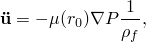
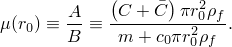
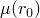

# 1.14.16 梁单元对平面波的响应

**产品：** Abaqus/Standard  Abaqus/Explicit

对简单几何形状的浸没结构对各种水下爆炸的响应进行模拟是任何流体-结构相互作用代码验证的重要组成部分。本示例展示了 Abaqus/Standard 和 Abaqus/Explicit 对梁单元对平面线性增加波的响应进行建模的能力。使用 Abaqus 获得的结果与使用 Hicks 方程在理论上确定的结果进行了比较。

### 问题描述

本问题对具有圆形横截面的梁单元对平面线性增加波的响应进行建模。为了验证入射波载荷特征，几个直径增加的梁承受相同的入射波载荷，横向。从 Hicks 我们有关于梁上实际载荷的表达式，以梁的横截面积和响应（作为梁结构质量和伴流体质量的函数）为函数。因此，刚性质量的加速度为

其中

在这些表达式中，*P* 是入射流体压力， 是流体质量密度， 是流体声速，*C* 和  是横截面的面积系数， 是横截面的（等效）圆形半径，*m* 是梁结构的质量。对于圆形横截面的梁，。

在 Abaqus 中浸没梁的载荷通过入射波载荷实现。在这个测试中，八个梁单元的非连接阵列承受在 90° 入射到阵列平面的平面波。波的幅度线性增加，提供均匀的压力梯度。这些梁具有相同的结构属性，但其润湿横截面从 0.3 m 变化到 35.0 m。因此，由于入射波在单元上产生的载荷将有所不同，并且由于不同的伴流体质量，响应也将有所不同。Abaqus/Standard 和 Abaqus/Explicit 都进行了测试。

### 结果和讨论

Abaqus/Standard 和 Abaqus/Explicit 的加速度结果总结在[表 1.14.16-1](ch01s14ach113.md#table-beamwaveaccelerations)中。结果与理论非常一致。

### 输入文件

[iw_bfi_bmk_std.inp](../eif/iw_bfi_bmk_std.inp)

Abaqus/Standard 分析。

[iw_bfi_bmk_xpl.inp](../eif/iw_bfi_bmk_xpl.inp)

Abaqus/Explicit 分析。

### 参考文献

Hicks, A. N., "The Theory of Explosion Induced Hull Whipping," Naval Construction Research Establishment, Dunfermline, Fife, Scotland, Report NCRE/R579, March 1972.

### 表格

**表 1.14.16-1** 有限元结果。
|  | *A* | *B* |  | 理论加速度（分量） | Abaqus/Standard 加速度（分量） | Abaqus/Explicit 加速度（分量） |
| --- | --- | --- | --- | --- | --- | --- |
| 0.3 | 579.6 | 3.262e4 | 1.777e2 | 8.17e9 | 8.17e9 | 8.17e9 |
| 1.0 | 6440.0 | 3.555e4 | 1.811e1 | 8.33e8 | 8.33e8 | 8.33e8 |
| 3.0 | 5.796e4 | 6.131e4 | 9.453e1 | 4.35e8 | 4.35e8 | 4.35e8 |
| 5.0 | 1.610e5 | 1.128e5 | 1.427 | 6.56e7 | 6.56e7 | 6.56e7 |
| 7.0 | 3.155e5 | 1.901e5 | 1.660 | 7.63e7 | 7.63e7 | 7.63e7 |
| 9.0 | 5.216e5 | 2.931e5 | 1.779 | 8.18e7 | 8.18e7 | 8.18e7 |
| 17.0 | 1.861e6 | 9.629e5 | 1.933 | 8.89e7 | 8.89e7 | 8.89e7 |
| 35.0 | 7.889e6 | 3.977e5 | 1.9837 | 9.12e7 | 9.12e7 | 9.12e7 |
