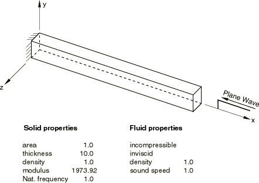
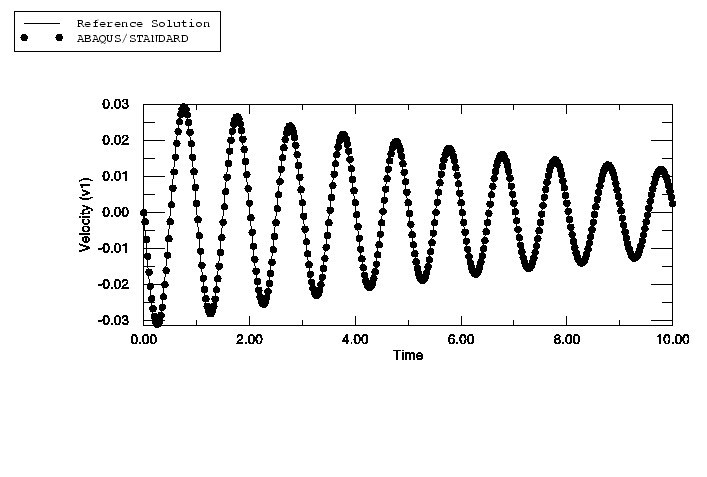
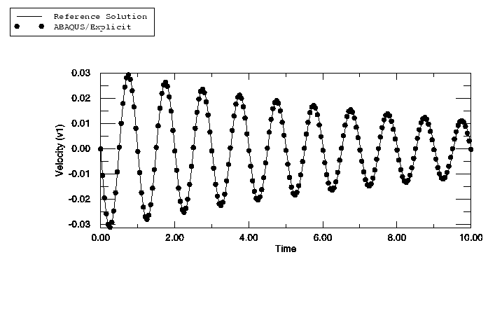
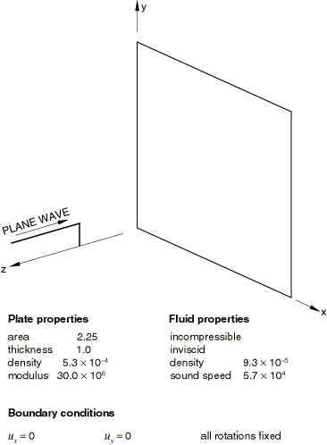
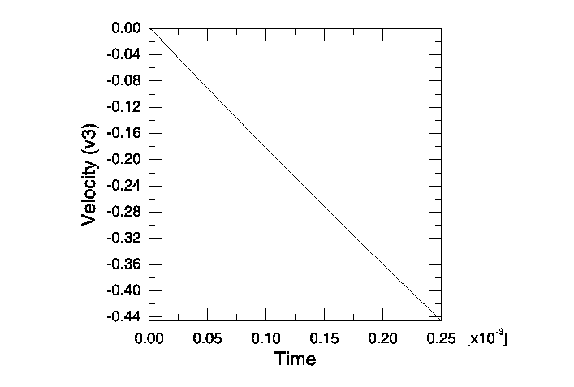
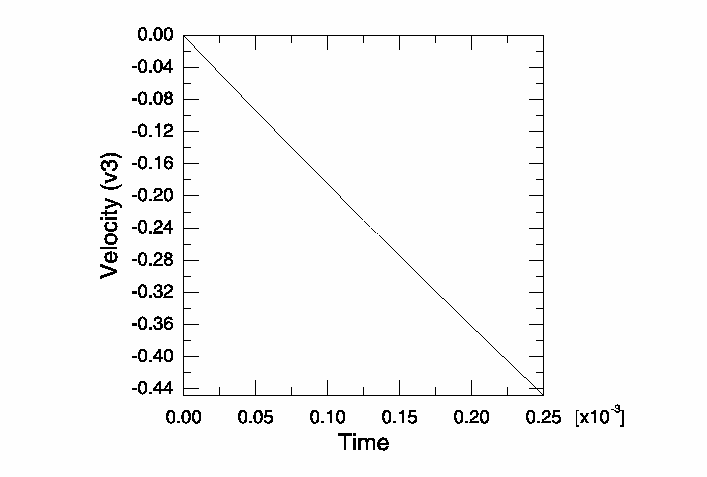

# 1.14.1 一维水下冲击分析

**产品：** Abaqus/Standard  Abaqus/Explicit

Abaqus 中的水下冲击分析能力通过使用入射波载荷来实现。耦合通过使用绑定约束来完成，其中 Abaqus 计算交互表面上结构的响应和流体压力响应。

### 水下冲击作用于一维连续体

### 问题描述

一维连续体模型分析如下所述。

#### 模型描述

Abaqus 模型（[图 1.14.1-1](ch01s14ach98.md#sxm1dusa-elasticmodel)）由一个约束为一维变形的单个 C3D8R 连续体单元组成。刚度和密度选择使得结构 alone 具有 1 Hz 的固有频率。单个声学单元耦合到结构单元。连续体单元具有单位横截面积，厚度为 10 个单位。这里分析两种情况。在第一种情况中，声学单元厚度设置为 0.01 个单位。在第二种情况中，厚度增加到 0.1 个单位。声学单元的表面和结构单元的表面绑在一起。流体密度和声速都设置为 1.0。平面波压力脉冲使用入射波载荷施加到连续体单元的前表面和声学单元的后表面。连续体单元的后表面保持固定，在声学单元的前表面上通过表面阻抗指定平面波吸收边界条件。压力脉冲沿 *x* 轴传播，是时间的阶跃函数。对于平面波，声源位于 (100, 0, 0)， standoff 点位于 (10, 0, 0)。分析运行 10 秒。连续体单元前表面的响应是一维的和振荡的。分析在 Abaqus/Standard（u1d_std_c3d8r_ac3d8.inp）和 Abaqus/Explicit（u1d_xpl_c3d8r_ac3d8r.inp）中都进行了。除了辐射边界条件外，结构或流体模型中都没有施加阻尼。然而，在 Abaqus/Explicit 中使用体积粘度来引入阻尼。线性体积粘度的值选择为 0.02，二次体积粘度的值选择为 0.5。

重启分析的模型数据保持不变。在初始运行中，载荷施加 2 秒。在重启运行期间，新动态步的初始条件从重启文件读取。载荷施加 2 秒。Abaqus/Standard 和 Abaqus/Explicit 都进行了重启分析。

### 结果和讨论

响应比较基于结构前表面的速度。Abaqus/Standard 和 Abaqus/Explicit 的速度与时间历史图分别如图 1.14.1-2](ch01s14ach98.md#std-continuum)和[图 1.14.1-3](ch01s14ach98.md#xpl-continuum)所示。这些图分别与参考解进行比较。Abaqus/Standard 和 Abaqus/Explicit 都与直接积分参考解完全一致。

### 输入文件

[u1d_shock_ref.f](../eif/u1d_shock_ref.f)

用于为一维连续体问题生成直接积分数值解的 FORTRAN 程序。该程序使用梯形积分。

[u1d_std_c3d8r_ac3d8.inp](../eif/u1d_std_c3d8r_ac3d8.inp)

Abaqus/Standard 分析：声学单元厚度为 0.01 个单位的 C3D8R/AC3D8 模型。

[u1d_xpl_c3d8r_ac3d8r.inp](../eif/u1d_xpl_c3d8r_ac3d8r.inp)

Abaqus/Explicit 分析：声学单元厚度为 0.01 个单位的 C3D8R/AC3D8R 模型。

[u1d_std_c3d8r_ac3d8_init.inp](../eif/u1d_std_c3d8r_ac3d8_init.inp)

用于重启分析的初始 Abaqus/Standard 运行。

[u1d_std_c3d8r_ac3d8_restart.inp](../eif/u1d_std_c3d8r_ac3d8_restart.inp)

重启分析。

[u1d_xpl_c3d8r_ac3d8r_init.inp](../eif/u1d_xpl_c3d8r_ac3d8r_init.inp)

用于重启分析的初始 Abaqus/Explicit 运行。

[u1d_xpl_c3d8r_ac3d8r_restart.inp](../eif/u1d_xpl_c3d8r_ac3d8r_restart.inp)

重启分析。

[u1d_std_c3d8r_ac3d8_diffthick.inp](../eif/u1d_std_c3d8r_ac3d8_diffthick.inp)

Abaqus/Standard 分析：声学单元厚度为 0.1 个单位的 C3D8R/AC3D8 模型。

[u1d_xpl_c3d8r_ac3d8r_diffthick.inp](../eif/u1d_xpl_c3d8r_ac3d8r_diffthick.inp)

Abaqus/Explicit 分析：声学单元厚度为 0.1 个单位的 C3D8R/AC3D8R 模型。

### 图形

**图 1.14.1-1** 一维连续体模型。

**图 1.14.1-2** Abaqus/Standard 模型速度-时间历史与参考解的比较。

**图 1.14.1-3** Abaqus/Explicit 模型速度-时间历史与参考解的比较。

### 水下冲击作用于一维板

### 问题描述

一维板模型分析如下所述。

#### 模型描述

Abaqus 模型（[图 1.14.1-4](ch01s14ach98.md#sxm1dusa-rigidmodel)）由一个约束为一维刚体平移的单个 S4R 壳单元组成。平面壳在 *X*–*Y* 平面中建模，所有边的长度为 1.5 个单位。壳属性为钢的属性。绑定约束用于将结构耦合到声学流体。建模的流体是水。平面波水下压力脉冲施加到结构单元的前表面和声学单元的后表面。源在 (0.75, 0.75, 100)，standoff 点在 (0.75, 0.75, 0)。脉冲沿 *z* 轴传播，是时间的阶跃函数。板的反作用是在一维中具有恒定加速度的刚体平移。响应比较基于板的速度时间历史。分析在 Abaqus/Standard（u1d_std_s4r_ac3d8.inp）和 Abaqus/Explicit（u1d_xpl_s4r_ac3d8r.inp）中都进行了。

### 结果和讨论

Abaqus S4R/AC3D8 模型结果与参考解相同。Abaqus/Standard 和 Abaqus/Explicit 的速度与时间历史图分别如图 1.14.1-5](ch01s14ach98.md#std-shell)和[图 1.14.1-6](ch01s14ach98.md#xpl-shell)所示。

### 输入文件

[u1d_std_s4r_ac3d8.inp](../eif/u1d_std_s4r_ac3d8.inp)

Abaqus/Standard 分析：S4R/AC3D8 模型。

[u1d_xpl_s4r_ac3d8r.inp](../eif/u1d_xpl_s4r_ac3d8r.inp)

Abaqus/Explicit 分析：S4R/AC3D8R 模型。

### 图形

**图 1.14.1-4** 一维板模型。

**图 1.14.1-5** Abaqus/Standard 模型速度-时间历史。

**图 1.14.1-6** Abaqus/Explicit 模型速度-时间历史。

