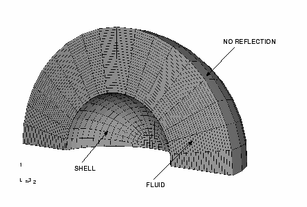
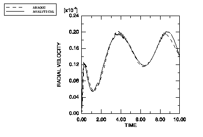
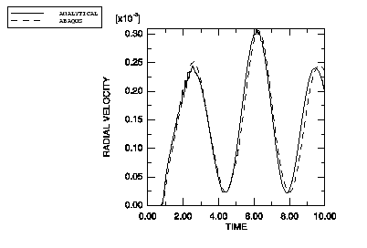

# 1.14.2 浸没球体问题

**产品：** Abaqus/Explicit

过去有两个测试问题特别用于验证任何代码的水下冲击模拟能力。这两个问题都是受到具有阶跃函数轮廓（平面波）的平面冲击波激励的浸没壳结构。第一个在此例中描述，是球壳；第二个在下个例中描述，是无限圆柱壳。浸没球壳的响应已由 Huang（Huang 和 Mair，1996）解析计算。在此例中，使用总波和散射波公式分析测试问题，并将 Abaqus/Explicit 计算的结果与解析结果进行比较。

### 问题描述

四分之一球体模型如图 1.14.2-1（[图 1.14.2-1](ch01s14ach99.md#sp-model)）所示。球体完全浸没在流体中，足够深以至于自由表面效应不重要。该图显示了用 4 节点壳单元建模的球体，包含在用声学流体单元建模的流体网格中。使用的材料特性基于钢球壳和水作为流体，但特性已被无量纲化。对结构模型施加对称边界条件。不需要为流体提供一致的边界条件集，因为它们默认应用。结构和流体之间的耦合使用绑定约束来强制执行，这不需要兼容的网格。流体的网格密度选择使得冲击被准确捕获。非反射条件通过预定义的球形辐射边界条件应用于流体网格的外表面。

爆炸发生在远离结构的 *y* 轴上。入射波载荷作为历史数据的一部分施加到结构和它们界面处的流体，规定炸药位置和 standoff 点。由于波前是平面的，炸药位置仅用于计算入射冲击的方向。standoff 点选择为结构上最接近炸药的点，使得模拟开始于波前即将撞击结构之际。在炸药 standoff 点测量的冲击波的压力轮廓由幅值曲线给出。对于此问题，压力轮廓是幅值为 1.0×10⁴ 的阶跃函数。

球体用 273 个 S4R 壳单元建模。流体用 3250 个 AC3D8R 声学流体单元网格划分。为了准确捕获冲击波前，每个流体单元径向尺寸为 0.03 个单位，而在极向和方位向都跨越 10°。单元必须足够小，使得显著的解特征（如 POR 中的峰值）跨越至少几个单元。如果计算结果显示 POR（或相应的结构自由度）在小于几个单元长度内变化很大，则可能需要网格细化。

### 结果与讨论

Abaqus 模型使用 0.01 个单位的时间增量和 10 个单位的总步骤时间。结果以领先节点（最接近炸药）和尾随节点（最远离炸药）的径向速度值给出。Abaqus/Explicit 结果与参考结果一起显示在[图 1.14.2-2](ch01s14ach99.md#sp-leading) 和[图 1.14.2-3](ch01s14ach99.md#sp-trailing) 中。两种情况的结果比较良好。

### 输入文件

[us_xpl.inp](../eif/us_xpl.inp)

球壳模型，散射波公式。

[us_tot_xpl.inp](../eif/us_tot_xpl.inp)

球壳模型，总波公式。

### 参考

Huang, H., and H. U. Mair, "The ROSEHIPS Program (Response Of a Spherical Elastic Shell to an Incident Plane Step pressure wave) for UNDEX Simulation Validation," 67th Shock and Vibration Symposium Proceedings, 1996.

### 图表

**图 1.14.2-1** 四分之一球壳模型。

**图 1.14.2-2** 领先节点速度时间历史。

**图 1.14.2-3** 尾随节点速度时间历史。

