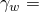
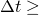
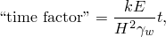
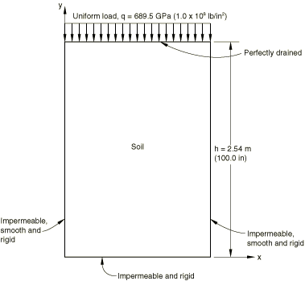
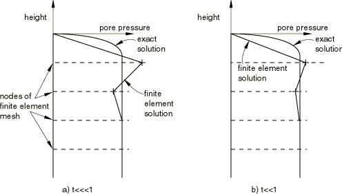
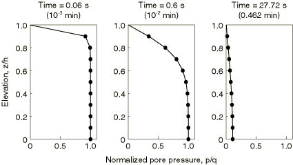
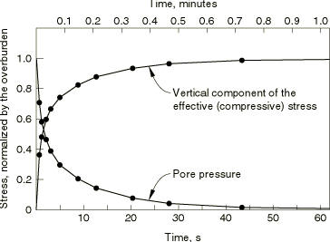
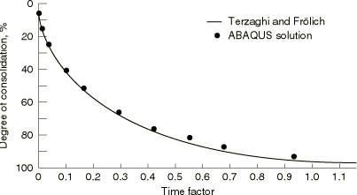
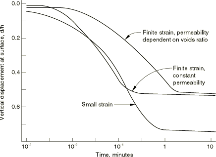

# 1.15.1 Terzaghi 固结问题

**产品：** Abaqus/Standard

这个一维问题有一个众所周知的线性解（见 Terzaghi 和 Peck，1948），因此提供了对 Abaqus 中固结功能的简单验证。饱和土的分析需要求解耦合应力-扩散方程，Abaqus 中使用的公式在《Abaqus 理论指南》第 2.8 节"多孔介质分析"和《Abaqus 理论指南》第 4.4 节"非金属塑性"中有详细描述。耦合通过有效应力原理近似，该原理将饱和土视为连续体，假设每点的总应力为土骨架承受的"有效应力"与渗透土的流体孔隙压力之和。这个流体孔隙压力可以随时间变化（如果外部条件改变，例如向土中施加荷载），而通过土中各点之间未被流体重量平衡的压力梯度将导致流体流动：流速与流体中的压力梯度成正比，符合达西定律。一个典型的情况是固结问题。这里，向土体施加荷载（通常是覆盖层）会导致孔隙压力最初升高；然后，随着土骨架承担额外的应力，孔隙压力随着土固结而衰减。Terzaghi 问题就是这种过程最简单的例子。为了说明的目的，此问题在有和无有限应变效应的情况下进行处理。小应变版本是 Terzaghi 和 Peck（1948）讨论的经典情况，有限应变版本已由包括 Carter 等人（1979）在内的许多作者进行了数值分析。

### 问题描述

问题如图 1.15.1-1（[图 1.15.1-1](ch01s15ach114.md#sxmterzaghi-geom)）所示。高度为 2.54 m（100 in）的土体被不透水、光滑、刚性墙限制，顶面除外。在该表面上可以实现完美排水，并突然施加荷载。忽略重力。由于边界条件，问题是一维的，唯一的梯度在垂直方向上。分析的目的是预测荷载施加后土体中位移、有效应力和孔隙压力随时间的演变。

### 几何和模型

Abaqus 没有用于有效应力计算的一维单元。因此，我们使用二维平面应变网格，在 *x* 方向上只有一个单元。选择单元类型 CPE4P 进行有限应变分析，选择单元类型 CPE8P 进行小应变分析。我们建议对涉及有限应变、冲击或复杂接触条件的应用使用线性单元，对必须准确捕获应力集中或必须建模几何特征（如曲面）的问题使用二次单元。在这个特定例子中，线性单元和二次单元产生几乎相同的结果。

土假定为线弹性，弹性模量为 689.5 GPa（10⁸ lb/in²），泊松比为 0.3。孔隙流体的比重假定为 276.8×10³ N/m³（1 lb/in³）。渗透率假定与孔隙比线性变化，在孔隙比为 1.5 时值为 8.47×10⁻⁸ m/sec（2.0×10⁻⁴ in/min），在孔隙比为 1.0 时值为 8.47×10⁻⁹ m/sec（2.0×10⁻⁵ in/min）。孔隙比假定在整个样本中最初为 1.5。Abaqus 使用有效渗透率，即渗透率除以孔隙流体的比重。因此，流体在此问题中被赋予比重值为 276.8×10³ N/m³（1 lb/in³）（例如，水的比重为 9965 N/m³，0.036 lb/in³），渗透率相应地缩放。

边界条件如下。在底部和两个垂直侧面上，位移的法向分量被固定（底部为 =0，侧面上为 =0），并且不允许孔隙流体通过墙壁流动。这是流体质量守恒方程中的自然边界条件，因此不需要明确规定（如平衡方程中的零牵引力）。在顶面上突然施加均匀向下的荷载（覆盖层）。此荷载的大小取为 689.5 GPa（10⁸ lb/in²）。这个大荷载将引起相当大的变形，从而说明小应变和大应变解之间的差异。此表面允许完美排水，因此超额孔隙压力在此表面上始终为零。

### 时间步进

问题分两步运行。第一步是瞬态土固结分析的单个增量，时间步长任意，顶部表面不允许排水（控制孔隙流体流动的质量守恒方程中的自然边界条件）。这建立了初始解：整个土体中等于荷载的均匀孔隙压力，土骨架不承担任何应力（零有效应力）。然后，使用自动时间步进进行第二步土固结分析。

第二个土固结过程（在排水发生时）的时间积分精度通过指定每个时间步允许的最大孔隙压力变化  来控制。即使在线性问题中，此值也控制解的精度，因为时间积分算子不是精确的（使用后向差分规则）。在这个例子中， 选择为 344.8 GPa（5.0×10⁷ lb/in²），这是一个相对较大的值，因此只会给出适中的精度：这对本例的目的被认为是足够的。

在这种固结问题中，初始时间步长的选择是一个重要问题。由于控制方程是抛物线的，初始解（荷载突然变化后立即）是局部的"皮肤效应"解。在这个一维情况下，初始解的形式在[图 1.15.1-2](ch01s15ach114.md#sxmterzaghi-earlysolutions)中进行了说明。用合理大小的有限元网格建模后期（当孔隙压力变化扩散到土体内部时）的解时，这个初始解将建模得较差。使用较小的初始时间步长，困难变得更加明显，在[图 1.15.1-2](ch01s15ach114.md#sxmterzaghi-earlysolutions)中进行了说明。像任何瞬态问题一样，空间单元大小和时间步长是相关的，时间步长小于某个尺寸不会给出有用的信息。这种空间和时间近似的耦合在扩散问题的开始总是最明显的，紧跟在边界值的规定变化之后。对于这个特定情况，Vermeer 和 Verruijt（1981）详细讨论了这个问题，他们建议使用简单准则

其中  是扰动附近的特征单元尺寸（也就是说，在我们的情况下靠近排水表面），*E* 是土骨架的弹性模量，*k* 是土渗透率， 是渗透流体的比重。对于我们的模型，我们选择 =254 mm（10 in）；我们有 =689.5 GPa（10⁸ lb/in²），=8.47×10⁻⁸ m/s（2.0×10⁻⁴ in/min），=2.768×10⁵ N/m³（1.0 lb/in³），给出 =0.05 s（0.833×10⁻³ min）。基于此计算，使用 0.06 sec（0.001 min）的初始时间步长。这给出了完全没有"超调"的初始解，正如预期的那样。

在这个例子中，我们希望将分析继续到稳态条件。这定义为要求 Abaqus 在所有孔隙压力变化速率低于 11.5 kN/m²/s（100 lb/in²/min）时停止。

### 结果与讨论

在小应变分析中，"稳态"条件（孔隙压力随时间的变化率低于规定值）在 20 个增量后达到，最后的时间增量取为 491 秒（8.19 min）——大约是初始时间增量的 8000 倍。时间增量大小的这种非常大的变化是此类扩散系统的典型特征，并指出了对此类问题使用具有无条件稳定积分算子的自动时间步进的价值。

小应变分析的结果总结在[图 1.15.1-3](ch01s15ach114.md#sxmterzaghi-porepress) 到[图 1.15.1-5](ch01s15ach114.md#sxmterzaghi-consolvtime) 中。[图 1.15.1-3](ch01s15ach114.md#sxmterzaghi-porepress) 显示了解中不同时刻的孔隙压力分布（孔隙压力作为高度的函数）。正如我们所预期的，解始于样本顶部快速排水，该区域孔隙压力损失。这种效应向下传播，直到整个样本在整个长度上稳定地失去孔隙压力。在稳态下，整个样本的孔隙压力为零，荷载作为均匀有效垂直应力承载。[图 1.15.1-4](ch01s15ach114.md#sxmterzaghi-poreandeffec) 显示了荷载从流体到骨架在 1.905 m（75 in）高度处随时间的转移。[图 1.15.1-5](ch01s15ach114.md#sxmterzaghi-consolvtime) 比较了这些数值结果与 Terzaghi 和 Peck（1948）中给出的解。这里，土顶面的向下位移（以其稳态值的一部分表示，即"固结度"）作为归一化时间的函数绘制，定义为

其中 *k* 是土的渗透率，*E* 是土的弹性模量， 是孔隙流体的比重，*H* 是土样本的高度，*t* 是时间。

[图 1.15.1-5](ch01s15ach114.md#sxmterzaghi-consolvtime) 显示数值解与分析解合理吻合，在后期有一些精度损失。后一种效应可归因于选择的时间步长容差较粗。通过对允许孔隙压力应力变化参数（）使用更严格的容差可以获得更高的精度。然而，该解显然足以用于设计用途。

在土的有限应变分析中，孔隙比的变化可能导致渗透率的很大变化，从而影响固结分析中的瞬态响应。典型土显示渗透率对孔隙比有很强的依赖性（随着土压实，流体通过它变得更加困难），结果是可能出现"堵塞"。这意味着在原始状态下相对透水的土在固结过程中变得不那么透水。

在这个例子中，土的渗透率假定在孔隙比从其初始值 1.5 降低到 1.0 时降低一个数量级。渗透率对孔隙比的对数依赖性在完全饱和黏土中并不罕见。运行两个有限应变分析，一个将渗透率视为常数，另一个考虑这种渗透率变化。结果显示在[图 1.15.1-6](ch01s15ach114.md#sxmterzaghi-solutions) 中，并与类似荷载下的小应变分析结果一起显示。渗透率对孔隙比依赖性的"堵塞"效应在这个图中清楚地看到。由于渗透率随土固结而降低，所有超额孔隙压力消散所需的时间增加。在施加荷载下位移的最终值不是渗透率的函数，被两个大应变分析正确预测。（这个位移的精确解很容易计算。）有趣的是，如果渗透率不依赖于孔隙比，有限应变结果显示比相应的小应变分析更快的初始固结。

提供了一组单独的文件（[terzaghi_cpe8p_rigid.inp](../eif/terzaghi_cpe8p_rigid.inp)、[terzaghi_cpe4p_rigid.inp](../eif/terzaghi_cpe4p_rigid.inp) 和 [terzaghi_cpe8p_ss_rigid.inp](../eif/terzaghi_cpe8p_ss_rigid.inp)）来说明在涉及孔隙压力单元的问题中使用接触对。三 个刚性表面用于建模如图 1.15.1-1（[图 1.15.1-1](ch01s15ach114.md#sxmterzaghi-geom)）所示的样本的三个不透水侧面，从而取代 [terzaghi_cpe8p.inp](../eif/terzaghi_cpe8p.inp)、[terzaghi_cpe4p.inp](../eif/terzaghi_cpe4p.inp) 和 [terzaghi_cpe8p_ss.inp](../eif/terzaghi_cpe8p_ss.inp) 中使用的边界条件。

### 输入文件

[terzaghi_cpe8p.inp](../eif/terzaghi_cpe8p.inp)

小应变分析（单元类型 CPE8P）。

[terzaghi_cpe4p.inp](../eif/terzaghi_cpe4p.inp)

渗透率随孔隙比变化的有限应变情况（单元类型 CPE4P）。

[terzaghi_cpe8p_ss.inp](../eif/terzaghi_cpe8p_ss.inp)

小应变稳态解（单元类型 CPE8P）。

[terzaghi_cpe8p_perm.inp](../eif/terzaghi_cpe8p_perm.inp)

具有速度依赖渗透率（Forchheimer 流动）和速度系数随孔隙比变化的小应变情况。

[terzaghi_postoutput1.inp](../eif/terzaghi_postoutput1.inp)

[terzaghi_cpe8p.inp](../eif/terzaghi_cpe8p.inp) 的 [*POST OUTPUT*](../key/key-link.md#usb-kws-hpostoutput) 后处理。

[terzaghi_postoutput2.inp](../eif/terzaghi_postoutput2.inp)

[terzaghi_cpe8p_perm.inp](../eif/terzaghi_cpe8p_perm.inp) 的 [*POST OUTPUT*](../key/key-link.md#usb-kws-hpostoutput) 后处理。

[terzaghi_cpe8p_rigid.inp](../eif/terzaghi_cpe8p_rigid.inp)

除了使用刚性表面来施加边界条件外，与 terzaghi_cpe8p.inp 相同。

[terzaghi_cpe4p_rigid.inp](../eif/terzaghi_cpe4p_rigid.inp)

除了使用刚性表面来施加边界条件外，与 terzaghi_cpe4p.inp 相同。

[terzaghi_cpe8p_ss_rigid.inp](../eif/terzaghi_cpe8p_ss_rigid.inp)

除了使用刚性表面来施加边界条件外，与 terzaghi_cpe8p_ss.inp 相同。

### 参考

Carter, J. P., J. R. Booker, and J. C. Small, "The Analysis of Finite Elasto-Plastic Consolidation," International Journal for Numerical and Analytical Methods in Geomechanics, vol. 3, pp. 107–129, 1979.

Terzaghi, K., and R. B. Peck, Soil Mechanics in Engineering Practice, John Wiley and Sons, New York, 2nd, 1948.

Vermeer, P. A., and A. Verruijt, "An Accuracy Condition for Consolidation by Finite Elements," International Journal for Numerical and Analytical Methods in Geomechanics, vol. 5, pp. 1–14, 1981.

### 图表

**图 1.15.1-1** Terzaghi 固结问题定义。

**图 1.15.1-2** 非常早期的解。

**图 1.15.1-3** 不同时刻的孔隙压力。

**图 1.15.1-4** 1.905 m（75 in）高度处的孔隙压力和有效应力。

**图 1.15.1-5** 固结度与时间因子关系。

**图 1.15.1-6** Terzaghi 固结问题的有限应变和小应变解的比较。

