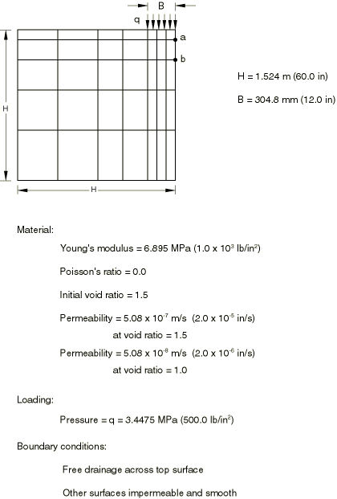
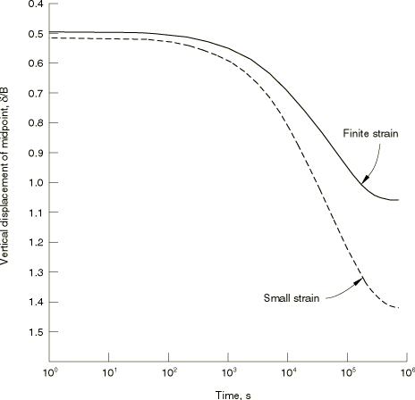
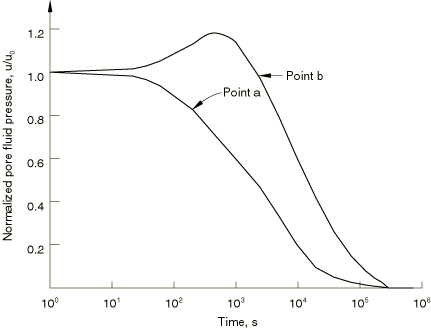

# 1.15.3 二维固体的有限应变固结

**产品：** Abaqus/Standard

此例涉及二维固体的大规模固结。考虑了由大几何变化引起的非线性，以及孔隙比变化对材料渗透率的影响。材料假定为线弹性。此例展示了与《Terzaghi固结问题》第1.15.1节中讨论的一维Terzaghi固结问题有许多共同特征，特别是与小应变理论结果相比，有限应变分析预测的沉降幅度减小。

### 问题描述

此例考虑一块土有限条带，在其中央部分加载。对称允许建模条带的一半，如图1.15.3-1（[图1.15.3-1](ch01s15ach116.md#sxmfinstraincon-geom)）所示：条带的半宽等于其高度，条带加载部分与条带宽度的比为1:5。使用的有限元离散化也在[图1.15.3-1](ch01s15ach116.md#sxmfinstraincon-geom)中显示：使用了35个CPE8RP单元，网格在垂直方向上按长度比1:2:3:4:5分级，在水平方向上按比1:1:1:2:2:4:4分级。这是一个粗网格，但期望提供代表性结果。使用CPE4P单元的类似网格包含在内用于验证目的。

[图1.15.3-1](ch01s15ach116.md#sxmfinstraincon-geom)还总结了所使用的材料特性和边界条件。压力荷载与弹性模量的比为1:2，泊松比规定为0。土假定具有1.5的初始孔隙比，孔隙比为此值时的渗透率为0.508 m/sec（2.0×10⁻⁵ in/sec）。假定渗透率在孔隙比为1.0时小一个数量级。这些低渗透率值代表黏土。

土条带假定位于刚性、不透水、光滑的基底上。不允许沿模型的垂直侧面进行水平位移或孔隙流体流动。假定模型顶部表面可以自由排水。

### 加载和时间步进

分析使用两个瞬态土固结步骤进行。在初步步骤中，整个荷载在两个相等的固定时间增量内施加。荷载在土发生固结的后续步骤中保持恒定。

在考虑有限应变效应的分析中，初步步骤需要六次迭代来收敛第一个增量，七次迭代来收敛满载。这些相对较大的迭代次数是由于土经历的大几何变化。如[图1.15.3-2](ch01s15ach116.md#sxmfinstraincon-settlement)所示，在满载时，这种情况的中点垂直挠度约为加载条带宽度的0.49倍。几何线性分析预测中点垂直挠度约为加载条带宽度的0.52倍。

实际固结分析需要跨几个数量级时间的求解（参见例如[图1.15.3-2](ch01s15ach116.md#sxmfinstraincon-settlement)），自动时间步进方案旨在为此类情况生成经济有效的求解。算法基于用户提供的每个增量允许的孔隙压力变化容差 。Abaqus以下述方式使用此值：如果任何节点处的最大孔隙压力变化大于 ，则使用成比例减小的时间步长重复增量。如果任何节点处的最大孔隙压力变化始终小于 ，则增加时间步长。在这种情况下， 设置为0.103 MPa（15 lb/in²）。这代表了荷载施加后模型中最大孔隙压力的约3%。使用此值，第一个时间增量为7.2秒，最后一个时间增量为1853秒。这对于扩散过程是相当典型的：在早期，孔隙压力的时间变化率是显著的，而在后期，这些时间变化率非常低。

### 结果与讨论

第一个分析考虑有限应变效应，土渗透率随孔隙比变化。渗透率随孔隙比的变化是物理上真实的——当土被压缩时，孔隙流体流过它变得更加困难。还进行了具有恒定渗透率的小应变分析。有限应变和小应变分析的中点沉降与时间的关系显示在[图1.15.3-2](ch01s15ach116.md#sxmfinstraincon-settlement)中。两种分析在最终固结中预测了很大差异：小应变结果比有限应变情况多出约40%的变形。这与一维Terzaghi固结解的结果一致——（见《Terzaghi固结问题》第1.15.1节）。很明显，在沉降幅度较大的情况下，有限应变效应是重要的。

[图1.15.3-2](ch01s15ach116.md#sxmfinstraincon-settlement)中的时间尺度跨越五个数量级，表明了自动时间增量对于经济有效求解的重要性。

[图1.15.3-3](ch01s15ach116.md#sxmfinstraincon-porepress)显示模型中两点的孔隙压力时间历史，即[图1.15.3-1](ch01s15ach116.md#sxmfinstraincon-geom)中点*a*和点*b*。孔隙压力结果用初步步骤结束时这些点的孔隙压力值归一化，并取自有限应变分析。在点  处显示的孔隙压力增加是Mandel-Cryer效应的证据（见Prevost，1981和Lambe和Whitman，1969），是二维和三维固结分析的典型特征。

### 输入文件

[finstrainconsolid2d_node.f](../eif/finstrainconsolid2d_node.f)

生成finstrainconsolid2d_cpe8rp.inp所需的节点坐标。

[finstrainconsolid2d_cpe8rp.inp](../eif/finstrainconsolid2d_cpe8rp.inp)

有限应变分析（单元类型CPE8RP）。

[finstrainconsolid2d_cpe4p.inp](../eif/finstrainconsolid2d_cpe4p.inp)

单元类型CPE4P。

[finstrainconsolid2d_autostab.inp](../eif/finstrainconsolid2d_autostab.inp)

添加自动稳定化的输入数据。

[finstrainconsolid2d_autostab_adap.inp](../eif/finstrainconsolid2d_autostab_adap.inp)

添加自适应自动稳定化的输入数据。

小应变情况通过移除[*STEP*](../key/key-link.md#usb-kws-hstep)选项上的NLGEOM参数来获得。

### 参考

Lambe, T. W., and R. V. Whitman, Soil Mechanics, John Wiley and Sons, New York, 1969.

Prevost, J. H., "Consolidation of an Elastic Porous Media," Journal of the Engineering Mechanics Division, ASCE, vol. 107, pp. 169–186, February 1981.

### 图表

**图1.15.3-1** 二维弹性固结问题描述。

**图1.15.3-2** 中点沉降时间历史。

**图1.15.3-3** 孔隙压力时间历史。

