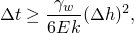
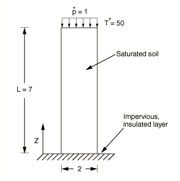
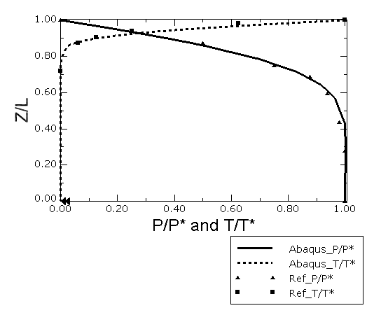

# 1.15.6 一维热固结问题

**产品：** Abaqus/Standard

当土受到荷载和温度变化时，必须求解描述土变形、孔隙流体流动和热传递的耦合方程组，才能准确预测固结行为。在此问题中说明了 Abaqus/Standard 建模一维热固结的能力。研究了受到恒定表面荷载和恒定表面温度的完全饱和土一维柱的固结行为，并将获得的结果与 Aboustit 等人（1985）获得的结果进行了比较。

### 问题描述

此问题可以视为《Terzaghi 固结问题》第 1.15.1 节的热对应问题。该节中提出的讨论同样适用于此问题，此处不再重复。[图 1.15.6-1](ch01s15ach119.md#bmkthermal-model) 显示了在恒定表面压力和恒定表面温度下线弹性土柱的一维热弹性固结。柱高 7 个单位，宽 2 个单位。柱的底部受到约束，除了允许自由流动的顶面外，柱的所有侧面都是不透水的。顶面受到 1 个单位的恒定压力和 50 个单位的恒定温度。土假定为完全饱和。忽略重力。使用 Aboustit 等人（1985）报告的材料特性。土是弹性的，模量为 6000 个单位，泊松比为 0.4。土的渗透率为 4×10⁻⁶ 个单位，比重为 1 个单位。由于 Aboustit 等人（1985）只使用了一组热特性，固体和孔隙流体使用相同的热特性。比热为 40 个单位，密度为 1 个单位。土和孔隙流体的电导率为 0.2 个单位，热膨胀系数为 0.3×10⁻⁶。

所有垂直于侧面的位移都受到约束以强制一维行为。使用具有自动时间步进的瞬态土固结步骤执行固结分析。此问题的时间步进由两个参数控制：一个控制温度场时间积分的精度，另一个控制孔隙流体流动时间积分的精度。孔隙流体求解的稳定性极限由

给出，这规定了最小时间增量。此方程中使用的变量在《Abaqus 分析用户指南》第 6.8.1 节"耦合孔隙流体扩散和应力分析"中有定义。使用的网格与 Aboustit 等人（1985）使用的相同，这导致最小时间增量为 0.1。由于施加的表面荷载，靠近表面的单元立即获得等于施加荷载的孔隙压力；因此，使用每个增量最大孔隙压力变化 1.1 和初始时间增量 0.1。这确保了在分析中不使用小于 0.1 的时间步长以满足孔隙流体流动的时间积分精度。选择每个增量允许的最大温度变化值为 3，以避免使用小于孔隙流体所需稳定性极限的时间增量。首先仅使用最大孔隙压力变化值运行问题来确定增量温度变化，从而获得允许的最大温度变化值。上述参数值产生适度精确的求解。如果需要更精确的求解，应使用更细化的网格。

由于荷载幅度小，几何非线性效应在此问题中不重要。同样，由于流体速度非常小，孔隙流体流动引起的热对流效应不足以需要包含非对称刚度。然而，为完整起见，我们选择激活几何非线性分析和非对称刚度。具有对称刚度的小应变分析的结果与呈现的结果难以区分。步骤的时间周期为 21.1，对应于 Abaqus/Standard 结果与参考解进行比较的时间。

### 结果与讨论

在分析开始时，除了顶面外，整个区域的温度为零，孔隙压力等于施加的表面荷载，因为所有荷载都由孔隙流体承载。随着时间进展，温度从前缘向后缘推进，施加的表面荷载随着孔隙流体从顶部流出而从孔隙流体转移到土骨架，减少了区域中的孔隙压力。在稳态极限下，整个区域的孔隙压力为零，温度恒定等于施加的表面温度。在时间 21.1 时比较孔隙压力和温度的 Abaqus/Standard 解，当时温度前缘已从前缘推进了一段距离，孔隙压力部分降低。结果显示在[图 1.15.6-2](ch01s15ach119.md#bmkthermal-results) 中。温度和孔隙压力值使用施加的温度和施加的表面压力进行归一化。纵坐标使用土柱的高度进行归一化。Abaqus/Standard 结果与 Aboustit 等人（1985）呈现的结果比较良好。

### 输入文件

[unidircon_c3d8pt.inp](../eif/unidirconv_c3d8pt.inp)

使用 C3D8PT 单元的网格。

[unidircon_c3d8rpt.inp](../eif/unidirconv_c3d8rpt.inp)

使用 C3D8RPT 单元的网格。

[unidircon_c3d8pht.inp](../eif/unidirconv_c3d8pht.inp)

使用 C3D8PHT 单元的网格。

[unidircon_c3d8rpht.inp](../eif/unidirconv_c3d8rpht.inp)

使用 C3D8RPHT 单元的网格。

[unidircon_c3d10mpt.inp](../eif/unidirconv_c3d10mpt.inp)

使用 C3D10MPT 单元的网格。

[unidircon_cax4pt.inp](../eif/unidirconv_cax4pt.inp)

使用 CAX4PT 单元的网格。

[unidircon_cax4rpt.inp](../eif/unidirconv_cax4rpt.inp)

使用 CAX4RPT 单元的网格。

[unidircon_cax4rpht.inp](../eif/unidirconv_cax4rpht.inp)

使用 CAX4RPHT 单元的网格。

### 参考

Aboustit, B. L., S. H. Advani, and J. K. Lee, "Variational Principles and Finite Element Simulations for Thermo-Elastic Consolidation," International Journal for Numerical and Analytical Methods in Geomechanics, vol. 9, pp. 49–69, 1985.

### 图表

**图 1.15.6-1** 一维热固结模型。

**图 1.15.6-2** 在时间 21.1 时沿 *z* 方向的归一化温度和孔隙压力。

