# 1.16.1 轮廓积分评估：二维情况

**产品：** Abaqus/Standard

*J* 积分、应力强度因子和 *T* 应力在断裂力学中广泛使用；在给定载荷条件下对假定缺陷的精确估计是断裂力学在设计中应用的重要方面。Shih 等人（1986）的域积分方法为 *J* 积分、应力强度因子和 *T* 应力的数值评估提供了一种有用的方法。这种方法在二维中即使使用相当粗的模型也能提供高精度；在三维中，粗网格仍然给出相当准确的值。它只增加了应力分析成本的一小部分，并且可以容易地指定。Abaqus 提供基于传统有限元方法或扩展有限元方法（XFEM）的断裂力学研究参数评估。轮廓积分评估在 Abaqus 中可用于任何载荷（包括热载荷：见"热载荷下的单边缺口标本"第 1.16.8 节）以及弹性、弹塑性和黏塑性（蠕变）行为，后两种情况基于等效假弹性材料概念。三维情况下的轮廓积分评估也经常受到关注：见"轮廓积分评估：三维情况"第 1.16.2 节。

### 问题描述

此处给出四个用于验证的示例。第一个是线弹性、平面应变、双边缺口标本在 I 型加载下，Bowie（1964）提供了应力强度因子  的系列解；第二个是具有币形裂纹的轴对称标本；第三个是 I 型加载下的单边缺口标本；第四个是具有沿两种材料界面延伸的界面裂纹的双材料标本。对于平面应变情况，也使用三维模型，在厚度方向上有一层单元，以验证沿裂纹前缘作为位置函数的 *J* 积分评估能力。在这种情况下，*J* 积分沿裂纹前缘应该是恒定的——与从二维平面应变分析获得的值相同。子模型技术用于演示如何在裂纹尖端周围获得更精确的结果。所有四个示例都基于传统有限元方法进行研究。此外，第一和第三个示例也基于扩展有限元方法进行研究。

### 几何和模型

第一个示例的几何如图 1.16.1-1（[图 1.16.1-1](ch01s16ach121.md#sxm2djint-2edgenotch)）所示。平面应变结构是具有中心线对称边缘裂纹的板的一部分，留下了板宽度一半的未裂韧带。标本通过施加到顶部和底部表面的均匀拉力以 I 型加载。当使用传统有限元方法时，关于 *x* = 0 和关于 *y* = 0 的对称性可用于仅建模板的右上象限。四分之一模型的网格如图 1.16.1-2（[图 1.16.1-2](ch01s16ach121.md#bmk-doubleedged-qtrmodel)）所示。使用二阶单元（8 节点四边形、20 节点砖块）。对于完整模型的缝合裂纹，在 Abaqus/CAE 中定义了左右轮廓积分，如图 1.16.1-3（[图 1.16.1-3](ch01s16ach121.md#bmk-doubleedged-seamcrackqvectors)）所示。可以使用裂纹扩展的法向或 *q* 向量来定义裂纹扩展方向。

使用传统有限元方法的二阶单元的一个优点是它们可以用于建模裂纹尖端的所需奇异性。为了获得  奇异性项，必须满足以下条件：

1. 裂纹尖端周围的单元必须聚焦在裂纹尖端。每个单元的一条边必须塌缩到零长度（如图 1.16.1-2（[图 1.16.1-2](ch01s16ach121.md#bmk-doubleedged-qtrmodel)）所示），以便这条零长度边的节点位于裂纹尖端。
2. 从每个连接到裂纹尖端的单元的裂纹尖端的边缘的"中间"节点必须放置在从裂纹尖端到边缘另一个节点的距離的四分之一处。

裂纹尖端周围的区域可以如图 1.16.1-4（[图 1.16.1-4](ch01s16ach121.md#bmk-doubleedged-meshcontrols)）所示进行分区，并使用具有四边形主导形状的单元进行扫掠网格划分。节点连接表由 Abaqus/CAE 在内部调整以创建退化四边形单元。

如果裂纹尖端的重合节点被约束为共同位移，则应变中唯一的奇异性项是 ；如果裂纹尖端节点可以自由独立位移，则裂纹尖端应变奇异性除了  项外还包括  项。在标准等参单元中创建奇异性的这些方法由 Barsoum（1976）详细解释。

材料类型决定了裂纹尖端的奇异性。线弹性材料在尖锐裂纹尖端表现出应变中的  奇异性，而完全塑性材料表现出应变中的  奇异性。塑性硬化材料的应变奇异性介于  和  之间。

通常，预处理器网格划分的简单性需求大于轮廓积分结果极端准确性的需求。轮廓积分结果通常是足够的，只要包含了一些奇异性。例如，如果单元边缘被塌缩，裂纹尖端的节点可以自由独立位移，并且中间节点没有被移动到四分之一点（它们保持在中间点），则引入  奇异性。这种奇异性通常对弹塑性问题相当足够。

此示例问题中的模型使用线弹性材料，因此，应该仅用  奇异性项建模。

对于双边缺口标本的四分之一模型，对称性用于计算轮廓积分结果。因此，轮廓积分的结果在输出前乘以二。三维模型使用相同网格，有一层 20 节点砖块，如图 1.16.1-5（[图 1.16.1-5](ch01s16ach121.md#bmk-doubleedged-c3d20)）所示。施加的载荷在二维中是均匀边缘载荷，在三维中是均匀表面压力（负值）。

当使用扩展有限元方法时，网格不需要与裂纹几何匹配。裂纹的存在通过特殊的富集函数以及额外的自由度来确保。这种方法还取消了在评估轮廓积分时明确定义裂纹前缘或指定虚拟裂纹扩展方向的要求。轮廓积分所需的数据将基于单元中节点的符号距离函数自动确定。对于此示例，使用了具有完全积分和减缩积分的一阶砖块单元。网格如图 1.16.1-6（[图 1.16.1-6](ch01s16ach121.md#bmk-doubleedged-c3d8)）所示。

轴对称模型对应于圆杆中的币形裂纹。模型如图 1.16.1-7（[图 1.16.1-7](ch01s16ach121.md#sxm2djint-crack-bar)）所示，并通过施加到顶部和底部表面的均匀拉力以 I 型加载。关于 *r* = 0 和 *z* = 0 的对称性允许您仅用网格建模右上象限，如图 1.16.1-8（[图 1.16.1-8](ch01s16ach121.md#bmk-axisymmpenny-mesh)）所示。使用二阶单元（CAX8 和 CAX8R）。

第三个示例是 I 型拉力下的单边缺口标本，如图 1.16.1-9（[图 1.16.1-9](ch01s16ach121.md#sxm2dcint-1edgenotch)）所示。此标本在均质线弹性材料的对称平面中包含裂纹。此示例使用传统有限元方法和扩展有限元方法进行研究。由于对称性，当使用传统有限元方法时，仅对标本的上半平面建模。当使用扩展有限元方法时，对整个体进行建模。使用传统有限元方法的二阶单元 CPE8 和 CPS8，而使用扩展有限元方法的一阶砖块单元 C3D8 和一阶四面体单元 C3D4。

最后一个示例也是 I 型拉力下的单边缺口标本，如图 1.16.1-9（[图 1.16.1-9](ch01s16ach121.md#sxm2dcint-1edgenotch)）所示。此标本在两种不同弹性材料的界面处包含裂纹。对于具有界面裂纹的标本，对整个体进行建模。对于此示例，使用二阶单元 CPE8 和 CPS8。

*J* 积分、应力强度因子和 *T* 应力应该是路径无关的，Abaqus 提供了按您请求的任意多个轮廓进行评估。第一个轮廓通常在裂纹尖端，随后的轮廓自动生成为穿过最近邻元素的轮廓，从裂纹尖端向外移动。在这种情况下使用的网格在裂纹尖端周围有几圈单元，可以请求的轮廓数等于圈数。轮廓积分应该是路径无关的，因此轮廓之间值的变化可以用作网格质量的指标，用于确定断裂参数。轮廓积分值的路径无关性足以表明应力、应变或位移的网格收敛。

### 结果与讨论

使用全积分和减缩积分单元（CPE8 和 CPE8R）获得的平面应变解与[表 1.16.1-1](ch01s16ach121.md#table-2djint-2edgenotch) 中 *J* 积分的 Bowie 近似解进行了比较。Abaqus 结果非常接近 Bowie 的近似值，路径无关性保持良好。如果在 Abaqus 的轮廓积分评估中请求了应力强度因子，则 *J* 积分也会自动基于应力强度因子计算。这些 *J* 值与[表 1.16.1-1](ch01s16ach121.md#table-2djint-2edgenotch) 中呈现的值显示出非常好的的一致性。

20 节点砖块网格的三维 *J* 积分解如[表 1.16.1-2](ch01s16ach121.md#table-2djint-3dsol-20node) 所示。全积分 20 节点砖块模型提供的 *J* 值在第一个轮廓处沿裂纹前缘显示出一些振荡。在 20 节点砖块模型中，涉及中间节点的轮廓比涉及此类单元角节点的轮廓具有更少的节点被扰动，这导致应变能计算的差异，从而导致积分值的差异。这种影响不大，通常仅在第一个轮廓处明显；随着网格的细化，它变得更小。由于无论使用何种单元类型，此轮廓的 *J* 值也可能最不准确，因此经常被忽略；仅使用轮廓二及更高的 *J* 值来估计 *J*。在 20 节点砖块的减缩积分模型中，*J* 积分值沿裂纹前缘的振荡不明显。应力强度因子和 *T* 应力也为相同的三维模型计算。它们具有与上述 *J* 轮廓积分评估相同的特征。

使用扩展有限元方法的 8 节点砖块网格的三维 *J* 积分解如[表 1.16.1-3](ch01s16ach121.md#table-2djint-3dsol-8node) 所示。

轴对称 *J* 积分解如[表 1.16.1-4](ch01s16ach121.md#table-2djint-axisym) 所示，可与 Tada 等人（1973）的近似解进行比较。路径无关性在网格中保持良好。数值结果再次略高于 Tada 等人（1973）的近似解。然而，应力强度因子和 *T* 应力在此网格中显示出轮廓依赖性的证据。裂纹尖端非常接近对称轴，以至于辅助平面应变裂纹尖端场不能令人满意地用于交互方法提取其值。使用围绕裂纹尖端的更集中、更细化的网格可以消除这个问题。

对于单边缺口标本，计算了应力强度因子  和 *T* 应力。结果与[表 1.16.1-5](ch01s16ach121.md#table-2dk1-1edgenotch) 中 Tada 等人（1973）呈现的  值以及[表 1.16.1-6](ch01s16ach121.md#table-2dts-1edgenotch) 中 Nakamura 和 Parks（1991）呈现的 *T* 应力值进行了比较。比较显示良好的一致性。此外，[表 1.16.1-7](ch01s16ach121.md#table-3dk1-1edgenotch) 中给出了使用扩展有限元方法在三维单边缺口标本中面处获得的结果。

对于界面裂纹模型，应力强度因子和 *J* 积分的计算结果如[表 1.16.1-8](ch01s16ach121.md#table-2dk12j-intf-1edgenotch) 所示。从[表 1.16.1-8](ch01s16ach121.md#table-2dk12j-intf-1edgenotch) 可以看出，虽然标本受到纯 I 型加载，但  的值不为零——这是界面裂纹的典型特征。[表 1.16.1-8](ch01s16ach121.md#table-2dk12j-intf-1edgenotch) 还表明，从应力强度因子计算的 *J* 与 Abaqus 直接计算的 *J* 非常一致。

### 裂纹尖端周围的子模型

子模型技术能够提供裂纹尖端周围应力的更精确分析。全局模型有粗网格，而子模型有细化网格。对于双边缺口标本和单边缺口标本，子模型区域是半径为 127 mm（5 英寸）的半圆形区域。因此，子模型边界与全局模型中裂纹尖端周围的分区相同。子模型使用围绕裂纹尖端的六行单元的聚焦网格。对于轴对称币裂纹标本，子模型区域是半径为 114.3 mm（4.5 英寸）的半圆形区域，与全局模型中裂纹尖端周围的外部分区重合。所有三个问题中的全局网格都给出了令人满意的 *J* 积分结果；因此，我们假定子模型边界上的位移足够准确以驱动子模型中的变形。没有尝试研究使子模型区域更大或更小的影响。带有子模型边界（虚线）的网格化全局模型在左侧，右侧显示子模型的放大视图，分别如图 1.16.1-10（[图 1.16.1-10](ch01s16ach121.md#bmk-doubleedged-glsub)）和图 1.16.1-11（[图 1.16.1-11](ch01s16ach121.md#bmk-pennycrack-glsub)）所示，用于双边缺口标本和轴对称币裂纹标本。

子模型和全局模型中垂直位移场的等值线如图 1.16.1-12（[图 1.16.1-12](ch01s16ach121.md#bmk-doubleedged-glsubdispcon)）所示用于双边缺口标本。等值线线的连续性验证了在子模型边界上规定了适当的位移值。使用五个轮廓计算轮廓积分值。*J* 积分的结果列于[表 1.16.1-9](ch01s16ach121.md#table-2djint-submodel-plstrain) 中。使用全局网格获得的 *J* 积分结果相当准确；因此，*J* 积分值仅有轻微改善。计算应力强度因子  和 *T* 应力的相同趋势也占主导地位。与 Bowie 近似解的一致性确实略好，而且可以观察到略好的路径无关性。子模型分析也用于轴对称模型。轴对称币裂纹子模型分析的计算 *J* 积分值如[表 1.16.1-10](ch01s16ach121.md#table-2djint-submodel-axisym) 所示。

### Python 脚本

### 输入文件

下面列出的输入文件是为喜欢使用 Abaqus 关键词界面而不是 Abaqus/CAE 的用户提供的。这些输入文件中创建的网格与使用 Python 脚本创建的网格不同；但是，结果具有相同的精度。

[jintegral2d_cpe8.inp](../eif/jintegral2d_cpe8.inp)

具有完全积分的二维平面应变模型。

[jintegral2d_cpe8r.inp](../eif/jintegral2d_cpe8r.inp)

具有减缩积分的二维平面应变模型。

[jintegral2d_cpe4_residual.inp](../eif/jintegral2d_cpe4_residual.inp)

具有完全积分和残余应力场影响的二维一阶平面应变模型。

[jintegral2d_cpe8_submodel.inp](../eif/jintegral2d_cpe8_submodel.inp)

具有完全积分的二维平面应变子模型。

[jintegral2d_c3d20.inp](../eif/jintegral2d_c3d20.inp)

具有完全积分的 20 节点砖块三维模型。

[jintegral2d_postoutput.inp](../eif/jintegral2d_postoutput.inp)

[jintegral2d_c3d20.inp](../eif/jintegral2d_c3d20.inp) 的 [*POST OUTPUT*](../key/key-link.md#usb-kws-hpostoutput) 分析。

[jintegral2d_c3d20r.inp](../eif/jintegral2d_c3d20r.inp)

具有减缩积分的 20 节点砖块三维模型。

[jintegral2d_c3d27.inp](../eif/jintegral2d_c3d27.inp)

具有完全积分的 27 节点砖块三维模型。

[jintegral2d_c3d27r.inp](../eif/jintegral2d_c3d27r.inp)

具有减缩积分的 27 节点砖块三维模型。

[jintegral2d_cax8.inp](../eif/jintegral2d_cax8.inp)

具有完全积分的轴对称模型。

[jintegral2d_cax8r.inp](../eif/jintegral2d_cax8r.inp)

具有减缩积分的轴对称模型。

[jintegral2d_cax8_submodel.inp](../eif/jintegral2d_cax8_submodel.inp)

具有完全积分的轴对称子模型。

[jintegral2d_3daxi.inp](../eif/jintegral2d_3daxi.inp)

具有减缩积分的轴对称问题的 20 节点砖块三维模型。

[cintegral2d_1edge_cpe8.inp](../eif/cintegral2d_1edge_cpe8.inp)

用于单边缺口标本的二维平面应变模型。

[cintegral2d_1edge_cps8.inp](../eif/cintegral2d_1edge_cps8.inp)

用于单边缺口标本的二维平面应力模型。

[cintegral2d_1edge_intf_cpe8.inp](../eif/cintegral2d_1edge_intf_cpe8.inp)

用于包含界面裂纹的单边缺口标本的二维平面应变模型。

[contourintegral_den_xfem_c3d8.inp](../eif/contourintegral_den_xfem_c3d8.inp)

用于双边缺口标本的扩展有限元方法具有完全积分的 8 节点砖块三维模型。

[contourintegral_den_xfem_c3d8r.inp](../eif/contourintegral_den_xfem_c3d8r.inp)

用于双边缺口标本的扩展有限元方法具有减缩积分的 8 节点砖块三维模型。

[contourintegral_sen_xfem_c3d8.inp](../eif/contourintegral_sen_xfem_c3d8.inp)

用于单边缺口标本的扩展有限元方法具有完全积分的 8 节点砖块三维模型。

[contourintegral_sen_xfem_c3d8_base.inp](../eif/contourintegral_sen_xfem_c3d8_base.inp)

与 contourintegral_sen_xfem_c3d8.inp 相同，但包括塑性以生成残余应力场。

[contourintegral_sen_xfem_c3d8_residual.inp](../eif/contourintegral_sen_xfem_c3d8_residual.inp)

与 contourintegral_sen_xfem_c3d8.inp 相同，但包括从 contourintegral_sen_xfem_c3d8_base 的分析生成的残余应力场的影响。

[contourintegral_sen_xfem_c3d4.inp](../eif/contourintegral_sen_xfem_c3d4.inp)

用于单边缺口标本的扩展有限元方法的 4 节点四面体三维模型。

### 参考

Barsoum, R. S., "On the Use of Isoparametric Finite Elements in Linear Fracture Mechanics," International Journal for Numerical Methods in Engineering, vol. 10, pp. 25–37, 1976.

Bowie, O. L., "Rectangular Tensile Sheet With Symmetric Edge Cracks," Journal of Applied Mechanics, vol. 31, pp. 208–212, 1964.

Nakamura, T., and D. M. Parks, "Determination of Elastic *T*-Stress along Three-Dimensional Crack Fronts Using an Interaction Integral," International Journal of Solids and Structures, vol. 28, pp. 1597–1611, 1991.

Shih, C. F., B. Moran, and T. Nakamura, "Energy Release Rate along a Three-Dimensional Crack Front in a Thermally Stressed Body," International Journal of Fracture, vol. 30, pp. 79–102, 1986.

Tada, H., P. C. Paris, and G. R. Irwin, The Stress Analysis of Cracks Handbook, Del Research Corporation, Hellertown, Pennsylvania, 1973.

### 表格

**表 1.16.1-1** *J* 积分值：使用平面应变单元建模的二维对称双边缺口标本。Bowie 近似解：*J* = 2.245 N/m（0.0128 lb/in）。
| 轮廓 | 完全积分 | 减缩积分 |
| --- | --- | --- |
| N/m | lb/in | N/m | lb/in |
| 1 | 2.284 | 0.01303 | 2.285 | 0.01304 |
| 2 | 2.282 | 0.01302 | 2.280 | 0.01301 |
| 3 | 2.282 | 0.01302 | 2.282 | 0.01302 |
| 4 | 2.282 | 0.01302 | 2.282 | 0.01302 |
| 5 | 2.282 | 0.01302 | 2.282 | 0.01302 |

**表 1.16.1-2** *J* 积分值：使用连续体单元建模的三维对称双边缺口标本。
| **完全积分** |
| --- |
| **轮廓** | **前表面** | **中间表面** | **后表面** |
| **N/m** | **lb/in** | **N/m** | **lb/in** | **N/m** | **lb/in** |
| 1 | 2.212 | 0.01262 | 2.306 | 0.01316 | 2.212 | 0.01262 |
| 2 | 2.277 | 0.01299 | 2.277 | 0.01299 | 2.277 | 0.01299 |
| 3 | 2.280 | 0.01301 | 2.280 | 0.01301 | 2.280 | 0.01301 |
| **减缩积分** |
| **轮廓** | **前表面** | **中间表面** | **后表面** |
| **N/m** | **lb/in** | **N/m** | **lb/in** | **N/m** | **lb/in** |
| 1 | 2.273 | 0.01297 | 2.284 | 0.01303 | 2.273 | 0.01297 |
| 2 | 2.277 | 0.01299 | 2.277 | 0.01299 | 2.277 | 0.01299 |
| 3 | 2.280 | 0.01301 | 2.280 | 0.01301 | 2.280 | 0.01301 |

**表 1.16.1-3** *J* 积分值：使用扩展有限元方法的连续体单元建模的三维双边缺口标本。
| **完全积分** |
| --- |
| **轮廓** | **前表面** | **后表面** |
| **N/m** | **lb/in** | **N/m** | **lb/in** |
| 3 | 2.874 | 0.01641 | 2.874 | 0.01641 |
| 4 | 2.795 | 0.01596 | 2.795 | 0.01596 |
| 5 | 3.108 | 0.01775 | 3.108 | 0.01775 |
| 6 | 2.559 | 0.01461 | 2.559 | 0.01461 |
| 7 | 2.343 | 0.01338 | 2.343 | 0.01338 |
| 8 | 2.485 | 0.01419 | 2.485 | 0.01419 |
| **减缩积分** |
| **轮廓** | **前表面** | **后表面** |
| **N/m** | **lb/in** | **N/m** | **lb/in** |
| 3 | 2.884 | 0.01647 | 2.884 | 0.01647 |
| 4 | 2.799 | 0.01598 | 2.799 | 0.01598 |
| 5 | 3.112 | 0.01777 | 3.112 | 0.01777 |
| 6 | 2.567 | 0.01466 | 2.567 | 0.01466 |
| 7 | 2.361 | 0.01348 | 2.361 | 0.01348 |
| 8 | 2.494 | 0.01424 | 2.494 | 0.01424 |

**表 1.16.1-4** *J* 积分值：轴对称币形裂纹标本。Tada 等人的近似解：*J* = 0.7635 N/m（0.00436 lb/in）。
| 轮廓 | 完全积分 | 减缩积分 |
| --- | --- | --- |
| N/m | lb/in | N/m | lb/in |
| 1 | 0.7870 | 0.00449 | 0.7853 | 0.00448 |
| 2 | 0.7818 | 0.00446 | 0.7853 | 0.00448 |
| 3 | 0.7835 | 0.00447 | 0.7870 | 0.00449 |
| 4 | 0.7835 | 0.00447 | 0.7870 | 0.00449 |
| 5 | 0.7835 | 0.00447 | 0.7870 | 0.00449 |

**表 1.16.1-5** 二维对称单边缺口标本的无量纲应力强度因子 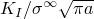。Tada 等人的近似解：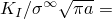 = 2.826。
| 轮廓 | CPE8 | CPS8 |
| --- | --- | --- |
| 1 | 2.8250 | 2.8249 |
| 2 | 2.8230 | 2.8231 |
| 3 | 2.8237 | 2.8238 |
| 4 | 2.8238 | 2.8239 |
| 5 | 2.8238 | 2.8239 |

**表 1.16.1-6** 单边缺口标本的无量纲 *T* 应力 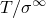。Nakamura 和 Parks 近似解：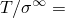 = -0.43。
| 轮廓 | CPE8 | CPS8 |
| --- | --- | --- |
| 1 | -0.4307 | -0.4298 |
| 2 | -0.4204 | -0.4202 |
| 3 | -0.4226 | -0.4224 |
| 4 | -0.4226 | -0.4224 |
| 5 | -0.4225 | -0.4223 |

**表 1.16.1-7** 使用扩展有限元方法的三维单边缺口标本中间表面处的无量纲应力强度因子 。Tada 等人的近似解： = 2.826。
| 轮廓 | C3D8 | C3D4 |
| --- | --- | --- |
| 2 | 2.8537 | 2.8871 |
| 3 | 2.9643 | 2.8675 |
| 4 | 3.0027 | 2.8675 |
| 5 | 2.9696 | 2.9014 |

**表 1.16.1-8** 界面裂纹的无量纲 、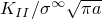 和 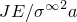 值。
| 轮廓 | 由应力强度因子估计的 *J* 积分值 | 直接估计的 *J* 积分值 |
| --- | --- | --- |
|  |  |  从 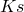 |  |
| 1 | 2.8245 | 0.0121 | 17.36 | 17.30 |
| 2 | 2.8226 | 0.0127 | 17.33 | 17.30 |
| 3 | 2.8232 | 0.0127 | 17.34 | 17.30 |
| 4 | 2.8233 | 0.0127 | 17.34 | 17.30 |
| 5 | 2.8232 | 0.0127 | 17.34 | 17.30 |

**表 1.16.1-9** *J* 积分值：使用平面应变单元的双边缺口标本的二维子模型分析。
| 轮廓 | 完全积分 | 减缩积分 |
| --- | --- | --- |
| N/m | lb/in | N/m | lb/in |
| 1 | 2.282 | 0.01302 | 2.285 | 0.01304 |
| 2 | 2.278 | 0.013 | 2.280 | 0.01301 |
| 3 | 2.280 | 0.01301 | 2.282 | 0.01302 |
| 4 | 2.280 | 0.01301 | 2.282 | 0.01302 |
| 5 | 2.280 | 0.01301 | 2.282 | 0.01302 |

**表 1.16.1-10** *J* 积分值：轴对称币形裂纹标本的子模型分析。
| 轮廓 | 完全积分 | 减缩积分 |
| --- | --- | --- |
| N/m | lb/in | N/m | lb/in |
| 1 | 0.7765 | 0.00443 | 0.7853 | 0.00448 |
| 2 | 0.7748 | 0.00442 | 0.7835 | 0.00447 |
| 3 | 0.7765 | 0.00443 | 0.7835 | 0.00447 |
| 4 | 0.7765 | 0.00443 | 0.7835 | 0.00447 |
| 5 | 0.7765 | 0.00443 | 0.7835 | 0.00447 |

### 图表

**图 1.16.1-1** 双边缺口示例。

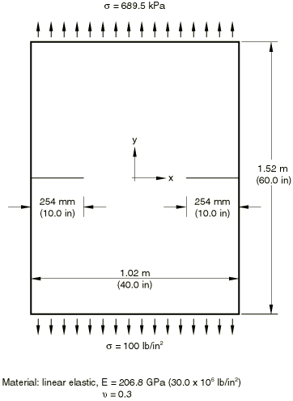

**图 1.16.1-2** 双边缺口标本的对称有限元模型。

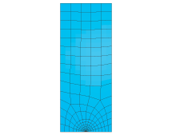

**图 1.16.1-3** 显示定义的缝合裂纹（粗体）和在左右裂纹尖端定义的 *q* 向量的模型。

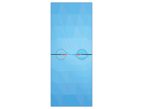

**图 1.16.1-4** 显示在裂纹尖端周围创建的分区的二维双边缺口标本。圆形分区区域使用扫掠网格划分技术和四边形主导单元进行网格划分。

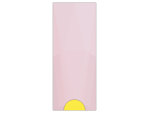

**图 1.16.1-5** 双边缺口标本的三维四分之一模型的有限元模型，用一层 C3D20 单元进行网格划分。

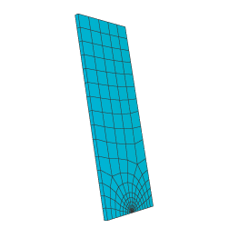

**图 1.16.1-6** 使用扩展有限元方法的一层一阶砖块单元进行网格划分的双边缺口标本的三维有限元模型。

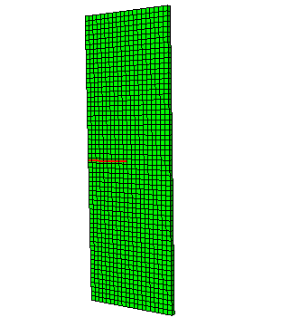

**图 1.16.1-7** 圆杆中的币形裂纹。

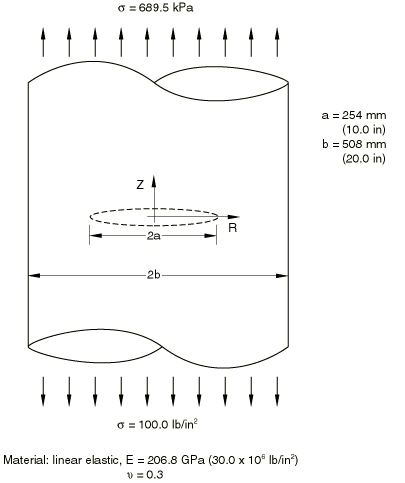

**图 1.16.1-8** 圆杆中币形裂纹的轴对称有限元模型。

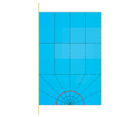

**图 1.16.1-9** 单边缺口标本。

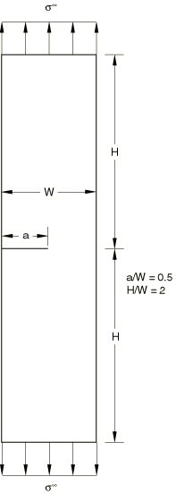

**图 1.16.1-10** 左：带有子模型边界的二维双边缺口标本的网格化全局模型（虚线显示），子模型区域中仅有两个单元。右：子模型的放大视图，具有六行单元的细化网格。

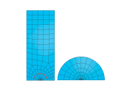

**图 1.16.1-11** 左：带有子模型边界（虚线显示）的轴对称币形裂纹标本的网格化全局模型，子模型区域中仅有两个单元。右：子模型的放大视图，具有六行单元的细化网格。

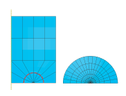

**图 1.16.1-12** 二维双边缺口标本的全局模型和子模型的位移等值线。

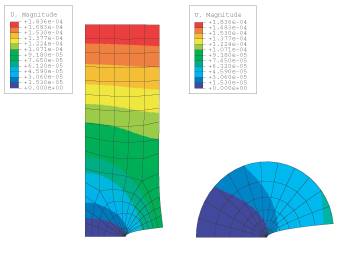
