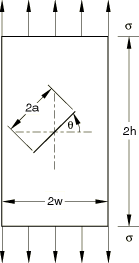
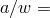
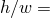
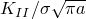
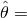
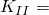
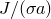
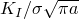

# 1.16.3 中心斜裂纹板在拉力作用下

**产品：** Abaqus/Standard

### 问题描述

模型由一个具有中心斜裂纹并受到远场拉力的矩形板组成。计算使用 CPE8 单元和线弹性材料进行。为板选择的几何比为  = 0.4 和  = 2。斜角为  = 45°。在顶部和底部板表面上规定位移边界条件，以向板施加拉力，从而可以获得两个裂纹尖端的合理解。总的远端拉力荷载通过对顶部或底部平面上每个节点的 *y* 方向节点反作用力求和获得；远端应力  定义为总拉力除以板的横截面积。

### 结果与讨论

计算的应力强度因子与 Y. Murakami 编辑的《应力强度因子手册》第 909 页给出的解进行了比较。

**表 1.16.3-1** 各向同性弹性的无量纲应力强度因子结果。轮廓 1 从计算中省略。
|  |  |  |
| --- | --- | --- |
| 参考解 | 0.5719 | 0.5290 |
| Abaqus | 0.5540 | 0.5289 |

基于应力强度因子  和 ，Abaqus 可以自动预测裂纹扩展方向，这是相对于裂纹平面测量的角度 。例如，如果使用最大切向应力准则， = 52.41；如果使用最大能量释放率准则， = 55.76；如果使用  = 0 准则， = 56.12。

Abaqus 还输出由应力强度因子估计的 *J* 积分值， = 3.4517×10³，这与直接估计的 *J* 积分值  = 3.4515×10³ 非常一致。

此外，对于使用四种不同各向异性线弹性材料的相同板评估了应力强度因子和 *J* 积分：由工程常数规定的正交弹性（用 ENGC 表示）、由刚度参数规定的正交弹性（ORTH）、完全各向异性弹性（ANIS）和层状弹性（LAMI）。具有层状弹性的模型使用平面应力 CPS8 单元进行网格划分。结果总结在[表 1.16.3-2](ch01s16ach123.md#table-k12jresults) 中。虽然没有可比较的已发布解，但应力强度因子的 *J* 积分与直接评估的 *J* 积分非常一致。

**表 1.16.3-2** 斜裂纹的无量纲 、 和  值。轮廓 1 从平均值计算中省略。
| 弹性 | *J* 积分值由应力强度因子估计 | 直接估计的 *J* 积分值 |
| --- | --- | --- |
|  |  | ×10³ | ×10³ |
| ENGC | 0.5717 | 0.5299 | 2.8740 | 2.8750 |
| ORTH | 0.599 | 0.5429 | 2.1931 | 2.1930 |
| ANIS | 0.5388 | 0.5260 | 4.3790 | 4.3798 |
| LAMI | 0.5391 | 0.5223 | 4.7639 | 4.7637 |

### Python 脚本

### 输入文件

以下输入文件创建的模型与通过上述 Python 脚本创建的 Abaqus/CAE 模型具有不同的网格。两种情况下的结果是相同的。

[psptskf2d.inp](../eif/psptskf2d.inp)

用于各向同性弹性的二维模型。

[psptskf2d_node.inp](../eif/psptskf2d_node.inp)

节点定义。

[psptskf2d_element.inp](../eif/psptskf2d_element.inp)

单元定义。

[psptskf2d_engc.inp](../eif/psptskf2d_engc.inp)

用于由工程常数规定的正交弹性的二维模型。

[psptskf2d_orth.inp](../eif/psptskf2d_orth.inp)

用于由刚度参数规定的正交弹性的二维模型。

[psptskf2d_anis.inp](../eif/psptskf2d_anis.inp)

用于各向异性弹性的二维模型。

[psptskf2d_lami.inp](../eif/psptskf2d_lami.inp)

用于层状弹性的二维模型。
