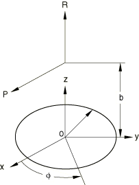
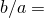
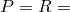
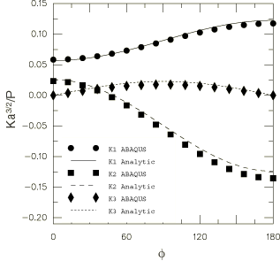
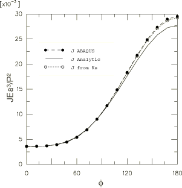
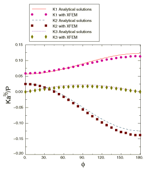
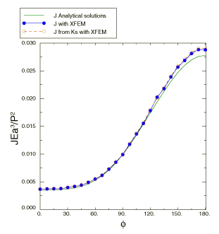

# 1.16.4 集中力作用下的币形裂纹

**产品：** Abaqus/Standard

### 问题描述

分析的几何是无限体中的币形裂纹，受到集中力 *P* 和 *R*，如上图所示。身体的大小相对于裂纹半径 *a* 选择得足够大，以便可以建模包含小币形裂纹的无限体。长度比为  = 0.66。材料是线弹性的，弹性模量 = 200 GPa，泊松比 = 0.3。身体上 *z* 轴上的两个远端点被固定以防止刚体运动。载荷为  = 400 MN。

### 结果与讨论

应力强度因子的解析解可以在 Y. Murakami 编辑的《应力强度因子手册》第 672-673 页找到。

由于对称性，只呈现从  = 0 到  = 180° 的结果，尽管计算是为完整固体进行的。计算的应力强度因子与[图 1.16.4-1](ch01s16ach124.md#verpennycrack-sifactors) 中的解析值进行了比较。

当请求时，Abaqus 输出由应力强度因子估计的 *J* 积分值。它们与直接计算的 *J* 积分值进行了比较，也在[图 1.16.4-2](ch01s16ach124.md#verpennycrack-jint) 中与解析 *J* 积分解进行了比较。

应力强度因子和 *J* 积分值也使用扩展有限元方法（XFEM）进行了评估。值在[图 1.16.4-3](ch01s16ach124.md#verpennycrack-sifactors-xfem) 和[图 1.16.4-4](ch01s16ach124.md#verpennycrack-jint-xfem) 中与解析解进行了比较。

### 输入文件

[ppennycrack.inp](../eif/ppennycrack.inp)

具有传统有限元方法的三维模型。

[ppennycrack_node.inp](../eif/ppennycrack_node.inp)

ppennycrack.inp 的节点定义。

[ppennycrack_element.inp](../eif/ppennycrack_element.inp)

ppennycrack.inp 的单元定义。

[contourintegral_penny_xfem_c3d8.inp](../eif/contourintegral_penny_xfem_c3d8.inp)

具有扩展有限元方法的三维模型。

### 图表

**图 1.16.4-1** 应力强度因子随  的变化。

**图 1.16.4-2** *J* 积分随  的变化。

**图 1.16.4-3** 使用扩展有限元方法获得的应力强度因子随  的变化。

**图 1.16.4-4** 使用扩展有限元方法获得的 *J* 积分随  的变化。

