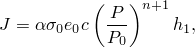
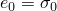
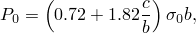
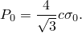
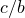
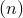
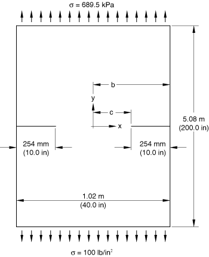
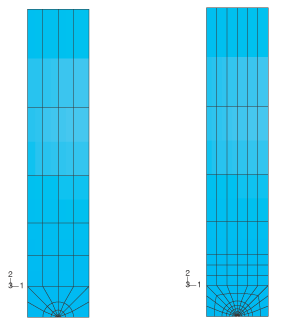
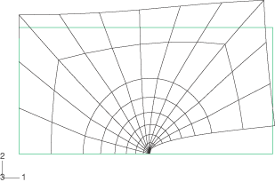
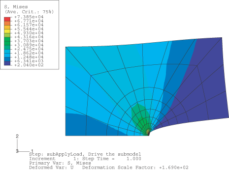

# 1.16.5 完全塑性 J 积分评估

**产品：** Abaqus/Standard

此示例说明使用变形理论塑性进行完全塑性 *J* 积分评估，如 Kumar 等人（1981）开发的"工程断裂力学"方法中所使用的。在这种类型的分析中，首先获得关心几何的弹性和完全塑性 *J* 积分值，然后使用简单公式组合，以获得直至极限荷载的所有荷载水平的 *J* 积分近似值。该方法提供了简单的缺陷评估技术，前提是可以随时获得完全塑性 *J* 积分值。Abaqus 包含用于此目的的 Ramberg-Osgood 变形塑性理论模型。此示例演示了 Abaqus 中获取此类完全塑性结果的标准方法。

在许多情况下，用户可能更喜欢使用增量理论或变形理论在每个荷载水平评估 *J* 积分，从而直接计算每个荷载水平的 *J* 积分值。此示例中使用的"工程断裂力学"方法通常在需要标准几何、载荷和材料值表时使用。

### 问题描述

此示例使用与"轮廓积分评估：二维情况"第 1.16.1 节（其中说明了线弹性 *J* 积分评估）中使用的相同的双边缺口标本几何，只是标本的长度已略有延长以确保结果对无限长板有效。同时分析了平面应力和平面应变情况。这些情况的结果在 Kumar 等人（1981）中提供，因此此示例提供了完全塑性 *J* 积分结果的验证。

几何如图 1.16.5-1（[图 1.16.5-1](ch01s16ach125.md#sxmjint-geom)）所示。标本半长度已延长至 2.54 m（100 in），以确保远场拉力载荷施加在距裂纹尖端足够远的位置。1/4 模型的网格如图 1.16.5-2（[图 1.16.5-2](ch01s16ach125.md#bmk-doubleedged-coarsefinemesh)）所示。同时使用了粗网格和细网格。细网格与粗网格类似，但有更多单元。此网格仅在平面应变情况下使用，因为材料模型中的不可压缩性假设使该情况更困难。Shih 和 Needleman（1984）讨论了这个问题，并指出网格必须能够准确建模完全塑性流动场。出于这个原因，网格收敛研究在此类应用中必不可少——见下面"结果"部分中的讨论。使用二阶单元。对于平面应力情况，单元类型为 CPS8R（减缩积分、8 节点四边形单元）。对于平面应变情况，使用单元类型 CPE8RH；此单元是"混合"（混合）公式单元，在这种情况下使用，因为材料行为在极限荷载下是完全不可压缩的，混合方法可以处理不可压缩约束。使用单元类型 CPE8R 也可以获得可接受的结果，因为减缩积分的使用避免了对不可压缩响应过度约束。

### 材料

材料模型是 Abaqus 为此类应用提供的变形理论、Ramberg-Osgood 模型。这种塑性模型在所有应力水平上都是非线性的，尽管直至参考应力和应变值的初始响应几乎是线性的。各种硬化指数都具有实际意义，最常需要的值在 3 到 10 之间。出于这个原因，在此示例中研究了几种不同的值。

### 加载

载荷是施加到模型顶部边缘的远场拉力。这通过沿模型顶部边缘的单元边缘施加负压力来实现。

### 求解展开

变形理论解不是路径相关的（这里使用的变形理论塑性模型完全等同于非线性弹性模型），因此任何能以数值有效方式提供完全塑性解的技术都是令人满意的。对于此目的，Abaqus 中最有效的方法通常是增量和平稳迭代的标准技术，逐渐增加载荷大小直至获得完全塑性解。执行一般静力分析。同时，监控一个区域变为完全塑性，从而监控这种变形理论解的进展。在这个问题中，创建了一个名为 `Monitor` 的集合，其中包含网格聚焦部分中的所有单元以及该区域上方的第一层单元。在 Abaqus/CAE 中，这样一个区域是通过分区创建的。当 `Monitor` 集合中所有单元中的所有点都处于完全塑性范围内（由等效塑性应变是偏移屈服应变的 10 倍定义）时，Abaqus 将停止增加载荷，此时获得所需的解。

使用自动增量，因此唯一需要的控制值是建议的初始增量大小。这可以根据问题的极限荷载知识来估计（在 Kumar 等人，1981 中可用）。初始增量建议为极限荷载值的 40%。在这种情况下这个选择不是非常关键的，因为自动增量算法将快速找到合适的增量大小，前提是建议不会大错。

### 结果与讨论

Kumar 等人（1981）提供了无量纲参数  的值表，它将完全塑性 *J* 积分定义为

其中 、 和 *n* 是 Ramberg-Osgood 模型中的材料参数；/*E*；*c* 是剩余韧带半宽度；*b* 是标本半宽度；*P* 是标本上每单位厚度的总荷载； 是每单位厚度的极限荷载。对于平面应变

对于平面应力

[表 1.16.5-1](ch01s16ach125.md#table-jint-plstress) 和[表 1.16.5-2](ch01s16ach125.md#table-jint-plstrain) 总结了在 此示例中获得的  值（从 Abaqus 输出中提供的 *J* 积分值使用上述方程计算），并与 Kumar 等人（1981）发表的值进行比较。平面应力情况几乎没有困难，不同轮廓计算的 *J* 积分值之间的差异很小，表明结果相当准确。这些结果与 Kumar 等人（1981）发表的值之间的一致性相当好。在平面应变情况下，[表 1.16.5-2](ch01s16ach125.md#table-jint-plstrain) 显示粗网格结果有相当大的离散，表明不准确。较细网格结果显示不同轮廓之间的差异很小（此网格中有六个轮廓可用，[表 1.16.5-2](ch01s16ach125.md#table-jint-plstrain) 显示获得的最小值和最大值）。这些较细网格值都与粗网格获得的值接近。这些观察表明较细网格结果是可靠的。然而，它们与 Kumar 等人（1981）列表中的值不太一致。已经确定 Kumar 等人（1981）呈现的一些平面应变结果是不准确的；因此 Shih 和 Needleman（1984）重新分析了单边裂纹标本。他们指出，需要精细且精心设计的网格来获得准确可靠的 *J* 积分值，特别是在不可压缩性约束变形的情况下。他们还讨论了一致性检查。其中之一是比较沿裂纹尖端的不同轮廓获得的 *J* 积分值的数值。*J* 积分应该是路径无关的；因此，任何在不同轮廓上计算的 *J* 积分值的变化都意味着不准确。[表 1.16.5-2](ch01s16ach125.md#table-jint-plstrain) 显示了在此示例中获得的 *J* 积分值范围；如上所述，较细网格计算的值几乎没有离散，因此它们满足此一致性检查。Shih 和 Needleman（1984）讨论的另一个一致性检查需要评估不同裂纹深度的 *J* 积分值，以便可以计算 *J* 随裂纹深度变化曲线的斜率。在此示例中仅研究了裂纹深度的一个值，因此无法应用此检查。此处报告的值与 Kumar 等人（1981）列表中的值之间的差异必须保持未解释状态，直至进行包括第二个一致性检查在内的进一步分析。

### 裂纹尖端的子模型

在"轮廓积分评估：二维情况"第 1.16.1 节中，子模型功能用于在线弹性问题中获得更精确的近尖端应力场。在此示例中，子模型功能用于在材料为弹塑性时分析裂纹尖端区域。当存在小规模屈服条件时，远场弹性区域不受裂纹尖端周围塑性区的影响。如果塑性区尺寸小于问题中任何特征长度的大约 10%，这就是正确的。裂纹长度在这种情况下起到特征长度作用。选择问题中的荷载使得塑性区足够小。

首先将问题作为弹性问题用相对粗的网格求解。子模型的边界选择得距离裂纹尖端足够远，以便边界上的位移不受塑性区影响。使用的粗网格如图 1.16.5-2（[图 1.16.5-2](ch01s16ach125.md#bmk-doubleedged-coarsefinemesh)）（左）所示。平面应变条件用 CPE8RH 单元建模，并使用聚焦网格（见 [jintegralplastic_global.inp](../eif/jintegralplastic_global.inp)）。全局问题的远场加载值选择为使得在弹塑性材料情况下满足裂纹尖端场的小规模屈服条件。子模型使用 508 mm（20 in）×254 mm（10 in）的区域。驱动边界距离裂纹尖端足够远，因此此边界附近的应力场不受塑性区影响。子模型在裂纹尖端周围有六圈 CPE8RH 单元。弹塑性材料属性可以在子模型的相应文件中找到。[图 1.16.5-3](ch01s16ach125.md#bmk-doubleedged-submodel-deformed) 显示了双边缺口子模型的几何及其放大因子为 169 的变形形状。

如果满足小规模屈服条件，子模型的 *J* 积分值应该与全局弹性网格的 *J* 值匹配。在塑性区完全包含在围绕裂纹尖端的第一个单元环内的分析中给出结果在[表 1.16.5-3](ch01s16ach125.md#table-jint-compare) 中。相应的 Mises 应力等值线如图 1.16.5-4](ch01s16ach125.md#bmk-doubleedged-submodelvonmises) 所示。

子模型同样可以与 Ramberg-Osgood 变形塑性模型一起使用。

### Python 脚本

### 输入文件

以下输入文件是为喜欢使用 Abaqus 关键词界面而不是 Abaqus/CAE 的用户提供的。这些输入文件中创建的网格与使用 Python 脚本创建的网格不同；但是，结果具有相似的精度。

[jintegralplastic_cps8r_coarse.inp](../eif/jintegralplastic_cps8r_coarse.inp)

一种情况的典型输入数据（平面应力，*n* = 5）。通过更改平面应变的单元类型和/或更改材料定义中的指数 *n*，可以获得表中报告的其他粗网格情况。

[jintegralplastic_cpe8rh_fine.inp](../eif/jintegralplastic_cpe8rh_fine.inp)

平面应变较细网格研究的典型输入数据；通过更改 *n* 的值可以获得其他情况。

[jintegralplastic_submodel.inp](../eif/jintegralplastic_submodel.inp)

弹塑性完美塑性材料的子模型数据。文件 jintegralplastic_global.inp 包含所使用的全局模型。

[jintegralplastic_submodel_sb.inp](../eif/jintegralplastic_submodel_sb.inp)

弹塑性完美塑性材料的子模型数据，使用基于应力的子模型技术。文件 jintegralplastic_global.inp 包含所使用的全局模型。

[jintegralplastic_global.inp](../eif/jintegralplastic_global.inp)

平面应变中的粗网格，用于子模型建模的全局模型。

### 参考

Kumar, V., M. D. German, and C. F. Shih, "An Engineering Approach for Elastic-Plastic Fracture Analysis," Report NP–1931, Electric Power Research Institute, Palo Alto, California, 1981.

Shih, C. F., and A. Needleman, "Fully Plastic Crack Problems," Parts I and II, ASME Journal of Applied Mechanics, vol. 51, pp. 48–64, 1984.

### 表格

**表 1.16.5-1** 平面应力中双边裂纹板的完全塑性结果。拉力下双边裂纹板的  值；（裂纹深度/半韧带）= 0.5。
| 硬化指数 |  |
| --- | --- |
|  | Abaqus | Kumar 等人（1981） |
| 3 | 1.37-1.38 | 1.38 |
| 5 | 1.17-1.18 | 1.17 |
| 7 | 1.01 | 1.01 |
| 9 | 0.90 | 未给出 |
| 10 | 0.85 | 0.845 |

**表 1.16.5-2** 平面应变中双边裂纹板的完全塑性结果。拉力下双边裂纹板的  值；（裂纹深度/半韧带）= 0.5。
| 硬化指数  |  |
| --- | --- |
| Abaqus | Kumar 等人（1981） |
| 粗网格 | 较细网格 |
| 3 | 2.55-2.59 | 2.55-2.58 | 2.48 |
| 5 | 2.59-2.62 | 2.58-2.59 | 2.43 |
| 7 | 2.55-2.58 | 2.55-2.56 | 2.32 |
| 10 | 2.39-2.43 | 2.46-2.47 | 2.12 |

**表 1.16.5-3** 全局和子模型分析的 *J* 积分比较。
| 轮廓 | 全局弹性分析 | 子模型弹塑性分析 |
| --- | --- | --- |
|  |
| 1 | 294.783 | 281.524 |
| 2 | 293.176 | 284.562 |
| 3 | 293.177 | 288.742 |
| 4 | 292.966 | 288.782 |
| 5 | -- | 288.797 |
| 6 | -- | 288.790 |

### 图表

**图 1.16.5-1** 双边缺口标本的几何。

**图 1.16.5-2** 双边缺口标本的粗（左）和较细（右）网格。

**图 1.16.5-3** 双边缺口子模型的几何及其放大因子为 169 的变形形状。

**图 1.16.5-4** 弹塑性子模型裂纹尖端周围的 Mises 应力等值线。

