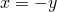
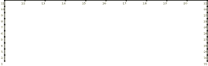
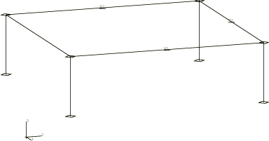

# 1.17.1 使用子结构的框架分析

**产品：** Abaqus/Standard

子结构在某些情况下可以显著节省计算机时间。它们可以用于线性分析中，将问题分成几个较小的分析，或者保存每次进行分析时不会修改的结构部分。子结构在非线性分析中也很有用。如"赫兹接触问题"第 1.1.11 节所示，如果结构在任何部分在分析过程中保持线性，该部分的刚度可以计算一次并保存。子结构也可用于围绕由非线性响应达到的状态的线性扰动分析，如"旋转悬臂板的振动"第 1.4.7 节所示，其中计算了预应力结构的振动频率。

此示例的目的是提供 Abaqus 中子结构功能的基本演示和验证。

### 问题描述

此示例是由横梁连接的两根柱组成的框架（[图 1.17.1-1](ch01s17ach129.md#sxmsuperframe-model)）。柱和横梁各用 10 个 B21 类型的单元建模。框架受到施加在横梁上的分布载荷。

### 一级子结构分析

一旦生成了子结构，它就可以像分析中的任何其他单元一样使用。子结构通过指定的自由度（保留的自由度）连接到模型的其余部分。在子结构生成过程中，也可以为子结构定义载荷情况。然后可以在分析过程中对这些载荷情况进行缩放和施加。在此示例中，横梁上的载荷被定义为子结构载荷情况，然后在全局级别施加。

许多结构包含具有相同几何的部分。在这种情况下，可以将部件生成为单个子结构，然后使用多次。在这种情况下，两根柱是相同的，因此可以为一根柱的几何生成一次子结构，然后使用两次。

分析包括两个步骤。第一步是静力载荷情况，其中分布载荷施加到结构上。对于此步骤，子结构分析给出与使用无子结构的模型获得相同的解，因为到子结构刚度矩阵的静力缩减不会改变该矩阵。

在第二步中执行频率分析以提取结构的前几个振动模式。生成子结构以合理准确度模拟其动态响应的技术称为"组件模态综合"。在这种方法中，子结构的动态响应由其静态变形模式和在其保留自由度完全约束时获得的其一些固有振动模式的组合构成。对于具有许多内部自由度的子结构，提取这些内部振动模式可能代价高昂。在这种情况下，通常可以通过"Guyan 缩减"获得子结构的足够准确的动态表示。这意味着保留了额外的自由度，这些自由度对于子结构与网格其余部分的物理连接不是必需的，只是为了改善动态建模。这种方法的缺点是，需要对这些自由度做出明智的选择，以从子结构矩阵的较大尺寸中获得最大益处。因此，组件模态综合是一种更可靠的替代方案，但需要对子结构进行频率分析，这对于大型模型可能代价高昂。这些模式通过在频率步骤中提取子结构的一些特征频率获得，所有保留的自由度都受到边界条件约束。将在子结构生成中使用的 *n* 个模式被指定，*n* 不大于已提取的模式数。然后在全局分析中使用子结构时添加这些额外模式。通常，即使只有几个额外的模式，这种技术也能显著改善子结构动态行为的表示。在此示例中，我们在每个子结构中添加了两个额外模式。[substrframe_1level_2mode_gen1.inp](../eif/substrframe_1level_2mode_gen1.inp) 和 [substrframe_1level_2mode_gen2.inp](../eif/substrframe_1level_2mode_gen2.inp) 显示了添加额外动态模式时的输入数据。

### 多级子结构分析

子结构可以在子结构内使用。我们通过将每根柱分成两个相同的部分来说明此功能。然后为半柱生成子结构，然后通过组合最低级别的两个子结构为完整柱生成更高级别的子结构。对横梁遵循相同的过程。通过这种方式，总共使用九个子结构来建模结构，尽管重复结构需要非常少的计算。Abaqus 对可使用的子结构级别数没有限制。[substrframe_2level_gen1.inp](../eif/substrframe_2level_gen1.inp)、[substrframe_2level_gen2.inp](../eif/substrframe_2level_gen2.inp)、[substrframe_2level_gen3.inp](../eif/substrframe_2level_gen3.inp) 和 [substrframe_2level_gen4.inp](../eif/substrframe_2level_gen4.inp) 显示了具有两级子结构的此示例的输入数据。

### 子结构库文件

默认情况下，Abaqus 会将子结构写入名称由作业名称定义的文件。也可以在子结构生成分析和定义单元时定义库名称。可以使用子结构目录列出子结构库的内容。也可以将子结构从一个文件复制到另一个文件。[substrframe_substrdirect.inp](../eif/substrframe_substrdirect.inp) 显示了这些选项的用法。

### 子结构旋转和镜像

子结构刚度和质量矩阵基于生成子结构时单元的位置和方向创建。只要这些矩阵只是被平移，它们就可以在空间中的任何地方使用。如果需要以旋转配置使用子结构，则必须转换矩阵。使用子结构属性定义子结构的旋转和镜像。此示例用如图 1.17.1-2（[图 1.17.1-2](ch01s17ach129.md#sxmsuperframe-3dmodel)）所示的三维框架结构说明此选项。使用级别的单元 82 通过将子结构 Z201 旋转 90° 创建。使用级别的单元 81 通过在平面  中镜像子结构 Z201 创建。全局级别的单元 72 可以通过简单平移子结构 Z201 创建，但实际上是通过子结构的旋转和镜像创建。[substrframe_b31_gen1.inp](../eif/substrframe_b31_gen1.inp) 和 [substrframe_b31_gen2.inp](../eif/substrframe_b31_gen2.inp) 显示了此分析的输入数据。

### 结果与讨论

无子结构的分析为此示例提供了"正确"的结果（即，结果对于所使用的有限元离散化是正确的）。对于静力载荷情况，子结构分析不意味着任何近似；因此，使用子结构的结果是相同的。对于频率分析，子结构质量矩阵是一个近似表示，因此会损失一些精度。[表 1.17.1-1](ch01s17ach129.md#table-superframe-freqs-planar) 和[表 1.17.1-2](ch01s17ach129.md#table-superframe-freqs-3d) 分别显示了平面和三维模型估计的最低频率的比较。它们显示了包含额外模式获得的结果的显著改善。

### 输入文件

[substrframe_1level_2modes.inp](../eif/substrframe_1level_2modes.inp)

子结构的一级，每个子结构添加两个动态模式。

[substrframe_1level_2mode_gen1.inp](../eif/substrframe_1level_2mode_gen1.inp)

分析 substrframe_1level_2modes.inp 引用的子结构生成。

[substrframe_1level_2mode_gen2.inp](../eif/substrframe_1level_2mode_gen2.inp)

分析 substrframe_1level_2modes.inp 引用的子结构生成。

[substrframe_2level.inp](../eif/substrframe_2level.inp)

子结构的两级。

[substrframe_2level_gen1.inp](../eif/substrframe_2level_gen1.inp)

分析 substrframe_2level.inp 引用的子结构生成。

[substrframe_2level_gen2.inp](../eif/substrframe_2level_gen2.inp)

分析 substrframe_2level.inp 引用的子结构生成。

[substrframe_2level_gen3.inp](../eif/substrframe_2level_gen3.inp)

分析 substrframe_2level.inp 引用的子结构生成。

[substrframe_2level_gen4.inp](../eif/substrframe_2level_gen4.inp)

分析 substrframe_2level.inp 引用的子结构生成。

[substrframe_substrdirect.inp](../eif/substrframe_substrdirect.inp)

显示 [*SUBSTRUCTURE DIRECTORY*](../key/key-link.md#usb-kws-ssubdirectory) 的使用以及将 substrframe_2level.inp 中的三个子结构文件合并到两个子结构文件中。

[substrframe_b31.inp](../eif/substrframe_b31.inp)

使用子结构的三维框架结构分析。在这种情况下，单元 82 通过旋转创建，单元 81 通过在平面  中镜像创建，单元 72 通过旋转然后镜像创建。

[substrframe_b31_gen1.inp](../eif/substrframe_b31_gen1.inp)

分析 substrframe_b31.inp 引用的子结构生成。

[substrframe_b31_gen2.inp](../eif/substrframe_b31_gen2.inp)

分析 substrframe_b31.inp 引用的子结构生成。

[substrframe_nosubstr.inp](../eif/substrframe_nosubstr.inp)

无子结构的分析。

[substrframe_1level.inp](../eif/substrframe_1level.inp)

具有一级子结构的分析。

[substrframe_1level_gen1.inp](../eif/substrframe_1level_gen1.inp)

分析 substrframe_1level.inp 引用的子结构生成。

[substrframe_substrpath.inp](../eif/substrframe_substrpath.inp)

显示在 substrframe_substrdirect.inp 中生成的两个子结构文件在重做框架全局分析中的使用。

[substrframe_3d_nosubstr.inp](../eif/substrframe_3d_nosubstr.inp)

无子结构的三维框架结构分析。

[substrframe_rotz201.inp](../eif/substrframe_rotz201.inp)

使用子结构的三维框架结构分析。*y* 方向上的两个结构通过将子结构 Z201 绕 *z* 轴旋转 90° 创建。

[substrframe_rotz201_gen1.inp](../eif/substrframe_rotz201_gen1.inp)

分析 substrframe_rotz201.inp 引用的子结构生成。

[substrframe_rotz201_gen2.inp](../eif/substrframe_rotz201_gen2.inp)

分析 substrframe_rotz201.inp 引用的子结构生成。

[substrframe_rotz201_2modes.inp](../eif/substrframe_rotz201_2modes.inp)

与 substrframe_rotz201.inp 相同，每个子结构添加两个额外动态模式。

[substrframe_rotz201_2mode_gen1.inp](../eif/substrframe_rotz201_2mode_gen1.inp)

分析 substrframe_rotz201_2modes.inp 引用的子结构生成。

[substrframe_rotz201_2mode_gen2.inp](../eif/substrframe_rotz201_2mode_gen2.inp)

分析 substrframe_rotz201_2modes.inp 引用的子结构生成。

### 表格

**表 1.17.1-1** 前三种模式的频率，平面模型（所有频率单位：周期/时间）。
|  | 模式 1 | 模式 2 | 模式 3 |
| --- | --- | --- | --- |
| 无子结构 | 7.0176 | 7.2431 | 20.309 |
| 三个子结构 | 7.2609 | 11.640 | 33.291 |
| 误差 | 3.5% | 61% | 64% |
| 三个子结构，带两个动态模式 | 7.0173 | 7.2444 | 20.314 |
| 误差 | 0.004% | 0.004% | 0.004% |
| 两级 | 7.2609 | 11.640 | 33.291 |
| 子结构 |  |  |  |
| 误差 | 3.5% | 61% | 64% |

**表 1.17.1-2** 前三种模式的频率，三维模型（所有频率单位：周期/时间）。
|  | 模式 1 | 模式 2 | 模式 3 |
| --- | --- | --- | --- |
| 无子结构 | 4.6277 | 4.6277 | 4.6320 |
| 八个子结构 | 5.0416 | 5.0416 | 5.4384 |
| 误差 | 8.9% | 8.9% | 17.4% |
| 八个子结构，带两个动态模式 | 4.6301 | 4.6301 | 4.6321 |
| 误差 | 0.05% | 0.05% | 0.05% |

### 图表

**图 1.17.1-1** 框架模型。

**图 1.17.1-2** 三维模型。

