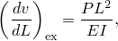
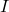
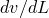
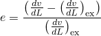
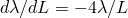
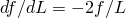
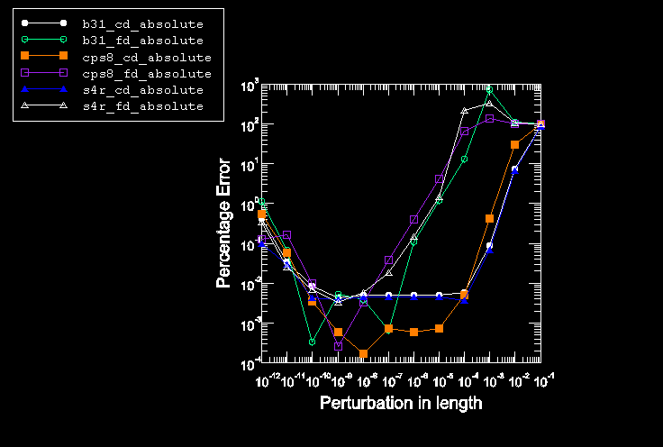
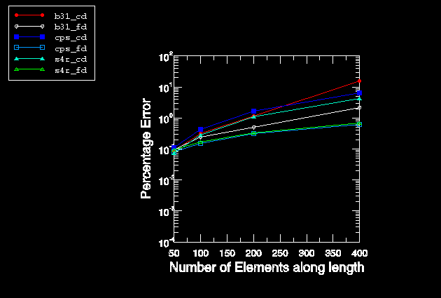
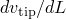
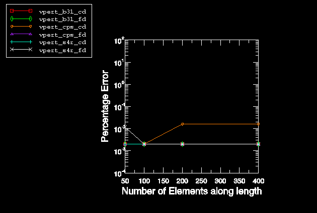

# 1.18.1 悬臂梁设计灵敏度分析

**产品：** Abaqus/Standard  Abaqus/Design

Abaqus 中的设计灵敏度分析使用半解析方法进行。文献中广泛讨论了使用这种方法获得关于设计形状参数的准确灵敏度的这个问题（例如，Pedersen 等人，1989；Barthelemy 和 Haftka，1990；Fenyes 和 Lust，1991；以及 Van Keulen 和 De Boer，1998）。困难在于灵敏度的准确性可能取决于单元的数量。这种依赖性在使用解析灵敏度分析或整体有限差分法时都不会出现。典型示例是承受端部载荷的悬臂梁，其中寻求梁长度对端点位移的灵敏度。本示例展示了 Abaqus/Design 使用的默认扰动大小调整算法在获得准确端点位移灵敏度方面的有效性。此外，进行了灵敏度分析以获得固有频率的灵敏度。

### 问题描述

使用 CPS8、S4R 和 B31 单元对长 100 个单位、深 2 个单位的悬臂梁进行建模。1 个单位的合成端部载荷施加到自由端以模拟剪切载荷。材料是线弹性的，使用 Abaqus/Standard 进行线性静力分析。使用四种不同的网格密度来研究网格细化的效果。选择的网格密度确保端点挠度与 Euler-Bernoulli 解相比误差小于 0.05%。每种单元类型的最粗网格沿长度包含 50 个单元。网格密度每级细化翻倍，因此每种单元类型的最高细化网格沿长度包含 400 个单元。对于 CPS8 单元网格，最粗网格（沿长度 50 个单元）包含一个穿过深度的单元，最细化网格（沿长度 400 个单元）穿过深度包含 8 个单元。只假定梁端部节点在 *x* 方向上的坐标取决于长度，因此为参数形状变化指定的梯度是统一的（即，只施加了边界扰动）。

静力分析之后，进行了包括设计灵敏度分析在内的频率分析。计算了关于梁长度的前三个特征值和相应固有频率的灵敏度。

### 结果和讨论

基于 Euler-Bernoulli 梁理论，对于承受端部载荷的悬臂梁，端点位移的灵敏度，，关于长度，，由下式给出

其中  是弹性模量， 是惯性矩。

半解析方法基于扰动设计参数 ，并使用差分技术来近似灵敏度。对于这个问题，产生最准确端点位移灵敏度的 *L* 中扰动大小  可以通过计算误差

在一系列扰动大小上确定。使用前向差分和中心差分的结果对于最粗网格绘制在[图 1.18.1-1](ch01s18ach130.md#sxmdsacant-errorvar)中。这些结果的行为是典型的：在"最优"扰动大小的左侧，误差由于舍入或消除误差而增加；在最优扰动大小的右侧，误差再次增加，但这次是由于差分公式中高阶项的截断，称为截断误差。

为了展示截断误差随单元数量的增长，扰动大小从[图 1.18.1-1](ch01s18ach130.md#sxmdsacant-errorvar)所示图中截断区域中选择，使得最粗网格计算灵敏度的误差可接受（0.1%）。这导致对于 CPS8、S4R 和 B31 单元，中心差分的扰动大小分别为 5×10^-4、1×10^-3 和 1×10^-3，前向差分分别为 2×10^-7、6×10^-7 和 9×10^-7。然后在细化网格的灵敏度分析中使用这些相同的扰动大小。[图 1.18.1-2](ch01s18ach130.md#sxmdsacant-errormesh)显示了当沿长度方向的单元数量增加时计算灵敏度百分比误差的增长。从这些结果可以清楚地看出，为粗网格产生准确结果的扰动大小可能为更细化网格产生较差结果，因为截断误差随网格细化增长。截断误差可以通过适当选择扰动大小来控制。实际上，如果选择 1×10^-9 的扰动大小，从[图 1.18.1-3](ch01s18ach130.md#sxmdsacant-errorzero)可以看出，对于所有单元类型，中心差分和前向差分的误差增长都不显著。

Abaqus/Design 中的默认扰动大小调整算法为每个单元确定扰动大小，然后在中心差分方案中使用这些大小来计算灵敏度。[表 1.18.1-1](ch01s18ach130.md#table-abqerror)显示了在各种网格细化级别上对端点位移灵敏度具有主导影响的单元所选择的扰动大小，以及 Abaqus/Design 灵敏度解的百分比误差。对于每个最粗网格，Abaqus/Design 选择的扰动大小与基于[图 1.18.1-1](ch01s18ach130.md#sxmdsacant-errorvar)的中心差分最优值非常一致。

可以证明，悬臂梁的特征值（）和固有频率（*f*，周期/时间）的灵敏度解析地由  和  给出。频率分析针对最粗网格进行，灵敏度分析使用默认扰动大小调整算法。默认情况下，算法基于第一模式确定扰动大小，然后对剩余模式重用相同的扰动大小。为了强制 Abaqus/Design 为每个模式获得新的扰动大小，可以在频率步骤中使用 DSA 求解控制，并在每个增量执行大小调整算法。Abaqus/Design 获得的前三个弯曲模式特征值和特征频率的灵敏度与解析方法和整体中心差分法获得的进行比较，分别用于所有单元类型在[表 1.18.1-2](ch01s18ach130.md#table-eigsens-cps8)、[表 1.18.1-3](ch01s18ach130.md#table-eigsens-s4r)和[表 1.18.1-4](ch01s18ach130.md#table-eigsens-b31)中。对于整体差分法，通过试错获得了 1.0×10^-4*L* 的最优扰动大小。Abaqus 和整体中心差分法之间看到了极好的一致性。使用 Abaqus/Design 中的设计灵敏度分析能力相对于整体有限差分法的优点是：（1）自动确定扰动大小；（2）由于灵敏度在与固有频率提取相同的分析中计算，因此计算工作减少。通过选择 1 的调整频率来重新计算每个模式的扰动大小所花费的努力实际上不会在灵敏度中产生差异，默认设置非常准确。

### 输入文件

[dsacantcps850.inp](../eif/dsacantcps850.inp)

使用 50 个 CPS8 单元建模的悬臂梁，包括频率步骤。

[dsacantcps8100.inp](../eif/dsacantcps8100.inp)

使用 100 个 CPS8 单元建模的悬臂梁。

[dsacantcps8200.inp](../eif/dsacantcps8200.inp)

使用 200 个 CPS8 单元建模的悬臂梁。

[dsacantcps8400.inp](../eif/dsacantcps8400.inp)

使用 400 个 CPS8 单元建模的悬臂梁。

[dsacants4r850.inp](../eif/dsacants4r850.inp)

使用 50 个 S4R 单元建模的悬臂梁，包括频率步骤。

[dsacants4r8100.inp](../eif/dsacants4r8100.inp)

使用 100 个 S4R 单元建模的悬臂梁。

[dsacants4r8200.inp](../eif/dsacants4r8200.inp)

使用 200 个 S4R 单元建模的悬臂梁。

[dsacants4r8400.inp](../eif/dsacants4r8400.inp)

使用 400 个 S4R 单元建模的悬臂梁。

[dsacantb31850.inp](../eif/dsacantb31850.inp)

使用 50 个 B31 单元建模的悬臂梁，包括频率步骤。

[dsacantb318100.inp](../eif/dsacantb318100.inp)

使用 100 个 B31 单元建模的悬臂梁。

[dsacantb318200.inp](../eif/dsacantb318200.inp)

使用 200 个 B31 单元建模的悬臂梁。

[dsacantb318400.inp](../eif/dsacantb318400.inp)

使用 400 个 B31 单元建模的悬臂梁。

### 参考文献

Pedersen, P., G. Cheng, and J. Rasmussen, "On Accuracy Problems for Semi-Analytical Sensitivity Analysis," Mechanics of Structures and Machines, vol. 17, pp. 373–384, 1989.

Barthelemy, B., and R. T. Haftka, "Accuracy Analysis of the Semi-Analytic Method for Shape Sensitivity Calculation," Mechanics of Structures and Machines, vol. 18, pp. 407–432, 1990.

Fenyes, P. A., and R. V. Lust, "Error Analysis of Semianalytic Displacement Derivatives for Shape and Sizing Variables," AIAA Journal, vol. 29, pp. 271–279, 1991.

Van Keulen, F., and H. De Boer, "Rigorous Improvement of Semi-Analytical Design Sensitivities by Exact Differentiation of Rigid Body Motions," International Journal for Numerical Methods in Engineering, vol. 42, pp. 71–91, 1998.

### 表格

**表 1.18.1-1** Abaqus 端点位移灵敏度结果。
| 沿长度的单元数量 | Abaqus 为主控单元选择的扰动大小 | 百分比误差 |
| --- | --- | --- |
| CPS8 | S4R | B31 | CPS8 | S4R | B31 |
| 50 | 1.5e-06 | 1.5e-06 | 1.5e-08 | 0.004 | 0.002 | 0.002 |
| 100 | 1.5e-06 | 1.5e-07 | 1.5e-08 | 0.008 | 0.002 | 0.002 |
| 200 | 1.5e-06 | 1.5e-07 | 1.5e-08 | 0.009 | 0.002 | 0.002 |
| 400 | 1.5e-07 | 1.5e-07 | 1.5e-08 | 0.009 | 0.002 | 0.002 |

**表 1.18.1-2** CPS8 单元的 Abaqus 和其他方法获得的特征值和频率灵敏度比较。
| 弯曲模式 | 模式编号 | 关于梁长度的灵敏度 | Abaqus（默认） | Abaqus（每个增量调整大小） | 整体中心差分方案 | 解析解 |
| --- | --- | --- | --- | --- | --- | --- |
| 1 | 1 | 特征值 | 3.460e03 | 3.460e03 | 3.460e03 | 3.461e03 |
| 频率 | 9.362e-04 | 9.362e-04 | 9.350e-04 | 9.363e-04 |
| 2 | 2 | 特征值 | 1.355e01 | 1.355e01 | 1.353e01 | 1.353e01 |
| 频率 | 5.860e-03 | 5.860e-03 | 5.856e-03 | 5.859e-03 |
| 3 | 3 | 特征值 | 1.057e00 | 1.057e00 | 1.052e00 | 1.058e00 |
| 频率 | 1.630e-02 | 1.636e-02 | 1.630e-02 | 1.637e-02 |

**表 1.18.1-3** S4R 单元的 Abaqus 和其他方法获得的特征值和频率灵敏度比较。
| 弯曲模式 | 模式编号 | 关于梁长度的灵敏度 | Abaqus（默认） | Abaqus（每个增量调整大小） | 整体中心差分方案 | 解析解 |
| --- | --- | --- | --- | --- | --- | --- |
| 1 | 4 | 特征值 | 3.460e03 | 3.460e03 | 3.460e03 | 3.460e03 |
| 频率 | 9.362e-04 | 9.362e-04 | 9.362e-04 | 9.362e-04 |
| 2 | 10 | 特征值 | 1.357e01 | 1.357e01 | 1.355e01 | 1.353e01 |
| 频率 | 5.860e-03 | 5.860e-03 | 5.856e-03 | 5.859e-03 |
| 3 | 17 | 特征值 | 1.062e00 | 1.062e00 | 1.060e00 | 1.058e00 |
| 频率 | 1.640e-02 | 1.640e-02 | 1.640e-02 | 1.637e-02 |

**表 1.18.1-4** B31 单元的 Abaqus 和其他方法获得的特征值和频率灵敏度比较。
| 弯曲模式 | 模式编号 | 关于梁长度的灵敏度 | Abaqus（默认） | Abaqus（每个增量调整大小） | 整体中心差分方案 | 解析解 |
| --- | --- | --- | --- | --- | --- | --- |
| 1 | 2 | 特征值 | 3.460e03 | 3.460e03 | 3.457e03 | 3.461e03 |
| 频率 | 9.366e-04 | 9.360e-04 | 9.370e-04 | 9.363e-04 |
| 2 | 4 | 特征值 | 1.353e01 | 1.353e01 | 1.354e01 | 1.353e01 |
| 频率 | 5.854e-03 | 5.854e-03 | 5.850e-03 | 5.859e-03 |
| 3 | 7 | 特征值 | 1.055e00 | 1.055e00 | 1.058e00 | 1.058e00 |
| 频率 | 1.634e-02 | 1.634e-02 | 1.639e-02 | 1.637e-02 |

### 图形

**图 1.18.1-1** 端点位移灵敏度关于扰动大小的误差变化。

**图 1.18.1-2** 对于为最粗网格给出 0.1% 误差的扰动大小，端点位移灵敏度随网格细化的误差变化（摘自[图 1.18.1-1](ch01s18ach130.md#sxmdsacant-errorvar)）。

**图 1.18.1-3** 对于 1×10^-9 的扰动，端点位移灵敏度  随网格细化的误差变化。

