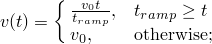
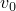
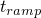
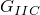
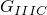
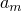
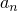
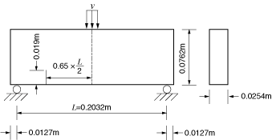
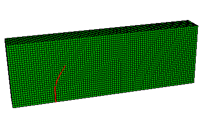

# 1.19.3 使用 XFEM 模拟冲击载荷下梁中的裂纹扩展

**产品：** Abaqus/Standard

### 问题描述

此示例验证并说明了在 Abaqus/Standard 中使用扩展有限元方法（XFEM）预测具有偏移边缘裂纹的梁的动态裂纹扩展。标本受到混合模式冲击载荷。研究了二维和三维模型。呈现的裂纹路径和裂纹起始角度与 John 和 Shah（1990）的实验结果进行了比较。

### 几何和模型

研究了具有偏移边缘裂纹的梁。标本如图 1.19.3-1（[图 1.19.3-1](ch01s19ach135.md#xfem-beam-geometry)）所示，长度为 0.2286 m，厚度为 0.0254 m，宽度为 0.0762 m。支撑之间的距离为 0.2032 m。为了引起混合模式断裂，在标本中从跨中偏移距离 0.06604 m 处制作了长度为 0.019 m 的初始裂纹。在标本的跨中施加速度边界条件以模拟动态冲击：

其中  = 0.06 m/s， = 1.96×10⁻⁴ s。

### 材料

富集单元中体积材料特性的材料数据为  = 31.37 GPa， = 2400 kg/m³， = 0.2。

指定了模型中富集单元的内聚力行为响应。选择最大主应力失效准则用于损伤起始，选择基于幂律断裂准则的基于能量的损伤演化规律用于损伤扩展。相关材料数据如下： = 10.45 MPa， = 19.58 N/m， = 19.58 N/m， = 19.58 N/m， = 1.0， = 1.0， = 1.0。

### 结果与讨论

[图 1.19.3-2](ch01s19ach135.md#xfem-beam-crack-profile) 显示了  = 1.3×10⁻³ s 时的裂纹轮廓。裂纹以 58° 的角度扩展，与 60° 的实验结果合理一致。

### 输入文件

[crackprop_tpb_xfem_2d_dyn.inp](../eif/crackprop_tpb_xfem_2d_dyn.inp)

混合模式冲击载荷下的二维平面应变模型。

[crackprop_tpb_xfem_c3d4_dyn.inp](../eif/crackprop_tpb_xfem_c3d4_dyn.inp)

混合模式冲击载荷下的三维四面体模型。

[crackprop_tpb_xfem_c3d8r_dyn.inp](../eif/crackprop_tpb_xfem_c3d8r_dyn.inp)

混合模式冲击载荷下具有减缩积分的三维砖块模型。

### Python 脚本

### 参考

John, P., and S. P. Shah, "Mixed Mode Fracture of Concrete Subjected to Impact Loading," Journal of Structural Engineering (ASCE), vol. 116, pp. 585–602, 1990.

### 图表

**图 1.19.3-1** 具有偏移边缘裂纹的梁的模型几何（尺寸单位：m）。

**图 1.19.3-2**  = 1.3×10⁻³ s 时的裂纹轮廓。

