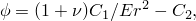
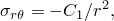
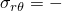
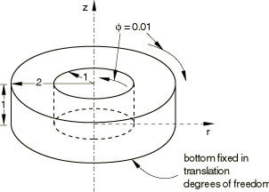
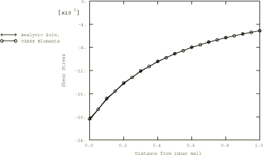

# 2.1.1 空心圆柱的扭转

**产品：** Abaqus/Standard  

本问题验证并说明了Abaqus中带扭转的轴对称实体单元的应用。使用了由Fung（1977）提供的Airy应力函数来获得该问题在圆柱坐标系下的应力分量。

### 问题描述

物理问题包括一个空心圆柱，其一端在平移自由度上固定。在空心圆柱的内径和外径上施加大小相等的相反扭转。[图2.1.1-1](ch02s01ach138.md#sxmtorsion-hollowcyl)显示了该分析中使用的模型几何形状。大多数用于该问题的网格是均匀的；然而，由于应力是半径的二次函数，建议在应变梯度较高的区域进行网格细化。两个输入文件在内径附近使用了细化网格以及适当的网格细化多点约束。某些输入文件使用运动耦合将边界表面耦合到参考节点；扭转施加在参考节点上。所有带扭转的轴对称实体单元都在本问题中进行了测试；耦合温度-位移单元在稳态耦合温度-位移步骤中进行了测试，施加了任意边界温度和热膨胀系数， 0，以防止与机械解耦合。尚未进行网格收敛研究。为了测试涉及带扭转的轴对称单元的问题中的子结构使用，该问题还使用子结构化方法求解，将整个模型作为单个子结构处理。

### 结果与讨论

基于由Fung（1977）提供的Airy应力函数，得到的该问题的解析解为：

其中，是弧度单位的扭转角，C1 = 2.05128 × 10^4，C2 = 1.6667 × 10^2。

[图2.1.1-2](ch02s01ach138.md#sxmtorsion-shearstress)显示了CGAX8单元模型（其中 = S13）的剪应力，，随空心圆柱半径的变化，并与解析解进行比较。所有单元的结果都与解析解吻合良好。子结构分析的结果与不使用子结构时获得的结果一致。

### 输入文件

[torsholcyl_cgax3_couplingk.inp](../eif/torsholcyl_cgax3_couplingk.inp)

使用[*COUPLING](../key/key-link.md#usb-kws-mcoupling)和[*KINEMATIC](../key/key-link.md#usb-kws-mkinematic)选项施加扭转的CGAX3模型。

[torsholcyl_cgax3_kincoupl.inp](../eif/torsholcyl_cgax3_kincoupl.inp)

使用[*KINEMATIC COUPLING](../key/key-link.md#usb-kws-mkinematiccoupling)选项施加扭转的CGAX3模型。

[torsholcyl_cgax3h.inp](../eif/torsholcyl_cgax3h.inp)

CGAX3H模型。

[torsholcyl_cgax4.inp](../eif/torsholcyl_cgax4.inp)

CGAX4模型。

[torsholcyl_cgax4h.inp](../eif/torsholcyl_cgax4h.inp)

CGAX4H模型。

[torsholcyl_cgax4ht.inp](../eif/torsholcyl_cgax4ht.inp)

CGAX4HT模型。

[torsholcyl_cgax4r_meshrefine.inp](../eif/torsholcyl_cgax4r_meshrefine.inp)

带网格细化的CGAX4R模型。

[torsholcyl_cgax4rh.inp](../eif/torsholcyl_cgax4rh.inp)

CGAX4RH模型。

[torsholcyl_cgax4rh_eh.inp](../eif/torsholcyl_cgax4rh_eh.inp)

带增强沙漏控制的CGAX4RH模型。

[torsholcyl_cgax4t.inp](../eif/torsholcyl_cgax4t.inp)

CGAX4T模型。

[torsholcyl_cgax6.inp](../eif/torsholcyl_cgax6.inp)

CGAX6模型。

[torsholcyl_cgax6h.inp](../eif/torsholcyl_cgax6h.inp)

CGAX6H模型。

[torsholcyl_cgax6m.inp](../eif/torsholcyl_cgax6m.inp)

CGAX6M模型。

[torsholcyl_cgax6mh.inp](../eif/torsholcyl_cgax6mh.inp)

CGAX6MH模型。

[torsholcyl_cgax8.inp](../eif/torsholcyl_cgax8.inp)

CGAX8模型。

[torsholcyl_cgax8_substruct.inp](../eif/torsholcyl_cgax8_substruct.inp)

使用子结构化的CGAX8模型。

[torsholcyl_cgax8_substruct_gen1.inp](../eif/torsholcyl_cgax8_substruct_gen1.inp)

torsholcyl_cgax8_substruct.inp分析中引用的子结构生成。

[torsholcyl_cgax8h.inp](../eif/torsholcyl_cgax8h.inp)

CGAX8H模型。

[torsholcyl_cgax8h_neohook.inp](../eif/torsholcyl_cgax8h_neohook.inp)

带neo-Hookean不可压缩超弹性材料的CGAX8H模型。

[torsholcyl_cgax8ht.inp](../eif/torsholcyl_cgax8ht.inp)

CGAX8HT模型。

[torsholcyl_cgax8r_meshrefine.inp](../eif/torsholcyl_cgax8r_meshrefine.inp)

带网格细化的CGAX8R模型。

[torsholcyl_cgax8rh.inp](../eif/torsholcyl_cgax8rh.inp)

CGAX8RH模型。

[torsholcyl_cgax8rht.inp](../eif/torsholcyl_cgax8rht.inp)

CGAX8RHT模型。

[torsholcyl_cgax8rt.inp](../eif/torsholcyl_cgax8rt.inp)

CGAX8RT模型。

[torsholcyl_cgax8t.inp](../eif/torsholcyl_cgax8t.inp)

CGAX8T模型。

### 参考文献

Fung, Y. C., *Foundations of Solid Mechanics*, Prentice-Hall Inc., New Jersey, 1977.

### 图表

**图2.1.1-1** 空心圆柱的扭转。

**图2.1.1-2** 剪应力随半径的变化。

