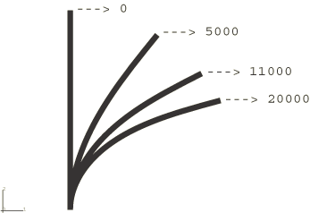
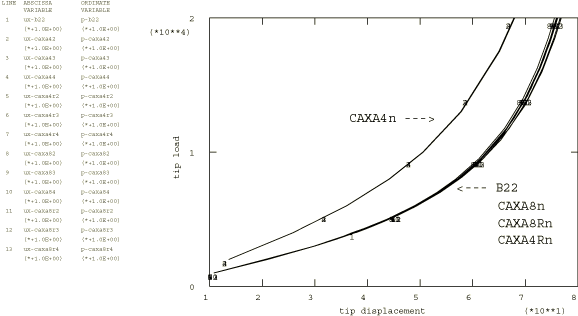
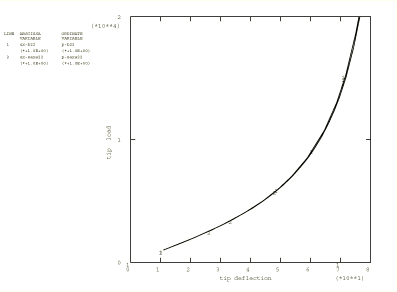

# 2.1.3 使用CAXA和SAXA单元分析悬臂梁

**产品：** Abaqus/Standard  

Abaqus提供了一系列单元，旨在对最初是轴对称但经历非线性和非轴对称变形的结构进行非线性分析。这些单元——命名为CAXA的连续体单元和命名为SAXA的壳单元——常用于建模圆柱形或管道结构，其中假设变形相对于 = 0对称，结构的弯曲发生在 = 90°轴线附近。单元编写为可在几何非线性分析中进行任意大变形。非线性能力对于细长结构特别有用。单元在r–z平面内使用标准等参插值，结合关于的傅里叶插值。最多允许四个傅里叶模式。作为简单的大变形演示问题，["悬臂梁的几何非线性分析，"第2.1.2节](ch02s01ach139.md)中的悬臂梁问题使用CAXA和SAXA单元求解。悬臂梁在其端部受恒定方向荷载。本例评估了二阶（CAXA为8节点，SAXA为3节点）和一阶（CAXA为4节点，SAXA为2节点）单元在单个大位移情况下的准确性，并将结果与梁理论获得的结果进行比较。

本例还用于分析使用CAXA和SAXA单元建模的端部加载悬臂梁的频率响应。结果与梁理论获得的结果进行比较。

### 问题描述

悬臂梁是一根长100单位的管道，截面外半径1.2675，壁厚0.2。该管道适度细长（ = 78.9）。这类问题随着细长比的增加在数值上变得更加困难。杨氏模量选为30 × 10^6，泊松比为0.3。管道轴线的运动完全在一个平面内，因此任何CAXA或SAXA单元都适用，除了那些仅在方向使用一个傅里叶模式的单元。（由于管道的有限旋转，截面在r–z平面上的投影变为椭圆。）由于傅里叶模式在固定的r–z系统中定义，使用二阶傅里叶展开（包括椭圆化）是最低要求。有限元模型对CAXA模型使用二阶单元，沿管道长度（z方向）10个单元，在r方向1个单元。一阶SAXA模型使用20个单元。使用一阶CAXA4*n*（n=2、3或4）单元的有限元模型由于剪切锁定而预期给出更硬的响应。然而，使用带减缩积分和沙漏控制的一阶单元CAXA4R*n*（n=2、3或4）的模型能够给出更准确的结果。在没有任何网格收敛研究的情况下，我们使用完全积分一阶单元的2×20网格和带沙漏控制的相应减缩积分单元的4×40网格来解决问题。

### 荷载和边界条件

悬臂梁端部的荷载增加到20000，使端部挠度超过75单位。CAXA单元在全局x和z方向都有刚体模式。通过固定管道固定端处节点集`BASE`的z位移来消除z方向的刚体模式。通过固定位于管道固定端处的中点节点的r位移来消除x方向的刚体模式。固定端的椭圆化也受到这些边界条件的限制。所有其他截面平面都可以椭圆化。集中荷载被分成两部分，一半施加在管道加载端 = 0和 = 180平面中的中点节点上。为了避免在CAXA模型中因在加载端施加集中荷载而产生的壁厚方向变形，中点节点处的径向位移被约束为等于内半径和外半径处节点径向运动的平均值。这通过方程约束实现（["线性约束方程，"Abaqus Analysis User's Guide第35.2.1节](../usb/usb-link.md#usb-cni-pequation)）。

通用加载步骤形成后续频率分析步骤的基态。在频率分析步骤中，荷载和边界条件保持为前一步骤中定义的状态。

### 结果与讨论

[图2.1.3-1](ch02s01ach140.md#sxmcaxasaxa-pipedef)显示了使用单元类型CAXA82建模的管道的渐进变形。CAXA单元的结果（以悬臂梁端部的运动表示）示于[图2.1.3-2](ch02s01ach140.md#sxmcaxasaxa-loaddispcaxa)，其中与使用B22梁单元获得的梁解进行了比较。显然，CAXA8*n*、CAXA8R*n*和CAXA4R*n*（n=2、3或4）单元的位移解几乎精确地预测了使用B22梁单元的模型获得的结果。正如预期，完全积分的一阶CAXA模型具有更硬的响应，而带减缩积分和沙漏控制的对应单元给出更准确的结果。SAXA单元的结果示于[图2.1.3-3](ch02s01ach140.md#sxmcaxasaxa-loaddispsaxa)，其中再次与B22解进行了比较。为清晰起见，仅绘制了SAXA22结果，因为所有SAXA1*n*和SAXA2*n*（n=2、3或4）单元产生几乎相同的结果。

使用CAXA8*n*、CAXA8R*n*和CAXA4R*n*（n=2、3或4）单元建模的端部加载悬臂梁的频率响应与使用B22梁单元的模型的频率响应非常接近。完全积分的一阶CAXA单元的固有频率更高，因为这些单元的响应更硬。

### 输入文件

[cantilevercaxasaxa_caxa42.inp](../eif/cantilevercaxasaxa_caxa42.inp)

CAXA42单元模型。

[cantilevercaxasaxa_caxa43.inp](../eif/cantilevercaxasaxa_caxa43.inp)

CAXA43单元模型。

[cantilevercaxasaxa_caxa44.inp](../eif/cantilevercaxasaxa_caxa44.inp)

CAXA44单元模型。

[cantilevercaxasaxa_caxa4r2.inp](../eif/cantilevercaxasaxa_caxa4r2.inp)

CAXA4R2单元模型。

[cantilevercaxasaxa_caxa4r3.inp](../eif/cantilevercaxasaxa_caxa4r3.inp)

CAXA4R3单元模型。

[cantilevercaxasaxa_caxa4r4.inp](../eif/cantilevercaxasaxa_caxa4r4.inp)

CAXA4R4单元模型。

[cantilevercaxasaxa_caxa82.inp](../eif/cantilevercaxasaxa_caxa82.inp)

CAXA82单元模型。

[cantilevercaxasaxa_caxa83.inp](../eif/cantilevercaxasaxa_caxa83.inp)

CAXA83单元模型。

[cantilevercaxasaxa_caxa84.inp](../eif/cantilevercaxasaxa_caxa84.inp)

CAXA84单元模型。

[cantilevercaxasaxa_caxa8r2.inp](../eif/cantilevercaxasaxa_caxa8r2.inp)

CAXA8R2单元模型。

[cantilevercaxasaxa_caxa8r3.inp](../eif/cantilevercaxasaxa_caxa8r3.inp)

CAXA8R3单元模型。

[cantilevercaxasaxa_caxa8r4.inp](../eif/cantilevercaxasaxa_caxa8r4.inp)

CAXA8R4单元模型。

[cantilevercaxasaxa_saxa12.inp](../eif/cantilevercaxasaxa_saxa12.inp)

SAXA12单元模型。

[cantilevercaxasaxa_saxa13.inp](../eif/cantilevercaxasaxa_saxa13.inp)

SAXA13单元模型。

[cantilevercaxasaxa_saxa14.inp](../eif/cantilevercaxasaxa_saxa14.inp)

SAXA14单元模型。

[cantilevercaxasaxa_saxa22.inp](../eif/cantilevercaxasaxa_saxa22.inp)

SAXA22单元模型。

[cantilevercaxasaxa_saxa23.inp](../eif/cantilevercaxasaxa_saxa23.inp)

SAXA23单元模型。

[cantilevercaxasaxa_saxa24.inp](../eif/cantilevercaxasaxa_saxa24.inp)

SAXA24单元模型。

### 图表

**图2.1.3-1** 管道的渐进变形。

**图2.1.3-2** CAXA单元荷载-位移曲线比较。

**图2.1.3-3** SAXA单元荷载-位移曲线比较。（仅显示SAXA22，因为所有n=2、3或4的SAXA1*n*和SAXA2*n*单元给出相同结果。）

