# 2.2.1 无限介质中的波传播

**产品：** Abaqus/Standard  Abaqus/Explicit  

本例用于测试无限单元（静边界）公式在动力学应用中的有效性。该问题类似于Cohen和Jennings（1983）分析的问题。

### 问题描述

问题是一个无限半空间（假设平面应变），承受垂直脉冲线荷载（参见[图2.2.1-1](ch02s02ach143.md#exxwaveprop-wave-types)）。使用垂直对称平面，因此仅对半个构型进行网格划分。考虑两种荷载情况：具有三角形振幅变化的垂直脉冲荷载（参见[图2.2.1-2](ch02s02ach143.md#exxwaveprop-triangle)）和形式为10 MHz升余弦函数的垂直脉冲荷载，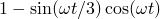，振幅1 GPa，周期0.3s（参见[图2.2.1-9](ch02s02ach143.md#exxwaveprop-raised-cos)）。选择升余弦函数是因为其频率含量在其中心频率附近具有高斯分布。

荷载情况1使用了三种网格：包含32个CINPE4无限单元的16×16 CPE4R有限单元的小型有限/无限单元（静边界）网格，如[图2.2.1-3](ch02s02ach143.md#sxmwaveinf-meshfin-inf)所示；16×16 CPE4R单元的小型有限单元网格，如[图2.2.1-4](ch02s02ach143.md#sxmwaveinf-smfinmesh)所示；以及48×48 CPE4R单元的扩展有限单元网格，如[图2.2.1-5](ch02s02ach143.md#sxmwaveinf-extfinmesh)所示。将包含无限单元静边界的小型网格获得的结果与仅使用有限单元的扩展网格获得的结果进行比较。还给出了不使用无限单元静边界的小型网格的结果，以显示传播波的反射如何影响解。荷载情况2使用的网格由180×107个CPE4R有限单元和287个CINPE4无限单元组成。有限单元网格在远场假设为自由边界，将反射传播波，而有限/无限单元网格模拟无限域并提供静边界，以最小化传播波反射回网格。该问题中几何非线性不显著，被忽略。

材料假定为弹性，具有以下属性：

| 属性 | 值 |
| --- | --- |
| 杨氏模量 | 73 GPa |
| 泊松比 | 0.33 |
| 密度 | 2842 kg/m³ |

分析中不包括材料阻尼和人工体积粘度。基于这些材料属性，材料中纵波的传播速度约为6169.1 m/s，剪切波的传播速度约为3107.5 m/s（参见["实体无限单元，"Abaqus Theory Guide第3.3.1节](../stm/stm-link.md#stm-elm-infinite)）。因此，纵波（垂直脉冲激励下占主导）应在约0.324s内到达荷载情况1所用小网格的边界，在约0.97s内到达扩展网格的边界，在约0.77s内到达荷载情况2所用网格的边界。荷载情况1分析运行1.5s，以便波能够反射到没有静边界的有限单元网格中。

所有分析均使用Abaqus/Standard和Abaqus/Explicit进行。

### 结果与讨论

荷载情况1的结果以节点13、103和601处垂直位移的时间历程形式显示，如网格上所示。[图2.2.1-6](ch02s02ach143.md#sxmwaveinf-vertdisp7)（节点13）、[图2.2.1-7](ch02s02ach143.md#sxmwaveinf-vertdisp27)（节点103）和[图2.2.1-8](ch02s02ach143.md#sxmwaveinf-vertdisp151)（节点601）显示了位移响应。小型有限单元网格中自由边界引起的波反射是明显的，而小型有限/无限单元静边界网格在消除这种反射方面取得了很大成功。Abaqus/Standard和Abaqus/Explicit获得的结果吻合良好。

[图2.2.1-1](ch02s02ach143.md#exxwaveprop-wave-types)显示了由无限半空间上分布荷载产生的波型。荷载引入系统的大部分能量包含在纵波的直部分中。弯曲的波前和表面波是由分布荷载边缘处的不连续性产生的。相同的波型可以在两种荷载情况的变形构型中识别。特别地，[图2.2.1-10](ch02s02ach143.md#exxwaveprop-deform-mesh)显示了荷载情况2在纵波离开网格下边界之前的变形构型。荷载情况2的垂直和水平位移等值线图（分别参见[图2.2.1-11](ch02s02ach143.md#exxwaveprop-vert-cont)和[图2.2.1-12](ch02s02ach143.md#exxwaveprop-horiz-cont)）更清楚地显示了从分布荷载边缘发出的较低能量的剪切波。

荷载情况2的整个模型能量时间历程示于[图2.2.1-13](ch02s02ach143.md#exxwaveprop-energy-hist)。可以看到，动能和内能保持不变，直到纵波到达网格边界处的无限单元。粘性耗散时间历程代表被无限单元吸收的能量。在1.07s时，当纵波脉冲的尾部到达网格边界时，大部分能量已被无限单元吸收。最后离开网格的波应该是由分布荷载边缘处的不连续性产生的剪切波，它向对称轴传播。它将被对称轴反射，向网格的右下角传播。这应发生在3.92s。此时留在网格中的任何波都是由于无限边界处的虚假波反射。 与这些波相关的动能小于脉冲产生的总动能的0.2%。

[图2.2.1-14](ch02s02ach143.md#exxwaveprop-vert-disp)显示了位于分布荷载边缘下方2 mm处的节点的垂直位移响应。初始纵波在0.324s内到达节点。由于波未被无限单元完全吸收，其反射可以在其返回表面时看到，也可以在从表面反射回来后再次看到。2.4s后的响应是由于剪切波从对称轴反射。直接从分布荷载边缘向下传播的剪切波没有出现在此图中，因为其运动完全在水平方向。

[图2.2.1-15](ch02s02ach143.md#exxwaveprop-horiz-disp)显示了位于分布荷载边缘下方3.2 mm处的节点的水平位移响应。纵波的水平分量在0.519s内到达节点，而较慢传播的剪切波在1.03s时到达节点。约1.7s后的响应是由于纵波和剪切波从下边界以及从对称轴反射的剪切波的虚假反射。同样，Abaqus/Standard和Abaqus/Explicit获得的结果吻合良好。

### 输入文件

##### **Abaqus/Standard输入文件**

[waveprop_fininfmesh.inp](../eif/waveprop_fininfmesh.inp)

荷载情况1的小型有限/无限单元（静边界）网格。

[waveprop_smallfinmesh.inp](../eif/waveprop_smallfinmesh.inp)

荷载情况1的小型有限单元网格。

[waveprop_extdfinmesh.inp](../eif/waveprop_extdfinmesh.inp)

荷载情况1的扩展有限单元网格。

[waveprop_3d_fininfmesh.inp](../eif/waveprop_3d_fininfmesh.inp)

荷载情况1的三维小型有限/无限单元（静边界）网格。

[waveprop_3d_smallfinmesh.inp](../eif/waveprop_3d_smallfinmesh.inp)

荷载情况1的三维小型有限单元网格。

[waveprop_3d_extdfinmesh.inp](../eif/waveprop_3d_extdfinmesh.inp)

荷载情况1的三维扩展有限单元网格。

[waveprop_prestatic.inp](../eif/waveprop_prestatic.inp)

包含waveprop_fininfmesh.inp中分析前面的静态步骤，用于在使用无限单元时验证静力学然后是动力学。

[waveprop_verssd.inp](../eif/waveprop_verssd.inp)

包含分析以验证在使用无限单元时使用[*STEADY STATE DYNAMICS](../key/key-link.md#usb-kws-hsteadystdyn)，DIRECT。

[waveprop_cpe4r_std.inp](../eif/waveprop_cpe4r_std.inp)

荷载情况2的CPE4R网格。

[waveprop_cpe3_std.inp](../eif/waveprop_cpe3_std.inp)

使用CPE3单元的相同模型。

[waveprop_ef1.inp](../eif/waveprop_ef1.inp)

包含10 MHz升余弦函数幅值数据的文件。此文件被上面列出的两个输入文件读取。

##### **Abaqus/Explicit输入文件**

[waveprop_fininfmesh_exp.inp](../eif/waveprop_fininfmesh_exp.inp)

荷载情况1的小型有限/无限单元（静边界）网格。

[waveprop_smallfinmesh_exp.inp](../eif/waveprop_smallfinmesh_exp.inp)

荷载情况1的小型有限单元网格。

[waveprop_extdfinmesh_exp.inp](../eif/waveprop_extdfinmesh_exp.inp)

荷载情况1的扩展有限单元网格。

[waveprop_3d_fininfmesh_exp.inp](../eif/waveprop_3d_fininfmesh_exp.inp)

荷载情况1的三维小型有限/无限单元（静边界）网格。

[waveprop_3d_smallfinmesh_exp.inp](../eif/waveprop_3d_smallfinmesh_exp.inp)

荷载情况1的三维小型有限单元网格。

[waveprop_3d_extdfinmesh_exp.inp](../eif/waveprop_3d_extdfinmesh_exp.inp)

荷载情况1的三维扩展有限单元网格。

[waveprop_cpe4r.inp](../eif/waveprop_cpe4r.inp)

荷载情况2的CPE4R网格。

[waveprop_cpe3.inp](../eif/waveprop_cpe3.inp)

使用CPE3单元的相同模型。

[waveprop_ef1.inp](../eif/waveprop_ef1.inp)

包含10 MHz升余弦函数幅值数据的文件。此文件被上面列出的两个输入文件读取。

### 参考文献

Cohen, M., and P. C. Jennings, "Silent Boundary Methods for Transient Analysis," Computational Methods for Transient Analysis, Ed. T. Belytschko and T. R. J. Hughes, Elsevier, 1983.

### 图表

**图2.2.1-1** 无限半空间上分布荷载产生的波型。

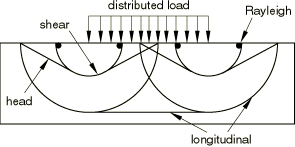

**图2.2.1-2** 荷载情况1的三角形振幅变化。

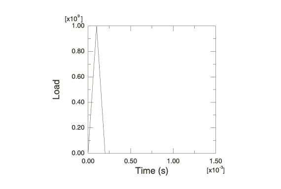

**图2.2.1-3** 荷载情况1的小型有限/无限单元网格（静边界）。

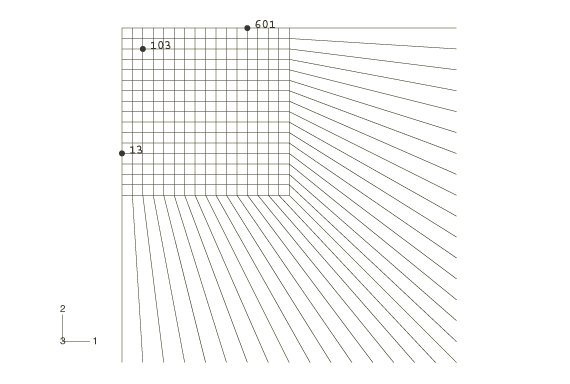

**图2.2.1-4** 荷载情况1的小型有限单元网格。

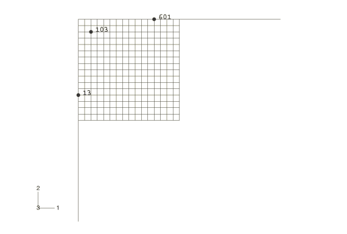

**图2.2.1-5** 荷载情况1的扩展有限单元网格。

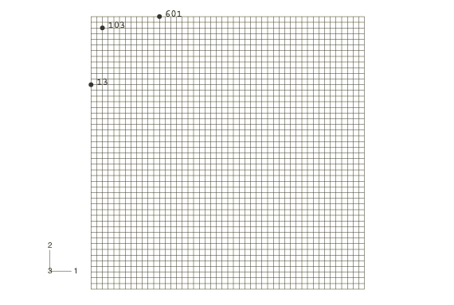

**图2.2.1-6** 节点13处的垂直位移响应（荷载情况1）。

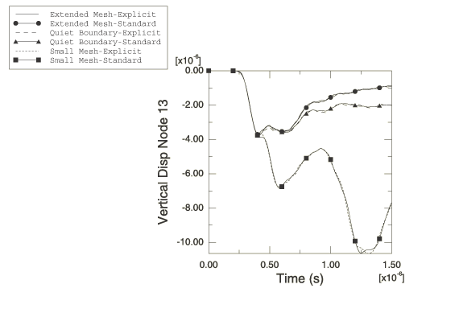

**图2.2.1-7** 节点103处的垂直位移响应（荷载情况1）。

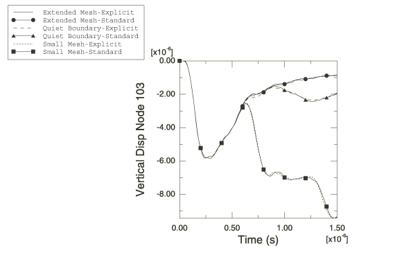

**图2.2.1-8** 节点601处的垂直位移响应（荷载情况1）。

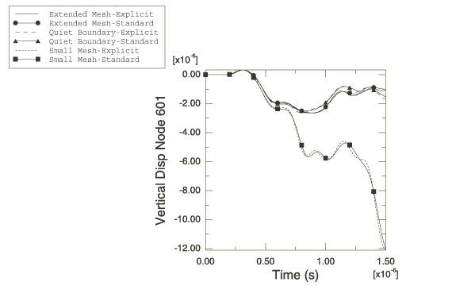

**图2.2.1-9** 荷载情况2使用的10 MHz升余弦函数。

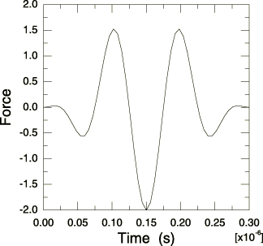

**图2.2.1-10** 波离开网格边界之前的变形构型（荷载情况2，0.81s，位移放大75%）。

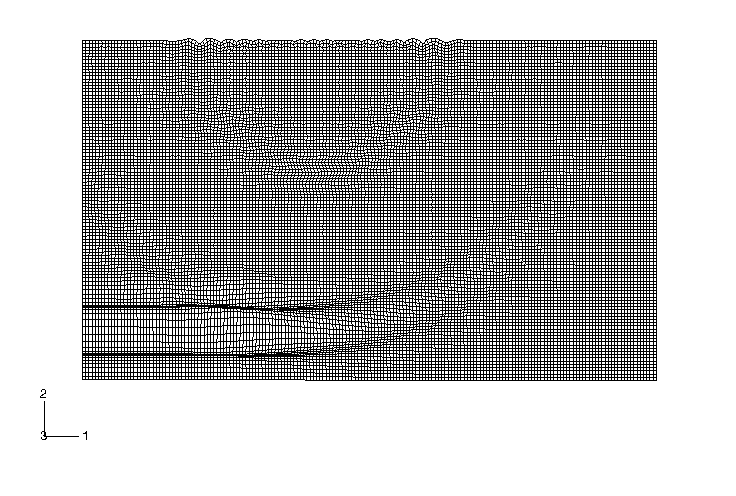

**图2.2.1-11** 0.81s时的垂直位移等值线（荷载情况2）。

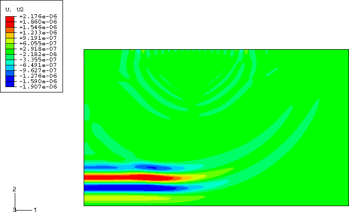

**图2.2.1-12** 0.81s时的水平位移等值线（荷载情况2）。

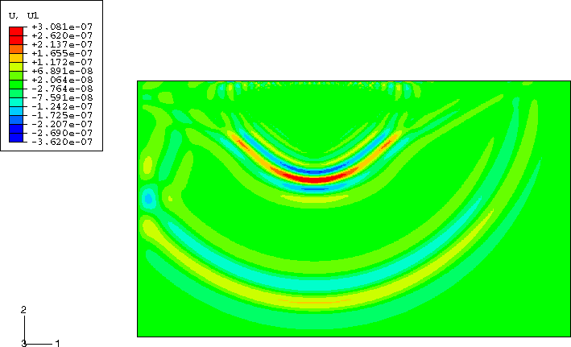

**图2.2.1-13** 整个模型能量历程（荷载情况2）。

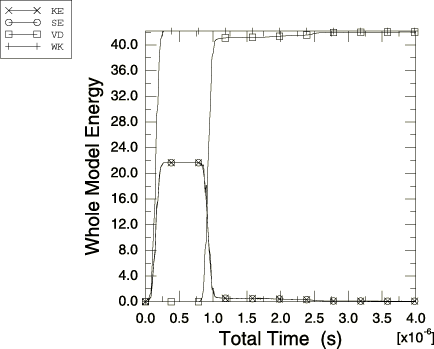

**图2.2.1-14** 荷载边缘下方2 mm处的垂直位移响应（荷载情况2）。

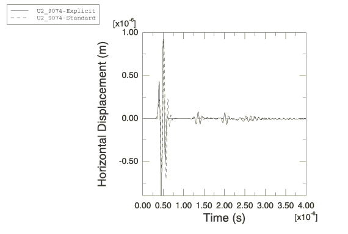

**图2.2.1-15** 荷载边缘下方3.2 mm处的水平位移响应（荷载情况2）。

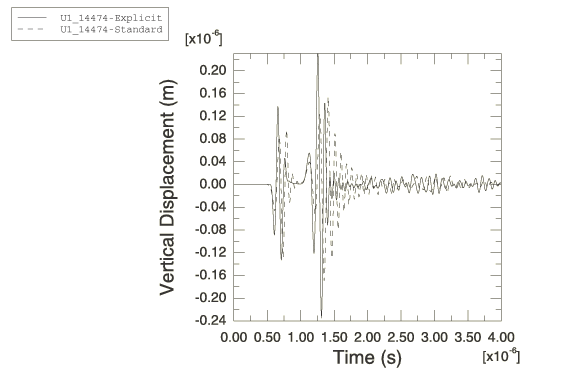

