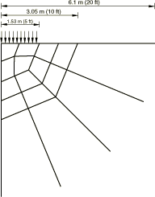
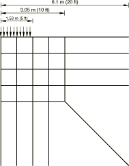
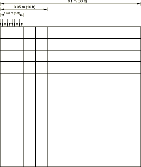
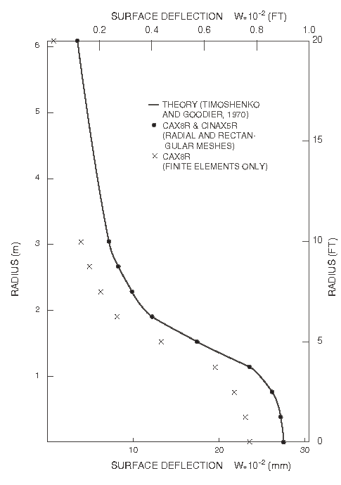
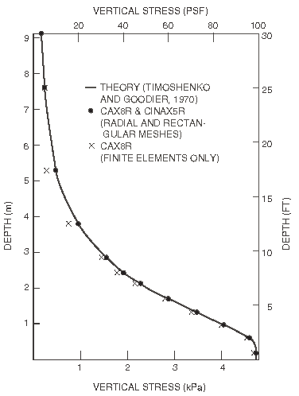

# 2.2.3 无限单元：半空间上的圆形荷载

**产品：** Abaqus/Standard  

本例由Lynn和Hadid（1981）提出，涉及承受均匀压力荷载的弹性半空间问题。本例的目的是将不同耦合有限/无限单元网格的性能与Timoshenko和Goodier（1970）给出的解析解进行比较。为比较起见，还使用了仅包含有限单元的网格。

### 问题描述

使用的两种有限/无限单元网格示于[图2.2.3-1](ch02s02ach145.md#sxmcircload-fin-inf-radmesh)和[图2.2.3-2](ch02s02ach145.md#sxmcircload-fin-inf-rectmesh)。[图2.2.3-1](ch02s02ach145.md#sxmcircload-fin-inf-radmesh)中所示的网格使用径向配置，有限单元类型为CAX8R。它延伸至半径3 m（10 ft），是荷载范围的两倍。远场用四个CINAX5R无限单元建模。第二个网格是矩形的，有限单元部分（16个CAX8R单元）也延伸至半径3 m（10 ft）。八个CINAX5R单元模拟远场。第三个仅包含有限单元的网格示于[图2.2.3-3](ch02s02ach145.md#sxmcircload-finmesh)：该网格与[图2.2.3-2](ch02s02ach145.md#sxmcircload-fin-inf-rectmesh)中的网格相同，只是外层的无限单元被一层有限单元取代，该有限单元延伸至9 m（30 ft）处，在该处固定位移的法向分量。

材料是各向同性线弹性，杨氏模量4.788 MPa（105 lb/ft²），泊松比0.3。弹性半空间在半径1.5 m（5 ft）范围内承受强度4788 Pa（100 lb/ft²）的均匀压力荷载。

### 结果与讨论

该问题的解析解由Timoshenko和Goodier（1970）给出，绘制于[图2.2.3-4](ch02s02ach145.md#sxmcircload-surfdeflection)和[图2.2.3-5](ch02s02ach145.md#sxmcircload-vertstress)中。[图2.2.3-4](ch02s02ach145.md#sxmcircload-surfdeflection)显示表面挠度随半径的变化，而[图2.2.3-5](ch02s02ach145.md#sxmcircload-vertstress)显示荷载中心下方垂直线上垂直应力的分布。带有无限单元的网格的位移结果与理论几乎完全一致，而纯有限单元网格获得的结果形式正确，但与精确结果有偏移。[图2.2.3-5](ch02s02ach145.md#sxmcircload-vertstress)中显示的应力结果都与理论非常吻合。

### 输入文件

[infelemcircular_radial_cinax5r.inp](../eif/infelemcircular_radial_cinax5r.inp)

径向耦合有限/无限单元网格。

[infelemcircular_rect_cinax5r.inp](../eif/infelemcircular_rect_cinax5r.inp)

矩形耦合有限/无限单元网格。

[infelemcircular_rect_cax8r.inp](../eif/infelemcircular_rect_cax8r.inp)

仅由有限单元组成的网格。

### 参考文献

Lynn, P. P., and H. A. Hadid, "Infinite Elements with n Type Decay," International Journal of Numerical Methods in Engineering, vol. 17, no. 3, pp. 347–355, 1981.

Timoshenko, S. P., and J. N. Goodier, *Theory of Elasticity*, McGraw-Hill, New York, 1970.

### 图表

**图2.2.3-1** 径向有限/无限单元网格。

**图2.2.3-2** 矩形有限/无限单元网格。

**图2.2.3-3** 仅有限单元的网格。

**图2.2.3-4** 表面挠度结果。

**图2.2.3-5** 垂直应力分布。

