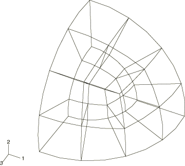
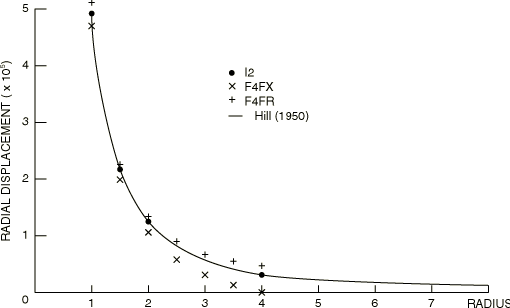
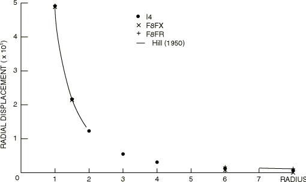
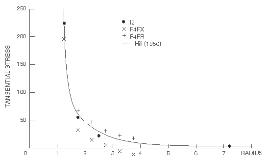
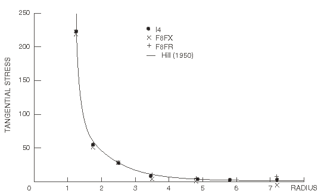
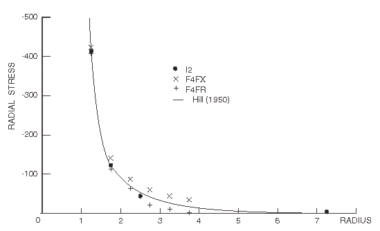
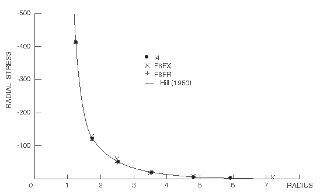

# 2.2.4 无限介质中的球形空腔

**产品：** Abaqus/Standard  

本例由Marques和Owen（1983）分析，涉及无限介质中内压球形空腔的问题。分析有两个主要目的：将使用无限单元获得的结果与仅使用有限单元（假设在网格截断端采用固定或自由边界条件）获得的结果进行比较，以及研究与Hill（1950）提供的解析解相比具有不同细化程度的网格的性能。

### 问题描述

在一致单位中，空腔半径为1.0，施加内压750。材料是各向同性线弹性，杨氏模量10^7，泊松比0.33。

利用三个正交对称平面，只需分析构型的八分之一。有限单元网格由12个C3D20R单元层组成，如[图2.2.4-1](ch02s02ach146.md#sxmsphercav-typelmlayer)所示。使用两种基本的三层单元网格：一种，层由径向位置1、2、3、4定义；另一种，层由径向位置1、2、4、8定义。在每种情况下，最外层节点被视为固定或自由。这产生了四种不同的有限单元网格，我们标记如下：

- F4FX — 外半径 = 4，外节点固定
- F4FR — 外半径 = 4，外节点自由
- F8FX — 外半径 = 8，外节点固定
- F8FR — 外半径 = 8，外节点自由

使用两种耦合有限/无限单元网格。首先，我们取F8网格，用一层CIN3D12R单元替换外层有限单元。我们将此网格标记为I4，数字4表示有限单元和无限单元耦合的半径。其次，我们使用在径向值1和2之间具有单层有限单元的网格，并将其与一层CIN3D12R单元耦合。此网格标记为I2。为了测试在涉及耦合有限/无限单元网格的问题中使用子结构，I2网格也使用子结构化方法求解，将整个模型作为单个子结构处理。

### 结果与讨论

该问题的Hill解析解示于[图2.2.4-2](ch02s02ach146.md#sxmsphercav-raddisp-f4)和[图2.2.4-3](ch02s02ach146.md#sxmsphercav-raddisp-f8)（径向位移）以及[图2.2.4-4](ch02s02ach146.md#sxmsphercav-tanstress-f4)、[图2.2.4-5](ch02s02ach146.md#sxmsphercav-tanstress-f8)、[图2.2.4-6](ch02s02ach146.md#sxmsphercav-radstress-f4)和[图2.2.4-7](ch02s02ach146.md#sxmsphercav-radstress-f8)（切向和径向应力）。有限单元网格F4FX和F4FR以及有限/无限单元网格I2获得的结果与[图2.2.4-2](ch02s02ach146.md#sxmsphercav-raddisp-f4)、[图2.2.4-4](ch02s02ach146.md#sxmsphercav-tanstress-f4)和[图2.2.4-6](ch02s02ach146.md#sxmsphercav-radstress-f4)中的解析解进行比较。我们看到，模型F4FX和F4FR提供上下界解，而无限单元结果几乎与理论完全一致。即使是这个非常粗糙的有限/无限单元网格（只有一层有限单元）也能为这个简单情况提供准确的结果。[图2.2.4-3](ch02s02ach146.md#sxmsphercav-raddisp-f8)、[图2.2.4-5](ch02s02ach146.md#sxmsphercav-tanstress-f8)和[图2.2.4-7](ch02s02ach146.md#sxmsphercav-radstress-f8)显示了网格F8FX、F8FR和I4获得的结果：同样，无限单元结果与解析解几乎完全一致，而较好的有限单元表示也提供了接近解析解的结果。子结构分析的结果与不使用子结构时获得的结果一致。

### 输入文件

[sphericalcavinfmed_i2.inp](../eif/sphericalcavinfmed_i2.inp)

模型I2。

[sphericalcavinfmed_i4.inp](../eif/sphericalcavinfmed_i4.inp)

模型I4。

[sphericalcavinfmed_f4fx.inp](../eif/sphericalcavinfmed_f4fx.inp)

模型F4FX。

[sphericalcavinfmed_f8fx.inp](../eif/sphericalcavinfmed_f8fx.inp)

模型F8FX。

[sphericalcavinfmed_i2_sub.inp](../eif/sphericalcavinfmed_i2_sub.inp)

使用子结构化的模型I2。

[sphericalcavinfmed_i2_sub_gen1.inp](../eif/sphericalcavinfmed_i2_sub_gen1.inp)

sphericalcavinfmed_i2_sub.inp分析中引用的子结构生成。

[sphericalcavinfmed_i2_cin3d18r.inp](../eif/sphericalcavinfmed_i2_cin3d18r.inp)

使用CIN3D18R单元的模型I2。

[sphericalcavinfmed_i4_cin3d18r.inp](../eif/sphericalcavinfmed_i4_cin3d18r.inp)

使用CIN3D18R单元的模型I4。

### 参考文献

Hill, R., *The Mathematical Theory of Plasticity*, Oxford University Press, 1950.

Marques, J. M. M. C., and D. R. J. Owen, "Infinite Elements in Quasi–Static Materially Nonlinear Problems," University of Wales Report, Swansea, 1983.

### 图表

**图2.2.4-1** 典型单元层。

**图2.2.4-2** 径向位移结果——网格F4FX、F4FR和I2。

**图2.2.4-3** 径向位移结果——网格F8FX、F8FR和I4。

**图2.2.4-4** 切向应力分布——网格F4FX、F4FR和I2。

**图2.2.4-5** 切向应力分布——网格F8FX、F8FR和I4。

**图2.2.4-6** 径向应力分布——网格F4FX、F4FR和I2。

**图2.2.4-7** 径向应力分布——网格F8FX、F8FR和I4。

