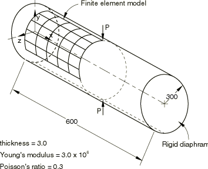
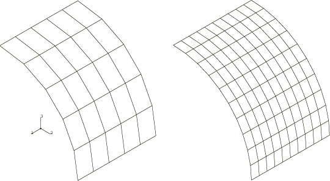
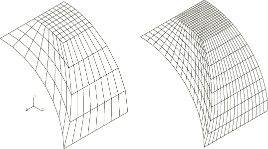
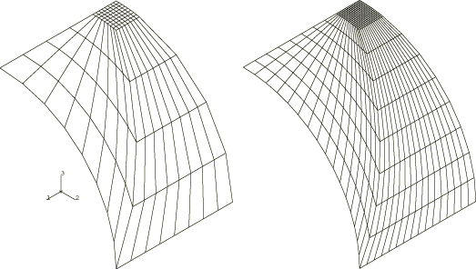
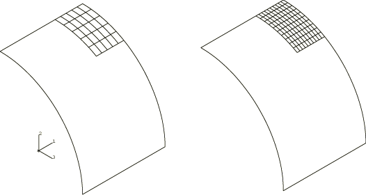
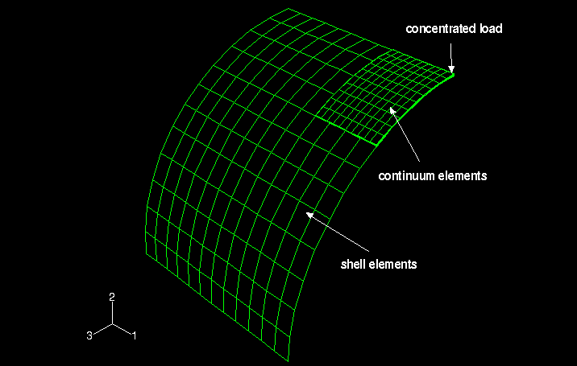
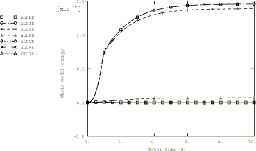
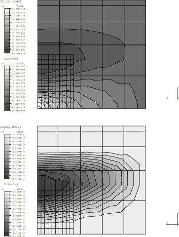

# 2.3.2 圆柱压痕问题


**产品：** Abaqus/Standard  Abaqus/Explicit  

端部带有刚性隔膜的有限长度圆形圆柱壳，承受集中压痕荷载，是用于评估壳单元公式性能的标准测试用例之一，特别是关于不可伸长弯曲模式和复杂膜状态的表现。本例特别有用，因为可以与已知解进行比较（参见Lindberg等人，1969）。

### 问题描述

示例使用的几何形状和材料属性示于[图2.3.2-1](ch02s03ach148.md#sxmpincyl-geom)。由于给出的值是一组自一致单位，因此未指定单位。圆柱厚度是其半径的1/100，因此该结构可被视为薄壳。网格覆盖圆柱的对称段，如图所示，在网格的三个边缘施加对称边界条件，而第四个边缘（圆柱端部）由刚性隔膜支撑。

本例使用了两种网格模式：规则网格（[图2.3.2-2](ch02s03ach148.md#sxmpincyl-regmeshes)）和两种类型的不规则网格（粗和细），分别示于[图2.3.2-3](ch02s03ach148.md#sxmpincyl-irregmeshestype1)和[图2.3.2-4](ch02s03ach148.md#sxmpincyl-irregmeshestype2)。当使用三角形单元时，每个四边形被分成两个三角形。测试不规则网格是因为这种网格模式可能在必须建模局部效应的情况下使用，并且它们允许评估单元的畸变敏感性。作为比较，使用Abaqus/Standard中所有常规壳单元对圆柱进行分析；Abaqus/Explicit分析仅测试S3R和S4R单元。

Abaqus/Standard中的子模型功能也用于本例中，以分析集中荷载附近区域。对于壳到壳子模型，使用S8R单元的两种规则网格模式（[图2.3.2-5](ch02s03ach148.md#sxmpincyl-supersubmeshes)），由也使用规则网格的各种全局分析驱动。在每种情况下，对网格的两个边缘施加对称边界条件，而全局分析的结果通过子模型技术插值到剩余两个边缘。还提供了壳到实体子模型用于演示目的。

Abaqus/Standard和Abaqus/Explicit中的壳到实体耦合功能也用于本例。集中荷载附近区域使用连续体单元网格划分，圆柱的其余部分使用壳单元网格划分（参见[图2.3.2-6](ch02s03ach148.md#sxmpincyl-shell2solid)）。在Abaqus/Standard中，S4R、S8R、C3D8I、C3D10、C3D10I和C3D20R单元用于六种不同的壳到实体组合；在Abaqus/Explicit中，使用S4R和C3D8R单元。

位移很小，因此在Abaqus/Explicit分析中忽略几何非线性是合适的。如果通过考虑几何非线性来激活大位移理论，由于应变和旋转保持较小，结果在所有情况下都不变。然而，分析CPU时间通常增加约30%。

为连续体壳单元模型提供了两个输入文件，以说明使用圆柱系统独立于节点连接性定向单元厚度（堆叠）方向。

### 结果与讨论

用于比较的结果是施加压痕荷载的点处的径向位移。Lindberg等人基于Flügge（1973）级数解给出的解为0.1825×10^(-4)。

#### 规则网格

规则Abaqus/Standard网格的结果示于[表2.3.2-1](ch02s03ach148.md#table-pincyl-compare-reg)。二阶单元（S8R5和S9R5类型）提供最准确的结果，而S8R单元类型（也是二阶单元，但主要用于厚壳应用）提供较不准确的结果。在一阶单元中，STRI3单元类型提供最高的准确性。使用最粗网格时，没有一阶单元提供可接受的结果。

与其他单元类型相比，STRI65单元类型似乎收敛得相当慢。这个结果可能看起来违反直觉，特别是与STRI3结果相比，后者在本问题中表现出更好的收敛性。与STRI3（平直面单元）相比，单元类型STRI65更适合于薄壳弯曲建模，并具有完整的膜应变二次表示；因此，预期STRI65在两个网格中单元数量相同的情况下比STRI3表现更好。在本收敛研究中，我们反而保持了相等的节点数量，这导致STRI65单元的性能相对较差。

规则Abaqus/Explicit网格的结果示于[表2.3.2-2](ch02s03ach148.md#table-pincyl-regmeshes)。结果表明，单元类型S3R和S4R最初较硬，但随后收敛到正确解。此外，[图2.3.2-7](ch02s03ach148.md#exxpincyl-energyplot)中提供了能量图，显示在分析结束时获得稳定的静态解。

#### 不规则网格

第二种不规则网格比第一种不规则网格具有更多畸变的单元形状。两种不规则Abaqus/Standard网格的结果示于[表2.3.2-3](ch02s03ach148.md#table-pincyl-compare-irreg)；并且，如["筒拱屋顶问题，"第2.3.1节"](ch02s03ach147.md)中所讨论的，它们显示的结果不如规则网格问题准确。

单元类型S8R5和S9R5在使用细网格时再次提供相当准确的结果，尽管使用这些单元的粗网格结果表现出较差的准确性。有趣的是，在这种情况下，所有一阶四边形单元即使在粗网格下也提供相当准确的值。这个结果可能是偶然的，不应被视为单元在畸变网格中质量的一般指示。对于S4R单元类型，使用了基于刚度的沙漏控制和增强沙漏控制来研究网格细化和斜交敏感性的影响。正如所预期的，增强沙漏控制的粗网格结果与细网格结果相比表现出较差的准确性。

不规则Abaqus/Explicit网格的结果示于[表2.3.2-4](ch02s03ach148.md#table-pincyl-irregmeshes)。尽管畸变增加，但这些不规则网格更准确，因为网格细化集中在解梯度最高的区域。

#### 子模型分析

壳到壳情况的子模型Abaqus/Standard分析结果示于[表2.3.2-5](ch02s03ach148.md#table-pincyl-compare-submodel)。显然，子模型技术在集中荷载附近比粗全局分析提供更准确的解。当在全局级别使用S4R单元时，荷载施加点的径向位移对于粗网格在Lindberg解的40%以内，对于较细网格在13%以内。子模型技术显著改善了这些结果，对于所有四种网格组合，壳子模型中的径向位移在11%和2%以内。

当使用S8R单元对四分之一圆柱进行网格划分时，解准确性从全局级别的6%以内提高到子模型级别的0.7%以内。壳子模型的位移等值线示于[图2.3.2-8](ch02s03ach148.md#sxmpincyl-dispcontours)，用于代表性分析，其中在全局级别使用5×5 S8R单元网格，在子模型级别使用10×10 S8R单元网格。

使用输入文件[pinchcyl_s4r_reg55.inp](../eif/pinchcyl_s4r_reg55.inp)、[pinchcyl_s4r_reg1010.inp](../eif/pinchcyl_s4r_reg1010.inp)和[pinchcyl_s8r_reg55.inp](../eif/pinchcyl_s8r_reg55.inp)的输出测试子模型分析。如果在全局级别使用五自由度壳（S4R5、S8R5等），则仅驱动子模型边界上的位移自由度，因为这些单元的旋转未写入结果文件。

对于本问题也提供了壳到实体子模型，具有10×10 C3D8I单元网格和四个穿过壳厚度的单元。子模型由12×12 S4R单元全局模型驱动。结果与壳到壳子模型结果良好一致。由于本例中的子模型由实体单元组成，因此没有提供与壳解析解的比较。在有限区域上施加集中荷载而不是点荷载的情况下，使用壳到实体子模型功能更为合理。

#### 壳到实体耦合分析

在Abaqus/Standard中分析了六种壳到实体耦合情况，如[表2.3.2-6](ch02s03ach148.md#table-pincyl-shell2solid)所列。在所有六种情况中，使用了12×12壳单元网格。如清楚所见，壳到实体耦合分析在集中荷载附近提供准确的解。荷载施加点的径向位移在所有六种情况下都在Lindberg解的4.1%以内。如前所述，在有限区域上施加集中荷载而不是点荷载的情况下，使用壳到实体耦合功能更为合理。

Abaqus/Explicit壳到实体耦合分析的结果示于[表2.3.2-7](ch02s03ach148.md#table-pincyl-shell2solidexp)。荷载施加点的径向位移在Lindberg解的32%以内。

### 使用Abaqus参数研究功能的参数研究

本例中研究的壳单元公式性能可以使用Abaqus中提供的脚本功能在参数研究中方便地进行分析。作为示例，我们执行参数研究，其中自动运行八个分析；这些分析对应于三种不同（规则）网格密度（5×5、10×10、20×20）和三种不同单元类型（S4、S8R和S3R）的组合。

[pinchcyl_parametric.inp](../eif/pinchcyl_parametric.inp)显示了用于生成参数研究参数变化的参数化模板输入数据。脚本文件（[pinchcyl_parametric.psf](../eif/pinchcyl_parametric.psf)）用于执行参数研究。参数研究的每个分析中，荷载施加点的径向位移在下表中报告：

```
   ________________________________________________

        Parametric study: pinchcyl_parametric
   ________________________________________________

           eltype,     m_density,     N2001_U.2,
   ________________________________________________

               S4,             5,  -9.51849e-06,
              S8R,             5,  -1.72138e-05,
               S4,            10,  -1.51895e-05,
              S8R,            10,  -1.80581e-05,
               S4,            20,   -1.7505e-05,
              S3R,             5,  -6.51879e-06,
              S3R,            10,   -1.3277e-05,
              S3R,            20,  -1.67431e-05,
   _______________________________________________
```

这些结果与[表2.3.2-1](ch02s03ach148.md#table-pincyl-compare-reg)中找到的相应结果匹配。

### 输入文件

##### **Abaqus/Standard输入文件**

[pinchcyl_s8r_submodel_reg55.inp](../eif/pinchcyl_s8r_submodel_reg55.inp)

规则子模型网格，S8R单元。

[pinchcyl_s8r_sub_reg1010.inp](../eif/pinchcyl_s8r_sub_reg1010.inp)

子模型网格，S8R单元。

[pinchcyl_c3d8i_sub_reg10104.inp](../eif/pinchcyl_c3d8i_sub_reg10104.inp)

实体子模型网格，C3D8I单元。

[pinchcyl_s4r_c3d8i_shell2solid.inp](../eif/pinchcyl_s4r_c3d8i_shell2solid.inp)

S4R壳单元和C3D8I连续体单元的壳到实体耦合模型。

[pinchcyl_s4r_c3d10_shell2solid.inp](../eif/pinchcyl_s4r_c3d10_shell2solid.inp)

S4R壳单元和C3D10连续体单元的壳到实体耦合模型。

[pinchcyl_s4r_c3d10i_shell2solid.inp](../eif/pinchcyl_s4r_c3d10i_shell2solid.inp)

S4R壳单元和C3D10I连续体单元的壳到实体耦合模型。

[pinchcyl_s4r_c3d20r_shell2solid.inp](../eif/pinchcyl_s4r_c3d20r_shell2solid.inp)

S4R壳单元和C3D20R连续体单元的壳到实体耦合模型。

[pinchcyl_s8r_c3d8i_shell2solid.inp](../eif/pinchcyl_s8r_c3d8i_shell2solid.inp)

S8R壳单元和C3D8I连续体单元的壳到实体耦合模型。

[pinchcyl_s8r_c3d10_shell2solid.inp](../eif/pinchcyl_s8r_c3d10_shell2solid.inp)

S8R壳单元和C3D10连续体单元的壳到实体耦合模型。

[pinchcyl_s8r_c3d10i_shell2solid.inp](../eif/pinchcyl_s8r_c3d10i_shell2solid.inp)

S8R壳单元和C3D10I连续体单元的壳到实体耦合模型。

[pinchcyl_s8r_c3d20r_shell2solid.inp](../eif/pinchcyl_s8r_c3d20r_shell2solid.inp)

S8R壳单元和C3D20R连续体单元的壳到实体耦合模型。

[pinchcyl_parametric.inp](../eif/pinchcyl_parametric.inp)

用于生成参数研究参数变化的参数化模板输入数据。

#### S3R单元：

[pinchcyl_s3r_reg55.inp](../eif/pinchcyl_s3r_reg55.inp)

5×5网格。

[pinchcyl_s3r_reg1010.inp](../eif/pinchcyl_s3r_reg1010.inp)

10×10网格。

[pinchcyl_s3r_reg2020.inp](../eif/pinchcyl_s3r_reg2020.inp)

20×20网格。

[pinchcyl_s3r_irreg_typ1.inp](../eif/pinchcyl_s3r_irreg_typ1.inp)

粗不规则网格（类型1）。

[pinchcyl_s3r_fineirreg_typ1.inp](../eif/pinchcyl_s3r_fineirreg_typ1.inp)

细不规则网格（类型1）。

[pinchcyl_s3r_irreg_typ2.inp](../eif/pinchcyl_s3r_irreg_typ2.inp)

粗不规则网格（类型2）。

[pinchcyl_s3r_fineirreg_typ2.inp](../eif/pinchcyl_s3r_fineirreg_typ2.inp)

细不规则网格（类型2）。

#### S4单元：

[pinchcyl_s4_reg55.inp](../eif/pinchcyl_s4_reg55.inp)

5×5网格。

[pinchcyl_s4_reg1010.inp](../eif/pinchcyl_s4_reg1010.inp)

10×10网格。

[pinchcyl_s4_reg2020.inp](../eif/pinchcyl_s4_reg2020.inp)

20×20网格。

[pinchcyl_s4_irreg_typ1.inp](../eif/pinchcyl_s4_irreg_typ1.inp)

粗不规则网格（类型1）。

[pinchcyl_s4_fineirreg_typ1.inp](../eif/pinchcyl_s4_fineirreg_typ1.inp)

细不规则网格（类型1）。

[pinchcyl_s4_irreg_typ2.inp](../eif/pinchcyl_s4_irreg_typ2.inp)

粗不规则网格（类型2）。

[pinchcyl_s4_fineirreg_typ2.inp](../eif/pinchcyl_s4_fineirreg_typ2.inp)

细不规则网格（类型2）。

[pinchcyl_s4_reg22_typ1.inp](../eif/pinchcyl_s4_reg22_typ1.inp)

2×2网格（类型1）。

[pinchcyl_s4_reg44_typ1.inp](../eif/pinchcyl_s4_reg44_typ1.inp)

4×4网格（类型1）。

[pinchcyl_s4_reg66_typ1.inp](../eif/pinchcyl_s4_reg66_typ1.inp)

6×6网格（类型1）。

[pinchcyl_s4_reg88_typ1.inp](../eif/pinchcyl_s4_reg88_typ1.inp)

8×8网格（类型1）。

[pinchcyl_s4_reg1212_typ1.inp](../eif/pinchcyl_s4_reg1212_typ1.inp)

12×12网格（类型1）。

#### S4R单元：

[pinchcyl_s4r_reg55.inp](../eif/pinchcyl_s4r_reg55.inp)

5×5网格。

[pinchcyl_s4r_reg55_eh.inp](../eif/pinchcyl_s4r_reg55_eh.inp)

5×5网格，带增强沙漏控制。

[pinchcyl_s4r_reg1010.inp](../eif/pinchcyl_s4r_reg1010.inp)

10×10网格。

[pinchcyl_s4r_reg1010_eh.inp](../eif/pinchcyl_s4r_reg1010_eh.inp)

10×10网格，带增强沙漏控制。

[pinchcyl_s4r_reg2020.inp](../eif/pinchcyl_s4r_reg2020.inp)

20×20网格。

[pinchcyl_s4r_reg2020_eh.inp](../eif/pinchcyl_s4r_reg2020_eh.inp)

20×20网格，带增强沙漏控制。

[pinchcyl_s4r_irreg_typ1.inp](../eif/pinchcyl_s4r_irreg_typ1.inp)

粗不规则网格（类型1）。

[pinchcyl_s4r_irreg_typ1_eh.inp](../eif/pinchcyl_s4r_irreg_typ1_eh.inp)

粗不规则网格，带增强沙漏控制（类型1）。

[pinchcyl_s4r_fineirreg_typ1.inp](../eif/pinchcyl_s4r_fineirreg_typ1.inp)

细不规则网格（类型1）。

[pinchcyl_s4r_fineirreg_typ1_eh.inp](../eif/pinchcyl_s4r_fineirreg_typ1_eh.inp)

细不规则网格，带增强沙漏控制（类型1）。

[pinchcyl_s4r_irreg_typ2.inp](../eif/pinchcyl_s4r_irreg_typ2.inp)

粗不规则网格（类型2）。

[pinchcyl_s4r_irreg_typ2_eh.inp](../eif/pinchcyl_s4r_irreg_typ2_eh.inp)

粗不规则网格，带增强沙漏控制（类型2）。

[pinchcyl_s4r_fineirreg_typ2.inp](../eif/pinchcyl_s4r_fineirreg_typ2.inp)

细不规则网格（类型2）。

[pinchcyl_s4r_fineirreg_typ2_eh.inp](../eif/pinchcyl_s4r_fineirreg_typ2_eh.inp)

细不规则网格，带增强沙漏控制（类型2）。

[pinchcyl_s4r_reg22_typ1.inp](../eif/pinchcyl_s4r_reg22_typ1.inp)

2×2网格（类型1）。

[pinchcyl_s4r_reg44_typ1.inp](../eif/pinchcyl_s4r_reg44_typ1.inp)

4×4网格（类型1）。

[pinchcyl_s4r_reg66_typ1.inp](../eif/pinchcyl_s4r_reg66_typ1.inp)

6×6网格（类型1）。

[pinchcyl_s4r_reg88_typ1.inp](../eif/pinchcyl_s4r_reg88_typ1.inp)

8×8网格（类型1）。

[pinchcyl_s4r_reg1212_typ1.inp](../eif/pinchcyl_s4r_reg1212_typ1.inp)

12×12网格（类型1）。

#### S4R5单元：

[pinchcyl_s4r5_reg55.inp](../eif/pinchcyl_s4r5_reg55.inp)

5×5网格。

[pinchcyl_s4r5_reg1010.inp](../eif/pinchcyl_s4r5_reg1010.inp)

10×10网格。

[pinchcyl_s4r5_reg2020.inp](../eif/pinchcyl_s4r5_reg2020.inp)

20×20网格。

[pinchcyl_s4r5_irreg_typ1.inp](../eif/pinchcyl_s4r5_irreg_typ1.inp)

粗不规则网格（类型1）。

[pinchcyl_s4r5_fineirreg_typ1.inp](../eif/pinchcyl_s4r5_fineirreg_typ1.inp)

细不规则网格（类型1）。

[pinchcyl_s4r5_irreg_typ2.inp](../eif/pinchcyl_s4r5_irreg_typ2.inp)

粗不规则网格（类型2）。

[pinchcyl_s4r5_fineirreg_typ2.inp](../eif/pinchcyl_s4r5_fineirreg_typ2.inp)

细不规则网格（类型2）。

[pinchcyl_s4r5_reg22_typ1.inp](../eif/pinchcyl_s4r5_reg22_typ1.inp)

2×2网格（类型1）。

[pinchcyl_s4r5_reg44_typ1.inp](../eif/pinchcyl_s4r5_reg44_typ1.inp)

4×4网格（类型1）。

[pinchcyl_s4r5_reg66_typ1.inp](../eif/pinchcyl_s4r5_reg66_typ1.inp)

6×6网格（类型1）。

[pinchcyl_s4r5_reg88_typ1.inp](../eif/pinchcyl_s4r5_reg88_typ1.inp)

8×8网格（类型1）。

[pinchcyl_s4r5_reg1212_typ1.inp](../eif/pinchcyl_s4r5_reg1212_typ1.inp)

12×12网格（类型1）。

#### S8R单元：

[pinchcyl_s8r_reg55.inp](../eif/pinchcyl_s8r_reg55.inp)

5×5网格。

[pinchcyl_s8r_reg1010.inp](../eif/pinchcyl_s8r_reg1010.inp)

10×10网格。

[pinchcyl_s8r_irreg_typ1.inp](../eif/pinchcyl_s8r_irreg_typ1.inp)

粗不规则网格（类型1）。

[pinchcyl_s8r_fineirreg_typ1.inp](../eif/pinchcyl_s8r_fineirreg_typ1.inp)

细不规则网格（类型1）。

[pinchcyl_s8r_irreg_typ2.inp](../eif/pinchcyl_s8r_irreg_typ2.inp)

粗不规则网格（类型2）。

[pinchcyl_s8r_fineirreg_typ2.inp](../eif/pinchcyl_s8r_fineirreg_typ2.inp)

细不规则网格（类型2）。

#### S8R5单元：

[pinchcyl_s8r5_reg55.inp](../eif/pinchcyl_s8r5_reg55.inp)

5×5网格。

[pinchcyl_s8r5_reg1010.inp](../eif/pinchcyl_s8r5_reg1010.inp)

10×10网格。

[pinchcyl_s8r5_irreg.inp](../eif/pinchcyl_s8r5_irreg.inp)

粗不规则网格（类型1）。

[pinchcyl_s8r5_fineirreg_typ1.inp](../eif/pinchcyl_s8r5_fineirreg_typ1.inp)

细不规则网格（类型1）。

[pinchcyl_s8r5_irreg_typ2.inp](../eif/pinchcyl_s8r5_irreg_typ2.inp)

粗不规则网格（类型2）。

[pinchcyl_s8r5_fineirreg_typ2.inp](../eif/pinchcyl_s8r5_fineirreg_typ2.inp)

细不规则网格（类型2）。

#### S9R5单元：

[pinchcyl_s9r5_reg55.inp](../eif/pinchcyl_s9r5_reg55.inp)

5×5网格。

[pinchcyl_s9r5_reg1010.inp](../eif/pinchcyl_s9r5_reg1010.inp)

10×10网格。

[pinchcyl_s9r5_irreg_typ1.inp](../eif/pinchcyl_s9r5_irreg_typ1.inp)

粗不规则网格（类型1）。

[pinchcyl_s9r5_fineirreg_typ1.inp](../eif/pinchcyl_s9r5_fineirreg_typ1.inp)

细不规则网格（类型1）。

[pinchcyl_s9r5_irreg_typ2.inp](../eif/pinchcyl_s9r5_irreg_typ2.inp)

粗不规则网格（类型2）。

[pinchcyl_s9r5_fineirreg_typ2.inp](../eif/pinchcyl_s9r5_fineirreg_typ2.inp)

细不规则网格（类型2）。

#### STRI3单元：

[pinchcyl_stri3_reg55.inp](../eif/pinchcyl_stri3_reg55.inp)

5×5网格。

[pinchcyl_stri3_reg1010.inp](../eif/pinchcyl_stri3_reg1010.inp)

10×10网格。

[pinchcyl_stri3_reg2020.inp](../eif/pinchcyl_stri3_reg2020.inp)

20×20网格。

[pinchcyl_stri3_irreg_typ1.inp](../eif/pinchcyl_stri3_irreg_typ1.inp)

粗不规则网格（类型1）。

[pinchcyl_stri3_fineirreg_typ1.inp](../eif/pinchcyl_stri3_fineirreg_typ1.inp)

细不规则网格（类型1）。

[pinchcyl_stri3_irreg_typ2.inp](../eif/pinchcyl_stri3_irreg_typ2.inp)

粗不规则网格（类型2）。

[pinchcyl_stri3_fineirreg_typ2.inp](../eif/pinchcyl_stri3_fineirreg_typ2.inp)

细不规则网格（类型2）。

[pinchcyl_stri3_reg22_typ1.inp](../eif/pinchcyl_stri3_reg22_typ1.inp)

2×2网格（类型1）。

[pinchcyl_stri3_reg44_typ1.inp](../eif/pinchcyl_stri3_reg44_typ1.inp)

4×4网格（类型1）。

[pinchcyl_stri3_reg66_typ1.inp](../eif/pinchcyl_stri3_reg66_typ1.inp)

6×6网格（类型1）。

[pinchcyl_stri3_reg88_typ1.inp](../eif/pinchcyl_stri3_reg88_typ1.inp)

8×8网格（类型1）。

[pinchcyl_stri3_reg1212_typ1.inp](../eif/pinchcyl_stri3_reg1212_typ1.inp)

12×12网格（类型1）。

[pinchcyl_stri3_reg22_typ2.inp](../eif/pinchcyl_stri3_reg22_typ2.inp)

2×2网格（类型2）。

[pinchcyl_stri3_reg44_typ2.inp](../eif/pinchcyl_stri3_reg44_typ2.inp)

4×4网格（类型2）。

[pinchcyl_stri3_reg66_typ2.inp](../eif/pinchcyl_stri3_reg66_typ2.inp)

6×6网格（类型2）。

[pinchcyl_stri3_reg88_typ2.inp](../eif/pinchcyl_stri3_reg88_typ2.inp)

8×8网格（类型2）。

[pinchcyl_stri3_reg1212_typ2.inp](../eif/pinchcyl_stri3_reg1212_typ2.inp)

12×12网格（类型2）。

[pinchcyl_stri3_reg22_typ3.inp](../eif/pinchcyl_stri3_reg22_typ3.inp)

2×2网格（类型3）。

[pinchcyl_stri3_reg44_typ3.inp](../eif/pinchcyl_stri3_reg44_typ3.inp)

4×4网格（类型3）。

[pinchcyl_stri3_reg66_typ3.inp](../eif/pinchcyl_stri3_reg66_typ3.inp)

6×6网格（类型3）。

[pinchcyl_stri3_reg88_typ3.inp](../eif/pinchcyl_stri3_reg88_typ3.inp)

8×8网格（类型3）。

[pinchcyl_stri3_reg1212_typ3.inp](../eif/pinchcyl_stri3_reg1212_typ3.inp)

12×12网格（类型3）。

#### STRI65单元：

[pinchcyl_stri65_reg55.inp](../eif/pinchcyl_stri65_reg55.inp)

5×5网格。

[pinchcyl_stri65_reg1010.inp](../eif/pinchcyl_stri65_reg1010.inp)

10×10网格。

[pinchcyl_stri65_irreg_typ1.inp](../eif/pinchcyl_stri65_irreg_typ1.inp)

粗不规则网格（类型1）。

[pinchcyl_stri65_fineirreg_typ1.inp](../eif/pinchcyl_stri65_fineirreg_typ1.inp)

细不规则网格（类型1）。

[pinchcyl_stri65_irreg_typ2.inp](../eif/pinchcyl_stri65_irreg_typ2.inp)

粗不规则网格（类型2）。

[pinchcyl_stri65_fineirreg_typ2.inp](../eif/pinchcyl_stri65_fineirreg_typ2.inp)

细不规则网格（类型2）。

#### SC6R单元：

[pinchcyl_sc6r_reg55.inp](../eif/pinchcyl_sc6r_reg55.inp)

5×5网格。

[pinchcyl_sc6r_reg1010.inp](../eif/pinchcyl_sc6r_reg1010.inp)

10×10网格。

[pinchcyl_sc6r_reg2020.inp](../eif/pinchcyl_sc6r_reg2020.inp)

20×20网格。

[pinchcyl_sc6r_stackdir_cylori.inp](../eif/pinchcyl_sc6r_stackdir_cylori.inp)

20×20网格，使用STACK DIRECTION=ORIENTATION参数和圆柱定向系统来定义单元厚度方向。

[pinchcyl_sc6r_irreg_typ1.inp](../eif/pinchcyl_sc6r_irreg_typ1.inp)

粗不规则网格（类型1）。

[pinchcyl_sc6r_fineirreg_typ1.inp](../eif/pinchcyl_sc6r_fineirreg_typ1.inp)

细不规则网格（类型1）。

[pinchcyl_sc6r_irreg_typ2.inp](../eif/pinchcyl_sc6r_irreg_typ2.inp)

粗不规则网格（类型2）。

[pinchcyl_sc6r_fineirreg_typ2.inp](../eif/pinchcyl_sc6r_fineirreg_typ2.inp)

细不规则网格（类型2）。

#### SC8R单元：

[pinchcyl_sc8r_reg55.inp](../eif/pinchcyl_sc8r_reg55.inp)

5×5网格。

[pinchcyl_sc8r_reg1010.inp](../eif/pinchcyl_sc8r_reg1010.inp)

10×10网格。

[pinchcyl_sc8r_reg2020.inp](../eif/pinchcyl_sc8r_reg2020.inp)

20×20网格。

[pinchcyl_sc8r_stackdir_cylori.inp](../eif/pinchcyl_sc8r_stackdir_cylori.inp)

20×20网格，使用STACK DIRECTION=ORIENTATION参数和圆柱定向系统来定义单元厚度方向。

[pinchcyl_sc8r_irreg_typ1.inp](../eif/pinchcyl_sc8r_irreg_typ1.inp)

粗不规则网格（类型1）。

[pinchcyl_sc8r_fineirreg_typ1.inp](../eif/pinchcyl_sc8r_fineirreg_typ1.inp)

细不规则网格（类型1）。

[pinchcyl_sc8r_irreg_typ2.inp](../eif/pinchcyl_sc8r_irreg_typ2.inp)

粗不规则网格（类型2）。

[pinchcyl_sc8r_fineirreg_typ2.inp](../eif/pinchcyl_sc8r_fineirreg_typ2.inp)

细不规则网格（类型2）。

##### **Abaqus/Explicit输入文件**

[pinchcyl_s4r_c3d8r_shell2solid.inp](../eif/pinchcyl_s4r_c3d8r_shell2solid.inp)

S4R壳单元和C3D8R连续体单元的壳到实体耦合模型。

#### 大位移理论：

[pinch_cyl_coarse_irr1_s4r.inp](../eif/pinch_cyl_coarse_irr1_s4r.inp)

S4R单元，粗不规则网格（类型1）。

[pinch_cyl_fine_irr1_s4r.inp](../eif/pinch_cyl_fine_irr1_s4r.inp)

S4R单元，细不规则网格（类型1）。

[pinch_cyl_coarse_irr1_s3r.inp](../eif/pinch_cyl_coarse_irr1_s3r.inp)

S3R单元，粗不规则网格（类型1）。

[pinch_cyl_fine_irr1_s3r.inp](../eif/pinch_cyl_fine_irr1_s3r.inp)

S3R单元，细不规则网格（类型1）。

[pinch_cyl_coarse_reg_s4r.inp](../eif/pinch_cyl_coarse_reg_s4r.inp)

S4R单元，粗规则网格。

[pinch_cyl_med_reg_s4r.inp](../eif/pinch_cyl_med_reg_s4r.inp)

S4R单元，中等规则网格。

[pinch_cyl_fine_reg_s4r.inp](../eif/pinch_cyl_fine_reg_s4r.inp)

S4R单元，细规则网格。

[pinch_cyl_coarse_reg_s3r.inp](../eif/pinch_cyl_coarse_reg_s3r.inp)

S3R单元，粗规则网格。

[pinch_cyl_med_reg_s3r.inp](../eif/pinch_cyl_med_reg_s3r.inp)

S3R单元，中等规则网格。

[pinch_cyl_fine_reg_s3r.inp](../eif/pinch_cyl_fine_reg_s3r.inp)

S3R单元，细规则网格。

#### 小位移理论：

[pinch_cyl_coarse_irr1_s4r_lk.inp](../eif/pinch_cyl_coarse_irr1_s4r_lk.inp)

S4R单元，粗不规则网格（类型1）。

[pinch_cyl_fine_irr1_s4r_lk.inp](../eif/pinch_cyl_fine_irr1_s4r_lk.inp)

S4R单元，细不规则网格（类型1）。

[pinch_cyl_coarse_irr1_s3r_lk.inp](../eif/pinch_cyl_coarse_irr1_s3r_lk.inp)

S3R单元，粗不规则网格（类型1）。

[pinch_cyl_fine_irr1_s3r_lk.inp](../eif/pinch_cyl_fine_irr1_s3r_lk.inp)

S3R单元，细不规则网格（类型1）。

[pinch_cyl_coarse_reg_s4r_lk.inp](../eif/pinch_cyl_coarse_reg_s4r_lk.inp)

S4R单元，粗规则网格。

[pinch_cyl_med_reg_s4r_lk.inp](../eif/pinch_cyl_med_reg_s4r_lk.inp)

S4R单元，中等规则网格。

[pinch_cyl_fine_reg_s4r_lk.inp](../eif/pinch_cyl_fine_reg_s4r_lk.inp)

S4R单元，细规则网格。

[pinch_cyl_coarse_reg_s3r_lk.inp](../eif/pinch_cyl_coarse_reg_s3r_lk.inp)

S3R单元，粗规则网格。

[pinch_cyl_med_reg_s3r_lk.inp](../eif/pinch_cyl_med_reg_s3r_lk.inp)

S3R单元，中等规则网格。

[pinch_cyl_fine_reg_s3r_lk.inp](../eif/pinch_cyl_fine_reg_s3r_lk.inp)

S3R单元，细规则网格。

### 参考文献

Flügge, W., *Stresses in Shells*, Springer-Verlag, New York, Second, 1973.

Lindberg, G. M. M., D. Olson, and G. R. Cowper, "New Developments in the Finite Element Analysis of Shells," Quarterly Bulletin of the Division of Mechanical Engineering and the National Aeronautical Establishment, National Research Council of Canada, vol. 4, 1969.

### 表格

**表2.3.2-1** 圆柱压痕径向位移结果比较。规则网格。Abaqus/Standard分析。

| 单元类型 | 自由度数量 | 位移（×10^(-5)） | 误差（相对于1.825×10^(-5)） |
| --- | --- | --- | --- |
| STRI3 | 216 | 1.134 | 38% |
|  | 726 | 1.696 | 7% |
|  | 2646 | 1.829 | 0.2% |
| S4R5 | 216 | 1.099 | 40% |
|  | 726 | 1.597 | 12% |
|  | 2646 | 1.778 | 2.6% |
| S4 | 216 | 0.951 | 47.8% |
|  | 726 | 1.519 | 16.7% |
|  | 2646 | 1.750 | 4.0% |
| S4R | 216 | 1.089 | 40.3% |
|  | 726 | 1.591 | 12.8% |
|  | 2646 | 1.779 | 2.5% |
| S4R* | 216 | 0.954 | -47.7% |
|  | 726 | 1.525 | -16.4% |
|  | 2646 | 1.755 | -3.8% |
| S8R5 | 726 | 1.804 | 1.1% |
|  | 2646 | 1.833 | 0.4% |
| S8R | 576 | 1.721 | 5.7% |
|  | 2046 | 1.806 | 1% |
| S9R5 | 726 | 1.804 | 1.1% |
|  | 2646 | 1.833 | 0.4% |
| STRI65 | 726 | 1.358 | 25.6% |
|  | 2646 | 1.765 | 3.3% |
| S3R | 216 | 0.653 | 64% |
|  | 726 | 1.328 | 27% |
|  | 2646 | 1.674 | 8.3% |
| SC6R | 216 | 0.652 | -65.7% |
|  | 726 | 1.327 | -27.3% |
|  | 2649 | 1.673 | -8.3% |
| SC8R | 216 | 1.123 | -38.5% |
|  | 726 | 1.608 | -11.9% |
|  | 2649 | 1.784 | -2.25% |
| * 带增强沙漏控制的Abaqus/Standard有限应变单元。 |

**表2.3.2-2** 圆柱压痕径向位移结果比较。规则网格。Abaqus/Explicit分析。

| 单元类型 | 单元数量 | 位移（×10^(-5)） | 误差（相对于1.825×10^(-5)） |
| --- | --- | --- | --- |
| S3R | 50 | 0.767 | 58% |
|  | 200 | 1.390 | 24% |
|  | 800 | 1.703 | 6.7% |
| S4R | 25 | 1.115 | 39% |
|  | 100 | 1.616 | 11% |
|  | 400 | 1.806 | 1.0% |

**表2.3.2-3** 圆柱压痕径向位移结果比较。不规则网格。Abaqus/Standard分析。

| 单元类型 | 自由度数量 | 类型1位移（×10^(-5)） | 类型1误差 | 类型2位移（×10^(-5)） | 类型2误差 |
| --- | --- | --- | --- | --- | --- |
| STRI3 | 894 | 1.767 | 3.2% | 1.372 | 25% |
|  | 3318 | 1.810 | 0.8% | 1.663 | 9% |
| S4R5 | 894 | 1.815 | 0.5% | 1.790 | 1.9% |
|  | 3318 | 1.835 | 0.5% | 1.842 | 0.9% |
| S4R | 894 | 1.814 | 0.6% | 1.781 | 2.4% |
|  | 3318 | 1.849 | 1.3% | 1.862 | 2.0% |
| S4R* | 894 | 1.764 | -3.3% | 1.618 | -10.7% |
|  | 3318 | 1.840 | 0.8% | 1.845 | 1.1% |
| S4 | 894 | 1.687 | 7.52% | 1.454 | 20.3% |
|  | 3318 | 1.814 | 0.58% | 1.777 | 2.5% |
| S8R5 | 918 | 1.803 | 1.2% | 1.519 | 17% |
|  | 3366 | 1.793 | 1.8% | 1.793 | 1.8% |
| S8R | 702 | 1.664 | 9% | 1.244 | 32% |
|  | 2550 | 1.726 | 5.4% | 1.726 | 5.4% |
| S9R5 | 918 | 1.793 | 1.8% | 1.504 | 18% |
|  | 3366 | 1.831 | 0.3% | 1.774 | 2.8% |
| STRI65 | 918 | 1.723 | 5.6% | 1.551 | 15.01% |
|  | 3366 | 1.850 | 1.4% | 1.824 | 0.05% |
| S3R | 894 | 1.565 | 14% | 1.270 | 30% |
|  | 3318 | 1.763 | 3.4% | 1.654 | 9.4% |
| SC6R | 894 | 1.563 | -14.3% | 1.273 | -30.2% |
|  | 3318 | 1.762 | -3.4% | 1.655 | -9.3% |
| SC8R | 894 | 1.821 | -0.22% | 1.767 | -3.18% |
|  | 3318 | 1.850 | 1.37% | 1.865 | 2.19% |
| * 带增强沙漏控制的Abaqus/Standard有限应变单元。 |

**表2.3.2-4** 圆柱压痕径向位移结果比较。不规则网格。Abaqus/Explicit分析。

| 单元类型 | 单元数量 | 位移（×10^(-5)） | 误差（相对于1.825×10^(-5)） |
| --- | --- | --- | --- |
| S3R | 256 | 1.618 | 11.3% |
|  | 1024 | 1.794 | 1.69% |
| S4R | 128 | 1.848 | 1.24% |
|  | 512 | 1.883 | 3.17% |

**表2.3.2-5** Abaqus/Standard中子模型分析的径向位移结果比较。参考解：1.825×10^(-5)

| 全局单元类型 | 全局网格尺寸 | 子模型网格尺寸 | 位移（×10^(-5)） | 误差 |
| --- | --- | --- | --- | --- |
| S4R | 5×5 | 不适用 | 1.092 | 40.2% |
|  | 5×5 | 10×10 | 1.6139 | 11.6% |
|  | 10×10 | 10×10 | 1.6259 | 10.9% |
|  | 10×10 | 不适用 | 1.592 | 12.8% |
|  | 5×5 | 10×10 | 1.7775 | 2.6% |
|  | 10×10 | 10×10 | 1.7881 | 2.0% |
| S8R | 5×5 | 不适用 | 1.721 | 5.7% |
|  | 5×5 | 10×10 | 1.8004 | 1.3% |
|  | 10×10 | 10×10 | 1.8123 | 0.7% |

**表2.3.2-6** Abaqus/Standard壳到实体耦合分析的径向位移结果比较。

| 壳单元 | 连续体单元 | 位移（×10^(-5)） | 误差（相对于1.825×10^(-5)） |
| --- | --- | --- | --- |
| S4R | C3D8I | 1.750 | 4.11% |
| S4R | C3D10 | 1.775 | 2.74% |
| S4R | C3D10I | 1.775 | -2.74% |
| S4R | C3D20R | 1.837 | 0.656% |
| S8R | C3D8I | 1.766 | 3.23% |
| S8R | C3D10 | 1.797 | 1.53% |
| S8R | C3D10I | 1.797 | -1.53% |
| S8R | C3D20R | 1.854 | 1.59% |

**表2.3.2-7** Abaqus/Explicit壳到实体耦合分析的径向位移结果比较。

| 壳单元 | 连续体单元 | 位移（×10^(-5)） | 误差（相对于1.825×10^(-5)） |
| --- | --- | --- | --- |
| S4R | C3D8R | 1.24 | 32% |

### 图表

**图2.3.2-1** 圆柱压痕示例。



**图2.3.2-2** 规则网格。



**图2.3.2-3** 类型1不规则网格。



**图2.3.2-4** 类型2不规则网格。



**图2.3.2-5** 叠加子模型网格。



**图2.3.2-6** 壳到实体耦合网格。



**图2.3.2-7** [pinch_cyl_coarse_irr1_s4r.inp](../eif/pinch_cyl_coarse_irr1_s4r.inp)的能量图（Abaqus/Explicit）。



**图2.3.2-8** 全局分析上叠加的y和z位移等值线（Abaqus/Standard）。




