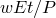
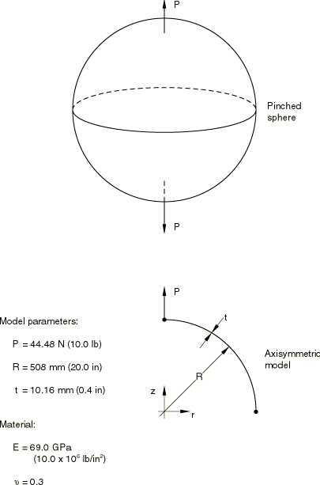
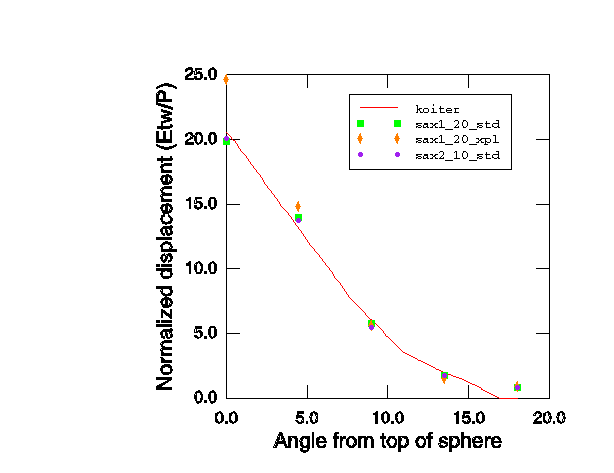
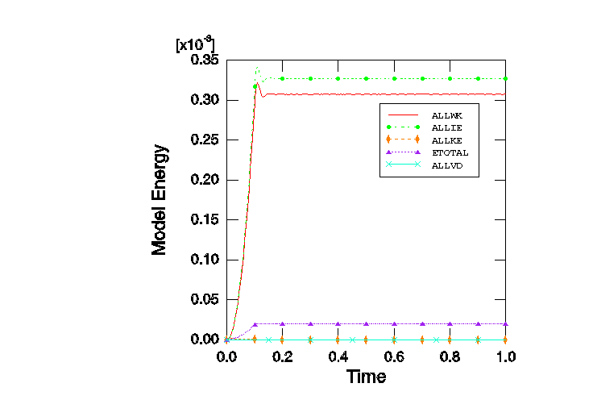

# 2.3.3 球壳压痕问题

**产品：** Abaqus/Standard  Abaqus/Explicit  

选择此问题是为了提供Abaqus中轴对称壳单元的验证和说明。大多数响应是局部的，因此该案例比例如带内压的球体更严格的测试。Koiter（1963）提供了解析解，已被用作若干轴对称壳有限单元的标准测试（参见Ashwell和Gallagher，1976）。

### 问题描述

物理问题包括一个空心球，沿球体直径施加相反的点荷载（参见[图2.3.3-1](ch02s03ach149.md#sxmpinsphere-geom)）。利用模型中的对称性，仅对球体的一半进行建模。本例使用的网格是均匀的，尽管在实际问题中，当表现出这种局部响应时，应细化网格以将单元集中在应变梯度最严重的区域。对于Abaqus/Standard分析，使用了四种轴对称网格。对于线性2节点单元SAX1，网格有10和20个单元。对于二次3节点单元SAX2，网格有5和10个单元。在Abaqus/Standard中还测试了由单个壳条或连续体壳单元带组成的两个三维模型，这些单元在周向上跨6°弧。在Abaqus/Explicit分析中使用了两种SAX1网格，一种有10个单元，另一种有20个单元。

在Abaqus/Explicit分析中，准静态压痕荷载作为斜坡函数施加，在步骤时间周期的初始10%期间，然后在该步骤的其余部分保持恒定。此外，向结构施加粘性压力载荷以阻尼动态效应。选择步骤的时间周期和粘性压力以获得最佳静态解。

### 结果与讨论

[图2.3.3-2](ch02s03ach149.md#sxmpinsphere-dispvsangle)显示了与Koiter（1963）精确解相比的径向位移数值预测。径向位移下降非常快，在离球体顶部15°以上的角度处基本上为零。在线性单元（SAX1）的较粗网格中，每个单元跨9°弧；较粗网格中的每个二次单元跨18°。因此，与精确解的变化相比，模型相当粗糙。

由于位移和旋转很小，可以忽略此问题中的几何非线性效应。默认情况下，Abaqus/Explicit考虑所有几何非线性；可以覆盖默认值。此问题的结果与是否考虑几何非线性无关，这表明当应变和旋转很小时，小位移和大位移变形理论正确地收敛到相同的结果。在Abaqus/Explicit中使用小位移变形理论的优势是显著减少CPU时间（通常约30%）用于以单元计算为主的分析。

每个网格的结果总结于[表2.3.3-1](ch02s03ach149.md#table-pinsphere-disp-top)，其中使用壳极点的位移作为解的代表度量。该表表明，二次单元网格比具有相同节点数的一阶线性单元网格收敛更快。这是一个常见的观察结果，反映了更高的理论收敛率，相对于单元尺寸，使用更高阶插值。

显式动力学分析运行直到获得稳定的静态解。[图2.3.3-3](ch02s03ach149.md#exxpinsphere-energybalance)显示了20单元网格的能量平衡图。可以看到，惯性效应被非常快地阻尼。

### 输入文件

##### **Abaqus/Standard输入文件**

[pinchedsphere_s4r_ele20.inp](../eif/pinchedsphere_s4r_ele20.inp)

S4R，20单元模型。

[pinchedsphere_sc8r_ele20.inp](../eif/pinchedsphere_sc8r_ele20.inp)

SC8R，20单元模型。

[pinchedsphere_sc8r_ele20_eh.inp](../eif/pinchedsphere_sc8r_ele20_eh.inp)

带增强沙漏控制的SC8R，20单元模型。

[pinchedsphere_sax1_ele10.inp](../eif/pinchedsphere_sax1_ele10.inp)

SAX1，10单元模型。

[pinchedsphere_sax1_ele20.inp](../eif/pinchedsphere_sax1_ele20.inp)

SAX1，20单元模型。

[pinchedsphere_sax2_ele5.inp](../eif/pinchedsphere_sax2_ele5.inp)

SAX2，5单元模型。

[pinchedsphere_sax2_ele10.inp](../eif/pinchedsphere_sax2_ele10.inp)

SAX2，10单元模型。

##### **Abaqus/Explicit输入文件**

[pinch_sph_coarse.inp](../eif/pinch_sph_coarse.inp)

10单元模型，大位移分析。

[pinch_sph_fine.inp](../eif/pinch_sph_fine.inp)

20单元模型，大位移分析。

[pinch_sph_coarse_lk.inp](../eif/pinch_sph_coarse_lk.inp)

10单元模型，小位移分析。

[pinch_sph_fine_lk.inp](../eif/pinch_sph_fine_lk.inp)

20单元模型，小位移分析。

### 参考文献

Ashwell, D. G., and R. H. Gallagher, Editors, *Finite Elements for Thin Shells and Curved Members*, John Wiley and Sons, London, 1976.

Koiter, W. T., "A Spherical Shell Under Point Loads at Its Poles," Progress in Applied Mechanics: The Prager Anniversary Volume, Macmillan, New York, 1963.

### 表格

**表2.3.3-1** 球体顶部位移。

| 单元类型 | 单元数量 | 归一化位移 | 误差 |
| --- | --- | --- | --- |
| SAX1，Abaqus/Standard | 10 | 15.52 | 24.7% |
| SAX1，Abaqus/Standard | 20 | 19.85 | 3.5% |
| SAX1，Abaqus/Explicit | 10 | 24.77 | 20.2% |
| SAX1，Abaqus/Explicit | 20 | 24.63 | 19.6% |
| SAX2 | 5 | 15.62 | 24% |
| SAX2 | 10 | 20.12 | 2.2% |
| S4R | 20 | 19.80 | 3.9% |
| SC8R | 20 | 19.83 | 3.7% |
| SC8R* | 20 | 19.94 | -3.2% |
| 归一化位移为，其中w是实际位移；E是杨氏模量；t是壳厚度；P是施加的荷载。 |
| Koiter（1963）的精确解给出归一化位移为20.6。 |
| * 带增强沙漏控制的Abaqus/Standard结果。 |

### 图表

**图2.3.3-1** 球壳压痕示例。

**图2.3.3-2** 从荷载施加点测量的角度与径向位移的关系。

**图2.3.3-3** 20单元模型能量平衡，Abaqus/Explicit分析。

