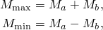
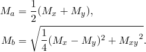
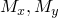
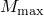
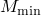
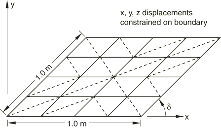
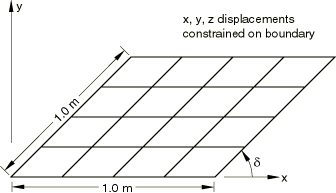
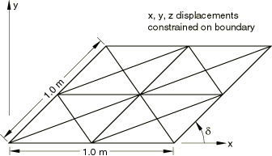
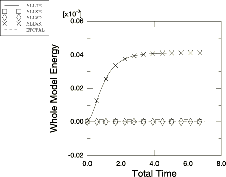

# 2.3.4 壳单元的斜交敏感性


**产品：** Abaqus/Standard  Abaqus/Explicit   

本例旨在评估Abaqus中壳单元在用作薄板时对斜交畸变的敏感性。Morley（1963）提供了该边值问题的解析级数解，Robinson（1985）在众多其他商业代码中提供了相同的单元评估。

### 问题描述

板的几何形状如图2.3.4-1、图2.3.4-2和图2.3.4-3所示。分析针对五个不同的斜交角度值进行：90°、80°、60°、40°和30°。在Abaqus/Standard分析中，每种斜交角度使用三种网格（4×4、8×8和14×14）。在Abaqus/Explicit分析中，每种斜交角度使用四边形单元的4×4、8×8和14×14网格，以及三角形单元的2×2×4、4×4×4和8×8×4网格。

板厚10mm，所有边长1.0m。因此，长厚比为100:1，板在横切剪切变形不显著的意义上是薄的。杨氏模量为30MPa，泊松比为0.3。板承受作用于整个表面的均匀压力荷载1.0×10⁶ MPa。板的所有边缘均为简支。

在Abaqus/Explicit分析中，压力作为阶跃函数施加。向结构施加粘性压力载荷以阻尼动态效应。选择阶跃的时间周期和粘性压力以获得最佳静态解。

### 结果与讨论

给出了三个响应量：板中心的垂直位移，以及板中心处单位长度最大和最小弯矩，定义为



其中



弯矩值和是通过在Abaqus/Standard分析中请求单元输出到数据文件而获得的节点平均值计算的。这些值通过从单元中积分点的值外推，然后对连接到节点的所有单元的这些值进行平均来计算。因此，它们不如积分点处的值准确。在Abaqus/Explicit分析中，弯矩值通过对共享板中心节点的所有单元的积分点值求平均获得。

#### Abaqus/Standard结果

3节点三角形壳单元S3R和STRI3的结果分别见表2.3.4-1和表2.3.4-2。除了最粗的网格（4×4单元）外，这些单元在所有斜交角度下都能给出合理的结果。

6节点三角形壳单元STRI65的结果见表2.3.4-3。除了最粗的网格外，该单元在各种网格离散化下对所有斜交角度都能给出合理的结果。

4节点四边形壳单元的结果见表2.3.4-4（S4R5）、表2.3.4-5（S4R）和表2.3.4-6（S4）。这些单元在此案例中的性能与三角形单元非常相似。

S8R5和S9R5单元类型的结果见表2.3.4-7，两者本质上相同。这些二阶单元比对一阶单元更敏感。在80°和90°角度下，它们比S4R5给出更准确的位移值；但在更严重的角度下，它们的性能明显恶化，特别是在预测板中心的最小弯矩时。这可能是由用于获取弯矩节点值的外推和平均技术引起的，而不是单元对这种类型畸变的固有敏感性。

S8R单元类型的结果见表2.3.4-8。除了最细的网格外，该单元通常比任何其他单元表现出更大的精度损失。

连续体壳单元SC6R和SC8R的结果见表2.3.4-9和表2.3.4-10。这些单元的性能与S3R和S4R壳单元相似。

#### Abaqus/Explicit结果

显式动力学分析运行直到获得稳定的静态解。图2.3.4-4显示了斜交角度为40°时14×14网格的能量平衡图。可以看到，惯性效应已经消失。

3节点三角形壳单元S3R的结果见表2.3.4-11。这些单元在最粗网格（2×2×4单元）下表现出刚性响应，但随着网格密度的增加而收敛到正确解。

4节点四边形壳单元S4R和S4RS的结果分别见表2.3.4-12和表2.3.4-13。除了40°和30°斜交角度外，S4R单元在最粗网格下给出合理答案。随着网格密度的增加，所有斜交角度的单元都收敛到解析解。

连续体壳单元SC8R的结果见表2.3.4-14。该单元的性能与S4R壳单元相似。

#### 一般说明

当四边形单元以大于45°的斜交畸变定义时，Abaqus会发出警告。在这种情况下，结果表明，除了S8R单元类型外，单元即使在大斜交畸变下也能通过合理的网格提供相当准确的结果。然而，同样明显的是，分析人员应尝试设计网格，以避免在任何应变梯度大的区域出现单元畸变。

将此处报告的结果与Robinson（1985）给出的评估进行比较，表明Abaqus中的单元是最准确且对斜交角度最不敏感的单元之一。

### 使用参数化研究脚本进行参数化研究

本例中讨论的斜交敏感性研究可以使用Abaqus提供的Python脚本功能方便地作为参数化研究执行。例如，我们在Abaqus/Standard中进行参数化研究，自动执行15个分析；这些分析对应于三种不同单元类型（S8R、S4R和S4）的五个不同斜交角度值（90°、80°、60°、40°和30°）的组合。我们还在Abaqus/Explicit中进行参数化研究，自动执行12个分析；这些分析对应于三个不同斜交角度值（90°、60°和30°）、两种不同单元类型（S4R和S4RS）和两种网格离散化（4×4和8×8单元）的组合。

[skewshell_parametric.inp](../eif/skewshell_parametric.inp)显示了用于生成Abaqus/Standard参数化研究参数变化的参数化模板输入数据。参数化研究脚本文件（[skewshell_parametric.psf](../eif/skewshell_parametric.psf)）用于执行参数化研究。参数化研究中每个分析的板中心垂直位移在下表中报告：

```
   ________________________________________________

        Parametric study: skewshell_parametric
   ________________________________________________

         elemType,         delta,      N405_U.3,
   ________________________________________________

              s8r,            90,   -0.00150858,
              s4r,            90,   -0.00149891,
               s4,            90,   -0.00144697,
              s8r,            80,   -0.00141673,
              s4r,            80,   -0.00143168,
               s4,            80,   -0.00137446,
              s8r,            60,  -0.000845317,
              s4r,            60,  -0.000969093,
               s4,            60,  -0.000885679,
              s8r,            40,  -0.000258699,
              s4r,            40,  -0.000371343,
               s4,            40,  -0.000315966,
              s8r,            30,   -9.5434e-05,
              s4r,            30,  -0.000153366,
               s4,            30,  -0.000130785,
   ________________________________________________

```

这些结果与表2.3.4-5到表2.3.4-8中找到的相应结果一致。

[skew_discr.inp](../eif/skew_discr.inp)显示了用于生成Abaqus/Explicit参数化研究参数变化的参数化模板输入数据。参数化研究脚本文件（[skew_discr.psf](../eif/skew_discr.psf)）用于执行参数化研究。参数化研究中每个分析的板中心垂直位移在下表中报告：

```

                      Parametric study: skewXpl
   ________________________________________________________________

            level,      elemType,         delta,      N405_U.3,
   ________________________________________________________________

                1,           s4r,            90,   -0.00144092,
                2,           s4r,            90,   -0.00144511,
                1,          s4rs,            90,   -0.00155302,
                2,          s4rs,            90,   -0.00147813,
                1,           s4r,            60,  -0.000954238,
                2,           s4r,            60,  -0.000925741,
                1,          s4rs,            60,   -0.00102325,
                2,          s4rs,            60,  -0.000963277,
                1,           s4r,            30,  -0.000151794,
                2,           s4r,            30,  -0.000148982,
                1,          s4rs,            30,  -0.000161744,
                2,          s4rs,            30,  -0.000162303,
   ________________________________________________________________

```

结果与表2.3.4-11到表2.3.4-13中找到的相应结果一致。

### 输入文件

##### **Abaqus/Standard输入文件**

[skewshell_typ_tri.inp](../eif/skewshell_typ_tri.inp)

三角形单元的典型输入数据。

[skewshell_typ_quad.inp](../eif/skewshell_typ_quad.inp)

四边形单元的典型输入数据。

[skewshell_parametric.inp](../eif/skewshell_parametric.inp)

用于生成参数化研究参数变化的参数化模板输入数据。

#### S3R单元：

[skewshell_s3r_4x4_ang30.inp](../eif/skewshell_s3r_4x4_ang30.inp)

4×4网格，斜交角度=30°。

[skewshell_s3r_4x4_ang40.inp](../eif/skewshell_s3r_4x4_ang40.inp)

4×4网格，斜交角度=40°。

[skewshell_s3r_4x4_ang60.inp](../eif/skewshell_s3r_4x4_ang60.inp)

4×4网格，斜交角度=60°。

[skewshell_s3r_4x4_ang80.inp](../eif/skewshell_s3r_4x4_ang80.inp)

4×4网格，斜交角度=80°。

[skewshell_s3r_4x4_ang90.inp](../eif/skewshell_s3r_4x4_ang90.inp)

4×4网格，斜交角度=90°。

[skewshell_s3r_8x8_ang30.inp](../eif/skewshell_s3r_8x8_ang30.inp)

8×8网格，斜交角度=30°。

[skewshell_s3r_8x8_ang40.inp](../eif/skewshell_s3r_8x8_ang40.inp)

8×8网格，斜交角度=40°。

[skewshell_s3r_8x8_ang60.inp](../eif/skewshell_s3r_8x8_ang60.inp)

8×8网格，斜交角度=60°。

[skewshell_s3r_8x8_ang80.inp](../eif/skewshell_s3r_8x8_ang80.inp)

8×8网格，斜交角度=80°。

[skewshell_s3r_8x8_ang90.inp](../eif/skewshell_s3r_8x8_ang90.inp)

8×8网格，斜交角度=90°。

[skewshell_s3r_14x14_ang30.inp](../eif/skewshell_s3r_14x14_ang30.inp)

14×14网格，斜交角度=30°。

[skewshell_s3r_14x14_ang40.inp](../eif/skewshell_s3r_14x14_ang40.inp)

14×14网格，斜交角度=40°。

[skewshell_s3r_14x14_ang60.inp](../eif/skewshell_s3r_14x14_ang60.inp)

14×14网格，斜交角度=60°。

[skewshell_s3r_14x14_ang80.inp](../eif/skewshell_s3r_14x14_ang80.inp)

14×14网格，斜交角度=80°。

[skewshell_s3r_14x14_ang90.inp](../eif/skewshell_s3r_14x14_ang90.inp)

14×14网格，斜交角度=90°。

#### S4单元：

[skewshell_s4_4x4_ang30.inp](../eif/skewshell_s4_4x4_ang30.inp)

4×4网格，斜交角度=30°。

[skewshell_s4_4x4_ang40.inp](../eif/skewshell_s4_4x4_ang40.inp)

4×4网格，斜交角度=40°。

[skewshell_s4_4x4_ang60.inp](../eif/skewshell_s4_4x4_ang60.inp)

4×4网格，斜交角度=60°。

[skewshell_s4_4x4_ang80.inp](../eif/skewshell_s4_4x4_ang80.inp)

4×4网格，斜交角度=80°。

[skewshell_s4_4x4_ang90.inp](../eif/skewshell_s4_4x4_ang90.inp)

4×4网格，斜交角度=90°。

[skewshell_s4_8x8_ang30.inp](../eif/skewshell_s4_8x8_ang30.inp)

8×8网格，斜交角度=30°。

[skewshell_s4_8x8_ang40.inp](../eif/skewshell_s4_8x8_ang40.inp)

8×8网格，斜交角度=40°。

[skewshell_s4_8x8_ang60.inp](../eif/skewshell_s4_8x8_ang60.inp)

8×8网格，斜交角度=60°。

[skewshell_s4_8x8_ang80.inp](../eif/skewshell_s4_8x8_ang80.inp)

8×8网格，斜交角度=80°。

[skewshell_s4_8x8_ang90.inp](../eif/skewshell_s4_8x8_ang90.inp)

8×8网格，斜交角度=90°。

[skewshell_s4_14x14_ang30.inp](../eif/skewshell_s4_14x14_ang30.inp)

14×14网格，斜交角度=30°。

[skewshell_s4_14x14_ang40.inp](../eif/skewshell_s4_14x14_ang40.inp)

14×14网格，斜交角度=40°。

[skewshell_s4_14x14_ang60.inp](../eif/skewshell_s4_14x14_ang60.inp)

14×14网格，斜交角度=60°。

[skewshell_s4_14x14_ang80.inp](../eif/skewshell_s4_14x14_ang80.inp)

14×14网格，斜交角度=80°。

[skewshell_s4_14x14_ang90.inp](../eif/skewshell_s4_14x14_ang90.inp)

14×14网格，斜交角度=90°。

#### S4R单元：

[skewshell_s4r_4x4_ang30.inp](../eif/skewshell_s4r_4x4_ang30.inp)

4×4网格，斜交角度=30°。

[skewshell_s4r_4x4_ang30_eh.inp](../eif/skewshell_s4r_4x4_ang30_eh.inp)

4×4网格，斜交角度=30°，带增强沙漏控制。

[skewshell_s4r_4x4_ang40.inp](../eif/skewshell_s4r_4x4_ang40.inp)

4×4网格，斜交角度=40°。

[skewshell_s4r_4x4_ang60.inp](../eif/skewshell_s4r_4x4_ang60.inp)

4×4网格，斜交角度=60°。

[skewshell_s4r_4x4_ang80.inp](../eif/skewshell_s4r_4x4_ang80.inp)

4×4网格，斜交角度=80°。

[skewshell_s4r_4x4_ang90.inp](../eif/skewshell_s4r_4x4_ang90.inp)

4×4网格，斜交角度=90°。

[skewshell_s4r_8x8_ang30.inp](../eif/skewshell_s4r_8x8_ang30.inp)

8×8网格，斜交角度=30°。

[skewshell_s4r_8x8_ang30_eh.inp](../eif/skewshell_s4r_8x8_ang30_eh.inp)

8×8网格，斜交角度=30°，带增强沙漏控制。

[skewshell_s4r_8x8_ang40.inp](../eif/skewshell_s4r_8x8_ang40.inp)

8×8网格，斜交角度=40°。

[skewshell_s4r_8x8_ang60.inp](../eif/skewshell_s4r_8x8_ang60.inp)

8×8网格，斜交角度=60°。

[skewshell_s4r_8x8_ang80.inp](../eif/skewshell_s4r_8x8_ang80.inp)

8×8网格，斜交角度=80°。

[skewshell_s4r_8x8_ang90.inp](../eif/skewshell_s4r_8x8_ang90.inp)

8×8网格，斜交角度=90°。

[skewshell_s4r_14x14_ang30.inp](../eif/skewshell_s4r_14x14_ang30.inp)

14×14网格，斜交角度=30°。

[skewshell_s4r_14x14_ang30_eh.inp](../eif/skewshell_s4r_14x14_ang30_eh.inp)

14×14网格，斜交角度=30°，带增强沙漏控制。

[skewshell_s4r_14x14_ang40.inp](../eif/skewshell_s4r_14x14_ang40.inp)

14×14网格，斜交角度=40°。

[skewshell_s4r_14x14_ang60.inp](../eif/skewshell_s4r_14x14_ang60.inp)

14×14网格，斜交角度=60°。

[skewshell_s4r_14x14_ang80.inp](../eif/skewshell_s4r_14x14_ang80.inp)

14×14网格，斜交角度=80°。

[skewshell_s4r_14x14_ang90.inp](../eif/skewshell_s4r_14x14_ang90.inp)

14×14网格，斜交角度=90°。

#### S4R5单元：

[skewshell_s4r5_4x4_ang30.inp](../eif/skewshell_s4r5_4x4_ang30.inp)

4×4网格，斜交角度=30°。

[skewshell_s4r5_4x4_ang40.inp](../eif/skewshell_s4r5_4x4_ang40.inp)

4×4网格，斜交角度=40°。

[skewshell_s4r5_4x4_ang60.inp](../eif/skewshell_s4r5_4x4_ang60.inp)

4×4网格，斜交角度=60°。

[skewshell_s4r5_4x4_ang80.inp](../eif/skewshell_s4r5_4x4_ang80.inp)

4×4网格，斜交角度=80°。

[skewshell_s4r5_4x4_ang90.inp](../eif/skewshell_s4r5_4x4_ang90.inp)

4×4网格，斜交角度=90°。

[skewshell_s4r5_8x8_ang30.inp](../eif/skewshell_s4r5_8x8_ang30.inp)

8×8网格，斜交角度=30°。

[skewshell_s4r5_8x8_ang40.inp](../eif/skewshell_s4r5_8x8_ang40.inp)

8×8网格，斜交角度=40°。

[skewshell_s4r5_8x8_ang60.inp](../eif/skewshell_s4r5_8x8_ang60.inp)

8×8网格，斜交角度=60°。

[skewshell_s4r5_8x8_ang80.inp](../eif/skewshell_s4r5_8x8_ang80.inp)

8×8网格，斜交角度=80°。

[skewshell_s4r5_8x8_ang90.inp](../eif/skewshell_s4r5_8x8_ang90.inp)

8×8网格，斜交角度=90°。

[skewshell_s4r5_14x14_ang30.inp](../eif/skewshell_s4r5_14x14_ang30.inp)

14×14网格，斜交角度=30°。

[skewshell_s4r5_14x14_ang40.inp](../eif/skewshell_s4r5_14x14_ang40.inp)

14×14网格，斜交角度=40°。

[skewshell_s4r5_14x14_ang60.inp](../eif/skewshell_s4r5_14x14_ang60.inp)

14×14网格，斜交角度=60°。

[skewshell_s4r5_14x14_ang80.inp](../eif/skewshell_s4r5_14x14_ang80.inp)

14×14网格，斜交角度=80°。

[skewshell_s4r5_14x14_ang90.inp](../eif/skewshell_s4r5_14x14_ang90.inp)

14×14网格，斜交角度=90°。

#### S8R单元：

[skewshell_s8r_4x4_ang30.inp](../eif/skewshell_s8r_4x4_ang30.inp)

4×4网格，斜交角度=30°。

[skewshell_s8r_4x4_ang40.inp](../eif/skewshell_s8r_4x4_ang40.inp)

4×4网格，斜交角度=40°。

[skewshell_s8r_4x4_ang60.inp](../eif/skewshell_s8r_4x4_ang60.inp)

4×4网格，斜交角度=60°。

[skewshell_s8r_4x4_ang80.inp](../eif/skewshell_s8r_4x4_ang80.inp)

4×4网格，斜交角度=80°。

[skewshell_s8r_4x4_ang90.inp](../eif/skewshell_s8r_4x4_ang90.inp)

4×4网格，斜交角度=90°。

[skewshell_s8r_8x8_ang30.inp](../eif/skewshell_s8r_8x8_ang30.inp)

8×8网格，斜交角度=30°。

[skewshell_s8r_8x8_ang40.inp](../eif/skewshell_s8r_8x8_ang40.inp)

8×8网格，斜交角度=40°。

[skewshell_s8r_8x8_ang60.inp](../eif/skewshell_s8r_8x8_ang60.inp)

8×8网格，斜交角度=60°。

[skewshell_s8r_8x8_ang80.inp](../eif/skewshell_s8r_8x8_ang80.inp)

8×8网格，斜交角度=80°。

[skewshell_s8r_8x8_ang90.inp](../eif/skewshell_s8r_8x8_ang90.inp)

8×8网格，斜交角度=90°。

[skewshell_s8r_14x14_ang30.inp](../eif/skewshell_s8r_14x14_ang30.inp)

14×14网格，斜交角度=30°。

[skewshell_s8r_14x14_ang40.inp](../eif/skewshell_s8r_14x14_ang40.inp)

14×14网格，斜交角度=40°。

[skewshell_s8r_14x14_ang60.inp](../eif/skewshell_s8r_14x14_ang60.inp)

14×14网格，斜交角度=60°。

[skewshell_s8r_14x14_ang80.inp](../eif/skewshell_s8r_14x14_ang80.inp)

14×14网格，斜交角度=80°。

[skewshell_s8r_14x14_ang90.inp](../eif/skewshell_s8r_14x14_ang90.inp)

14×14网格，斜交角度=90°。

#### S8R5单元：

[skewshell_s8r5_4x4_ang30.inp](../eif/skewshell_s8r5_4x4_ang30.inp)

4×4网格，斜交角度=30°。

[skewshell_s8r5_4x4_ang40.inp](../eif/skewshell_s8r5_4x4_ang40.inp)

4×4网格，斜交角度=40°。

[skewshell_s8r5_4x4_ang60.inp](../eif/skewshell_s8r5_4x4_ang60.inp)

4×4网格，斜交角度=60°。

[skewshell_s8r5_4x4_ang80.inp](../eif/skewshell_s8r5_4x4_ang80.inp)

4×4网格，斜交角度=80°。

[skewshell_s8r5_4x4_ang90.inp](../eif/skewshell_s8r5_4x4_ang90.inp)

4×4网格，斜交角度=90°。

[skewshell_s8r5_8x8_ang30.inp](../eif/skewshell_s8r5_8x8_ang30.inp)

8×8网格，斜交角度=30°。

[skewshell_s8r5_8x8_ang40.inp](../eif/skewshell_s8r5_8x8_ang40.inp)

8×8网格，斜交角度=40°。

[skewshell_s8r5_8x8_ang60.inp](../eif/skewshell_s8r5_8x8_ang60.inp)

8×8网格，斜交角度=60°。

[skewshell_s8r5_8x8_ang80.inp](../eif/skewshell_s8r5_8x8_ang80.inp)

8×8网格，斜交角度=80°。

[skewshell_s8r5_8x8_ang90.inp](../eif/skewshell_s8r5_8x8_ang90.inp)

8×8网格，斜交角度=90°。

[skewshell_s8r5_14x14_ang30.inp](../eif/skewshell_s8r5_14x14_ang30.inp)

14×14网格，斜交角度=30°。

[skewshell_s8r5_14x14_ang40.inp](../eif/skewshell_s8r5_14x14_ang40.inp)

14×14网格，斜交角度=40°。

[skewshell_s8r5_14x14_ang60.inp](../eif/skewshell_s8r5_14x14_ang60.inp)

14×14网格，斜交角度=60°。

[skewshell_s8r5_14x14_ang80.inp](../eif/skewshell_s8r5_14x14_ang80.inp)

14×14网格，斜交角度=80°。

[skewshell_s8r5_14x14_ang90.inp](../eif/skewshell_s8r5_14x14_ang90.inp)

14×14网格，斜交角度=90°。

#### S9R5单元：

[skewshell_s9r5_4x4_ang30.inp](../eif/skewshell_s9r5_4x4_ang30.inp)

4×4网格，斜交角度=30°。

[skewshell_s9r5_4x4_ang40.inp](../eif/skewshell_s9r5_4x4_ang40.inp)

4×4网格，斜交角度=40°。

[skewshell_s9r5_4x4_ang60.inp](../eif/skewshell_s9r5_4x4_ang60.inp)

4×4网格，斜交角度=60°。

[skewshell_s9r5_4x4_ang80.inp](../eif/skewshell_s9r5_4x4_ang80.inp)

4×4网格，斜交角度=80°。

[skewshell_s9r5_4x4_ang90.inp](../eif/skewshell_s9r5_4x4_ang90.inp)

4×4网格，斜交角度=90°。

[skewshell_s9r5_8x8_ang30.inp](../eif/skewshell_s9r5_8x8_ang30.inp)

8×8网格，斜交角度=30°。

[skewshell_s9r5_8x8_ang40.inp](../eif/skewshell_s9r5_8x8_ang40.inp)

8×8网格，斜交角度=40°。

[skewshell_s9r5_8x8_ang60.inp](../eif/skewshell_s9r5_8x8_ang60.inp)

8×8网格，斜交角度=60°。

[skewshell_s9r5_8x8_ang80.inp](../eif/skewshell_s9r5_8x8_ang80.inp)

8×8网格，斜交角度=80°。

[skewshell_s9r5_8x8_ang90.inp](../eif/skewshell_s9r5_8x8_ang90.inp)

8×8网格，斜交角度=90°。

[skewshell_s9r5_14x14_ang30.inp](../eif/skewshell_s9r5_14x14_ang30.inp)

14×14网格，斜交角度=30°。

[skewshell_s9r5_14x14_ang40.inp](../eif/skewshell_s9r5_14x14_ang40.inp)

14×14网格，斜交角度=40°。

[skewshell_s9r5_14x14_ang60.inp](../eif/skewshell_s9r5_14x14_ang60.inp)

14×14网格，斜交角度=60°。

[skewshell_s9r5_14x14_ang80.inp](../eif/skewshell_s9r5_14x14_ang80.inp)

14×14网格，斜交角度=80°。

[skewshell_s9r5_14x14_ang90.inp](../eif/skewshell_s9r5_14x14_ang90.inp)

14×14网格，斜交角度=90°。

#### STRI3单元：

[skewshell_stri3_4x4_ang30.inp](../eif/skewshell_stri3_4x4_ang30.inp)

4×4网格，斜交角度=30°。

[skewshell_stri3_4x4_ang40.inp](../eif/skewshell_stri3_4x4_ang40.inp)

4×4网格，斜交角度=40°。

[skewshell_stri3_4x4_ang60.inp](../eif/skewshell_stri3_4x4_ang60.inp)

4×4网格，斜交角度=60°。

[skewshell_stri3_4x4_ang80.inp](../eif/skewshell_stri3_4x4_ang80.inp)

4×4网格，斜交角度=80°。

[skewshell_stri3_4x4_ang90.inp](../eif/skewshell_stri3_4x4_ang90.inp)

4×4网格，斜交角度=90°。

[skewshell_stri3_8x8_ang30.inp](../eif/skewshell_stri3_8x8_ang30.inp)

8×8网格，斜交角度=30°。

[skewshell_stri3_8x8_ang40.inp](../eif/skewshell_stri3_8x8_ang40.inp)

8×8网格，斜交角度=40°。

[skewshell_stri3_8x8_ang60.inp](../eif/skewshell_stri3_8x8_ang60.inp)

8×8网格，斜交角度=60°。

[skewshell_stri3_8x8_ang80.inp](../eif/skewshell_stri3_8x8_ang80.inp)

8×8网格，斜交角度=80°。

[skewshell_stri3_8x8_ang90.inp](../eif/skewshell_stri3_8x8_ang90.inp)

8×8网格，斜交角度=90°。

[skewshell_stri3_14x14_ang30.inp](../eif/skewshell_stri3_14x14_ang30.inp)

14×14网格，斜交角度=30°。

[skewshell_stri3_14x14_ang40.inp](../eif/skewshell_stri3_14x14_ang40.inp)

14×14网格，斜交角度=40°。

[skewshell_stri3_14x14_ang60.inp](../eif/skewshell_stri3_14x14_ang60.inp)

14×14网格，斜交角度=60°。

[skewshell_stri3_14x14_ang80.inp](../eif/skewshell_stri3_14x14_ang80.inp)

14×14网格，斜交角度=80°。

[skewshell_stri3_14x14_ang90.inp](../eif/skewshell_stri3_14x14_ang90.inp)

14×14网格，斜交角度=90°。

#### STRI65单元：

[skewshell_stri65_4x4_ang30.inp](../eif/skewshell_stri65_4x4_ang30.inp)

4×4网格，斜交角度=30°。

[skewshell_stri65_4x4_ang40.inp](../eif/skewshell_stri65_4x4_ang40.inp)

4×4网格，斜交角度=40°。

[skewshell_stri65_4x4_ang60.inp](../eif/skewshell_stri65_4x4_ang60.inp)

4×4网格，斜交角度=60°。

[skewshell_stri65_4x4_ang80.inp](../eif/skewshell_stri65_4x4_ang80.inp)

4×4网格，斜交角度=80°。

[skewshell_stri65_4x4_ang90.inp](../eif/skewshell_stri65_4x4_ang90.inp)

4×4网格，斜交角度=90°。

[skewshell_stri65_8x8_ang30.inp](../eif/skewshell_stri65_8x8_ang30.inp)

8×8网格，斜交角度=30°。

[skewshell_stri65_8x8_ang40.inp](../eif/skewshell_stri65_8x8_ang40.inp)

8×8网格，斜交角度=40°。

[skewshell_stri65_8x8_ang60.inp](../eif/skewshell_stri65_8x8_ang60.inp)

8×8网格，斜交角度=60°。

[skewshell_stri65_8x8_ang80.inp](../eif/skewshell_stri65_8x8_ang80.inp)

8×8网格，斜交角度=80°。

[skewshell_stri65_8x8_ang90.inp](../eif/skewshell_stri65_8x8_ang90.inp)

8×8网格，斜交角度=90°。

[skewshell_stri65_14x14_ang30.inp](../eif/skewshell_stri65_14x14_ang30.inp)

14×14网格，斜交角度=30°。

[skewshell_stri65_14x14_ang40.inp](../eif/skewshell_stri65_14x14_ang40.inp)

14×14网格，斜交角度=40°。

[skewshell_stri65_14x14_ang60.inp](../eif/skewshell_stri65_14x14_ang60.inp)

14×14网格，斜交角度=60°。

[skewshell_stri65_14x14_ang80.inp](../eif/skewshell_stri65_14x14_ang80.inp)

14×14网格，斜交角度=80°。

[skewshell_stri65_14x14_ang90.inp](../eif/skewshell_stri65_14x14_ang90.inp)

14×14网格，斜交角度=90°。

#### SC6R单元：

[skewshell_sc6r_4x4_ang30.inp](../eif/skewshell_sc6r_4x4_ang30.inp)

4×4网格，斜交角度=30°。

[skewshell_sc6r_4x4_ang40.inp](../eif/skewshell_sc6r_4x4_ang40.inp)

4×4网格，斜交角度=40°。

[skewshell_sc6r_4x4_ang60.inp](../eif/skewshell_sc6r_4x4_ang60.inp)

4×4网格，斜交角度=60°。

[skewshell_sc6r_4x4_ang80.inp](../eif/skewshell_sc6r_4x4_ang80.inp)

4×4网格，斜交角度=80°。

[skewshell_sc6r_4x4_ang90.inp](../eif/skewshell_sc6r_4x4_ang90.inp)

4×4网格，斜交角度=90°。

[skewshell_sc6r_8x8_ang30.inp](../eif/skewshell_sc6r_8x8_ang30.inp)

8×8网格，斜交角度=30°。

[skewshell_sc6r_8x8_ang40.inp](../eif/skewshell_sc6r_8x8_ang40.inp)

8×8网格，斜交角度=40°。

[skewshell_sc6r_8x8_ang60.inp](../eif/skewshell_sc6r_8x8_ang60.inp)

8×8网格，斜交角度=60°。

[skewshell_sc6r_8x8_ang80.inp](../eif/skewshell_sc6r_8x8_ang80.inp)

8×8网格，斜交角度=80°。

[skewshell_sc6r_8x8_ang90.inp](../eif/skewshell_sc6r_8x8_ang90.inp)

8×8网格，斜交角度=90°。

[skewshell_sc6r_14x14_ang30.inp](../eif/skewshell_sc6r_14x14_ang30.inp)

14×14网格，斜交角度=30°。

[skewshell_sc6r_14x14_ang40.inp](../eif/skewshell_sc6r_14x14_ang40.inp)

14×14网格，斜交角度=40°。

[skewshell_sc6r_14x14_ang60.inp](../eif/skewshell_sc6r_14x14_ang60.inp)

14×14网格，斜交角度=60°。

[skewshell_sc6r_14x14_ang80.inp](../eif/skewshell_sc6r_14x14_ang80.inp)

14×14网格，斜交角度=80°。

[skewshell_sc6r_14x14_ang90.inp](../eif/skewshell_sc6r_14x14_ang90.inp)

14×14网格，斜交角度=90°。

#### SC8R单元：

[skewshell_sc8r_4x4_ang30.inp](../eif/skewshell_sc8r_4x4_ang30.inp)

4×4网格，斜交角度=30°。

[skewshell_sc8r_4x4_ang40.inp](../eif/skewshell_sc8r_4x4_ang40.inp)

4×4网格，斜交角度=40°。

[skewshell_sc8r_4x4_ang60.inp](../eif/skewshell_sc8r_4x4_ang60.inp)

4×4网格，斜交角度=60°。

[skewshell_sc8r_4x4_ang80.inp](../eif/skewshell_sc8r_4x4_ang80.inp)

4×4网格，斜交角度=80°。

[skewshell_sc8r_4x4_ang90.inp](../eif/skewshell_sc8r_4x4_ang90.inp)

4×4网格，斜交角度=90°。

[skewshell_sc8r_8x8_ang30.inp](../eif/skewshell_sc8r_8x8_ang30.inp)

8×8网格，斜交角度=30°。

[skewshell_sc8r_8x8_ang40.inp](../eif/skewshell_sc8r_8x8_ang40.inp)

8×8网格，斜交角度=40°。

[skewshell_sc8r_8x8_ang60.inp](../eif/skewshell_sc8r_8x8_ang60.inp)

8×8网格，斜交角度=60°。

[skewshell_sc8r_8x8_ang80.inp](../eif/skewshell_sc8r_8x8_ang80.inp)

8×8网格，斜交角度=80°。

[skewshell_sc8r_8x8_ang90.inp](../eif/skewshell_sc8r_8x8_ang90.inp)

8×8网格，斜交角度=90°。

[skewshell_sc8r_14x14_ang30.inp](../eif/skewshell_sc8r_14x14_ang30.inp)

14×14网格，斜交角度=30°。

[skewshell_sc8r_14x14_ang40.inp](../eif/skewshell_sc8r_14x14_ang40.inp)

14×14网格，斜交角度=40°。

[skewshell_sc8r_14x14_ang60.inp](../eif/skewshell_sc8r_14x14_ang60.inp)

14×14网格，斜交角度=60°。

[skewshell_sc8r_14x14_ang80.inp](../eif/skewshell_sc8r_14x14_ang80.inp)

14×14网格，斜交角度=80°。

[skewshell_sc8r_14x14_ang90.inp](../eif/skewshell_sc8r_14x14_ang90.inp)

14×14网格，斜交角度=90°。

##### **Abaqus/Explicit输入文件**

[skew_discr.inp](../eif/skew_discr.inp)

用于生成参数化研究参数变化的参数化模板输入数据。

#### S3R单元测试：

[skew_coarse_30_s3r.inp](../eif/skew_coarse_30_s3r.inp)

粗网格，斜交角度=30°。

[skew_coarse_40_s3r.inp](../eif/skew_coarse_40_s3r.inp)

粗网格，斜交角度=40°。

[skew_coarse_60_s3r.inp](../eif/skew_coarse_60_s3r.inp)

粗网格，斜交角度=60°。

[skew_coarse_80_s3r.inp](../eif/skew_coarse_80_s3r.inp)

粗网格，斜交角度=80°。

[skew_coarse_90_s3r.inp](../eif/skew_coarse_90_s3r.inp)

粗网格，斜交角度=90°。

[skew_fine_30_s3r.inp](../eif/skew_fine_30_s3r.inp)

细网格，斜交角度=30°。

[skew_fine_40_s3r.inp](../eif/skew_fine_40_s3r.inp)

细网格，斜交角度=40°。

[skew_fine_60_s3r.inp](../eif/skew_fine_60_s3r.inp)

细网格，斜交角度=60°。

[skew_fine_80_s3r.inp](../eif/skew_fine_80_s3r.inp)

细网格，斜交角度=80°。

[skew_fine_90_s3r.inp](../eif/skew_fine_90_s3r.inp)

细网格，斜交角度=90°。

[skew_medium_30_s3r.inp](../eif/skew_medium_30_s3r.inp)

中等网格，斜交角度=30°。

[skew_medium_40_s3r.inp](../eif/skew_medium_40_s3r.inp)

中等网格，斜交角度=40°。

[skew_medium_60_s3r.inp](../eif/skew_medium_60_s3r.inp)

中等网格，斜交角度=60°。

[skew_medium_80_s3r.inp](../eif/skew_medium_80_s3r.inp)

中等网格，斜交角度=80°。

[skew_medium_90_s3r.inp](../eif/skew_medium_90_s3r.inp)

中等网格，斜交角度=90°。

#### S4R单元测试：

[skew_coarse_30_s4r.inp](../eif/skew_coarse_30_s4r.inp)

粗网格，斜交角度=30°。

[skew_coarse_40_s4r.inp](../eif/skew_coarse_40_s4r.inp)

粗网格，斜交角度=40°。

[skew_coarse_60_s4r.inp](../eif/skew_coarse_60_s4r.inp)

粗网格，斜交角度=60°。

[skew_coarse_80_s4r.inp](../eif/skew_coarse_80_s4r.inp)

粗网格，斜交角度=80°。

[skew_coarse_90_s4r.inp](../eif/skew_coarse_90_s4r.inp)

粗网格，斜交角度=90°。

[skew_fine_30_s4r.inp](../eif/skew_fine_30_s4r.inp)

细网格，斜交角度=30°。

[skew_fine_40_s4r.inp](../eif/skew_fine_40_s4r.inp)

细网格，斜交角度=40°。

[skew_fine_60_s4r.inp](../eif/skew_fine_60_s4r.inp)

细网格，斜交角度=60°。

[skew_fine_80_s4r.inp](../eif/skew_fine_80_s4r.inp)

细网格，斜交角度=80°。

[skew_fine_90_s4r.inp](../eif/skew_fine_90_s4r.inp)

细网格，斜交角度=90°。

[skew_medium_30_s4r.inp](../eif/skew_medium_30_s4r.inp)

中等网格，斜交角度=30°。

[skew_medium_40_s4r.inp](../eif/skew_medium_40_s4r.inp)

中等网格，斜交角度=40°。

[skew_medium_60_s4r.inp](../eif/skew_medium_60_s4r.inp)

中等网格，斜交角度=60°。

[skew_medium_80_s4r.inp](../eif/skew_medium_80_s4r.inp)

中等网格，斜交角度=80°。

[skew_medium_90_s4r.inp](../eif/skew_medium_90_s4r.inp)

中等网格，斜交角度=90°。

#### SC8R单元测试：

[skew_coarse_30_sc8r.inp](../eif/skew_coarse_30_sc8r.inp)

粗网格，斜交角度=30°。

[skew_coarse_40_sc8r.inp](../eif/skew_coarse_40_sc8r.inp)

粗网格，斜交角度=40°。

[skew_coarse_60_sc8r.inp](../eif/skew_coarse_60_sc8r.inp)

粗网格，斜交角度=60°。

[skew_coarse_80_sc8r.inp](../eif/skew_coarse_80_sc8r.inp)

粗网格，斜交角度=80°。

[skew_coarse_90_sc8r.inp](../eif/skew_coarse_90_sc8r.inp)

粗网格，斜交角度=90°。

[skew_fine_30_sc8r.inp](../eif/skew_fine_30_sc8r.inp)

细网格，斜交角度=30°。

[skew_fine_40_sc8r.inp](../eif/skew_fine_40_sc8r.inp)

细网格，斜交角度=40°。

[skew_fine_60_sc8r.inp](../eif/skew_fine_60_sc8r.inp)

细网格，斜交角度=60°。

[skew_fine_80_sc8r.inp](../eif/skew_fine_80_sc8r.inp)

细网格，斜交角度=80°。

[skew_fine_90_sc8r.inp](../eif/skew_fine_90_sc8r.inp)

细网格，斜交角度=90°。

[skew_medium_30_sc8r.inp](../eif/skew_medium_30_sc8r.inp)

中等网格，斜交角度=30°。

[skew_medium_40_sc8r.inp](../eif/skew_medium_40_sc8r.inp)

中等网格，斜交角度=40°。

[skew_medium_60_sc8r.inp](../eif/skew_medium_60_sc8r.inp)

中等网格，斜交角度=60°。

[skew_medium_80_sc8r.inp](../eif/skew_medium_80_sc8r.inp)

中等网格，斜交角度=80°。

[skew_medium_90_sc8r.inp](../eif/skew_medium_90_sc8r.inp)

中等网格，斜交角度=90°。

#### S4RS单元测试：

[skew_coarse_30_s4rs.inp](../eif/skew_coarse_30_s4rs.inp)

粗网格，斜交角度=30°。

[skew_coarse_40_s4rs.inp](../eif/skew_coarse_40_s4rs.inp)

粗网格，斜交角度=40°。

[skew_coarse_60_s4rs.inp](../eif/skew_coarse_60_s4rs.inp)

粗网格，斜交角度=60°。

[skew_coarse_80_s4rs.inp](../eif/skew_coarse_80_s4rs.inp)

粗网格，斜交角度=80°。

[skew_coarse_90_s4rs.inp](../eif/skew_coarse_90_s4rs.inp)

粗网格，斜交角度=90°。

[skew_fine_30_s4rs.inp](../eif/skew_fine_30_s4rs.inp)

细网格，斜交角度=30°。

[skew_fine_40_s4rs.inp](../eif/skew_fine_40_s4rs.inp)

细网格，斜交角度=40°。

[skew_fine_60_s4rs.inp](../eif/skew_fine_60_s4rs.inp)

细网格，斜交角度=60°。

[skew_fine_80_s4rs.inp](../eif/skew_fine_80_s4rs.inp)

细网格，斜交角度=80°。

[skew_fine_90_s4rs.inp](../eif/skew_fine_90_s4rs.inp)

细网格，斜交角度=90°。

[skew_medium_30_s4rs.inp](../eif/skew_medium_30_s4rs.inp)

中等网格，斜交角度=30°。

[skew_medium_40_s4rs.inp](../eif/skew_medium_40_s4rs.inp)

中等网格，斜交角度=40°。

[skew_medium_60_s4rs.inp](../eif/skew_medium_60_s4rs.inp)

中等网格，斜交角度=60°。

[skew_medium_80_s4rs.inp](../eif/skew_medium_80_s4rs.inp)

中等网格，斜交角度=80°。

[skew_medium_90_s4rs.inp](../eif/skew_medium_90_s4rs.inp)

中等网格，斜交角度=90°。

### 参考文献

Morley, L. S. D., *Skew Plates and Structures*, Pergamon Press, London, 1963.

Robinson, J., "An Evaluation of Skew Sensitivity of Thirty-Three Plate Bending Elements in Nineteen FEM Systems," paper presented at the Finite Element Standards Forum at the AIAA/ASME/ASCE/AHS 26th Structures, Structural Dynamics, and Materials Conference, April 1985.

### 表格

**表2.3.4-1** 斜交板结果：S3R，Abaqus/Standard分析。
| 斜交角度 | 网格 |  |  |  |
| --- | --- | --- | --- | --- |
| (mm) | 误差 | (10² N-m/m) | 误差 | (10² N-m/m) | 误差 |
| 90 | 级数 |  |  |  |  |  |  |
|  | 解 | 1.478 |  | 4.79 |  | 4.79 |  |
|  | 4×4 | 1.214 | 17.9% | 4.03 | 15.9% | 3.97 | 17.1% |
|  | 8×8 | 1.425 | 3.6% | 4.86 | 1.5% | 4.84 | 1.0% |
|  | 14×14 | 1.462 | 1.1% | 4.81 | 0.4% | 4.80 | 0.2% |
| 80 | 级数 |  |  |  |  |  |  |
|  | 解 | 1.409 |  | 4.86 |  | 4.48 |  |
|  | 4×4 | 1.148 | 18.5% | 4.09 | 15.8% | 3.60 | 19.6% |
|  | 8×8 | 1.343 | 4.7% | 4.91 | 1.0% | 4.44 | 0.9% |
|  | 14×14 | 1.391 | 1.3% | 4.87 | 0.2% | 4.51 | 0.7% |
| 60 | 级数 |  |  |  |  |  |  |
|  | 解 | 0.932 |  | 4.25 |  | 3.33 |  |
|  | 4×4 | 0.615 | 34.0% | 2.98 | 29.9% | 1.93 | 42.0% |
|  | 8×8 | 0.812 | 12.9% | 3.82 | 10.1% | 2.82 | 15.3% |
|  | 14×14 | 0.913 | 2.0% | 4.19 | 1.4% | 3.31 | 0.6% |
| 40 | 级数 |  |  |  |  |  |  |
|  | 解 | 0.349 |  | 2.81 |  | 1.80 |  |
|  | 4×4 | 0.213 | 39.0% | 1.86 | 33.8% | 0.88 | 51.1% |
|  | 8×8 | 0.292 | 16.3% | 2.42 | 13.9% | 1.39 | 22.8% |
|  | 14×14 | 0.346 | 0.8% | 2.81 | 0.0% | 1.82 | 1.1% |
| 30 | 级数 |  |  |  |  |  |  |
|  | 解 | 0.148 |  | 1.91 |  | 1.08 |  |
|  | 4×4 | 0.080 | 45.9% | 1.14 | 40.3% | 0.46 | 57.4% |
|  | 8×8 | 0.125 | 15.5% | 1.60 | 16.2% | 0.80 | 25.9% |
|  | 14×14 | 0.148 | 0.0% | 1.89 | 1.0% | 1.08 | 0.0% |

**表2.3.4-2** 斜交板结果：STRI3，Abaqus/Standard分析。
| 斜交角度 | 网格 |  |  |  |
| --- | --- | --- | --- | --- |
| (mm) | 误差 | (10² N-m/m) | 误差 | (10² N-m/m) | 误差 |
| 90 | 级数 |  |  |  |  |  |  |
|  | 解 | 1.478 |  | 4.79 |  | 4.79 |  |
|  | 4×4 | 1.488 | 0.7% | 5.22 | 8.9% | 5.22 | 8.9% |
|  | 8×8 | 1.481 | 0.2% | 4.89 | 2.0% | 4.89 | 2.0% |
|  | 14×14 | 1.480 | 0.1% | 4.82 | 0.6% | 4.82 | 0.6% |
| 80 | 级数 |  |  |  |  |  |  |
|  | 解 | 1.409 |  | 4.86 |  | 4.48 |  |
|  | 4×4 | 1.419 | 0.7% | 5.37 | 10% | 4.83 | 7.8% |
|  | 8×8 | 1.410 | 0.1% | 4.98 | 2.4% | 4.57 | 2.0% |
|  | 14×14 | 1.409 | 0.0% | 4.89 | 0.7% | 4.51 | 0.7% |
| 60 | 级数 |  |  |  |  |  |  |
|  | 解 | 0.932 |  | 4.25 |  | 3.33 |  |
|  | 4×4 | 0.965 | 3.5% | 4.86 | 14% | 3.62 | 8.8% |
|  | 8×8 | 0.940 | 0.8% | 4.43 | 4.2% | 3.41 | 2.4% |
|  | 14×14 | 0.935 | 0.3% | 4.31 | 1.4% | 3.36 | 0.9% |
| 40 | 级数 |  |  |  |  |  |  |
|  | 解 | 0.349 |  | 2.81 |  | 1.80 |  |
|  | 4×4 | 0.390 | 12% | 3.40 | 21% | 2.15 | 19% |
|  | 8×8 | 0.363 | 4.2% | 3.05 | 8.5% | 1.93 | 7.4% |
|  | 14×14 | 0.357 | 2.4% | 2.91 | 3.4% | 1.87 | 4.1% |
| 30 | 级数 |  |  |  |  |  |  |
|  | 解 | 0.148 |  | 1.91 |  | 1.08 |  |
|  | 4×4 | 0.173 | 16% | 2.35 | 23% | 1.35 | 25% |
|  | 8×8 | 0.158 | 6.6% | 2.12 | 11% | 1.22 | 13% |
|  | 14×14 | 0.154 | 3.8% | 2.01 | 5.3% | 1.16 | 7.5% |

**表2.3.4-3** 斜交板结果：STRI65，Abaqus/Standard分析。
| 斜交角度 | 网格 |  |  |  |
| --- | --- | --- | --- | --- |
| (mm) | 误差 | (10² N-m/m) | 误差 | (10² N-m/m) | 误差 |
| 90 | 级数 |  |  |  |  |  |  |
|  | 解 | 1.478 |  | 4.79 |  | 4.79 |  |
|  | 4×4 | 1.481 | 0.2% | 5.11 | 6.7% | 4.99 | 4.2% |
|  | 8×8 | 1.486 | 0.5% | 4.91 | 2.5% | 4.87 | 1.7% |
|  | 14×14 | 1.484 | 0.4% | 4.83 | 0.8% | 4.81 | 0.4% |
| 80 | 级数 |  |  |  |  |  |  |
|  | 解 | 1.409 |  | 4.86 |  | 4.48 |  |
|  | 4×4 | 1.377 | 2.3% | 4.89 | 0.6% | 4.65 | 3.8% |
|  | 8×8 | 1.413 | 0.3% | 4.93 | 1.4% | 4.61 | 2.9% |
|  | 14×14 | 1.414 | 0.3% | 4.89 | 0.6% | 4.54 | 1.3% |
| 60 | 级数 |  |  |  |  |  |  |
|  | 解 | 0.932 |  | 4.25 |  | 3.33 |  |
|  | 4×4 | 0.825 | 3.5% | 3.95 | 7% | 3.06 | 8.2% |
|  | 8×8 | 0.919 | 0.8% | 4.27 | 0.5% | 3.36 | 0.9% |
|  | 14×14 | 0.934 | 0.3% | 4.27 | 0.5% | 3.36 | 0.9% |
| 40 | 级数 |  |  |  |  |  |  |
|  | 解 | 0.349 |  | 2.81 |  | 1.80 |  |
|  | 4×4 | 0.273 | 22% | 2.45 | 13% | 1.41 | 21% |
|  | 8×8 | 0.333 | 4.8% | 2.76 | 1.8% | 1.73 | 3.8% |
|  | 14×14 | 0.350 | 0.6% | 2.81 | 0.0% | 1.82 | 1.1% |
| 30 | 级数 |  |  |  |  |  |  |
|  | 解 | 0.148 |  | 1.91 |  | 1.08 |  |
|  | 4×4 | 0.114 | 23% | 1.64 | 23% | 0.80 | 25% |
|  | 8×8 | 0.143 | 3.4% | 1.87 | 11% | 1.03 | 5% |
|  | 14×14 | 0.152 | 2.7% | 1.92 | 5.3% | 1.11 | 2.7% |

**表2.3.4-4** 斜交板结果：S4R5，Abaqus/Standard分析。
| 斜交角度 | 网格 |  |  |  |
| --- | --- | --- | --- | --- |
| (mm) | 误差 | (10² N-m/m) | 误差 | (10² N-m/m) | 误差 |
| 90 | 级数 |  |  |  |  |  |  |
|  | 解 | 1.478 |  | 4.79 |  | 4.79 |  |
|  | 4×4 | 1.502 | 1.6% | 4.23 | 12% | 4.23 | 12% |
|  | 8×8 | 1.485 | 0.5% | 4.65 | 2.8% | 4.65 | 2.8% |
|  | 14×14 | 1.482 | 0.3% | 4.75 | 0.9% | 4.75 | 0.9% |
| 80 | 级数 |  |  |  |  |  |  |
|  | 解 | 1.409 |  | 4.86 |  | 4.48 |  |
|  | 4×4 | 1.436 | 1.9% | 4.29 | 11% | 3.96 | 12% |
|  | 8×8 | 1.415 | 0.5% | 4.71 | 3.0% | 4.36 | 2.6% |
|  | 14×14 | 1.412 | 0.2% | 4.81 | 1.0% | 4.45 | 0.7% |
| 60 | 级数 |  |  |  |  |  |  |
|  | 解 | 0.932 |  | 4.25 |  | 3.33 |  |
|  | 4×4 | 0.981 | 5.3% | 3.78 | 11% | 2.88 | 14% |
|  | 8×8 | 0.943 | 1.2% | 4.12 | 3.1% | 3.25 | 2.3% |
|  | 14×14 | 0.937 | 0.5% | 4.21 | 0.9% | 3.31 | 0.7% |
| 40 | 级数 |  |  |  |  |  |  |
|  | 解 | 0.349 |  | 2.81 |  | 1.80 |  |
|  | 4×4 | 0.384 | 10% | 2.58 | 8.1% | 1.45 | 19% |
|  | 8×8 | 0.365 | 4.8% | 2.74 | 2.6% | 1.80 | 0.0% |
|  | 14×14 | 0.357 | 2.3% | 2.79 | 0.8% | 1.83 | 1.7% |
| 30 | 级数 |  |  |  |  |  |  |
|  | 解 | 0.148 |  | 1.91 |  | 1.08 |  |
|  | 4×4 | 0.160 | 7.7% | 1.74 | 9.0% | 0.80 | 26% |
|  | 8×8 | 0.160 | 7.9% | 1.89 | 1.3% | 1.08 | 0.0% |
|  | 14×14 | 0.155 | 4.6% | 1.91 | 0.2% | 1.13 | 4.3% |

**表2.3.4-5** 斜交板结果：S4R，Abaqus/Standard分析。
| 斜交角度 | 网格 |  |  |  |
| --- | --- | --- | --- | --- |
| (mm) | 误差 | (10² N-m/m) | 误差 | (10² N-m/m) | 误差 |
| 90 | 级数 |  |  |  |  |  |  |
|  | 解 | 1.478 |  | 4.79 |  | 4.79 |  |
|  | 4×4 | 1.498 | 1.4% | 4.22 | 12% | 4.22 | 12% |
|  | 8×8 | 1.485 | 0.5% | 4.65 | 2.9% | 4.65 | 2.9% |
|  | 14×14 | 1.483 | 0.3% | 4.75 | 0.9% | 4.75 | 0.9% |
| 80 | 级数 |  |  |  |  |  |  |
|  | 解 | 1.409 |  | 4.86 |  | 4.48 |  |
|  | 4×4 | 1.431 | 1.6% | 4.28 | 12% | 3.94 | 12% |
|  | 8×8 | 1.415 | 0.4% | 4.71 | 3.0% | 4.36 | 2.7% |
|  | 14×14 | 1.414 | 0.4% | 4.81 | 0.9% | 4.45 | 0.7% |
| 60 | 级数 |  |  |  |  |  |  |
|  | 解 | 0.932 |  | 4.25 |  | 3.33 |  |
|  | 4×4 | 0.969 | 4.0% | 3.76 | 12% | 2.84 | 15% |
|  | 8×8 | 0.937 | 0.5% | 4.11 | 3.4% | 3.23 | 3.1% |
|  | 14×14 | 0.936 | 0.4% | 4.21 | 0.9% | 3.30 | 1.0% |
| 40 | 级数 |  |  |  |  |  |  |
|  | 解 | 0.349 |  | 2.81 |  | 1.80 |  |
|  | 4×4 | 0.371 | 6.3% | 2.52 | 10% | 1.41 | 22% |
|  | 8×8 | 0.353 | 1.1% | 2.68 | 4.5% | 1.72 | 4.4% |
|  | 14×14 | 0.351 | 0.4% | 2.76 | 1.9% | 1.77 | 1.4% |
| 30 | 级数 |  |  |  |  |  |  |
|  | 解 | 0.148 |  | 1.91 |  | 1.08 |  |
|  | 4×4 | 0.153 | 3.4% | 1.70 | 11% | 0.78 | 27% |
|  | 8×8 | 0.151 | 2.0% | 1.82 | 4.8% | 1.00 | 6.9% |
|  | 14×14 | 0.149 | 0.7% | 1.86 | 2.7% | 1.05 | 2.5% |
|  | 4×4* | 0.156 | 5.4% | 1.72 | 11% | 0.79 | -27% |
|  | 8×8* | 0.155 | 4.7% | 1.86 | 2.6% | 1.05 | -2.7% |
|  | 14×14* | 0.150 | 1.3% | 1.88 | -1.5% | 1.10 | -1.8% |
| * 带增强沙漏控制的Abaqus/Standard有限应变单元。 |

**表2.3.4-6** 斜交板结果：S4，Abaqus/Standard分析。
| 斜交角度 | 网格 |  |  |  |
| --- | --- | --- | --- | --- |
| (mm) | 误差 | (10² N-m/m) | 误差 | (10² N-m/m) | 误差 |
| 90 | 级数 |  |  |  |  |  |  |
|  | 解 | 1.478 |  | 4.79 |  | 4.79 |  |
|  | 4×4 | 1.447 | 2.1% | 4.78 | 0.2% | 4.78 | 0.2% |
|  | 8×8 | 1.474 | 0.3% | 4.80 | 0.2% | 4.80 | 0.2% |
|  | 14×14 | 1.481 | 0.2% | 4.80 | 0.2% | 4.80 | 0.2% |
| 80 | 级数 |  |  |  |  |  |  |
|  | 解 | 1.409 |  | 4.86 |  | 4.48 |  |
|  | 4×4 | 1.375 | 2.4% | 4.84 | 0.4% | 4.52 | 0.9% |
|  | 8×8 | 1.402 | 0.5% | 4.86 | 0.0% | 4.50 | 0.4% |
|  | 14×14 | 1.410 | 0.1% | 4.86 | 0.0% | 4.50 | 0.4% |
| 60 | 级数 |  |  |  |  |  |  |
|  | 解 | 0.932 |  | 4.86 |  | 3.33 |  |
|  | 4×4 | 0.886 | 2.4% | 4.84 | 0.4% | 3.38 | 1.5% |
|  | 8×8 | 0.910 | 0.5% | 4.86 | 0.0% | 3.31 | 0.6% |
|  | 14×14 | 0.925 | 0.1% | 4.86 | 0.0% | 3.32 | 0.3% |
| 40 | 级数 |  |  |  |  |  |  |
|  | 解 | 0.349 |  | 2.81 |  | 1.80 |  |
|  | 4×4 | 0.316 | 4.9% | 2.63 | 6.4% | 1.70 | 5.6% |
|  | 8×8 | 0.323 | 2.4% | 2.71 | 3.6% | 1.74 | 3.3% |
|  | 14×14 | 0.327 | 0.8% | 2.76 | 1.9% | 1.77 | 1.4% |
| 30 | 级数 |  |  |  |  |  |  |
|  | 解 | 0.148 |  | 1.91 |  | 1.08 |  |
|  | 4×4 | 0.131 | 11.0% | 1.67 | 12.6% | 0.92 | 14.8% |
|  | 8×8 | 0.133 | 10.1% | 1.80 | 5.8% | 1.02 | 5.6% |
|  | 14×14 | 0.141 | 4.7% | 1.85 | 3.1% | 1.06 | 1.9% |

**表2.3.4-7** 斜交板结果：S8R5、S9R5；Abaqus/Standard分析。
| 斜交角度 | 网格 |  |  |  |
| --- | --- | --- | --- | --- |
| (mm) | 误差 | (10² N-m/m) | 误差 | (10² N-m/m) | 误差 |
| 90 | 级数 |  |  |  |  |  |  |
|  | 解 | 1.478 |  | 4.79 |  | 4.79 |  |
|  | 4×4 | 1.483 | 0.3% | 5.16 | 7.8% | 5.16 | 7.8% |
|  | 8×8 | 1.481 | 0.2% | 4.88 | 1.9% | 4.88 | 1.9% |
|  | 14×14 | 1.483 | 0.3% | 4.82 | 0.7% | 4.82 | 0.7% |
| 80 | 级数 |  |  |  |  |  |  |
|  | 解 | 1.409 |  | 4.86 |  | 4.48 |  |
|  | 4×4 | 1.413 | 0.3% | 5.18 | 6.5% | 4.91 | 9.6% |
|  | 8×8 | 1.411 | 0.2% | 4.94 | 1.6% | 4.59 | 2.4% |
|  | 14×14 | 1.413 | 0.3% | 4.89 | 0.6% | 4.53 | 1.0% |
| 60 | 级数 |  |  |  |  |  |  |
|  | 解 | 0.932 |  | 4.25 |  | 3.33 |  |
|  | 4×4 | 0.945 | 1.4% | 4.43 | 4.3% | 3.84 | 15% |
|  | 8×8 | 0.937 | 0.6% | 4.31 | 1.4% | 3.45 | 3.5% |
|  | 14×14 | 0.938 | 0.7% | 4.28 | 0.8% | 3.38 | 1.5% |
| 40 | 级数 |  |  |  |  |  |  |
|  | 解 | 0.349 |  | 2.81 |  | 1.80 |  |
|  | 4×4 | 0.370 | 6.0% | 2.92 | 4.0% | 2.35 | 31% |
|  | 8×8 | 0.357 | 2.5% | 2.85 | 1.3% | 1.97 | 9.3% |
|  | 14×14 | 0.357 | 2.5% | 2.85 | 1.4% | 1.88 | 4.7% |
| 30 | 级数 |  |  |  |  |  |  |
|  | 解 | 0.148 |  | 1.91 |  | 1.08 |  |
|  | 4×4 | 0.164 | 10% | 2.05 | 7.4% | 1.51 | 40% |
|  | 8×8 | 0.156 | 4.9% | 1.94 | 1.7% | 1.26 | 16% |
|  | 14×14 | 0.155 | 4.5% | 1.95 | 2.2% | 1.17 | 8.2% |

**表2.3.4-8** 斜交板结果：S8R，Abaqus/Standard分析。
| 斜交角度 | 网格 |  |  |  |
| --- | --- | --- | --- | --- |
| (mm) | 误差 | (10² N-m/m) | 误差 | (10² N-m/m) | 误差 |
| 90 | 级数 |  |  |  |  |  |  |
|  | 解 | 1.478 |  | 4.79 |  | 4.79 |  |
|  | 4×4 | 1.509 | 2.1% | 5.22 | 9.1% | 5.22 | 9.1% |
|  | 8×8 | 1.494 | 1.1% | 4.91 | 2.5% | 4.91 | 2.5% |
|  | 14×14 | 1.492 | 1.0% | 4.85 | 1.2% | 4.85 | 1.2% |
| 80 | 级数 |  |  |  |  |  |  |
|  | 解 | 1.409 |  | 4.86 |  | 4.48 |  |
|  | 4×4 | 1.417 | 0.6% | 5.25 | 8.0% | 4.89 | 9.1% |
|  | 8×8 | 1.421 | 0.9% | 4.97 | 2.3% | 4.60 | 2.8% |
|  | 14×14 | 1.421 | 0.9% | 4.91 | 1.1% | 4.55 | 1.5% |
| 60 | 级数 |  |  |  |  |  |  |
|  | 解 | 0.932 |  | 4.25 |  | 3.33 |  |
|  | 4×4 | 0.845 | 9.3% | 4.46 | 4.8% | 3.39 | 1.8% |
|  | 8×8 | 0.915 | 1.8% | 4.30 | 1.2% | 3.32 | 0.1% |
|  | 14×14 | 0.933 | 0.2% | 4.29 | 0.8% | 3.35 | 0.7% |
| 40 | 级数 |  |  |  |  |  |  |
|  | 解 | 0.349 |  | 2.81 |  | 1.80 |  |
|  | 4×4 | 0.259 | 26% | 2.73 | 3.0% | 1.50 | 17% |
|  | 8×8 | 0.308 | 12% | 2.68 | 4.7% | 1.57 | 13% |
|  | 14×14 | 0.332 | 4.7% | 2.75 | 2.2% | 1.70 | 5.5% |
| 30 | 级数 |  |  |  |  |  |  |
|  | 解 | 0.148 |  | 1.91 |  | 1.08 |  |
|  | 4×4 | 0.095 | 36% | 1.72 | 10% | 0.78 | 28% |
|  | 8×8 | 0.119 | 20% | 1.70 | 11% | 0.82 | 24% |
|  | 14×14 | 0.149 | 0.5% | 1.91 | 0.2% | 1.09 | 0.8% |

**表2.3.4-9** 斜交板结果：SC6R，Abaqus/Standard分析。
| 斜交角度 | 网格 |  |  |  |
| --- | --- | --- | --- | --- |
| (mm) | 误差 | (10² N-m/m) | 误差 | (10² N-m/m) | 误差 |
| 90 | 级数 |  |  |  |  |  |  |
|  | 解 | 1.478 |  | 4.79 |  | 4.79 |  |
|  | 4×4 | 1.214 | -17.8% | 4.00 | -6.5% | 4.00 | -16.5% |
|  | 8×8 | 1.425 | -3.6% | 4.85 | 1.3% | 4.85 | 1.3% |
|  | 14×14 | 1.462 | -1.1% | 4.80 | 0.3% | 4.80 | 0.3% |
| 80 | 级数 |  |  |  |  |  |  |
|  | 解 | 1.409 |  | 4.86 |  | 4.48 |  |
|  | 4×4 | 1.147 | -18.5% | 4.07 | -16.3% | 3.54 | -20.9% |
|  | 8×8 | 1.343 | -4.7% | 4.92 | 1.1% | 4.43 | -1.1% |
|  | 14×14 | 1.391 | -1.3% | 4.87 | 0.2% | 4.50 | 0.5% |
| 60 | 级数 |  |  |  |  |  |  |
|  | 解 | 0.932 |  | 4.25 |  | 3.33 |  |
|  | 4×4 | 0.615 | 34% | 3.02 | 28.9% | 1.94 | -41.8% |
|  | 8×8 | 0.812 | -12.9% | 3.83 | -9.8% | 2.81 | -15.5% |
|  | 14×14 | 0.913 | 2.1% | 4.19 | -1.5% | 3.31 | -0.7% |
| 40 | 级数 |  |  |  |  |  |  |
|  | 解 | 0.349 |  | 2.81 |  | 1.80 |  |
|  | 4×4 | 0.213 | 38.9% | 1.89 | 32.9% | 0.89 | 50.7% |
|  | 8×8 | 0.292 | 16.3% | 2.43 | 13.6% | 1.39 | -22.8% |
|  | 14×14 | 0.346 | 0.8% | 2.81 | 0% | 1.82 | 1.1% |
| 30 | 级数 |  |  |  |  |  |  |
|  | 解 | 0.148 |  | 1.91 |  | 1.08 |  |
|  | 4×4 | 0.080 | 46.2% | 1.16 | 39.4% | 0.46 | 56.9% |
|  | 8×8 | 0.125 | 15.8% | 1.61 | 15.9% | 0.80 | 26.1% |
|  | 14×14 | 0.148 | 0.1% | 1.91 | 1.9% | 1.07 | 0.5% |

**表2.3.4-10** 斜交板结果：SC8R，Abaqus/Standard分析。
| 斜交角度 | 网格 |  |  |  |
| --- | --- | --- | --- | --- |
| (mm) | 误差 | (10² N-m/m) | 误差 | (10² N-m/m) | 误差 |
| 90 | 级数 |  |  |  |  |  |  |
|  | 解 | 1.478 |  | 4.79 |  | 4.79 |  |
|  | 4×4 | 1.503 | 1.7% | 4.23 | -11.6% | 4.23 | -11.6% |
|  | 8×8 | 1.487 | 0.6% | 4.66 | -2.8% | 4.66 | -2.8% |
|  | 14×14 | 1.485 | -0.5% | 4.75 | -0.8% | 4.75 | -0.8% |
| 80 | 级数 |  |  |  |  |  |  |
|  | 解 | 1.409 |  | 4.86 |  | 4.48 |  |
|  | 4×4 | 1.436 | 1.9% | 4.29 | -11.8% | 3.96 | -11.6% |
|  | 8×8 | 1.417 | 0.6% | 4.72 | -2.9% | 4.43 | -2.5% |
|  | 14×14 | 1.414 | -0.4% | 4.82 | -0.8% | 4.46 | -0.5% |
| 60 | 级数 |  |  |  |  |  |  |
|  | 解 | 0.932 |  | 4.25 |  | 3.33 |  |
|  | 4×4 | 0.981 | 5.2% | 3.78 | -11.0% | 2.87 | -13.7% |
|  | 8×8 | 0.943 | 1.2% | 4.12 | -3.1% | 3.25 | -2.3% |
|  | 14×14 | 0.938 | 0.6% | 4.22 | -0.7% | 3.31 | -0.5% |
| 40 | 级数 |  |  |  |  |  |  |
|  | 解 | 0.349 |  | 2.81 |  | 1.80 |  |
|  | 4×4 | 0.383 | 9.6% | 2.58 | 8.2% | 1.45 | 19.5% |
|  | 8×8 | 0.363 | 4.1% | 2.73 | 2.8% | 1.79 | -0.5% |
|  | 14×14 | 0.355 | 1.7% | 2.78 | -0.9% | 1.82 | 1.3% |
| 30 | 级数 |  |  |  |  |  |  |
|  | 解 | 0.148 |  | 1.91 |  | 1.08 |  |
|  | 4×4 | 0.158 | 6.8% | 1.74 | -9.1% | 0.80 | 25.9% |
|  | 8×8 | 0.158 | 6.8% | 1.88 | 1.6% | 1.07 | 0.8% |
|  | 14×14 | 0.153 | 3.4% | 1.90 | -0.7% | 1.11 | 3.1% |

**表2.3.4-11** 斜交板结果：S3R，Abaqus/Explicit分析。
| 斜交角度 | 网格 |  |  |  |
| --- | --- | --- | --- | --- |
| (mm) | 误差 | (10² N-m/m) | 误差 | (10² N-m/m) | 误差 |
| 90 | 级数 |  |  |  |  |  |  |
| 解 | 1.478 |  | 4.79 |  | 4.79 |  |
| 2×2×4 | 0.949 | 36.2% | 2.69 | 44.0% | 2.69 | 44.0% |
| 4×4×4 | 1.325 | 10.4% | 4.30 | 10.2% | 4.30 | 10.2% |
| 8×8×4 | 1.413 | 4.4% | 4.56 | 4.8% | 4.56 | 4.8% |
| 80 | 级数 |  |  |  |  |  |  |
| 解 | 1.409 |  | 4.86 |  | 4.48 |  |
| 2×2×4 | 0.941 | 33.0% | 2.71 | 44.1% | 2.65 | 40.8% |
| 4×4×4 | 1.257 | 10.7% | 4.26 | 12.3% | 4.18 | 6.6% |
| 8×8×4 | 1.347 | 4.4% | 4.65 | 4.0% | 4.26 | 4.9% |
| 60 | 级数 |  |  |  |  |  |  |
| 解 | 0.932 |  | 4.25 |  | 3.33 |
| 2×2×4 | 0.783 | 15.9% | 2.60 | 38.1% | 2.19 | 34.3% |
| 4×4×4 | 0.822 | 11.8% | 3.99 | 6.1% | 2.98 | 10.5% |
| 8×8×4 | 0.897 | 3.7% | 4.14 | 2.5% | 3.21 | 3.6% |
| 40 | 级数 |  |  |  |  |  |  |
| 解 | 0.349 |  | 2.81 |  | 1.80 |
| 2×2×4 | 0.332 | 4.9% | 1.78 | 36.6% | 1.10 | 38.8% |
| 4×4×4 | 0.326 | 6.6% | 2.63 | 6.4% | 1.65 | 8.3% |
| 8×8×4 | 0.348 | 0.2% | 2.84 | 1.0% | 1.80 | 0.0% |
| 30 | 级数 |  |  |  |  |  |  |
| 解 | 0.148 |  | 1.91 |  | 1.08 |
| 2×2×4 | 0.145 | 2.0% | 1.16 | 39.2% | 0.60 | 44.4% |
| 4×4×4 | 0.148 | 0.0% | 1.78 | 6.8% | 0.98 | 9.3% |
| 8×8×4 | 0.152 | 2.7% | 1.86 | 2.6% | 1.10 | 1.9% |

**表2.3.4-12** 斜交板结果：S4R，Abaqus/Explicit分析。
| 斜交角度 | 网格 |  |  |  |
| --- | --- | --- | --- | --- |
| (mm) | 误差 | (10² N-m/m) | 误差 | (10² N-m/m) | 误差 |
| 90 | 级数 |  |  |  |  |  |  |
|  | 解 | 1.478 |  | 4.79 |  | 4.79 |  |
|  | 4×4 | 1.444 | 2.3% | 3.95 | 17% | 3.95 | 17% |
|  | 8×8 | 1.450 | 1.9% | 4.49 | 6.0% | 4.49 | 6.0% |
|  | 14×14 | 1.445 | 2.2% | 4.60 | 3.9% | 4.60 | 3.9% |
| 80 | 级数 |  |  |  |  |  |  |
|  | 解 | 1.409 |  | 4.86 |  | 4.48 |  |
|  | 4×4 | 1.356 | 4.0% | 4.08 | 16% | 3.71 | 17% |
|  | 8×8 | 1.372 | 2.6% | 4.57 | 6.0% | 4.20 | 6.2% |
|  | 14×14 | 1.378 | 2.2% | 4.68 | 2.5% | 4.32 | 3.5% |
| 60 | 级数 |  |  |  |  |  |  |
|  | 解 | 0.932 |  | 4.25 |  | 3.33 |  |
|  | 4×4 | 0.957 | 2.7% | 3.53 | 16% | 2.54 | 23% |
|  | 8×8 | 0.930 | 0.2% | 4.02 | 5.4% | 3.09 | 7.2% |
|  | 14×14 | 0.922 | 1.0% | 4.15 | 2.3% | 3.23 | 3.0% |
| 40 | 级数 |  |  |  |  |  |  |
|  | 解 | 0.349 |  | 2.81 |  | 1.80 |
|  | 4×4 | 0.305 | 12% | 2.21 | 21% | 1.17 | 35% |
|  | 8×8 | 0.328 | 6.0% | 2.59 | 7.9% | 1.57 | 13% |
|  | 14×14 | 0.344 | 1.5% | 2.74 | 2.5% | 1.73 | 4.0% |
| 30 | 级数 |  |  |  |  |  |  |
|  | 解 | 0.148 |  | 1.91 |  | 1.08 |  |
|  | 4×4 | 0.152 | 2.7% | 1.45 | 24% | 0.63 | 42% |
|  | 8×8 | 0.151 | 2.0% | 1.71 | 10% | 0.88 | 26% |
|  | 14×14 | 0.144 | 2.7% | 1.84 | 3.7% | 1.01 | 6.4% |

**表2.3.4-13** 斜交板结果：S4RS，Abaqus/Explicit分析。
| 斜交角度 | 网格 |  |  |  |
| --- | --- | --- | --- | --- |
| (mm) | 误差 | (10² N-m/m) | 误差 | (10² N-m/m) | 误差 |
| 90 | 级数 |  |  |  |  |  |  |
| 解 | 1.478 |  | 4.79 |  | 4.79 |  |
| 4×4 | 1.553 | +5.1% | 4.29 | 10% | 4.29 | 10% |
| 8×8 | 1.477 | 0.1% | 4.60 | 4.0% | 4.60 | 4.0% |
| 14×14 | 1.458 | 1.4% | 4.63 | 3.3% | 4.63 | 3.3% |
| 80 | 级数 |  |  |  |  |  |  |
| 解 | 1.409 |  | 4.86 |  | 4.48 |  |
| 4×4 | 1.516 | +7.6% | 4.46 | 8.2% | 4.08 | 8.9% |
| 8×8 | 1.409 | 0.0% | 4.72 | 2.9% | 4.26 | 4.9% |
| 14×14 | 1.391 | 1.3% | 4.73 | 2.7% | 4.32 | 3.6% |
| 60 | 级数 |  |  |  |  |  |  |
| 解 | 0.932 |  | 4.25 |  | 3.33 |  |
| 4×4 | 1.026 | +10% | 3.91 | 8.0% | 2.96 | 11% |
| 8×8 | 0.954 | +2.1% | 4.20 | 1.2% | 3.21 | 3.6% |
| 14×14 | 0.942 | +1.0% | 4.19 | 1.4% | 3.33 | 0.0% |
| 40 | 级数 |  |  |  |  |  |  |
| 解 | 0.349 |  | 2.81 |  | 1.80 |  |
| 4×4 | 0.397 | +14% | 2.65 | 5.7% | 1.49 | 17% |
| 8×8 | 0.371 | +6.3% | 2.78 | 1.1% | 1.82 | +1.1% |
| 14×14 | 0.361 | +3.4% | 2.80 | 0.5% | 1.87 | +4.0% |
| 30 | 级数 |  |  |  |  |  |  |
| 解 | 0.148 |  | 1.91 |  | 1.08 |  |
| 4×4 | 0.162 | +9.5% | 1.76 | 7.9% | 0.82 | 24% |
| 8×8 | 0.162 | +9.5% | 1.91 | 0.0% | 1.09 | +1.0% |
| 14×14 | 0.156 | +5.4% | 1.92 | +0.5% | 1.14 | +5.6% |

**表2.3.4-14** 斜交板结果：SC8R，Abaqus/Explicit分析。
| 斜交角度 | 网格 |  |  |  |
| --- | --- | --- | --- | --- |
| (mm) | 误差 | (10² N-m/m) | 误差 | (10² N-m/m) | 误差 |
| 90 | 级数 |  |  |  |  |  |  |
|  | 解 | 1.478 |  | 4.79 |  | 4.79 |  |
|  | 4×4 | 1.466 | 0.8% | 4.15 | 13% | 4.15 | 13% |
|  | 8×8 | 1.446 | 2.1% | 4.53 | 5.4% | 4.53 | 5.4% |
|  | 14×14 | 1.443 | 2.4% | 4.61 | 3.8% | 4.61 | 3.8% |
| 80 | 级数 |  |  |  |  |  |  |
|  | 解 | 1.409 |  | 4.86 |  | 4.48 |  |
|  | 4×4 | 1.403 | 0.4% | 4.20 | 14% | 3.87 | 14% |
|  | 8×8 | 1.381 | 2.0% | 4.59 | 5.6% | 4.25 | 5.1% |
|  | 14×14 | 1.378 | 2.2% | 4.68 | 3.7% | 4.33 | 3.3% |
| 60 | 级数 |  |  |  |  |  |  |
|  | 解 | 0.932 |  | 4.25 |  | 3.33 |  |
|  | 4×4 | 0.957 | 1.6% | 3.72 | 13% | 2.80 | 16% |
|  | 8×8 | 0.926 | 0.6% | 4.06 | 4.5% | 3.18 | 4.5% |
|  | 14×14 | 0.924 | 0.9% | 4.16 | 2.1% | 3.26 | 2.1% |
| 40 | 级数 |  |  |  |  |  |  |
|  | 解 | 0.349 |  | 2.81 |  | 1.80 |  |
|  | 4×4 | 0.367 | 5.2% | 2.50 | 11% | 1.39 | 23% |
|  | 8×8 | 0.350 | 0.3% | 2.67 | 5.0% | 1.71 | 5% |
|  | 14×14 | 0.349 | 0.0% | 2.76 | 1.8% | 1.78 | 1.1% |
| 30 | 级数 |  |  |  |  |  |  |
|  | 解 | 0.148 |  | 1.91 |  | 1.08 |  |
|  | 4×4 | 0.152 | 2.0% | 1.68 | 12% | 0.77 | 29% |
|  | 8×8 | 0.149 | 0.7% | 1.81 | 5.2% | 0.99 | 8.3% |
|  | 14×14 | 0.149 | 0.7% | 1.87 | 2.1% | 1.06 | 1.9% |

### 图表

**图2.3.4-1** 简支斜交板承受均匀分布荷载。显示了四边形单元完整板的4×4网格。三角形单元的相应网格用虚线表示。



**图2.3.4-2** 四边形单元完整板的4×4网格。



**图2.3.4-3** 三角形单元完整板的2×2×4网格。



**图2.3.4-4** 斜交角度40°时14×14网格的能量平衡（Abaqus/Explicit分析）。




