# 2.3.5 连续体单元和壳单元在弯曲问题线性分析中的性能

**产品：** Abaqus/Standard  Abaqus/Explicit   

众所周知，完全积分的线性等参数连续体单元（在二维和三维中）在模拟梁的简单弯曲变形时过于刚硬。同样，4节点壳单元的完全积分标准位移公式在模拟垂直于壳平面的轴弯曲时（即平面内弯曲）过于刚硬。全积分是指在单元为矩形时精确积分所积分的多项式阶数所需的高斯积分阶数。尽管全阶积分单元可以精确表示刚体和常应变位移场，但它们在弯曲问题中容易"锁定"，因为产生了过大的剪切相关应变能，这大大增加了模型的弯曲刚度。

### 问题描述

#### 具有良好弯曲性能的连续体单元

在Abaqus中，有几种可用的替代连续体单元来克服这种剪切锁定缺陷：
- 二阶等参数单元——这些单元可以再现二次位移场，从而使它们能够模拟纯弯曲响应而无需任何剪切应变。它们仅在Abaqus/Standard中可用。
- 不相容模式单元——在线性等参数单元中添加不相容模式可以消除剪切锁定，并使这些单元具有优异的弯曲性能。
- 减缩积分线性等参数单元——在评估单元应变能时使用减缩积分可以消除剪切锁定现象。这些单元在Abaqus/Standard和Abaqus/Explicit中都可用。通常，需要通过厚度方向的多个减缩积分单元来准确模拟弯曲响应。然而，Abaqus/Standard和Abaqus/Explicit中的增强沙漏控制方法即使在粗网格下也能提供良好的弯曲性能。使用增强沙漏控制的减缩积分单元获得的线性弹性材料位移解与不相容模式单元获得的结果非常接近，因为它们都基于相同的假设应变公式。
- 连续体壳单元——这些单元的行为类似于壳单元，因此可用于有效模拟以弯曲行为为主的细长结构。

["实体等参数四边形和六面体，"Abaqus理论指南第3.2.4节](../stm/stm-link.md#stm-elm-solidisoquadhex)，以及["具有不相容模式的连续体单元，"Abaqus理论指南第3.2.5节](../stm/stm-link.md#stm-elm-incompatible)，提供了单元公式的详细讨论。

#### 具有良好平面内弯曲性能的壳单元

在许多加载情况下，壳单元在单元平面内承受大量弯曲。在Abaqus中，壳单元S4使用假设应变处理其薄膜响应，该处理旨在消除当单元承受平面内弯曲时发生的寄生剪切应力。此外，假设应变场旨在消除由泊松比效应引起的平面内弯曲中的人为刚化。关于S4单元中假设应变处理的描述，请参阅["有限应变壳单元公式，"Abaqus理论指南第3.6.5节](../stm/stm-link.md#stm-elm-finitestrainshells)。减缩积分单元S4R在Abaqus/Standard和Abaqus/Explicit中都具有增强沙漏控制的良好平面内弯曲性能。

#### 本例的目的

本例问题的目的有三方面。首先，它阐述了在弯曲问题中使用上述各种单元的基本原理。其次，使用不同的网格和加载条件测量这些单元的性能。第三，给出了使用这些单元的一些指南。

考虑了两个问题：承受端部荷载的悬臂梁和在外压下平面内环的屈曲。悬臂梁问题使用规则网格和两种类型的单元畸变进行研究。

#### 不相容模式单元

类型为CPS4I、CPE4I、CAX4I、CPEG4I和C3D8I的一阶四边形连续体单元，以及相关的混合单元，通过不相容模式增强以改善弯曲性能。除了位移自由度外，还在单元内部添加了不相容变形模式。这些自由度的主要作用是消除在弯曲加载时在常规线性连续体单元中观察到的寄生剪切应力。

此外，这些自由度消除了由泊松效应引起的弯曲中的人为刚化。在常规线性连续体单元中，弯曲引起的轴向应力的线性变化伴随着垂直于弯曲方向的应力的线性变化，这导致不正确的应力和过高的刚度估计。不相容模式阻止这种应力的发生。

#### 连续体单元积分方案

这里讨论了上述单元在评估刚度矩阵时使用的不同数值积分方案。积分方案在确定单元属性方面起着至关重要的作用。
- 线性等参数单元使用选择性减缩积分。选择减缩积分用于Abaqus中的线性平面应变、广义平面应变、轴对称和三维等参数单元。在这些单元中，二阶高斯积分用于偏应变，的一个点用于积分体积应变项，以避免当单元响应基本不可压缩时产生过大约束。
- 二阶等参数单元使用全积分或减缩积分。全积分和减缩积分方案分别使用三阶和二阶高斯积分方案。
- 不相容模式单元使用全积分。使用全高斯正交（二阶）需要在二维中（例如CPS4I）有2×2个积分点，在三维中（例如C3D8I）有2×2×2个积分点。
- 减缩积分线性等参数单元使用均匀减缩积分。积分方案基于"均匀应变公式"，其中在整个单元体积上计算平均应变。均匀减缩积分规则在计算上很有吸引力，因为可以实现函数求值数量的实质性减少。

#### 减缩积分单元的沙漏控制

减缩积分有一个严重的缺点：它可能导致网格不稳定，通常称为"沙漏"。在减缩积分单元公式中存在运动学零能模式，因此，如果网格在几何上与这种模式的全局模式一致，则获得奇异刚度矩阵，单元变得无效。

Flanagan和Belytschko（1981）以及Belytschko等人（1984）描述了一种控制一阶均匀应变单元沙漏的技术。该方法涉及构建与刚体模式正交的广义沙漏应变。通常，沙漏应力通过人为刚度参数与沙漏应变相关。这些刚度系数与材料的实际刚度相比相对较小。如果未指定，默认使用Abaqus理论指南描述的人为刚度值。Abaqus中可用的增强沙漏控制使用基于增强假设应变方法的刚度系数。它为线性弹性材料提供良好的位移解，并为非线性材料提供更强的抗沙漏能力。单元类型CPS4R、CPE4R、CPEG4R、CAX4R、C3D8R以及相应的混合单元基于此方法。壳单元类型S4R和S4R5基于类似概念。对于修正的四面体和三角形单元，指定了总刚度方法。

### 几何和模型

这里考虑了三个例子来说明各种单元在模拟弯曲行为方面的性能。

对于每种网格布局，使用相同数量的一阶和二阶单元。显然，对于相同数量的单元，二阶单元的网格将包含更多节点，因此具有更大的自由度。然而，目标是表明，即使自由度较少，不相容模式单元和——在某种程度上——减缩积分线性单元也能提供与二阶单元相当准确的结果。因此，此处包含的网格是粗网格，不应被视为良好的建模实践。

#### 承受端部剪切荷载的悬臂梁

第一个例子是承受端部剪切荷载的悬臂梁的线性静力分析。几何形状如图2.3.5-1所示。杨氏模量为689.5 GPa（10×10⁷ lb/in²），泊松比为0。在Abaqus/Standard和Abaqus/Explicit中使用以下四种网格：通过梁深度的1、2、4或8个单元，结合沿梁方向的4或16个单元。包含8×16网格以检查"收敛"解。最终挠度归一化为欧拉-伯努利梁理论预测值2.74 mm（0.108 in），见表2.3.5-1。虽然此例是梁问题，但选择厚度较小，因此可以合理地使用连续体单元和壳单元进行建模。由于厚度较小，对于涉及三维连续体单元较粗网格的分析，可能会发出纵横比不佳的警告消息。解析解仅通过杨氏模量乘以厚度的组合（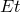）依赖于厚度。因此，只要乘积保持固定，可以使用任何厚度；除了四面体单元外，解决方案保持相同，其中厚度影响四面体质量度量，从而影响位移解。

在Abaqus/Explicit分析中，使用SMOOTH STEP幅值曲线将荷载施加到结构上，以最小化动态效应。

#### 悬臂梁的斜交敏感性分析

第二个例子检查单元对两种形状（平行四边形和梯形）的斜交敏感性。悬臂梁和加载与第一个例子相同。当单元为四边形或六面体时，对于两种形状使用1×8网格，如图2.3.5-2和图2.3.5-3所示。当使用三角形或四面体单元对问题进行建模时，用一个四边形或六面体单元填充的基本平行四边形或梯形形状在二维情况下填充两个三角形单元，在三维情况下填充五个四面体单元。因此，三角形和四面体单元没有真正的平行四边形或梯形形状。对于Abaqus/Standard和Abaqus/Explicit运行，测试了以下斜交角度：0°、15°、30°和45°。最终挠度再次归一化为欧拉-伯努利梁理论预测值2.74 mm（0.108 in），见表2.3.5-2和表2.3.5-3。单层单元的使用排除了减缩积分线性等参数单元的测试（除非使用增强沙漏控制），因为需要至少四层才能获得可接受的结果。

#### 外压下环的屈曲分析

最后一个例子是外压下平面内环的屈曲分析。几何形状和材料与["外压下平面内环的屈曲，"第1.2.2节](ch01s02ach15.md)相同，如图2.3.5-4所示。环屈曲问题需要在周向方向上使用相当细的网格，可能是为了准确模拟屈曲模式中的应变梯度。使用对称边界条件，仅对环的45°扇区进行建模，这足以再现主要屈曲模式。表2.3.5-5给出了这种情况各种模型获得的解。基于欧拉-伯努利梁理论的精确解是临界屈曲压力为51.71 KPa（7.5 lb/in²）。

### 结果与讨论

下面描述每个分析的结果。

#### 承受端部剪切荷载的悬臂梁

正如预期的那样，Abaqus/Standard中的二阶单元即使在使用粗1×4网格时也能给出优异的结果，减缩积分CPS8R和C3D20R单元给出最准确的结果。常规二阶和修正三角形和四面体单元在弯曲中也表现出优异的性能。Abaqus/Standard中的不相容模式单元（CPS4I和C3D8I）以及Abaqus/Standard和Abaqus/Explicit中的减缩积分单元（C3D8R、CPS4R和S4R）配合增强沙漏控制，其性能与二阶单元一样好，表明它们在用作矩形且与弯曲主轴对齐时具有优异的弯曲性能。一层1×4网格的结果已经非常好。增加层数不会改善结果。但是，当存在材料非线性时，需要更多层才能进行准确分析。假设应变壳单元S4考虑到网格的粗糙性以及S4不像CPS4I和C3D8I那样具有内部自由度，其性能相对较好。随着网格细化，解决方案会有所改善。

另一方面，线性等参数单元表现出极其刚硬的弯曲行为，对于实际应用来说太刚硬了。即使使用非常细的8×16网格，位移仍小于正确值的一半。在对精确积分平面应力单元的批判性分析中，Prathap（1985）指出"通过增加深度方向的单元数量来改善理想化并不能缓解寄生剪切锁定（即弯曲情况下的过度刚硬行为）"。此观察通过此例中CPS3、CPS4、C3D4和C3D8单元类型的结果得到证实。

减缩积分线性单元CPS4R、C3D8R、S4R和SC8R随着网格细化快速收敛。然而，向正确结果的收敛不再单调。这是单元刚度欠积分的结果：不能保证解的刚度上界，响应可能落在较软的一侧。使用减缩积分时，深度方向的单元数量起着关键作用。通过深度方向的2个单元无法提供工程精度。通过深度方向的4个单元和沿长度方向的4个单元可提供可接受的结果。如果理想化仅涉及深度方向的一个单元，则材料积分点都将位于中性轴上，弯曲行为将完全取决于（人为的）沙漏刚度。结合增强沙漏控制，CPS4R、C3D8R和S4R单元即使在使用粗1×4网格时也能提供优异的结果。结果与Abaqus/Standard中不相容模式单元获得的结果非常接近，因为两种分析都基于相同的假设应变公式。

#### 悬臂梁的斜交敏感性分析

图2.3.5-5和图2.3.5-6显示了将单元斜交为平行四边形和梯形的效果。我们看到二阶单元对这种畸变不表现出强烈的敏感性，而不相容模式单元和S4单元表现出更多的敏感性，特别是对梯形畸变，这很快导致它们过于刚硬而不实用。常规二阶和修正三角形/四面体单元在平行四边形斜交测试中比二阶四边形/六面体单元表现出更小的敏感性，但在梯形斜交测试中表现出比二阶单元更大的敏感性。Abaqus/Explicit结果和Abaqus/Standard中具有增强沙漏控制的线性减缩积分单元与Abaqus/Standard中不相容模式单元获得的结果非常接近。

表2.3.5-2和表2.3.5-3总结了将连续体单元、壳单元和连续体壳单元斜交为平行四边形和梯形的效果。对于壳和连续体壳模型，斜交是在单元平面内方向进行的。表2.3.5-4总结了将连续体壳单元SC8R在单元厚度方向上斜交的效果。结果表明，行为对厚度方向发生的网格畸变不敏感。

#### 外压下环的屈曲分析

不相容模式和二阶单元即使在使用粗网格时也能给出优异的结果。基于总刚度的沙漏控制的线性减缩积分单元给出可接受的结果，这些结果再次围绕正确值波动：粗网格时较高，细网格时较低。具有增强沙漏控制的线性减缩积分单元给出的结果与不相容模式单元获得的结果非常匹配。正如预期的那样，线性全积分单元再次给出极其刚硬的结果：介于实际屈曲压力的8到93倍之间。

### 其他建模考虑

这些分析说明了使用连续体单元模拟薄结构弯曲行为。同样，这些分析说明了使用壳单元S4进行单元平面内弯曲。一般来说，建议对薄结构使用梁单元或壳单元（带面外弯曲）；只有在分析人员由于某种原因无法使用更合适的弯曲单元时才会遇到这里讨论的困难。此处呈现的结果并不反映连续体单元在其他类型问题中的有用性或重要性。

我们已经看到，如果单元具有近似矩形的形状，不相容模式单元在许多情况下性能几乎与二阶单元一样好。如果单元具有平行四边形形状，性能会差得多，而对于梯形单元形状，性能很快变得不可接受。此外，当边缘退化或塌缩成节点时，这些单元没有优势。退化单元只能表示常应变场，不相容模式无法改进这种场。

由于内部自由度（CPS4I为4个；CPE4I、CAX4I和CPEG4I为5个；C3D8I为13个），不相容模式单元比常规位移单元稍贵，但比二阶单元更经济。额外的自由度不会显著增加波前大小，因为它们可以立即消除。此外，没有必要使用选择性减缩积分，这部分抵消了额外自由度的成本。

当使用至少四层时，减缩积分线性单元也能为此处尝试的问题集提供令人满意的解决方案。然而，在某些情况下，单元可能会产生近乎奇异的刚度，从而产生物理上不合理的解。在分析大应变问题时尤其如此。因此，与所有建模决策一样，分析人员必须通过仔细测试单元对特定应用的有效性来开发离散化。

### 更多示例

上文讨论的单元的使用在以下示例问题中进一步说明：
- ["悬臂梁的几何非线性分析，"第2.1.2节](ch02s01ach139.md)
- ["内压下的圆柱体，"第3.2.14节](ch03s02ach187.md)
- ["具有局部非弹性坍塌结构的非线性动力学分析，"Abaqus示例问题指南第2.1.1节](../exa/exa-link.md#exa-dyn-nonlindyncollapse)

### 输入文件

[linbending_typ_cant.inp](../eif/linbending_typ_cant.inp)

悬臂梁分析的典型输入数据。

[linbending_typ_paral.inp](../eif/linbending_typ_paral.inp)

平行四边形单元斜交敏感性分析的典型输入数据。

[linbending_typ_trap.inp](../eif/linbending_typ_trap.inp)

梯形单元斜交敏感性分析的典型输入数据。

[linbending_typ_ring.inp](../eif/linbending_typ_ring.inp)

环屈曲问题的典型输入数据。

##### **Abaqus/Standard输入文件：**

##### **悬臂梁分析**

#### C3D4单元：

[linbending_c3d4_cant_1x4.inp](../eif/linbending_c3d4_cant_1x4.inp)

1×4网格。

[linbending_c3d4_cant_2x4.inp](../eif/linbending_c3d4_cant_2x4.inp)

2×4网格。

[linbending_c3d4_cant_4x4.inp](../eif/linbending_c3d4_cant_4x4.inp)

4×4网格。

[linbending_c3d4_cant_8x16.inp](../eif/linbending_c3d4_cant_8x16.inp)

8×16网格。

#### C3D8单元：

[linbending_c3d8_cant_1x4.inp](../eif/linbending_c3d8_cant_1x4.inp)

1×4网格。

[linbending_c3d8_cant_2x4.inp](../eif/linbending_c3d8_cant_2x4.inp)

2×4网格。

[linbending_c3d8_cant_4x4.inp](../eif/linbending_c3d8_cant_4x4.inp)

4×4网格。

[linbending_c3d8_cant_8x16.inp](../eif/linbending_c3d8_cant_8x16.inp)

8×16网格。

#### C3D8I单元：

[linbending_c3d8i_cant_1x4.inp](../eif/linbending_c3d8i_cant_1x4.inp)

1×4网格。

[linbending_c3d8i_cant_2x4.inp](../eif/linbending_c3d8i_cant_2x4.inp)

2×4网格。

[linbending_c3d8i_cant_4x4.inp](../eif/linbending_c3d8i_cant_4x4.inp)

4×4网格。

[linbending_c3d8i_cant_8x16.inp](../eif/linbending_c3d8i_cant_8x16.inp)

8×16网格。

#### C3D8R单元：

[linbending_c3d8r_cant_2x4.inp](../eif/linbending_c3d8r_cant_2x4.inp)

2×4网格。

[linbending_c3d8r_cant_4x4.inp](../eif/linbending_c3d8r_cant_4x4.inp)

4×4网格。

[linbending_c3d8r_cant_8x16.inp](../eif/linbending_c3d8r_cant_8x16.inp)

8×16网格。

[linbending_c3d8r_cant_1x4_eh.inp](../eif/linbending_c3d8r_cant_1x4_eh.inp)

1×4网格。

[linbending_c3d8r_cant_2x4_eh.inp](../eif/linbending_c3d8r_cant_2x4_eh.inp)

2×4网格。

[linbending_c3d8r_cant_4x4_eh.inp](../eif/linbending_c3d8r_cant_4x4_eh.inp)

4×4网格。

[linbending_c3d8r_cant_8x16_eh.inp](../eif/linbending_c3d8r_cant_8x16_eh.inp)

8×16网格。

#### C3D10单元：

[linbending_c3d10_cant_1x4.inp](../eif/linbending_c3d10_cant_1x4.inp)

1×4网格。

[linbending_c3d10_cant_2x4.inp](../eif/linbending_c3d10_cant_2x4.inp)

2×4网格。

[linbending_c3d10_cant_4x4.inp](../eif/linbending_c3d10_cant_4x4.inp)

4×4网格。

[linbending_c3d10_cant_8x16.inp](../eif/linbending_c3d10_cant_8x16.inp)

8×16网格。

#### C3D10I单元：

[linbending_c3d10i_cant_1x4.inp](../eif/linbending_c3d10i_cant_1x4.inp)

1×4网格。

[linbending_c3d10i_cant_2x4.inp](../eif/linbending_c3d10i_cant_2x4.inp)

2×4网格。

[linbending_c3d10i_cant_4x4.inp](../eif/linbending_c3d10i_cant_4x4.inp)

4×4网格。

[linbending_c3d10i_cant_8x16.inp](../eif/linbending_c3d10i_cant_8x16.inp)

8×16网格。

#### C3D10M单元：

[linbending_c3d10_mcant_1x4.inp](../eif/linbending_c3d10_mcant_1x4.inp)

1×4网格。

[linbending_c3d10_mcant_2x4.inp](../eif/linbending_c3d10_mcant_2x4.inp)

2×4网格。

[linbending_c3d10_mcant_4x4.inp](../eif/linbending_c3d10_mcant_4x4.inp)

4×4网格。

[linbending_c3d10_mcant_8x16.inp](../eif/linbending_c3d10_mcant_8x16.inp)

8×16网格。

#### C3D20单元：

[linbending_c3d20_cant_1x4.inp](../eif/linbending_c3d20_cant_1x4.inp)

1×4网格。

[linbending_c3d20_cant_2x4.inp](../eif/linbending_c3d20_cant_2x4.inp)

2×4网格。

[linbending_c3d20_cant_4x4.inp](../eif/linbending_c3d20_cant_4x4.inp)

4×4网格。

[linbending_c3d20_cant_8x16.inp](../eif/linbending_c3d20_cant_8x16.inp)

8×16网格。

#### C3D20R单元：

[linbending_c3d20r_cant_1x4.inp](../eif/linbending_c3d20r_cant_1x4.inp)

1×4网格。

[linbending_c3d20r_cant_2x4.inp](../eif/linbending_c3d20r_cant_2x4.inp)

2×4网格。

[linbending_c3d20r_cant_4x4.inp](../eif/linbending_c3d20r_cant_4x4.inp)

4×4网格。

[linbending_c3d20r_cant_8x16.inp](../eif/linbending_c3d20r_cant_8x16.inp)

8×16网格。

#### CPS3单元：

[linbending_cps3_cant_1x4.inp](../eif/linbending_cps3_cant_1x4.inp)

1×4网格。

[linbending_cps3_cant_2x2.inp](../eif/linbending_cps3_cant_2x2.inp)

2×2网格。

[linbending_cps3_cant_4x4.inp](../eif/linbending_cps3_cant_4x4.inp)

4×4网格。

[linbending_cps3_cant_8x16.inp](../eif/linbending_cps3_cant_8x16.inp)

8×16网格。

#### CPS4单元：

[linbending_cps4_cant_1x4.inp](../eif/linbending_cps4_cant_1x4.inp)

1×4网格。

[linbending_cps4_cant_2x4.inp](../eif/linbending_cps4_cant_2x4.inp)

2×4网格。

[linbending_cps4_cant_4x4.inp](../eif/linbending_cps4_cant_4x4.inp)

4×4网格。

[linbending_cps4_cant_8x16.inp](../eif/linbending_cps4_cant_8x16.inp)

8×16网格。

#### CPS4I单元：

[linbending_cps4i_cant_1x4.inp](../eif/linbending_cps4i_cant_1x4.inp)

1×4网格。

[linbending_cps4i_cant_2x4.inp](../eif/linbending_cps4i_cant_2x4.inp)

2×4网格。

[linbending_cps4i_cant_4x4.inp](../eif/linbending_cps4i_cant_4x4.inp)

4×4网格。

[linbending_cps4i_cant_8x16.inp](../eif/linbending_cps4i_cant_8x16.inp)

8×16网格。

#### CPS4R单元：

[linbending_cps4r_cant_2x4.inp](../eif/linbending_cps4r_cant_2x4.inp)

2×4网格。

[linbending_cps4r_cant_4x4.inp](../eif/linbending_cps4r_cant_4x4.inp)

4×4网格。

[linbending_cps4r_cant_8x16.inp](../eif/linbending_cps4r_cant_8x16.inp)

8×16网格。

[linbending_cps4r_cant_1x4_eh.inp](../eif/linbending_cps4r_cant_1x4_eh.inp)

1×4网格。

[linbending_cps4r_cant_2x4_eh.inp](../eif/linbending_cps4r_cant_2x4_eh.inp)

2×4网格。

[linbending_cps4r_cant_4x4_eh.inp](../eif/linbending_cps4r_cant_4x4_eh.inp)

4×4网格。

[linbending_cps4r_cant_8x16_eh.inp](../eif/linbending_cps4r_cant_8x16_eh.inp)

8×16网格。

#### CPS6单元：

[linbending_cps6_cant_1x4.inp](../eif/linbending_cps6_cant_1x4.inp)

1×4网格。

[linbending_cps6_cant_2x4.inp](../eif/linbending_cps6_cant_2x4.inp)

2×4网格。

[linbending_cps6_cant_4x4.inp](../eif/linbending_cps6_cant_4x4.inp)

4×4网格。

[linbending_cps6_cant_8x16.inp](../eif/linbending_cps6_cant_8x16.inp)

8×16网格。

#### CPS6M单元：

[linbending_cps6m_cant_1x4.inp](../eif/linbending_cps6m_cant_1x4.inp)

1×4网格。

[linbending_cps6m_cant_2x4.inp](../eif/linbending_cps6m_cant_2x4.inp)

2×4网格。

[linbending_cps6m_cant_4x4.inp](../eif/linbending_cps6m_cant_4x4.inp)

4×4网格。

[linbending_cps6m_cant_8x16.inp](../eif/linbending_cps6m_cant_8x16.inp)

8×16网格。

#### CPS8单元：

[linbending_cps8_cant_1x4.inp](../eif/linbending_cps8_cant_1x4.inp)

1×4网格。

[linbending_cps8_cant_2x4.inp](../eif/linbending_cps8_cant_2x4.inp)

2×4网格。

[linbending_cps8_cant_4x4.inp](../eif/linbending_cps8_cant_4x4.inp)

4×4网格。

[linbending_cps8_cant_8x16.inp](../eif/linbending_cps8_cant_8x16.inp)

8×16网格。

#### CPS8R单元：

[linbending_cps8r_cant_1x4.inp](../eif/linbending_cps8r_cant_1x4.inp)

1×4网格。

[linbending_cps8r_cant_2x4.inp](../eif/linbending_cps8r_cant_2x4.inp)

2×4网格。

[linbending_cps8r_cant_4x4.inp](../eif/linbending_cps8r_cant_4x4.inp)

4×4网格。

[linbending_cps8r_cant_8x16.inp](../eif/linbending_cps8r_cant_8x16.inp)

8×16网格。

#### S4单元：

[linbending_s4_cant_1x4.inp](../eif/linbending_s4_cant_1x4.inp)

1×4网格。

[linbending_s4_cant_2x4.inp](../eif/linbending_s4_cant_2x4.inp)

2×4网格。

[linbending_s4_cant_4x4.inp](../eif/linbending_s4_cant_4x4.inp)

4×4网格。

[linbending_s4_cant_8x16.inp](../eif/linbending_s4_cant_8x16.inp)

8×16网格。

#### S4R单元：

[linbending_s4r_cant_1x4_eh.inp](../eif/linbending_s4r_cant_1x4_eh.inp)

1×4网格。

[linbending_s4r_cant_2x4_eh.inp](../eif/linbending_s4r_cant_2x4_eh.inp)

2×4网格。

[linbending_s4r_cant_4x4_eh.inp](../eif/linbending_s4r_cant_4x4_eh.inp)

4×4网格。

[linbending_s4r_cant_8x16_eh.inp](../eif/linbending_s4r_cant_8x16_eh.inp)

8×16网格。

##### **平行四边形和梯形单元的斜交敏感性分析**

#### C3D4单元：

[linbending_c3d4_1x8_ang0.inp](../eif/linbending_c3d4_1x8_ang0.inp)

1×8网格；斜交角度0°。

[linbending_c3d4_paral_ang15.inp](../eif/linbending_c3d4_paral_ang15.inp)

平行四边形形状；斜交角度15°。

[linbending_c3d4_paral_ang30.inp](../eif/linbending_c3d4_paral_ang30.inp)

平行四边形形状；斜交角度30°。

[linbending_c3d4_paral_ang45.inp](../eif/linbending_c3d4_paral_ang45.inp)

平行四边形形状；斜交角度45°。

[linbending_c3d4_trap_ang15.inp](../eif/linbending_c3d4_trap_ang15.inp)

梯形形状；斜交角度15°。

[linbending_c3d4_trap_ang30.inp](../eif/linbending_c3d4_trap_ang30.inp)

梯形形状；斜交角度30°。

[linbending_c3d4_trap_ang45.inp](../eif/linbending_c3d4_trap_ang45.inp)

梯形形状；斜交角度45°。

#### C3D8单元：

[linbending_c3d8_1x8_ang0.inp](../eif/linbending_c3d8_1x8_ang0.inp)

1×8网格；斜交角度0°。

[linbending_c3d8_paral_ang15.inp](../eif/linbending_c3d8_paral_ang15.inp)

平行四边形形状；斜交角度15°。

[linbending_c3d8_paral_ang30.inp](../eif/linbending_c3d8_paral_ang30.inp)

平行四边形形状；斜交角度30°。

[linbending_c3d8_paral_ang45.inp](../eif/linbending_c3d8_paral_ang45.inp)

平行四边形形状；斜交角度45°。

[linbending_c3d8_trap_ang15.inp](../eif/linbending_c3d8_trap_ang15.inp)

梯形形状；斜交角度15°。

[linbending_c3d8_trap_ang30.inp](../eif/linbending_c3d8_trap_ang30.inp)

梯形形状；斜交角度30°。

[linbending_c3d8_trap_ang45.inp](../eif/linbending_c3d8_trap_ang45.inp)

梯形形状；斜交角度45°。

#### C3D8I单元：

[linbending_c3d8i_1x8_ang0.inp](../eif/linbending_c3d8i_1x8_ang0.inp)

1×8网格；斜交角度0°。

[linbending_c3d8i_paral_ang15.inp](../eif/linbending_c3d8i_paral_ang15.inp)

平行四边形形状；斜交角度15°。

[linbending_c3d8i_paral_ang30.inp](../eif/linbending_c3d8i_paral_ang30.inp)

平行四边形形状；斜交角度30°。

[linbending_c3d8i_paral_ang45.inp](../eif/linbending_c3d8i_paral_ang45.inp)

平行四边形形状；斜交角度45°。

[linbending_c3d8i_trap_ang15.inp](../eif/linbending_c3d8i_trap_ang15.inp)

梯形形状；斜交角度15°。

[linbending_c3d8i_trap_ang30.inp](../eif/linbending_c3d8i_trap_ang30.inp)

梯形形状；斜交角度30°。

[linbending_c3d8i_trap_ang45.inp](../eif/linbending_c3d8i_trap_ang45.inp)

梯形形状；斜交角度45°。

#### C3D8R单元：

[linbending_c3d8r_1x8_ang0_eh.inp](../eif/linbending_c3d8r_1x8_ang0_eh.inp)

1×8网格；斜交角度0°。

[linbending_c3d8r_paral_ang15_eh.inp](../eif/linbending_c3d8r_paral_ang15_eh.inp)

平行四边形形状；斜交角度15°。

[linbending_c3d8r_paral_ang30_eh.inp](../eif/linbending_c3d8r_paral_ang30_eh.inp)

平行四边形形状；斜交角度30°。

[linbending_c3d8r_paral_ang45_eh.inp](../eif/linbending_c3d8r_paral_ang45_eh.inp)

平行四边形形状；斜交角度45°。

[linbending_c3d8r_trap_ang15_eh.inp](../eif/linbending_c3d8r_trap_ang15_eh.inp)

梯形形状；斜交角度15°。

[linbending_c3d8r_trap_ang30_eh.inp](../eif/linbending_c3d8r_trap_ang30_eh.inp)

梯形形状；斜交角度30°。

[linbending_c3d8r_trap_ang45_eh.inp](../eif/linbending_c3d8r_trap_ang45_eh.inp)

梯形形状；斜交角度45°。

#### C3D10单元：

[linbending_c3d10_1x8_ang0.inp](../eif/linbending_c3d10_1x8_ang0.inp)

1×8网格；斜交角度0°。

[linbending_c3d10_paral_ang15.inp](../eif/linbending_c3d10_paral_ang15.inp)

平行四边形形状；斜交角度15°。

[linbending_c3d10_paral_ang30.inp](../eif/linbending_c3d10_paral_ang30.inp)

平行四边形形状；斜交角度30°。

[linbending_c3d10_paral_ang45.inp](../eif/linbending_c3d10_paral_ang45.inp)

平行四边形形状；斜交角度45°。

[linbending_c3d10_trap_ang15.inp](../eif/linbending_c3d10_trap_ang15.inp)

梯形形状；斜交角度15°。

[linbending_c3d10_trap_ang30.inp](../eif/linbending_c3d10_trap_ang30.inp)

梯形形状；斜交角度30°。

[linbending_c3d10_trap_ang45.inp](../eif/linbending_c3d10_trap_ang45.inp)

梯形形状；斜交角度45°。

#### C3D10I单元：

[linbending_c3d10i_1x8_ang0.inp](../eif/linbending_c3d10i_1x8_ang0.inp)

1×8网格；斜交角度0°。

[linbending_c3d10i_paral_ang15.inp](../eif/linbending_c3d10i_paral_ang15.inp)

平行四边形形状；斜交角度15°。

[linbending_c3d10i_paral_ang30.inp](../eif/linbending_c3d10i_paral_ang30.inp)

平行四边形形状；斜交角度30°。

[linbending_c3d10i_paral_ang45.inp](../eif/linbending_c3d10i_paral_ang45.inp)

平行四边形形状；斜交角度45°。

[linbending_c3d10i_trap_ang15.inp](../eif/linbending_c3d10i_trap_ang15.inp)

梯形形状；斜交角度15°。

[linbending_c3d10i_trap_ang30.inp](../eif/linbending_c3d10i_trap_ang30.inp)

梯形形状；斜交角度30°。

[linbending_c3d10i_trap_ang45.inp](../eif/linbending_c3d10i_trap_ang45.inp)

梯形形状；斜交角度45°。

#### C3D10M单元：

[linbending_c3d10m_1x8_ang0.inp](../eif/linbending_c3d10m_1x8_ang0.inp)

1×8网格；斜交角度0°。

[linbending_c3d10m_paral_ang15.inp](../eif/linbending_c3d10m_paral_ang15.inp)

平行四边形形状；斜交角度15°。

[linbending_c3d10m_paral_ang30.inp](../eif/linbending_c3d10m_paral_ang30.inp)

平行四边形形状；斜交角度30°。

[linbending_c3d10m_paral_ang45.inp](../eif/linbending_c3d10m_paral_ang45.inp)

平行四边形形状；斜交角度45°。

[linbending_c3d10m_trap_ang15.inp](../eif/linbending_c3d10m_trap_ang15.inp)

梯形形状；斜交角度15°。

[linbending_c3d10m_trap_ang30.inp](../eif/linbending_c3d10m_trap_ang30.inp)

梯形形状；斜交角度30°。

[linbending_c3d10m_trap_ang45.inp](../eif/linbending_c3d10m_trap_ang45.inp)

梯形形状；斜交角度45°。

#### C3D20单元：

[linbending_c3d20_1x8_ang0.inp](../eif/linbending_c3d20_1x8_ang0.inp)

1×8网格；斜交角度0°。

[linbending_c3d20_paral_ang15.inp](../eif/linbending_c3d20_paral_ang15.inp)

平行四边形形状；斜交角度15°。

[linbending_c3d20_paral_ang30.inp](../eif/linbending_c3d20_paral_ang30.inp)

平行四边形形状；斜交角度30°。

[linbending_c3d20_paral_ang45.inp](../eif/linbending_c3d20_paral_ang45.inp)

平行四边形形状；斜交角度45°。

[linbending_c3d20_trap_ang15.inp](../eif/linbending_c3d20_trap_ang15.inp)

梯形形状；斜交角度15°。

[linbending_c3d20_trap_ang30.inp](../eif/linbending_c3d20_trap_ang30.inp)

梯形形状；斜交角度30°。

[linbending_c3d20_trap_ang45.inp](../eif/linbending_c3d20_trap_ang45.inp)

梯形形状；斜交角度45°。

#### C3D20R单元：

[linbending_c3d20r_1x8_ang0.inp](../eif/linbending_c3d20r_1x8_ang0.inp)

1×8网格；斜交角度0°。

[linbending_c3d20r_paral_ang15.inp](../eif/linbending_c3d20r_paral_ang15.inp)

平行四边形形状；斜交角度15°。

[linbending_c3d20r_paral_ang30.inp](../eif/linbending_c3d20r_paral_ang30.inp)

平行四边形形状；斜交角度30°。

[linbending_c3d20r_paral_ang45.inp](../eif/linbending_c3d20r_paral_ang45.inp)

平行四边形形状；斜交角度45°。

[linbending_c3d20r_trap_ang15.inp](../eif/linbending_c3d20r_trap_ang15.inp)

梯形形状；斜交角度15°。

[linbending_c3d20r_trap_ang30.inp](../eif/linbending_c3d20r_trap_ang30.inp)

梯形形状；斜交角度30°。

[linbending_c3d20r_trap_ang45.inp](../eif/linbending_c3d20r_trap_ang45.inp)

梯形形状；斜交角度45°。

#### CPS3单元：

[linbending_cps3_1x8_ang0.inp](../eif/linbending_cps3_1x8_ang0.inp)

1×8网格；斜交角度0°。

[linbending_cps3_paral_ang15.inp](../eif/linbending_cps3_paral_ang15.inp)

平行四边形形状；斜交角度15°。

[linbending_cps3_paral_ang30.inp](../eif/linbending_cps3_paral_ang30.inp)

平行四边形形状；斜交角度30°。

[linbending_cps3_paral_ang45.inp](../eif/linbending_cps3_paral_ang45.inp)

平行四边形形状；斜交角度45°。

[linbending_cps3_trap_ang15.inp](../eif/linbending_cps3_trap_ang15.inp)

梯形形状；斜交角度15°。

[linbending_cps3_trap_ang30.inp](../eif/linbending_cps3_trap_ang30.inp)

梯形形状；斜交角度30°。

[linbending_cps3_trap_ang45.inp](../eif/linbending_cps3_trap_ang45.inp)

梯形形状；斜交角度45°。

#### CPS4单元：

[linbending_cps4_1x8_ang0.inp](../eif/linbending_cps4_1x8_ang0.inp)

1×8网格；斜交角度0°。

[linbending_cps4_paral_ang15.inp](../eif/linbending_cps4_paral_ang15.inp)

平行四边形形状；斜交角度15°。

[linbending_cps4_paral_ang30.inp](../eif/linbending_cps4_paral_ang30.inp)

平行四边形形状；斜交角度30°。

[linbending_cps4_paral_ang45.inp](../eif/linbending_cps4_paral_ang45.inp)

平行四边形形状；斜交角度45°。

[linbending_cps4_trap_ang15.inp](../eif/linbending_cps4_trap_ang15.inp)

梯形形状；斜交角度15°。

[linbending_cps4_trap_ang30.inp](../eif/linbending_cps4_trap_ang30.inp)

梯形形状；斜交角度30°。

[linbending_cps4_trap_ang45.inp](../eif/linbending_cps4_trap_ang45.inp)

梯形形状；斜交角度45°。

#### CPS4I单元：

[linbending_cps4i_mesh18_ang0.inp](../eif/linbending_cps4i_mesh18_ang0.inp)

1×8网格；斜交角度0°。

[linbending_cps4i_paral_ang15.inp](../eif/linbending_cps4i_paral_ang15.inp)

平行四边形形状；斜交角度15°。

[linbending_cps4i_paral_ang30.inp](../eif/linbending_cps4i_paral_ang30.inp)

平行四边形形状；斜交角度30°。

[linbending_cps4i_paral_ang45.inp](../eif/linbending_cps4i_paral_ang45.inp)

平行四边形形状；斜交角度45°。

[linbending_cps4i_trap_ang15.inp](../eif/linbending_cps4i_trap_ang15.inp)

梯形形状；斜交角度15°。

[linbending_cps4i_trap_ang30.inp](../eif/linbending_cps4i_trap_ang30.inp)

梯形形状；斜交角度30°。

[linbending_cps4i_trap_ang45.inp](../eif/linbending_cps4i_trap_ang45.inp)

梯形形状；斜交角度45°。

#### CPS4R单元：

[linbending_cps4r_1x8_ang0_eh.inp](../eif/linbending_cps4r_1x8_ang0_eh.inp)

1×8网格；斜交角度0°。

[linbending_cps4r_paral_ang15_eh.inp](../eif/linbending_cps4r_paral_ang15_eh.inp)

平行四边形形状；斜交角度15°。

[linbending_cps4r_paral_ang30_eh.inp](../eif/linbending_cps4r_paral_ang30_eh.inp)

平行四边形形状；斜交角度30°。

[linbending_cps4r_paral_ang45_eh.inp](../eif/linbending_cps4r_paral_ang45_eh.inp)

平行四边形形状；斜交角度45°。

[linbending_cps4r_trap_ang15_eh.inp](../eif/linbending_cps4r_trap_ang15_eh.inp)

梯形形状；斜交角度15°。

[linbending_cps4r_trap_ang30_eh.inp](../eif/linbending_cps4r_trap_ang30_eh.inp)

梯形形状；斜交角度30°。

[linbending_cps4r_trap_ang45_eh.inp](../eif/linbending_cps4r_trap_ang45_eh.inp)

梯形形状；斜交角度45°。

#### CPS6单元：

[linbending_cps6_1x8_ang0.inp](../eif/linbending_cps6_1x8_ang0.inp)

1×8网格；斜交角度0°。

[linbending_cps6_paral_ang15.inp](../eif/linbending_cps6_paral_ang15.inp)

平行四边形形状；斜交角度15°。

[linbending_cps6_paral_ang30.inp](../eif/linbending_cps6_paral_ang30.inp)

平行四边形形状；斜交角度30°。

[linbending_cps6_paral_ang45.inp](../eif/linbending_cps6_paral_ang45.inp)

平行四边形形状；斜交角度45°。

[linbending_cps6_trap_ang15.inp](../eif/linbending_cps6_trap_ang15.inp)

梯形形状；斜交角度15°。

[linbending_cps6_trap_ang30.inp](../eif/linbending_cps6_trap_ang30.inp)

梯形形状；斜交角度30°。

[linbending_cps6_trap_ang45.inp](../eif/linbending_cps6_trap_ang45.inp)

梯形形状；斜交角度45°。

#### CPS6M单元：

[linbending_cps6m_1x8_ang0.inp](../eif/linbending_cps6m_1x8_ang0.inp)

1×8网格；斜交角度0°。

[linbending_cps6m_paral_ang15.inp](../eif/linbending_cps6m_paral_ang15.inp)

平行四边形形状；斜交角度15°。

[linbending_cps6m_paral_ang30.inp](../eif/linbending_cps6m_paral_ang30.inp)

平行四边形形状；斜交角度30°。

[linbending_cps6m_paral_ang45.inp](../eif/linbending_cps6m_paral_ang45.inp)

平行四边形形状；斜交角度45°。

[linbending_cps6m_trap_ang15.inp](../eif/linbending_cps6m_trap_ang15.inp)

梯形形状；斜交角度15°。

[linbending_cps6m_trap_ang30.inp](../eif/linbending_cps6m_trap_ang30.inp)

梯形形状；斜交角度30°。

[linbending_cps6m_trap_ang45.inp](../eif/linbending_cps6m_trap_ang45.inp)

梯形形状；斜交角度45°。

#### CPS8单元：

[linbending_cps8_1x8_ang0.inp](../eif/linbending_cps8_1x8_ang0.inp)

1×8网格；斜交角度0°。

[linbending_cps8_paral_ang15.inp](../eif/linbending_cps8_paral_ang15.inp)

平行四边形形状；斜交角度15°。

[linbending_cps8_paral_ang30.inp](../eif/linbending_cps8_paral_ang30.inp)

平行四边形形状；斜交角度30°。

[linbending_cps8_paral_ang45.inp](../eif/linbending_cps8_paral_ang45.inp)

平行四边形形状；斜交角度45°。

[linbending_cps8_trap_ang15.inp](../eif/linbending_cps8_trap_ang15.inp)

梯形形状；斜交角度15°。

[linbending_cps8_trap_ang30.inp](../eif/linbending_cps8_trap_ang30.inp)

梯形形状；斜交角度30°。

[linbending_cps8_trap_ang45.inp](../eif/linbending_cps8_trap_ang45.inp)

梯形形状；斜交角度45°。

#### CPS8R单元：

[linbending_cps8r_1x8_ang0.inp](../eif/linbending_cps8r_1x8_ang0.inp)

1×8网格；斜交角度0°。

[linbending_cps8r_paral_ang15.inp](../eif/linbending_cps8r_paral_ang15.inp)

平行四边形形状；斜交角度15°。

[linbending_cps8r_paral_ang30.inp](../eif/linbending_cps8r_paral_ang30.inp)

平行四边形形状；斜交角度30°。

[linbending_cps8r_paral_ang45.inp](../eif/linbending_cps8r_paral_ang45.inp)

平行四边形形状；斜交角度45°。

[linbending_cps8r_trap_ang15.inp](../eif/linbending_cps8r_trap_ang15.inp)

梯形形状；斜交角度15°。

[linbending_cps8r_trap_ang30.inp](../eif/linbending_cps8r_trap_ang30.inp)

梯形形状；斜交角度30°。

[linbending_cps8r_trap_ang45.inp](../eif/linbending_cps8r_trap_ang45.inp)

梯形形状；斜交角度45°。

#### S4单元：

[linbending_s4_1x8_ang0.inp](../eif/linbending_s4_1x8_ang0.inp)

1×8网格；斜交角度0°。

[linbending_s4_paral_ang15.inp](../eif/linbending_s4_paral_ang15.inp)

平行四边形形状；斜交角度15°。

[linbending_s4_paral_ang30.inp](../eif/linbending_s4_paral_ang30.inp)

平行四边形形状；斜交角度30°。

[linbending_s4_paral_ang45.inp](../eif/linbending_s4_paral_ang45.inp)

平行四边形形状；斜交角度45°。

[linbending_s4_trap_ang15.inp](../eif/linbending_s4_trap_ang15.inp)

梯形形状；斜交角度15°。

[linbending_s4_trap_ang30.inp](../eif/linbending_s4_trap_ang30.inp)

梯形形状；斜交角度30°。

[linbending_s4_trap_ang45.inp](../eif/linbending_s4_trap_ang45.inp)

梯形形状；斜交角度45°。

#### S4R单元：

[linbending_s4r_1x8_ang0_eh.inp](../eif/linbending_s4r_1x8_ang0_eh.inp)

1×8网格；斜交角度0°。

[linbending_s4r_paral_ang15_eh.inp](../eif/linbending_s4r_paral_ang15_eh.inp)

平行四边形形状；斜交角度15°。

[linbending_s4r_paral_ang30_eh.inp](../eif/linbending_s4r_paral_ang30_eh.inp)

平行四边形形状；斜交角度30°。

[linbending_s4r_paral_ang45_eh.inp](../eif/linbending_s4r_paral_ang45_eh.inp)

平行四边形形状；斜交角度45°。

[linbending_s4r_trap_ang15_eh.inp](../eif/linbending_s4r_trap_ang15_eh.inp)

梯形形状；斜交角度15°。

[linbending_s4r_trap_ang30_eh.inp](../eif/linbending_s4r_trap_ang30_eh.inp)

梯形形状；斜交角度30°。

[linbending_s4r_trap_ang45_eh.inp](../eif/linbending_s4r_trap_ang45_eh.inp)

梯形形状；斜交角度45°。

#### SC8R单元：

[linbending_sc8r_1x8_ang0_eh.inp](../eif/linbending_sc8r_1x8_ang0_eh.inp)

1×8网格；斜交角度0°。

[linbending_sc8r_paral_ang15_eh.inp](../eif/linbending_sc8r_paral_ang15_eh.inp)

平行四边形形状；斜交角度15°。

[linbending_sc8r_paral_ang30_eh.inp](../eif/linbending_sc8r_paral_ang30_eh.inp)

平行四边形形状；斜交角度30°。

[linbending_sc8r_paral_ang45_eh.inp](../eif/linbending_sc8r_paral_ang45_eh.inp)

平行四边形形状；斜交角度45°。

[linbending_sc8r_trap_ang15_eh.inp](../eif/linbending_sc8r_trap_ang15_eh.inp)

梯形形状；斜交角度15°。

[linbending_sc8r_trap_ang30_eh.inp](../eif/linbending_sc8r_trap_ang30_eh.inp)

梯形形状；斜交角度30°。

[linbending_sc8r_trap_ang45_eh.inp](../eif/linbending_sc8r_trap_ang45_eh.inp)

梯形形状；斜交角度45°。

[linbending_sc8r_1x8_ang0_thk.inp](../eif/linbending_sc8r_1x8_ang0_thk.inp)

1×8网格；单元厚度方向斜交角度0°。

[linbending_sc8r_paral_ang15_thk.inp](../eif/linbending_sc8r_paral_ang15_thk.inp)

平行四边形形状；单元厚度方向斜交角度15°。

[linbending_sc8r_paral_ang30_thk.inp](../eif/linbending_sc8r_paral_ang30_thk.inp)

平行四边形形状；单元厚度方向斜交角度30°。

[linbending_sc8r_paral_ang45_thk.inp](../eif/linbending_sc8r_paral_ang45_thk.inp)

平行四边形形状；单元厚度方向斜交角度45°。

[linbending_sc8r_trap_ang15_thk.inp](../eif/linbending_sc8r_trap_ang15_thk.inp)

梯形形状；单元厚度方向斜交角度15°。

[linbending_sc8r_trap_ang30_thk.inp](../eif/linbending_sc8r_trap_ang30_thk.inp)

梯形形状；单元厚度方向斜交角度30°。

[linbending_sc8r_trap_ang45_thk.inp](../eif/linbending_sc8r_trap_ang45_thk.inp)

梯形形状；单元厚度方向斜交角度45°。

##### **环屈曲问题**

#### C3D4单元：

[linbending_ring_c3d4_4x10.inp](../eif/linbending_ring_c3d4_4x10.inp)

4×10网格。

[linbending_ring_c3d4_4x20.inp](../eif/linbending_ring_c3d4_4x20.inp)

4×20网格。

#### C3D8单元：

[linbending_ring_c3d8_4x10.inp](../eif/linbending_ring_c3d8_4x10.inp)

4×10网格。

[linbending_ring_c3d8_4x20.inp](../eif/linbending_ring_c3d8_4x20.inp)

4×20网格。

#### C3D8I单元：

[linbending_ring_c3d8i_4x10.inp](../eif/linbending_ring_c3d8i_4x10.inp)

4×10网格。

[linbending_ring_c3d8i_4x20.inp](../eif/linbending_ring_c3d8i_4x20.inp)

4×20网格。

#### C3D8R单元：

[linbending_ring_c3d8r_4x10.inp](../eif/linbending_ring_c3d8r_4x10.inp)

4×10网格。

[linbending_ring_c3d8r_4x20.inp](../eif/linbending_ring_c3d8r_4x20.inp)

4×20网格。

[linbending_ring_c3d8r_4x10_eh.inp](../eif/linbending_ring_c3d8r_4x10_eh.inp)

4×10网格。

[linbending_ring_c3d8r_4x20_eh.inp](../eif/linbending_ring_c3d8r_4x20_eh.inp)

4×20网格。

#### C3D10单元：

[linbending_ring_c3d10_4x10.inp](../eif/linbending_ring_c3d10_4x10.inp)

4×10网格。

[linbending_ring_c3d10_4x20.inp](../eif/linbending_ring_c3d10_4x20.inp)

4×20网格。

#### C3D10I单元：

[linbending_ring_c3d10i_4x10.inp](../eif/linbending_ring_c3d10i_4x10.inp)

4×10网格。

[linbending_ring_c3d10i_4x20.inp](../eif/linbending_ring_c3d10i_4x20.inp)

4×20网格。

#### C3D10M单元：

[linbending_ring_c3d10m_4x10.inp](../eif/linbending_ring_c3d10m_4x10.inp)

4×10网格。

[linbending_ring_c3d10m_4x20.inp](../eif/linbending_ring_c3d10m_4x20.inp)

4×20网格。

#### C3D20单元：

[linbending_ring_c3d20_4x10.inp](../eif/linbending_ring_c3d20_4x10.inp)

4×10网格。

[linbending_ring_c3d20_4x20.inp](../eif/linbending_ring_c3d20_4x20.inp)

4×20网格。

#### C3D20R单元：

[linbending_ring_c3d20r_4x10.inp](../eif/linbending_ring_c3d20r_4x10.inp)

4×10网格。

[linbending_ring_c3d20r_4x20.inp](../eif/linbending_ring_c3d20r_4x20.inp)

4×20网格。

#### CPS3单元：

[linbending_ring_cps3_eq4x10.inp](../eif/linbending_ring_cps3_eq4x10.inp)

4×10网格。

[linbending_ring_cps3_eq4x20.inp](../eif/linbending_ring_cps3_eq4x20.inp)

4×20网格。

#### CPS4单元：

[linbending_ring_cps4_4x10.inp](../eif/linbending_ring_cps4_4x10.inp)

4×10网格。

[linbending_ring_cps4_4x20.inp](../eif/linbending_ring_cps4_4x20.inp)

4×20网格。

#### CPS4I单元：

[linbending_ring_cps4i_4x10.inp](../eif/linbending_ring_cps4i_4x10.inp)

4×10网格。

[linbending_ring_cps4i_4x20.inp](../eif/linbending_ring_cps4i_4x20.inp)

4×20网格。

#### CPS4R单元：

[linbending_ring_cps4r_4x10.inp](../eif/linbending_ring_cps4r_4x10.inp)

4×10网格。

[linbending_ring_cps4r_4x20.inp](../eif/linbending_ring_cps4r_4x20.inp)

4×20网格。

[linbending_ring_cps4r_4x10_eh.inp](../eif/linbending_ring_cps4r_4x10_eh.inp)

4×10网格。

[linbending_ring_cps4r_4x20_eh.inp](../eif/linbending_ring_cps4r_4x20_eh.inp)

4×20网格。

#### CPS6单元：

[linbending_ring_cps6_eq4x10.inp](../eif/linbending_ring_cps6_eq4x10.inp)

4×10网格。

[linbending_ring_cps6_eq4x20.inp](../eif/linbending_ring_cps6_eq4x20.inp)

4×20网格。

#### CPS6M单元：

[linbending_ring_cps6m_eq4x10.inp](../eif/linbending_ring_cps6m_eq4x10.inp)

4×10网格。

[linbending_ring_cps6m_eq4x20.inp](../eif/linbending_ring_cps6m_eq4x20.inp)

4×20网格。

#### CPS8单元：

[linbending_ring_cps8_4x10.inp](../eif/linbending_ring_cps8_4x10.inp)

4×10网格。

[linbending_ring_cps8_4x20.inp](../eif/linbending_ring_cps8_4x20.inp)

4×20网格。

#### CPS8R单元：

[linbending_ring_cps8r_4x10.inp](../eif/linbending_ring_cps8r_4x10.inp)

4×10网格。

[linbending_ring_cps8r_4x20.inp](../eif/linbending_ring_cps8r_4x20.inp)

4×20网格。

##### **Abaqus/Explicit输入文件：**

##### **悬臂梁分析**

#### C3D8单元：

[expl_linbending_c3d8_cant1x4.inp](../eif/expl_linbending_c3d8_cant1x4.inp)

1×4网格。

[expl_linbending_c3d8_cant2x4.inp](../eif/expl_linbending_c3d8_cant2x4.inp)

2×4网格。

[expl_linbending_c3d8_cant4x4.inp](../eif/expl_linbending_c3d8_cant4x4.inp)

4×4网格。

[expl_linbending_c3d8_cant8x16.inp](../eif/expl_linbending_c3d8_cant8x16.inp)

8×16网格。

#### C3D8I单元：

[expl_linbending_c3d8i_cant1x4.inp](../eif/expl_linbending_c3d8i_cant1x4.inp)

1×4网格。

[expl_linbending_c3d8i_cant2x4.inp](../eif/expl_linbending_c3d8i_cant2x4.inp)

2×4网格。

[expl_linbending_c3d8i_cant4x4.inp](../eif/expl_linbending_c3d8i_cant4x4.inp)

4×4网格。

[expl_linbending_c3d8i_cant8x16.inp](../eif/expl_linbending_c3d8i_cant8x16.inp)

8×16网格。

#### C3D8R单元：

[expl_linbending_c3d8r_cant1x4enh.inp](../eif/expl_linbending_c3d8r_cant1x4enh.inp)

1×4网格。

[expl_linbending_c3d8r_cant2x4enh.inp](../eif/expl_linbending_c3d8r_cant2x4enh.inp)

2×4网格。

[expl_linbending_c3d8r_cant4x4enh.inp](../eif/expl_linbending_c3d8r_cant4x4enh.inp)

4×4网格。

[expl_linbending_c3d8r_cant8x16enh.inp](../eif/expl_linbending_c3d8r_cant8x16enh.inp)

8×16网格。

#### CPS4R单元：

[expl_linbending_cps4r_cant1x4enh.inp](../eif/expl_linbending_cps4r_cant1x4enh.inp)

1×4网格。

[expl_linbending_cps4r_cant2x4enh.inp](../eif/expl_linbending_cps4r_cant2x4enh.inp)

2×4网格。

[expl_linbending_cps4r_cant4x4enh.inp](../eif/expl_linbending_cps4r_cant4x4enh.inp)

4×4网格。

[expl_linbending_cps4r_cant8x16enh.inp](../eif/expl_linbending_cps4r_cant8x16enh.inp)

8×16网格。

#### S4单元：

[expl_linbending_s4_cant1x4.inp](../eif/expl_linbending_s4_cant1x4.inp)

1×4网格。

[expl_linbending_s4_cant2x4.inp](../eif/expl_linbending_s4_cant2x4.inp)

2×4网格。

[expl_linbending_s4_cant4x4.inp](../eif/expl_linbending_s4_cant4x4.inp)

4×4网格。

[expl_linbending_s4_cant8x16.inp](../eif/expl_linbending_s4_cant8x16.inp)

8×16网格。

#### S4R单元：

[expl_linbending_s4r_cant1x4enh.inp](../eif/expl_linbending_s4r_cant1x4enh.inp)

1×4网格。

[expl_linbending_s4r_cant2x4enh.inp](../eif/expl_linbending_s4r_cant2x4enh.inp)

2×4网格。

[expl_linbending_s4r_cant4x4enh.inp](../eif/expl_linbending_s4r_cant4x4enh.inp)

4×4网格。

[expl_linbending_s4r_cant8x16enh.inp](../eif/expl_linbending_s4r_cant8x16enh.inp)

8×16网格。

##### **平行四边形和梯形单元的斜交敏感性分析**

#### C3D8单元：

[expl_linbending_c3d8_cant1x8_ang0.inp](../eif/expl_linbending_c3d8_cant1x8_ang0.inp)

1×8网格；斜交角度0°。

[expl_linbending_c3d8_cant1x8_ang15.inp](../eif/expl_linbending_c3d8_cant1x8_ang15.inp)

平行四边形形状；斜交角度15°。

[expl_linbending_c3d8_cant1x8_ang30.inp](../eif/expl_linbending_c3d8_cant1x8_ang30.inp)

平行四边形形状；斜交角度30°。

[expl_linbending_c3d8_cant1x8_ang45.inp](../eif/expl_linbending_c3d8_cant1x8_ang45.inp)

平行四边形形状；斜交角度45°。

[expl_linbending_c3d8_trap_ang15.inp](../eif/expl_linbending_c3d8_trap_ang15.inp)

梯形形状；斜交角度15°。

[expl_linbending_c3d8_trap_ang30.inp](../eif/expl_linbending_c3d8_trap_ang30.inp)

梯形形状；斜交角度30°。

[expl_linbending_c3d8_trap_ang45.inp](../eif/expl_linbending_c3d8_trap_ang45.inp)

梯形形状；斜交角度45°。

#### C3D8I单元：

[expl_linbending_c3d8i_cant1x8_ang0.inp](../eif/expl_linbending_c3d8i_cant1x8_ang0.inp)

1×8网格；斜交角度0°。

[expl_linbending_c3d8i_cant1x8_ang15.inp](../eif/expl_linbending_c3d8i_cant1x8_ang15.inp)

平行四边形形状；斜交角度15°。

[expl_linbending_c3d8i_cant1x8_ang30.inp](../eif/expl_linbending_c3d8i_cant1x8_ang30.inp)

平行四边形形状；斜交角度30°。

[expl_linbending_c3d8i_cant1x8_ang45.inp](../eif/expl_linbending_c3d8i_cant1x8_ang45.inp)

平行四边形形状；斜交角度45°。

[expl_linbending_c3d8i_trap_ang15.inp](../eif/expl_linbending_c3d8i_trap_ang15.inp)

梯形形状；斜交角度15°。

[expl_linbending_c3d8i_trap_ang30.inp](../eif/expl_linbending_c3d8i_trap_ang30.inp)

梯形形状；斜交角度30°。

[expl_linbending_c3d8i_trap_ang45.inp](../eif/expl_linbending_c3d8i_trap_ang45.inp)

梯形形状；斜交角度45°。

#### C3D8R单元：

[expl_linbending_c3d8r_cant1x8_ang0enh.inp](../eif/expl_linbending_c3d8r_cant1x8_ang0enh.inp)

1×8网格；斜交角度0°。

[expl_linbending_c3d8r_cant1x8_ang15enh.inp](../eif/expl_linbending_c3d8r_cant1x8_ang15enh.inp)

平行四边形形状；斜交角度15°。

[expl_linbending_c3d8r_cant1x8_ang30enh.inp](../eif/expl_linbending_c3d8r_cant1x8_ang30enh.inp)

平行四边形形状；斜交角度30°。

[expl_linbending_c3d8r_cant1x8_ang45enh.inp](../eif/expl_linbending_c3d8r_cant1x8_ang45enh.inp)

平行四边形形状；斜交角度45°。

[expl_linbending_c3d8r_trap_ang15enh.inp](../eif/expl_linbending_c3d8r_trap_ang15enh.inp)

梯形形状；斜交角度15°。

[expl_linbending_c3d8r_trap_ang30enh.inp](../eif/expl_linbending_c3d8r_trap_ang30enh.inp)

梯形形状；斜交角度30°。

[expl_linbending_c3d8r_trap_ang45enh.inp](../eif/expl_linbending_c3d8r_trap_ang45enh.inp)

梯形形状；斜交角度45°。

#### CPS4R单元：

[expl_linbending_cps4r_cant1x8_ang0enh.inp](../eif/expl_linbending_cps4r_cant1x8_ang0enh.inp)

1×8网格；斜交角度0°。

[expl_linbending_cps4r_cant1x8_ang15enh.inp](../eif/expl_linbending_cps4r_cant1x8_ang15enh.inp)

平行四边形形状；斜交角度15°。

[expl_linbending_cps4r_cant1x8_ang30enh.inp](../eif/expl_linbending_cps4r_cant1x8_ang30enh.inp)

平行四边形形状；斜交角度30°。

[expl_linbending_cps4r_cant1x8_ang45enh.inp](../eif/expl_linbending_cps4r_cant1x8_ang45enh.inp)

平行四边形形状；斜交角度45°。

[expl_linbending_cps4r_trap_ang15enh.inp](../eif/expl_linbending_cps4r_trap_ang15enh.inp)

梯形形状；斜交角度15°。

[expl_linbending_cps4r_trap_ang30enh.inp](../eif/expl_linbending_cps4r_trap_ang30enh.inp)

梯形形状；斜交角度30°。

[expl_linbending_cps4r_trap_ang45enh.inp](../eif/expl_linbending_cps4r_trap_ang45enh.inp)

梯形形状；斜交角度45°。

#### S4单元：

[expl_linbending_s4_1x8_ang0.inp](../eif/expl_linbending_s4_1x8_ang0.inp)

1×8网格；斜交角度0°。

[expl_linbending_s4_1x8_ang15.inp](../eif/expl_linbending_s4_1x8_ang15.inp)

平行四边形形状；斜交角度15°。

[expl_linbending_s4_1x8_ang30.inp](../eif/expl_linbending_s4_1x8_ang30.inp)

平行四边形形状；斜交角度30°。

[expl_linbending_s4_1x8_ang45.inp](../eif/expl_linbending_s4_1x8_ang45.inp)

平行四边形形状；斜交角度45°。

[expl_linbending_s4_trap_ang15.inp](../eif/expl_linbending_s4_trap_ang15.inp)

梯形形状；斜交角度15°。

[expl_linbending_s4_trap_ang30.inp](../eif/expl_linbending_s4_trap_ang30.inp)

梯形形状；斜交角度30°。

[expl_linbending_s4_trap_ang45.inp](../eif/expl_linbending_s4_trap_ang45.inp)

梯形形状；斜交角度45°。

#### S4R单元：

[expl_linbending_s4r_1x8_ang0enh.inp](../eif/expl_linbending_s4r_1x8_ang0enh.inp)

1×8网格；斜交角度0°。

[expl_linbending_s4r_1x8_ang15enh.inp](../eif/expl_linbending_s4r_1x8_ang15enh.inp)

平行四边形形状；斜交角度15°。

[expl_linbending_s4r_1x8_ang30enh.inp](../eif/expl_linbending_s4r_1x8_ang30enh.inp)

平行四边形形状；斜交角度30°。

[expl_linbending_s4r_1x8_ang45enh.inp](../eif/expl_linbending_s4r_1x8_ang45enh.inp)

平行四边形形状；斜交角度45°。

[expl_linbending_s4r_trap_ang15enh.inp](../eif/expl_linbending_s4r_trap_ang15enh.inp)

梯形形状；斜交角度15°。

[expl_linbending_s4r_trap_ang30enh.inp](../eif/expl_linbending_s4r_trap_ang30enh.inp)

梯形形状；斜交角度30°。

[expl_linbending_s4r_trap_ang45enh.inp](../eif/expl_linbending_s4r_trap_ang45enh.inp)

梯形形状；斜交角度45°。

### 参考文献

Belytschko, T., W. K. Liu, and J. M. Kennedy, "Hourglass Control in Linear and Nonlinear Problems," Computer Methods in Applied Mechanics and Engineering, vol. 43, pp. 251–276, 1984.

Flanagan, D. P., and T. Belytschko, "A Uniform Strain Hexahedron and Quadrilateral with Hourglass Control," International Journal For Numerical Methods in Engineering, vol. 17, pp. 679–706, 1981.

Prathap, G., "The Poor Bending Response of the Four-Node Plane Stress Quadrilateral," International Journal for Numerical Methods in Engineering, vol. 21, pp. 825–835, 1985.

### 表格

**表2.3.5-1** 悬臂梁的归一化端部挠度（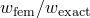）。伯努利-欧拉理论预测：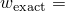 2.743 mm（0.108 in）。
| 单元类型 | 网格尺寸（深度×长度） |
| --- | --- |
| | 1×4 | 2×4 | 4×4 | 8×16 |
| CPS3 | 0.012 | 0.012 | 0.012 | 0.159 |
| CPS4I | 0.985 | 0.985 | 0.985 | 1.000 |
| S4 | 0.899 | 0.943 | 0.937 | 0.966 |
| S4¹ | 0.873 | 0.887 | 0.834 | 0.923 |
| S4R² | 0.985 | 0.985 | 0.985 | 1.000 |
| S4R³ | 0.985 | 0.985 | 0.985 | 1.000 |
| CPS4 | 0.034 | 0.034 | 0.034 | 0.363 |
| CPS4R | * | 1.151 | 0.944 | 1.008 |
| CPS4R² | 0.985 | 0.985 | 0.985 | 1.000 |
| CPS4R³ | 0.985 | 0.985 | 0.985 | 1.000 |
| C3D4 | 0.001 | 0.001 | 0.002 | 0.065 |
| C3D8I | 0.985 | 0.985 | 0.985 | 1.000 |
| C3D8I¹ | 0.984 | 0.985 | 0.985 | 1.000 |
| C3D8 | 0.035 | 0.034 | 0.034 | 0.364 |
| C3D8¹ | 0.034 | 0.034 | 0.034 | 0.364 |
| C3D8R | * | 1.306 | 1.050 | 1.016 |
| C3D8R² | 0.984 | 0.985 | 0.985 | 1.000 |
| C3D8R³ | 0.985 | 0.985 | 0.985 | 1.000 |
| CPS6 | 0.986 | 0.986 | 0.986 | 1.000 |
| CPS6M | 0.940 | 0.946 | 0.947 | 0.999 |
| CPS8 | 0.987 | 0.987 | 0.987 | 1.000 |
| CPS8R | 1.001 | 1.001 | 1.001 | 1.001 |
| C3D10 | 0.985 | 0.985 | 0.985 | 1.000 |
| C3D10I | 0.985 | 0.985 | 0.985 | 1.000 |
| C3D10M | 1.021 | 0.985 | 0.969 | 1.000 |
| C3D20 | 0.987 | 0.987 | 0.988 | 1.000 |
| C3D20R | 1.001 | 1.001 | 1.001 | 1.001 |
| * 产生奇异刚度矩阵 |
| ¹ Abaqus/Explicit |
| ² 带增强沙漏控制的Abaqus/Explicit |
| ³ 带增强沙漏控制的Abaqus/Standard |

**表2.3.5-2** 具有平行四边形单元的悬臂梁的归一化端部挠度（）。伯努利-欧拉理论预测： 2.743 mm（0.108 in）。
| 单元类型 | 斜交角度 |
| --- | --- |
| | 0° | 15° | 30° | 45° |
| CPS3 | 0.042 | 0.032 | 0.022 | 0.017 |
| CPS4I | 0.996 | 0.898 | 0.791 | 0.742 |
| S4 | 0.903 | 0.833 | 0.470 | 0.226 |
| S4¹ | 0.901 | 0.826 | 0.471 | 0.239 |
| S4R² | 0.996 | 0.898 | 0.791 | 0.742 |
| S4R³ | 0.996 | 0.898 | 0.791 | 0.742 |
| CPS4 | 0.125 | 0.110 | 0.079 | 0.049 |
| CPS4R² | 0.996 | 0.898 | 0.791 | 0.742 |
| CPS4R³ | 0.996 | 0.898 | 0.791 | 0.742 |
| C3D4 | 0.001 | 0.001 | 0.002 | 0.002 |
| C3D8I | 0.997 | 0.898 | 0.791 | 0.742 |
| C3D8I¹ | 0.996 | 0.896 | 0.791 | 0.743 |
| C3D8 | 0.132 | 0.121 | 0.093 | 0.061 |
| C3D8¹ | 0.132 | 0.121 | 0.093 | 0.061 |
| C3D8R² | 0.996 | 0.897 | 0.790 | 0.742 |
| C3D8R³ | 0.996 | 0.897 | 0.791 | 0.742 |
| CPS6 | 0.997 | 0.982 | 0.931 | 0.821 |
| CPS6M | 0.991 | 0.985 | 0.965 | 0.926 |
| CPS8 | 0.998 | 0.998 | 0.996 | 0.988 |
| CPS8R | 1.001 | 1.001 | 1.000 | 0.997 |
| C3D10 | 0.997 | 0.897 | 0.711 | 0.484 |
| C3D10I | 0.999 | 0.880 | 0.674 | 0.455 |
| C3D10M | 1.040 | 1.004 | 0.920 | 0.814 |
| C3D20 | 0.998 | 0.998 | 0.983 | 0.961 |
| C3D20R | 1.001 | 0.988 | 0.980 | 0.896 |
| SC8R³ | 0.996 | 0.898 | 0.791 | 0.742 |
| ¹ Abaqus/Explicit |
| ² 带增强沙漏控制的Abaqus/Explicit |
| ³ 带增强沙漏控制的Abaqus/Standard |

**表2.3.5-3** 具有梯形单元的悬臂梁的归一化端部挠度（）。伯努利-欧拉理论预测： 2.743 mm（0.108 in）。
| 单元类型 | 斜交角度 |
| --- | --- |
| | 0° | 15° | 30° | 45° |
| CPS3 | 0.042 | 0.041 | 0.034 | 0.025 |
| CPS4I | 0.997 | 0.411 | 0.140 | 0.067 |
| S4 | 0.903 | 0.469 | 0.169 | 0.102 |
| S4¹ | 0.901 | 0.479 | 0.216 | 0.142 |
| S4R² | 0.996 | 0.411 | 0.140 | 0.067 |
| S4R³ | 0.996 | 0.411 | 0.140 | 0.067 |
| CPS4 | 0.125 | 0.102 | 0.060 | 0.035 |
| CPS4R² | 0.997 | 0.411 | 0.140 | 0.067 |
| CPS4R³ | 0.996 | 0.411 | 0.140 | 0.067 |
| C3D4 | 0.001 | 0.002 | 0.006 | 0.010 |
| C3D8I | 0.997 | 0.411 | 0.140 | 0.067 |
| C3D8I¹ | 0.996 | 0.410 | 0.140 | 0.067 |
| C3D8 | 0.132 | 0.108 | 0.063 | 0.037 |
| C3D8¹ | 0.132 | 0.108 | 0.063 | 0.037 |
| C3D8R² | 0.996 | 0.410 | 0.140 | 0.067 |
| C3D8R³ | 0.996 | 0.411 | 0.140 | 0.067 |
| CPS6 | 0.997 | 0.997 | 0.994 | 0.986 |
| CPS6M | 0.991 | 0.990 | 0.990 | 0.990 |
| CPS8 | 0.998 | 0.959 | 0.985 | 0.915 |
| CPS8R | 1.001 | 0.971 | 0.996 | 0.981 |
| C3D10 | 0.997 | 0.995 | 0.986 | 0.963 |
| C3D10I | 0.999 | 0.995 | 0.986 | 0.963 |
| C3D10M | 1.040 | 1.038 | 1.035 | 1.024 |
| C3D20 | 0.998 | 0.959 | 0.985 | 0.914 |
| C3D20R | 1.001 | 0.956 | 0.984 | 0.974 |
| SC8R³ | 0.996 | 0.411 | 0.140 | 0.067 |
| ¹ Abaqus/Explicit |
| ² 带增强沙漏控制的Abaqus/Explicit |
| ³ 带增强沙漏控制的Abaqus/Standard |

**表2.3.5-4** 使用连续体壳单元在单元厚度方向斜交时悬臂梁的归一化端部挠度（）。伯努利-欧拉理论预测： 2.743 mm（0.108 in）。
| 网格 | 斜交角度 |
| --- | --- |
| | 0° | 15° | 30° | 45° |
| 平行四边形单元 | 1.00 | 1.00 | 1.00 | 1.00 |
| 梯形单元 | 1.00 | 1.00 | 1.00 | 1.00 |

**表2.3.5-5** 归一化特征值压力估计（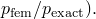）伯努利-欧拉理论预测：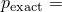 51.71 KPa（7.5 lb/in²）。
| 单元类型 | 网格尺寸（深度×长度） |
| --- | --- |
| | 4×10 | 4×20 |
| CPS3 | 93.83 | 24.27 |
| CPS4I | 1.005 | 1.001 |
| CPS4 | 32.00 | 8.72 |
| CPS4R | 1.059 | 0.968 |
| CPS4R¹ | 1.006 | 1.001 |
| C3D4 | 64.27 | 16.82 |
| C3D8I | 1.005 | 1.001 |
| C3D8 | 31.98 | 8.70 |
| C3D8R | 1.043 | 0.966 |
| C3D8R¹ | 1.006 | 1.001 |
| CPS6 | 1.010 | 1.001 |
| CPS6M | 1.002 | 1.000 |
| CPS8 | 1.027 | 1.002 |
| CPS8R | 1.000 | 1.000 |
| C3D10 | 1.013 | 1.001 |
| C3D10I | 1.076 | 1.001 |
| C3D10M | 1.014 | 0.998 |
| C3D20 | 1.027 | 1.002 |
| C3D20R | 1.000 | 1.000 |
| ¹ 带增强沙漏控制的Abaqus/Standard |

### 图表

**图2.3.5-1** 典型网格和荷载。

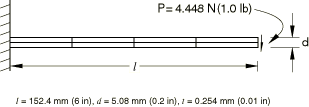

**图2.3.5-2** 典型平行四边形单元。

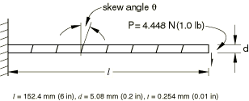

**图2.3.5-3** 典型梯形单元。

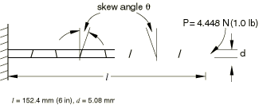

**图2.3.5-4** 环屈曲问题。

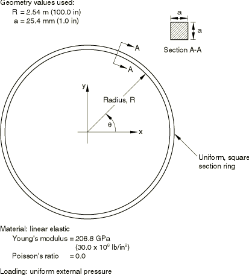

**图2.3.5-5** 平行四边形连续体单元：端部位移与斜交角度的关系。

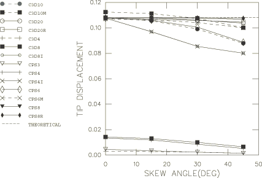

**图2.3.5-6** 梯形连续体单元：端部位移与斜交角度的关系。

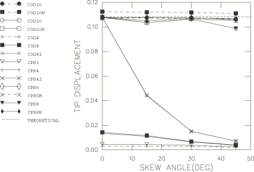

