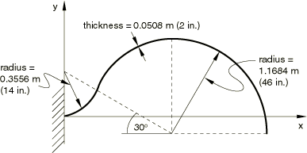
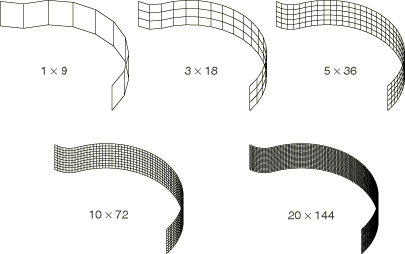

# 2.3.6 悬臂钩端部的平面内剪切荷载

**产品：** Abaqus/Standard   

Raasch挑战问题已被用作使用壳单元在弯曲条带中进行平面内剪切加载的测试（参见Knight，1997）。横切剪切柔度以及壳单元扭转变形的正确处理是决定弯曲行为的重要因素。

### 问题描述

几何形状由一个"钩子"组成，呈弯曲条带形状，一端刚性夹紧，另一端沿宽度承受单位平面内剪切。它有两个圆弧段，在切点处连接。较小的段从夹紧端到切点跨越60°，平均半径为0.3556 m（14英寸）。较大的段从切点到自由端跨越150°，平均半径为1.1684 m（46英寸）。钩子厚0.0508 m（2英寸），宽0.508 m（20英寸），建模为线弹性，弹性模量为22.77 MPa（3300 psi），泊松比为0.35。在大多数测试中，剪切力通过使用分布耦合约束来施加。耦合约束提供所施加荷载的参考节点与位于自由端的节点之间的耦合。自由端的分布节点荷载等于8.7563 N/m（0.05 lb/in）的均匀分布荷载。在其中两个测试中，施加了等效剪切力作为分布剪切牵引力。

该问题使用全积分S4壳单元建模，采用五种不同网格：1×9、3×18、5×36、10×72和20×144。为比较，还使用减缩积分的S4R壳单元和SC8R连续体壳单元对该问题进行了分析。参考解是通过使用减缩积分的C3D20R连续体单元的细化网格获得的。

### 结果与讨论

报告的解是沿加载端中心线的平面内位移。表2.3.6-1中显示了归一化到参考解的端部位移比较。减缩积分单元S4R和SC8R对于粗网格（1×9）表现出过大的位移，这是因为单元对粗网格的平面内弯曲变形处理不佳。S4单元的粗网格给出的解仅比参考解刚硬约3.5%。两种壳单元的细化网格给出可比较的解，比参考解柔韧0.2%。

连续体壳网格在厚度方向具有单个单元的解收敛到过大的位移。这可能是由于单元对钻孔刚度处理不佳。堆叠两个或更多单元即使对于粗网格（3×18×2）也能产生精确解。

使用分布剪切牵引力施加荷载的解与使用耦合约束的解完全一致。

### 输入文件

#### C3D20R单元：

[raasch_c3d20r_20x144x2.inp](../eif/raasch_c3d20r_20x144x2.inp)

20×144×2网格。

#### S4单元：

[raasch_s4_1x9.inp](../eif/raasch_s4_1x9.inp)

1×9网格。

[raasch_s4_1x9_edld.inp](../eif/raasch_s4_1x9_edld.inp)

1×9网格，用分布边缘牵引力加载。

[raasch_s4_3x18.inp](../eif/raasch_s4_3x18.inp)

3×18网格。

[raasch_s4_5x36.inp](../eif/raasch_s4_5x36.inp)

5×36网格。

[raasch_s4_10x72.inp](../eif/raasch_s4_10x72.inp)

10×72网格。

[raasch_s4_20x144.inp](../eif/raasch_s4_20x144.inp)

20×144网格。

#### S4R单元：

[raasch_s4r_1x9.inp](../eif/raasch_s4r_1x9.inp)

1×9网格。

[raasch_s4r_3x18.inp](../eif/raasch_s4r_3x18.inp)

3×18网格。

[raasch_s4r_5x36.inp](../eif/raasch_s4r_5x36.inp)

5×36网格。

[raasch_s4r_10x72.inp](../eif/raasch_s4r_10x72.inp)

10×72网格。

[raasch_s4r_20x144.inp](../eif/raasch_s4r_20x144.inp)

20×144网格。

#### SC8R单元：

[raasch_sc8r_1x9x1.inp](../eif/raasch_sc8r_1x9x1.inp)

1×9×1网格。

[raasch_sc8r_3x18x1.inp](../eif/raasch_sc8r_3x18x1.inp)

3×18×1网格。

[raasch_sc8r_5x36x1.inp](../eif/raasch_sc8r_5x36x1.inp)

5×36×1网格。

[raasch_sc8r_10x72x1.inp](../eif/raasch_sc8r_10x72x1.inp)

10×72×1网格。

[raasch_sc8r_20x144x1.inp](../eif/raasch_sc8r_20x144x1.inp)

20×144×1网格。

[raasch_sc8r_1x9x2.inp](../eif/raasch_sc8r_1x9x2.inp)

1×9×2网格。

[raasch_sc8r_3x18x2.inp](../eif/raasch_sc8r_3x18x2.inp)

3×18×2网格。

[raasch_sc8r_3x18x2_trvec.inp](../eif/raasch_sc8r_3x18x2_trvec.inp)

3×18×2网格，用分布广义牵引力加载。

[raasch_sc8r_5x36x2.inp](../eif/raasch_sc8r_5x36x2.inp)

5×36×2网格。

[raasch_sc8r_10x72x2.inp](../eif/raasch_sc8r_10x72x2.inp)

10×72×2网格。

[raasch_sc8r_20x144x2.inp](../eif/raasch_sc8r_20x144x2.inp)

20×144×2网格。

### 参考文献

Knight, N. F., Jr., "The Raasch Challenge for Shell Elements," AIAA Journal, vol. 35, no.2, pp. 375–381, 1997.

### 表格

**表2.3.6-1** 端部挠度的比较（归一化到连续体解）。荷载方向的位移。（连续体解为C3D20R单元20×144×2网格的5.020。）
| 网格 | S4 | S4R | SC8R |
| --- | --- | --- | --- |
| 单个单元 | 两个单元堆叠 |
| 1×9 | 0.967 | 2.951 | 2.622 | 1.693 |
| 3×18 | 0.972 | 0.979 | 1.534 | 1.019 |
| 5×36 | 0.987 | 0.989 | 1.522 | 1.007 |
| 10×72 | 0.998 | 0.999 | 1.530 | 1.011 |
| 20×144 | 1.003 | 1.003 | 1.535 | 1.015 |

### 图表

**图2.3.6-1** Raasch挑战问题。

**图2.3.6-2** 用于壳单元的网格。

