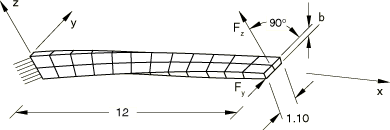
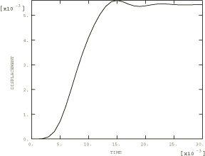
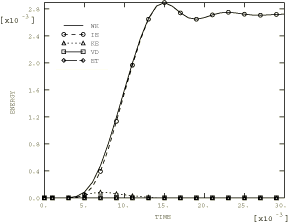

# 2.3.7 扭曲梁的分析

**产品：** Abaqus/Standard  Abaqus/Explicit   

本问题检验了壳和梁有限元解在弯曲扭曲结构时的准确性。获得了承受平面内或平面外剪切荷载的厚和薄扭曲悬臂梁的响应。测试由MacNeal和Harder（1985）提出，他们提供了厚扭曲梁的解析解。薄扭曲梁的参考解由Simo等人（1989）提供。

### 问题描述

结构为一悬臂梁，长12.0英寸，宽1.1英寸，从一端到另一端扭转90°，如图2.3.7-1所示。梁与x轴对齐。其厚度b在厚情况下为0.32英寸，在薄情况下为0.05英寸。

梁在Abaqus/Standard中使用4节点壳单元（S4、S4R和S4R5）、3节点壳单元（S3R和STRI3）、二次壳单元（STRI65、S8R、S8R5和S9R5）、连续体壳单元（SC8R）和梁单元（B31、B32和B33）建模。每种单元类型考虑三种网格密度。4节点壳单元的最粗网格（2×12，每单元长度扭曲角7.5°）如图2.3.7-1所示。3节点壳网格具有与等效4节点壳网格相同数量的单元。二次壳网格在每个方向上的单元数量是对应线性壳网格的一半（通常，具有相同数量的自由度）。梁单元的最粗网格使用12个线性单元。

梁在Abaqus/Explicit中使用S4R、S4RS或S4RSW单元的2×12网格建模。

材料为钢，弹性模量为29.0 Msi，泊松比为0.22。分别沿y和z方向在自由端中心施加1.0 lb的点荷载。

### 结果与讨论

结果列于表2.3.7-1到表2.3.7-12。将荷载方向的端部位移与解析解进行比较。

#### Abaqus/Standard结果

壳单元模型对于两种荷载情况和两种厚度都收敛到解析解。即使对于最粗的网格（对于4节点壳，每单元扭曲角为7.5°），结果也相当一致。

4节点四边形结果列于表2.3.7-1和表2.3.7-2，3节点三角形结果列于表2.3.7-5和表2.3.7-6，二次壳结果列于表2.3.7-7和表2.3.7-8。对于最粗的网格，一阶壳结果对于平面内荷载情况比平面外荷载情况稍好。平面外荷载情况在固定端引起平面内弯曲变形，该处产生最大弯矩（参见图2.3.7-1）。一阶三角形和减缩积分四边形单元需要网格细化以准确模拟这种平面内弯曲。一阶全积分壳S4和二阶减缩积分单元能正确捕捉平面内弯曲行为。

连续体壳结果列于表2.3.7-3和表2.3.7-4，针对两种荷载情况和两种厚度。比较了在厚度方向堆叠1、2、4和8个单元的情况。对于厚度方向堆叠单个单元的情况，结果显示出过大的位移。这可能是由于单元对钻孔刚度处理不佳。结果显示在厚度方向堆叠多个单元（甚至两个单元）时一致性良好。

梁单元模型准确再现了两种荷载情况和两种厚度的解析结果；参见表2.3.7-9和表2.3.7-10。由于最粗的网格已经足够细化以捕捉解析解，结果不会随网格细化而改善。

#### Abaqus/Explicit结果

图2.3.7-2显示了当梁厚度为0.32英寸时，平面内剪切荷载情况下端部位移和各种能量的时间历史。表格结果中指示的端部位移值是节点132在施加端荷载方向上的位移值。表2.3.7-11和表2.3.7-12比较了使用S4R、S4RS和S4RSW单元获得的结果。S4RS的响应与S4R非常相似。

### 输入文件

#### B31单元：

[twistedbeam_b31_12_thick.inp](../eif/twistedbeam_b31_12_thick.inp)

12单元，厚梁。

[twistedbeam_b31_12_thin.inp](../eif/twistedbeam_b31_12_thin.inp)

12单元，薄梁。

[twistedbeam_b31_24_thick.inp](../eif/twistedbeam_b31_24_thick.inp)

24单元，厚梁。

[twistedbeam_b31_24_thin.inp](../eif/twistedbeam_b31_24_thin.inp)

24单元，薄梁。

[twistedbeam_b31_48_thick.inp](../eif/twistedbeam_b31_48_thick.inp)

48单元，厚梁。

[twistedbeam_b31_48_thin.inp](../eif/twistedbeam_b31_48_thin.inp)

48单元，薄梁。

#### B32单元：

[twistedbeam_b32_6_thick.inp](../eif/twistedbeam_b32_6_thick.inp)

6单元，厚梁。

[twistedbeam_b32_6_thin.inp](../eif/twistedbeam_b32_6_thin.inp)

6单元，薄梁。

[twistedbeam_b32_12_thick.inp](../eif/twistedbeam_b32_12_thick.inp)

12单元，厚梁。

[twistedbeam_b32_12_thin.inp](../eif/twistedbeam_b32_12_thin.inp)

12单元，薄梁。

[twistedbeam_b32_24_thick.inp](../eif/twistedbeam_b32_24_thick.inp)

24单元，厚梁。

[twistedbeam_b32_24_thin.inp](../eif/twistedbeam_b32_24_thin.inp)

24单元，薄梁。

#### B33单元：

[twistedbeam_b33_12_thick.inp](../eif/twistedbeam_b33_12_thick.inp)

12单元，厚梁。

[twistedbeam_b33_12_thin.inp](../eif/twistedbeam_b33_12_thin.inp)

12单元，薄梁。

[twistedbeam_b33_24_thick.inp](../eif/twistedbeam_b33_24_thick.inp)

24单元，厚梁。

[twistedbeam_b33_24_thin.inp](../eif/twistedbeam_b33_24_thin.inp)

24单元，薄梁。

[twistedbeam_b33_48_thick.inp](../eif/twistedbeam_b33_48_thick.inp)

48单元，厚梁。

[twistedbeam_b33_48_thin.inp](../eif/twistedbeam_b33_48_thin.inp)

48单元，薄梁。

#### S3R单元：

[twistedbeam_s3r_2x12_thick.inp](../eif/twistedbeam_s3r_2x12_thick.inp)

2×12网格，厚梁。

[twistedbeam_s3r_2x12_thin.inp](../eif/twistedbeam_s3r_2x12_thin.inp)

2×12网格，薄梁。

[twistedbeam_s3r_4x24_thick.inp](../eif/twistedbeam_s3r_4x24_thick.inp)

4×24网格，厚梁。

[twistedbeam_s3r_4x24_thin.inp](../eif/twistedbeam_s3r_4x24_thin.inp)

4×24网格，薄梁。

[twistedbeam_s3r_8x48_thick.inp](../eif/twistedbeam_s3r_8x48_thick.inp)

8×48网格，厚梁。

[twistedbeam_s3r_8x48_thin.inp](../eif/twistedbeam_s3r_8x48_thin.inp)

8×48网格，薄梁。

#### S4单元：

[twistedbeam_s4_2x12_thick.inp](../eif/twistedbeam_s4_2x12_thick.inp)

2×12网格，厚梁。

[twistedbeam_s4_2x12_thin.inp](../eif/twistedbeam_s4_2x12_thin.inp)

2×12网格，薄梁。

[twistedbeam_s4_4x24_thick.inp](../eif/twistedbeam_s4_4x24_thick.inp)

4×24网格，厚梁。

[twistedbeam_s4_4x24_thin.inp](../eif/twistedbeam_s4_4x24_thin.inp)

4×24网格，薄梁。

[twistedbeam_s4_8x48_thick.inp](../eif/twistedbeam_s4_8x48_thick.inp)

8×48网格，厚梁。

[twistedbeam_s4_8x48_thin.inp](../eif/twistedbeam_s4_8x48_thin.inp)

8×48网格，薄梁。

#### S4R单元：

[twistedbeam_s4r_2x12_thick.inp](../eif/twistedbeam_s4r_2x12_thick.inp)

2×12网格，厚梁。

[twistedbeam_s4r_2x12_thin.inp](../eif/twistedbeam_s4r_2x12_thin.inp)

2×12网格，薄梁。

[twistedbeam_s4r_4x24_thick.inp](../eif/twistedbeam_s4r_4x24_thick.inp)

4×24网格，厚梁。

[twistedbeam_s4r_4x24_thin.inp](../eif/twistedbeam_s4r_4x24_thin.inp)

4×24网格，薄梁。

[twistedbeam_s4r_8x48_thick.inp](../eif/twistedbeam_s4r_8x48_thick.inp)

8×48网格，厚梁。

[twistedbeam_s4r_8x48_thin.inp](../eif/twistedbeam_s4r_8x48_thin.inp)

8×48网格，薄梁。

#### S4R5单元：

[twistedbeam_s4r5_2x12_thick.inp](../eif/twistedbeam_s4r5_2x12_thick.inp)

2×12网格，厚梁。

[twistedbeam_s4r5_2x12_thin.inp](../eif/twistedbeam_s4r5_2x12_thin.inp)

2×12网格，薄梁。

[twistedbeam_s4r5_4x24_thick.inp](../eif/twistedbeam_s4r5_4x24_thick.inp)

4×24网格，厚梁。

[twistedbeam_s4r5_4x24_thin.inp](../eif/twistedbeam_s4r5_4x24_thin.inp)

4×24网格，薄梁。

[twistedbeam_s4r5_8x48_thick.inp](../eif/twistedbeam_s4r5_8x48_thick.inp)

8×48网格，厚梁。

[twistedbeam_s4r5_8x48_thin.inp](../eif/twistedbeam_s4r5_8x48_thin.inp)

8×48网格，薄梁。

#### Abaqus/Explicit中的S4RSW单元2×12网格：

[twistedbeam_thick_fy.inp](../eif/twistedbeam_thick_fy.inp)

厚梁，y方向端部荷载。

[twistedbeam_thick_fz.inp](../eif/twistedbeam_thick_fz.inp)

厚梁，z方向端部荷载。

[twistedbeam_thin_fy.inp](../eif/twistedbeam_thin_fy.inp)

薄梁，y方向端部荷载。

[twistedbeam_thin_fz.inp](../eif/twistedbeam_thin_fz.inp)

薄梁，z方向端部荷载。

#### Abaqus/Explicit中的S4RS单元2×12网格：

[twistedbeam_s4rs_thick_fy.inp](../eif/twistedbeam_s4rs_thick_fy.inp)

厚梁，y方向端部荷载。

[twistedbeam_s4rs_thick_fz.inp](../eif/twistedbeam_s4rs_thick_fz.inp)

厚梁，z方向端部荷载。

[twistedbeam_s4rs_thin_fy.inp](../eif/twistedbeam_s4rs_thin_fy.inp)

薄梁，y方向端部荷载。

[twistedbeam_s4rs_thin_fz.inp](../eif/twistedbeam_s4rs_thin_fz.inp)

薄梁，z方向端部荷载。

#### Abaqus/Explicit中的S4R单元2×12网格：

[twistedbeam_s4r_thick_fy.inp](../eif/twistedbeam_s4r_thick_fy.inp)

厚梁，y方向端部荷载。

[twistedbeam_s4r_thick_fz.inp](../eif/twistedbeam_s4r_thick_fz.inp)

厚梁，z方向端部荷载。

[twistedbeam_s4r_thin_fy.inp](../eif/twistedbeam_s4r_thin_fy.inp)

薄梁，y方向端部荷载。

[twistedbeam_s4r_thin_fz.inp](../eif/twistedbeam_s4r_thin_fz.inp)

薄梁，z方向端部荷载。

#### S8R单元：

[twistedbeam_s8r_2x12_thick.inp](../eif/twistedbeam_s8r_2x12_thick.inp)

2×12网格，厚梁。

[twistedbeam_s8r_2x12_thin_s8r.inp](../eif/twistedbeam_s8r_2x12_thin_s8r.inp)

2×12网格，薄梁。

[twistedbeam_s8r_4x24_thick.inp](../eif/twistedbeam_s8r_4x24_thick.inp)

4×24网格，厚梁。

[twistedbeam_s8r_4x24_thin_s8r.inp](../eif/twistedbeam_s8r_4x24_thin_s8r.inp)

4×24网格，薄梁。

[twistedbeam_s8r_8x48_thick.inp](../eif/twistedbeam_s8r_8x48_thick.inp)

8×48网格，厚梁。

[twistedbeam_s8r_8x48_thin_s8r.inp](../eif/twistedbeam_s8r_8x48_thin_s8r.inp)

8×48网格，薄梁。

#### S8R5单元：

[twistedbeam_s8r5_2x12_thick.inp](../eif/twistedbeam_s8r5_2x12_thick.inp)

2×12网格，厚梁。

[twistedbeam_s8r5_2x12_thin.inp](../eif/twistedbeam_s8r5_2x12_thin.inp)

2×12网格，薄梁。

[twistedbeam_s8r5_4x24_thick.inp](../eif/twistedbeam_s8r5_4x24_thick.inp)

4×24网格，厚梁。

[twistedbeam_s8r5_4x24_thin.inp](../eif/twistedbeam_s8r5_4x24_thin.inp)

4×24网格，薄梁。

[twistedbeam_s8r5_8x48_thick.inp](../eif/twistedbeam_s8r5_8x48_thick.inp)

8×48网格，厚梁。

[twistedbeam_s8r5_8x48_thin.inp](../eif/twistedbeam_s8r5_8x48_thin.inp)

8×48网格，薄梁。

#### S9R5单元：

[twistedbeam_s9r5_2x12_thick.inp](../eif/twistedbeam_s9r5_2x12_thick.inp)

2×12网格，厚梁。

[twistedbeam_s9r5_2x12_thin.inp](../eif/twistedbeam_s9r5_2x12_thin.inp)

2×12网格，薄梁。

[twistedbeam_s9r5_4x24_thick.inp](../eif/twistedbeam_s9r5_4x24_thick.inp)

4×24网格，厚梁。

[twistedbeam_s9r5_4x24_thick.inp](../eif/twistedbeam_s9r5_4x24_thick.inp)

4×24网格，薄梁。

[twistedbeam_s9r5_8x48_thick.inp](../eif/twistedbeam_s9r5_8x48_thick.inp)

8×48网格，厚梁。

[twistedbeam_s9r5_8x48_thin.inp](../eif/twistedbeam_s9r5_8x48_thin.inp)

8×48网格，薄梁。

#### STRI3单元：

[twistedbeam_stri3_2x12_thick.inp](../eif/twistedbeam_stri3_2x12_thick.inp)

2×12网格，厚梁。

[twistedbeam_stri3_2x12_thin.inp](../eif/twistedbeam_stri3_2x12_thin.inp)

2×12网格，薄梁。

[twistedbeam_stri3_4x24_thick.inp](../eif/twistedbeam_stri3_4x24_thick.inp)

4×24网格，厚梁。

[twistedbeam_stri3_4x24_thin.inp](../eif/twistedbeam_stri3_4x24_thin.inp)

4×24网格，薄梁。

[twistedbeam_stri3_8x48_thick.inp](../eif/twistedbeam_stri3_8x48_thick.inp)

8×48网格，厚梁。

[twistedbeam_stri3_8x48_thin.inp](../eif/twistedbeam_stri3_8x48_thin.inp)

8×48网格，薄梁。

#### STRI65单元：

[twistedbeam_stri65_2x12_thick.inp](../eif/twistedbeam_stri65_2x12_thick.inp)

2×12网格，厚梁。

[twistedbeam_stri65_2x12_thin.inp](../eif/twistedbeam_stri65_2x12_thin.inp)

2×12网格，薄梁。

[twistedbeam_stri65_4x24_thick.inp](../eif/twistedbeam_stri65_4x24_thick.inp)

4×24网格，厚梁。

[twistedbeam_stri65_4x24_thin.inp](../eif/twistedbeam_stri65_4x24_thin.inp)

4×24网格，薄梁。

[twistedbeam_stri65_8x48_thick.inp](../eif/twistedbeam_stri65_8x48_thick.inp)

8×48网格，厚梁。

[twistedbeam_stri65_8x48_thin.inp](../eif/twistedbeam_stri65_8x48_thin.inp)

8×48网格，薄梁。

#### SC8R单元：

[twistedbeam_sc8r_2x12x1_thick.inp](../eif/twistedbeam_sc8r_2x12x1_thick.inp)

2×12×1网格，厚梁。

[twistedbeam_sc8r_2x12x2_thick.inp](../eif/twistedbeam_sc8r_2x12x2_thick.inp)

2×12×2网格，厚梁。

[twistedbeam_sc8r_2x12x4_thick.inp](../eif/twistedbeam_sc8r_2x12x4_thick.inp)

2×12×4网格，厚梁。

[twistedbeam_sc8r_2x12x8_thick.inp](../eif/twistedbeam_sc8r_2x12x8_thick.inp)

2×12×8网格，厚梁。

[twistedbeam_sc8r_4x24x1_thick.inp](../eif/twistedbeam_sc8r_4x24x1_thick.inp)

4×24×1网格，厚梁。

[twistedbeam_sc8r_4x24x2_thick.inp](../eif/twistedbeam_sc8r_4x24x2_thick.inp)

4×24×2网格，厚梁。

[twistedbeam_sc8r_4x24x4_thick.inp](../eif/twistedbeam_sc8r_4x24x4_thick.inp)

4×24×4网格，厚梁。

[twistedbeam_sc8r_4x24x8_thick.inp](../eif/twistedbeam_sc8r_4x24x8_thick.inp)

4×24×8网格，厚梁。

[twistedbeam_sc8r_8x48x1_thick.inp](../eif/twistedbeam_sc8r_8x48x1_thick.inp)

8×48×1网格，厚梁。

[twistedbeam_sc8r_8x48x2_thick.inp](../eif/twistedbeam_sc8r_8x48x2_thick.inp)

8×48×2网格，厚梁。

[twistedbeam_sc8r_8x48x4_thick.inp](../eif/twistedbeam_sc8r_8x48x4_thick.inp)

8×48×4网格，厚梁。

[twistedbeam_sc8r_8x48x8_thick.inp](../eif/twistedbeam_sc8r_8x48x8_thick.inp)

8×48×8网格，厚梁。

[twistedbeam_sc8r_2x12x1_thin.inp](../eif/twistedbeam_sc8r_2x12x1_thin.inp)

2×12×1网格，薄梁。

[twistedbeam_sc8r_2x12x2_thin.inp](../eif/twistedbeam_sc8r_2x12x2_thin.inp)

2×12×2网格，薄梁。

[twistedbeam_sc8r_2x12x4_thin.inp](../eif/twistedbeam_sc8r_2x12x4_thin.inp)

2×12×4网格，薄梁。

[twistedbeam_sc8r_2x12x8_thin.inp](../eif/twistedbeam_sc8r_2x12x8_thin.inp)

2×12×8网格，薄梁。

[twistedbeam_sc8r_4x24x1_thin.inp](../eif/twistedbeam_sc8r_4x24x1_thin.inp)

4×24×1网格，薄梁。

[twistedbeam_sc8r_4x24x2_thin.inp](../eif/twistedbeam_sc8r_4x24x2_thin.inp)

4×24×2网格，薄梁。

[twistedbeam_sc8r_4x24x4_thin.inp](../eif/twistedbeam_sc8r_4x24x4_thin.inp)

4×24×4网格，薄梁。

[twistedbeam_sc8r_4x24x8_thin.inp](../eif/twistedbeam_sc8r_4x24x8_thin.inp)

4×24×8网格，薄梁。

[twistedbeam_sc8r_8x48x1_thin.inp](../eif/twistedbeam_sc8r_8x48x1_thin.inp)

8×48×1网格，薄梁。

[twistedbeam_sc8r_8x48x2_thin.inp](../eif/twistedbeam_sc8r_8x48x2_thin.inp)

8×48×2网格，薄梁。

[twistedbeam_sc8r_8x48x4_thin.inp](../eif/twistedbeam_sc8r_8x48x4_thin.inp)

8×48×4网格，薄梁。

[twistedbeam_sc8r_8x48x8_thin.inp](../eif/twistedbeam_sc8r_8x48x8_thin.inp)

8×48×8网格，薄梁。

### 参考文献

MacNeal, R. H., and R. L. Harder, "A Proposed Standard Set of Problems to Test Finite Element Accuracy," Finite Elements in Analysis Design, vol. 11, pp. 3–20, 1985.

Simo, J. C., D. D. Fox, and M. S. Rifai, "On a Stress Resultant Geometrically Exact Shell Model. Part II: The Linear Theory; Computational Aspects," Computational Methods in Applied Mechanical Engineering, vol. 73, pp. 53–92, 1989.

### 表格

**表2.3.7-1** 4节点壳网格的端部位移，厚情况（b = 0.32英寸）。
| 荷载 | 平面内（ = 1.0 lb） | 平面外（ = 1.0 lb） |
| --- | --- | --- |
| 参考解 | 5.424×10⁻³ (in) | 1.754×10⁻³ (in) |
| 单元 | 网格 | 有限元解 | 误差 | 有限元解 | 误差 |
| S4 | 2×12 | 5.440×10⁻³ | 0.29% | 1.730×10⁻³ | 1.37% |
| | 4×24 | 5.428×10⁻³ | 0.07% | 1.747×10⁻³ | 0.40% |
| | 8×48 | 5.427×10⁻³ | 0.05% | 1.753×10⁻³ | 0.06% |
| S4R | 2×12 | 5.479×10⁻³ | 1.01% | 1.868×10⁻³ | 6.50% |
| | 4×24 | 5.437×10⁻³ | 0.24% | 1.777×10⁻³ | 1.31% |
| | 8×48 | 5.430×10⁻³ | 0.11% | 1.761×10⁻³ | 0.40% |
| S4R5 | 2×12 | 5.443×10⁻³ | 0.35% | 1.879×10⁻³ | 7.10% |
| | 4×24 | 5.418×10⁻³ | 0.10% | 1.768×10⁻³ | 0.78% |
| | 8×48 | 5.416×10⁻³ | 0.15% | 1.755×10⁻³ | 0.05% |

**表2.3.7-2** 4节点壳网格的端部位移，薄情况（b = 0.05英寸）。
| 荷载 | 平面内（ = 1.0 lb） | 平面外（ = 1.0 lb） |
| --- | --- | --- |
| 参考解 | 1.390 (in) | 0.3431 (in) |
| 单元 | 网格 | 有限元解 | 误差 | 有限元解 | 误差 |
| S4 | 2×12 | 1.391 | 0.07% | 0.3397 | 0.99% |
| | 4×24 | 1.388 | 0.14% | 0.3421 | 0.29% |
| | 8×48 | 1.388 | 0.14% | 0.3427 | 0.12% |
| S4R | 2×12 | 1.394 | 0.28% | 0.3403 | 0.81% |
| | 4×24 | 1.389 | 0.07% | 0.3422 | 0.26% |
| | 8×48 | 1.388 | 0.14% | 0.3428 | 0.09% |
| S4R5 | 2×12 | 1.389 | 0.07% | 0.3388 | 1.25% |
| | 4×24 | 1.387 | 0.22% | 0.3418 | 0.38% |
| | 8×48 | 1.387 | 0.22% | 0.3426 | 0.15% |

**表2.3.7-3** 连续体壳网格的端部位移，厚情况（b = 0.32英寸）。
| 荷载 | 平面内（ = 1.0 lb） | 平面外（ = 1.0 lb） |
| --- | --- | --- |
| 参考解 | 5.424×10⁻³ (in) | 1.754×10⁻³ (in) |
| 单元 | 网格 | 有限元解 | 误差 | 有限元解 | 误差 |
| SC8R | 2×12×1 | 7.819×10⁻³ | 44.2% | 2.428×10⁻³ | 38.4% |
| | 2×12×2 | 5.254×10⁻³ | -3.13% | 1.887×10⁻³ | 7.59% |
| | 2×12×4 | 5.352×10⁻³ | -1.33% | 1.874×10⁻³ | 6.82% |
| | 2×12×8 | 5.410×10⁻³ | -0.27% | 1.873×10⁻³ | 6.79% |
| | 4×24×1 | 7.696×10⁻³ | 41.9% | 2.388×10⁻³ | 36.2% |
| | 4×24×2 | 5.229×10⁻³ | -3.59% | 1.798×10⁻³ | 2.53% |
| | 4×24×4 | 5.349×10⁻³ | -1.38% | 1.777×10⁻³ | 1.28% |
| | 4×24×4 | 5.395×10⁻³ | -0.53% | 1.775×10⁻³ | 1.17% |
| | 8×48×1 | 7.635×10⁻³ | 40.8% | 2.380×10⁻³ | 35.7% |
| | 8×48×2 | 5.220×10⁻³ | -3.76% | 1.781×10⁻³ | 1.54% |
| | 8×48×4 | 5.331×10⁻³ | -1.72% | 1.781×10⁻³ | 0.3% |
| | 8×48×8 | 5.393×10⁻³ | -0.57% | 1.757×10⁻³ | 0.19% |

**表2.3.7-4** 连续体壳网格的端部位移，薄情况（b = 0.05英寸）。
| 荷载 | 平面内（ = 1.0 lb） | 平面外（ = 1.0 lb） |
| --- | --- | --- |
| 参考解 | 1.390 (in) | 0.3431 (in) |
| 单元 | 网格 | 有限元解 | 误差 | 有限元解 | 误差 |
| SC8R | 2×12×1 | 1.927 | 38.6% | 0.5826 | 69.8% |
| | 2×12×2 | 1.347 | -3.09% | 0.3574 | 4.17% |
| | 2×12×4 | 1.366 | -1.73% | 0.3412 | -0.55% |
| | 2×12×8 | 1.378 | -0.86% | 0.3384 | -1.37% |
| | 4×24×1 | 1.908 | 37.3% | 0.5828 | 69.9% |
| | 4×24×2 | 1.346 | -3.17% | 0.3608 | 5.16% |
| | 4×24×4 | 1.368 | -1.58% | 0.3451 | 0.58% |
| | 4×24×4 | 1.381 | -0.65% | 0.3423 | -0.23% |
| | 8×48×1 | 1.903 | 36.9% | 0.5829 | 69.9% |
| | 8×48×2 | 1.346 | -3.17% | 0.3617 | 5.42% |
| | 8×48×4 | 1.368 | -1.58% | 0.3461 | 0.87% |
| | 8×48×8 | 1.382 | -0.59% | 0.3433 | 0.06% |

**表2.3.7-5** 3节点壳网格的端部位移，厚情况（b = 0.32英寸）。
| 荷载 | 平面内（ = 1.0 lb） | 平面外（ = 1.0 lb） |
| --- | --- | --- |
| 参考解 | 5.424×10⁻³ (in) | 1.754×10⁻³ (in) |
| 单元 | 网格 | 有限元解 | 误差 | 有限元解 | 误差 |
| S3R | 4×6 | 5.262×10⁻³ | 2.99% | 1.400×10⁻³ | 20.18% |
| | 8×12 | 5.361×10⁻³ | 1.16% | 1.581×10⁻³ | 9.86% |
| | 16×24 | 5.405×10⁻³ | 0.35% | 1.696×10⁻³ | 3.31% |
| STRI3 | 4×6 | 5.323×10⁻³ | 1.86% | 1.438×10⁻³ | 18.01% |
| | 8×12 | 5.359×10⁻³ | 1.20% | 1.594×10⁻³ | 9.18% |
| | 16×24 | 5.386×10⁻³ | 0.70% | 1.698×10⁻³ | 3.19% |

**表2.3.7-6** 3节点壳网格的端部位移，薄情况（b = 0.05英寸）。
| 荷载 | 平面内（ = 1.0 lb） | 平面外（ = 1.0 lb） |
| --- | --- | --- |
| 参考解 | 1.390 (in) | 0.3431 (in) |
| 单元 | 网格 | 有限元解 | 误差 | 有限元解 | 误差 |
| S3R | 4×6 | 1.352 | 2.73% | 0.3251 | 5.25% |
| | 8×12 | 1.372 | 1.29% | 0.3381 | 1.46% |
| | 16×24 | 1.383 | 0.50% | 0.3417 | 0.41% |
| STRI3 | 4×6 | 1.383 | 0.50% | 0.3382 | 1.43% |
| | 8×12 | 1.384 | 0.43% | 0.3413 | 0.52% |
| | 16×24 | 1.386 | 0.29% | 0.3424 | 0.20% |

**表2.3.7-7** 二次壳网格的端部位移，厚情况（b = 0.32英寸）。
| 荷载 | 平面内（ = 1.0 lb） | 平面外（ = 1.0 lb） |
| --- | --- | --- |
| 参考解 | 5.424×10⁻³ (in) | 1.754×10⁻³ (in) |
| 单元 | 网格 | 有限元解 | 误差 | 有限元解 | 误差 |
| STRI65 | 2×6 | 5.408×10⁻³ | 0.29% | 1.751×10⁻³ | 0.17% |
| | 4×12 | 5.412×10⁻³ | 0.22% | 1.752×10⁻³ | 0.11% |
| | 8×24 | 5.414×10⁻³ | 0.18% | 1.752×10⁻³ | 0.11% |
| S8R | 1×6 | 5.376×10⁻³ | 0.88% | 1.745×10⁻³ | 0.51% |
| | 2×12 | 5.411×10⁻³ | 0.24% | 1.752×10⁻³ | 0.11% |
| | 4×24 | 5.415×10⁻³ | 0.17% | 1.752×10⁻³ | 0.11% |
| S8R5和S9R5 | 1×6 | 5.405×10⁻³ | 0.35% | 1.746×10⁻³ | 0.46% |
| | 2×12 | 5.413×10⁻³ | 0.20% | 1.752×10⁻³ | 0.11% |
| | 4×24 | 5.416×10⁻³ | 0.15% | 1.753×10⁻³ | 0.06% |

**表2.3.7-8** 二次壳网格的端部位移，薄情况（b = 0.05英寸）。
| 荷载 | 平面内（ = 1.0 lb） | 平面外（ = 1.0 lb） |
| --- | --- | --- |
| 参考解 | 1.390 (in) | 0.3431 (in) |
| 单元 | 网格 | 有限元解 | 误差 | 有限元解 | 误差 |
| STRI65 | 2×6 | 1.384 | 0.43% | 0.3420 | 0.32% |
| | 4×12 | 1.384 | 0.43% | 0.3429 | 0.06% |
| | 8×24 | 1.386 | 0.29% | 0.3429 | 0.06% |
| S8R | 1×6 | 1.214 | 12.66% | 0.3311 | 3.50% |
| | 2×12 | 1.379 | 0.79% | 0.3427 | 0.11% |
| | 4×24 | 1.387 | 0.22% | 0.3429 | 0.05% |
| S8R5和S9R5 | 1×6 | 1.386 | 0.29% | 0.3423 | 0.23% |
| | 2×12 | 1.387 | 0.22% | 0.3429 | 0.05% |
| | 4×24 | 1.387 | 0.21% | 0.3429 | 0.05% |

**表2.3.7-9** 梁网格的端部位移，厚情况（b = 0.32英寸）。
| 荷载 | 平面内（ = 1.0 lb） | 平面外（ = 1.0 lb） |
| --- | --- | --- |
| 参考解 | 5.424×10⁻³ (in) | 1.754×10⁻³ (in) |
| 单元 | 网格 | 有限元解 | 误差 | 有限元解 | 误差 |
| B31 | 12 | 5.422×10⁻³ | 0.04% | 1.753×10⁻³ | 0.06% |
| | 24 | 5.428×10⁻³ | 0.07% | 1.750×10⁻³ | 0.23% |
| | 48 | 5.429×10⁻³ | 0.09% | 1.750×10⁻³ | 0.23% |
| B32 | 6 | 5.429×10⁻³ | 0.09% | 1.750×10⁻³ | 0.23% |
| | 12 | 5.429×10⁻³ | 0.09% | 1.750×10⁻³ | 0.23% |
| | 24 | 5.429×10⁻³ | 0.09% | 1.750×10⁻³ | 0.23% |
| B33 | 12 | 5.430×10⁻³ | 0.11% | 1.743×10⁻³ | 0.63% |
| | 24 | 5.429×10⁻³ | 0.09% | 1.743×10⁻³ | 0.63% |
| | 48 | 5.428×10⁻³ | 0.07% | 1.743×10⁻³ | 0.63% |

**表2.3.7-10** 梁网格的端部位移，薄情况（b = 0.05英寸）。
| 荷载 | 平面内（ = 1.0 lb） | 平面外（ = 1.0 lb） |
| --- | --- | --- |
| 参考解 | 1.390 (in) | 0.3431 (in) |
| 单元 | 网格 | 有限元解 | 误差 | 有限元解 | 误差 |
| B31 | 12 | 1.392 | 0.15% | 0.3438 | 0.26% |
| | 24 | 1.394 | 0.29% | 0.3430 | 0.03% |
| | 48 | 1.394 | 0.29% | 0.3428 | 0.03% |
| B32 | 6 | 1.394 | 0.29% | 0.3427 | 0.03% |
| | 12 | 1.394 | 0.29% | 0.3427 | 0.03% |
| | 24 | 1.394 | 0.29% | 0.3427 | 0.03% |
| B33 | 12 | 1.395 | 0.36% | 0.3417 | 0.32% |
| | 24 | 1.395 | 0.36% | 0.3418 | 0.32% |
| | 48 | 1.395 | 0.36% | 0.3421 | 0.32% |

**表2.3.7-11** Abaqus/Explicit中4节点壳2×12网格的端部位移，厚情况（b = 0.32英寸）。
| 荷载 | 平面内（ = 1.0 lb） | 平面外（ = 1.0 lb） |
| --- | --- | --- |
| 参考解 | 5.424×10⁻³ (in) | 1.754×10⁻³ (in) |
| 单元 | 网格 | 有限元解 | 误差 | 有限元解 | 误差 |
| S4R | 2×12 | 5.542×10⁻³ | 2.18% | 1.800×10⁻³ | 2.62% |
| S4RS | 2×12 | 5.438×10⁻³ | 2.57% | 1.802×10⁻³ | 2.74% |
| S4RSW | 2×12 | 5.435×10⁻³ | 0.20% | 1.869×10⁻³ | 6.56% |

**表2.3.7-12** Abaqus/Explicit中4节点壳2×12网格的端部位移，薄情况（b = 0.05英寸）。
| 荷载 | 平面内（ = 1.0 lb） | 平面外（ = 1.0 lb） |
| --- | --- | --- |
| 参考解 | 1.390 (in) | 0.3431 (in) |
| 单元 | 网格 | 有限元解 | 误差 | 有限元解 | 误差 |
| S4R | 2×12 | 1.366 | -1.73% | 0.3443 | 0.35% |
| S4RS | 2×12 | 1.376 | -1.01% | 0.3390 | 1.19% |
| S4RSW | 2×12 | 1.424 | 2.45% | 0.3821 | 11.37% |

### 图表

**图2.3.7-1** 扭曲梁。

**图2.3.7-2** 节点132处随时间的变化，Abaqus/Explicit分析。

**图2.3.7-3** 能量随时间的变化，Abaqus/Explicit分析。

