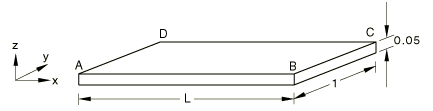
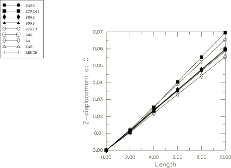

# 2.3.9 带施加弯矩的壳带测试

**产品：** Abaqus/Standard   

### 问题描述

原始问题描述和基准解可以在Batoz（1982）中找到。

板的长度从2.0到10.0变化，以研究长宽比效应。材料为线弹性，弹性模量为1×10⁷，泊松比为0.25。沿边缘的节点被夹紧。在节点B和处沿y方向施加大小为1.0的弯矩。

### 结果与讨论

节点C的垂直位移作为板长宽比的函数被发现。由于板的宽度为1.0，长宽比等于长度L。图2.3.9-2绘制了处垂直位移与板长度的关系。与参考解相比，所有单元都给出了合理的数值预测；参见Batoz（1982）。

### 输入文件

[ese4sxsb.inp](../eif/ese4sxsb.inp)

S4单元。

[esf4sxsb.inp](../eif/esf4sxsb.inp)

S4R单元。

[es54sxsb.inp](../eif/es54sxsb.inp)

S4R5单元。

[es68sxsb.inp](../eif/es68sxsb.inp)

S8R单元。

[es58sxsb.inp](../eif/es58sxsb.inp)

S8R5单元。

[es59sxsb.inp](../eif/es59sxsb.inp)

S9R5单元。

[es63sxsb.inp](../eif/es63sxsb.inp)

STRI3单元。

[es56sxsb.inp](../eif/es56sxsb.inp)

STRI65单元。

### 参考文献

Batoz, J. L., "An Explicit Formulation for an Efficient Triangular Plate Bending Element," International Journal for Numerical Methods in Engineering, vol. 18, pp. 1077–1089, 1982.

### 图表

**图2.3.9-1** 板模型。

**图2.3.9-2** 结果比较。

