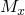
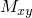
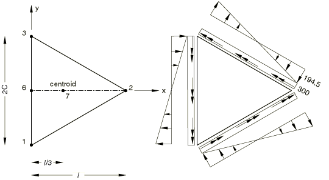

# 2.3.10 三点支撑的三角形板弯曲

**产品：** Abaqus/Standard

### 问题描述

考虑两种网格：粗网格和细网格。粗网格离散化为七个节点，以及六个三节点单元或三个四节点单元。细网格离散化为十九个节点，以及二十四个三节点单元或十二个四节点单元。材料为线弹性，弹性模量为207×10⁹，泊松比为0.25。板厚*t*为0.00254。*c* = 0.138564，*l* = 0.24。在*z*方向有三个角点支撑。在每个边界上施加大小为300/长度的均匀分布切向弯矩和大小为194.85/长度的线性分布扭矩。

### 结果与讨论

在节点1、2、3、6和7处计算等效节点弯矩。同时计算重心节点7的垂直位移。理论解见表2.3.10-1，其中等效节点弯矩通过应用虚位移原理计算，对应切向弯矩的转角采用线性函数，对应扭矩的转角采用二次函数。粗网格的结果见表2.3.10-2至表2.3.10-5，细网格的结果见表2.3.10-6至表2.3.10-9。对于所使用的网格密度以及由于积分点量的外推，节点弯矩与理论解相比显示出相当大的误差。预测的重心位移大于理论值，随网格密度增加而接近理论值。

### 输入文件

[ese4sfsh.inp](../eif/ese4sfsh.inp)

S4单元，细网格。

[ese4smsh.inp](../eif/ese4smsh.inp)

S4单元，粗网格。

[esf4sfsh.inp](../eif/esf4sfsh.inp)

S4R单元，细网格。

[esf4smsh.inp](../eif/esf4smsh.inp)

S4R单元，粗网格。

[es54sfsh.inp](../eif/es54sfsh.inp)

S4R5单元，细网格。

[es54smsh.inp](../eif/es54smsh.inp)

S4R5单元，粗网格。

[es63sfsh.inp](../eif/es63sfsh.inp)

STRI3单元，细网格。

[es63smsh.inp](../eif/es63smsh.inp)

STRI3单元，粗网格。

### 参考文献

Robinson, J., "Triangular Plate-Bending on Three Point Supports," Finite Element News, no.1, 1992.

### 表格

**表2.3.10-1** 理论解。
| 节点 |  |  |  |
| --- | --- | --- | --- |
| 1 | 300.0 | 75.0 | 194.86 |
| 2 | 37.7 | 412.5 | 0.0 |
| 3 | 300.0 | 75.0 | 194.86 |
| 6 | 300.0 | 75.0 | 0.0 |
| 7 | 187.5 | 187.5 | 0.0 |
| 重心位移 = 2.1226×10³ |

**表2.3.10-2** S4单元，粗网格。
| 节点 |  |  |  |
| --- | --- | --- | --- |
| 1 | 194.7 | 64.38 | 112.9 |
| 2 | 0.7924 | 259.9 | 0.0 |
| 3 | 194.7 | 64.38 | 112.9 |
| 6 | 273.0 | 73.07 | 0.0 |
| 7 | 303.4 | 303.4 | 0.0 |
| 重心位移 = 3.6602×10³ |

**表2.3.10-3** S4R单元，粗网格。
| 节点 |  |  |  |
| --- | --- | --- | --- |
| 1 | 243.0 | 132.0 | 96.16 |
| 2 | 76.47 | 298.5 | 0.0 |
| 3 | 243.0 | 132.0 | 96.16 |
| 6 | 243.0 | 132.0 | 0.0 |
| 7 | 187.5 | 187.5 | 0.0 |
| 重心位移 = 3.2232×10³ |

**表2.3.10-4** S4R5单元，粗网格。
| 节点 |  |  |  |
| --- | --- | --- | --- |
| 1 | 243.6 | 131.4 | 97.11 |
| 2 | 75.38 | 299.6 | 0.0 |
| 3 | 243.6 | 131.4 | 97.11 |
| 6 | 243.6 | 131.4 | 0.0 |
| 7 | 187.5 | 187.5 | 0.0 |
| 重心位移 = 3.1924×10³ |

**表2.3.10-5** STRI3单元，粗网格。
| 节点 |  |  |  |
| --- | --- | --- | --- |
| 1 | 101.5 | 251.5 | 129.9 |
| 2 | 326.4 | 26.56 | 0.0 |
| 3 | 101.5 | 251.5 | 129.9 |
| 6 | 50.33 | 355.5 | 0.0 |
| 7 | 183.1 | 183.1 | 0.0 |
| 重心位移 = 2.7551×10³ |

**表2.3.10-6** S4单元，细网格。
| 节点 |  |  |  |
| --- | --- | --- | --- |
| 1 | 233.3 | 59.27 | 151.5 |
| 2 | 9.773 | 332.3 | 0.0 |
| 3 | 233.3 | 59.27 | 151.5 |
| 6 | 275.7 | 71.22 | 0.0 |
| 7 | 240.1 | 247.5 | 0.0 |
| 重心位移 = 2.5038×10³ |

**表2.3.10-7** S4R单元，细网格。
| 节点 |  |  |  |
| --- | --- | --- | --- |
| 1 | 260.9 | 102.0 | 139.4 |
| 2 | 19.36 | 352.0 | 0.0 |
| 3 | 260.9 | 102.0 | 139.4 |
| 6 | 273.7 | 108.2 | 0.0 |
| 7 | 184.7 | 191.2 | 0.0 |
| 重心位移 = 2.4042×10³ |

**表2.3.10-8** S4R5单元，细网格。
| 节点 |  |  |  |
| --- | --- | --- | --- |
| 1 | 261.3 | 101.1 | 140.6 |
| 2 | 18.91 | 353.9 | 0.0 |
| 3 | 261.3 | 101.1 | 140.6 |
| 6 | 273.6 | 108.7 | 0.0 |
| 7 | 184.6 | 191.3 | 0.0 |
| 重心位移 = 2.4022×10³ |

**表2.3.10-9** STRI3单元，细网格。
| 节点 |  |  |  |
| --- | --- | --- | --- |
| 1 | 83.59 | 272.1 | 160.3 |
| 2 | 370.3 | 8.347 | 0.0 |
| 3 | 83.59 | 272.1 | 160.3 |
| 6 | 62.72 | 333.9 | 0.0 |
| 7 | 183.6 | 187.4 | 0.0 |
| 重心位移 = 2.3259×10³ |

### 图表

**图2.3.10-1** 施加弯矩的三角形板模型。

