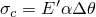
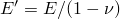
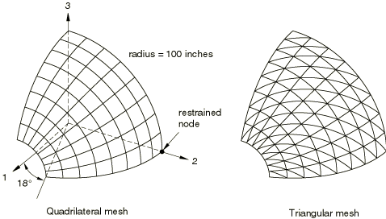

# 2.3.11 承受均匀热载荷的壳单元

**产品：** Abaqus/Standard

### 问题描述

测试壳单元的自由热膨胀。建模了一个带孔的球面八分之一对称段，作为壳截面。对截面边缘施加适当的对称边界条件。结构厚度为0.4英寸，半径为100.0英寸，承受均匀温度变化。该曲面的离散化生成以下网格：一种由64个四边形单元组成，用于S4、S4R、S4R5、S8R和SC8R单元；另一种由128个三角形单元组成，用于STRI3、STRI65、S3/S3R和SC6R单元。壳截面从0°F均匀加热到430°F。

每个输入文件的第一步是静态线性摄动步。第二步中，荷载作为考虑几何非线性的常规步重复施加。由于变形很小，第二步获得的位移与线性摄动步获得的位移几乎相同。在一些输入文件中，使用了solution controls来适度放松平衡公差。这是必要的，因为最终解中的节点力为零；因此，最大力和力矩残差与力和力矩范数大致处于同一数量级。

### 材料属性

材料为各同性，具有以下常数：

| 弹性模量，*E* = 68.25×10⁶ psi |
| --- |
| 泊松比， = 0.3 |
| 热膨胀系数， = 1.0×10⁻⁶ in/in/°F |

### 解析解

该问题的解析解是均匀径向膨胀，应力为零。

### 结果与讨论

在建立壳截面的合理数值结果时，可接受的应力输出可能是比完全约束壳截面（具有相同几何形状）的应力小至少五或六个数量级的值。如果建模的截面完全约束，温度变化将提供均匀的压应力，计算为，其中且是温度变化。使用上述材料属性和这些关系，完全约束的壳模型应产生等于42,000 psi的压应力，。因此，可接受的数值解应小于约0.1 psi。

所有单元在线性静力分析步（Step 1）和几何非线性步（Step 2）中都提供了远低于此值的最大主应力。在线性静力步中，除S4R5外的所有测试单元提供的最大主应力幅值均为*O*(10⁻⁸) psi或更小。S4R5单元的最大主应力幅值为*O*(10⁻³) psi。当包含非线性几何（NLGEOM）时，问题变得更具挑战性。在这些测试中，这种影响反映在Step 2的一些几何非线性结果中较高的应力幅值上。S3/S3R、STRI3和S4R单元提供的最大主应力幅值为*O*(10⁻⁷) psi或更小。S4单元提供的最大主应力幅值为*O*(10⁻⁶) psi。STRI65、S4R5和S8R单元的主应力幅值——均为*O*(10⁻²) psi——相当高。然而，即使这些相对较高的应力也被认为是非常合理的。

### 输入文件

[esf3sxf1.inp](../eif/esf3sxf1.inp)

S3/S3R单元。

[ese4sxf1.inp](../eif/ese4sxf1.inp)

S4单元。

[esf4sxf1.inp](../eif/esf4sxf1.inp)

S4R单元。

[es54sxf1.inp](../eif/es54sxf1.inp)

S4R5单元。

[esf8sxf1.inp](../eif/esf8sxf1.inp)

S8R单元。

[es63sxf1.inp](../eif/es63sxf1.inp)

STRI3单元。

[es56sxf1.inp](../eif/es56sxf1.inp)

STRI65单元。

[esc6sxf1.inp](../eif/esc6sxf1.inp)

SC6R单元。

[esc8sxf1.inp](../eif/esc8sxf1.inp)

SC8R单元。

#### 包含OFFSET参数的文件：

[esf3sxf2.inp](../eif/esf3sxf2.inp)

S3/S3R单元。

[ese4sxf2.inp](../eif/ese4sxf2.inp)

S4单元。

[esf4sxf2.inp](../eif/esf4sxf2.inp)

S4R单元。

[es54sxf2.inp](../eif/es54sxf2.inp)

S4R5单元。

[es63sxf2.inp](../eif/es63sxf2.inp)

STRI3单元。

[es56sxf2.inp](../eif/es56sxf2.inp)

STRI65单元。

### 图表

**图2.3.11-1** 该分析中使用的网格。

