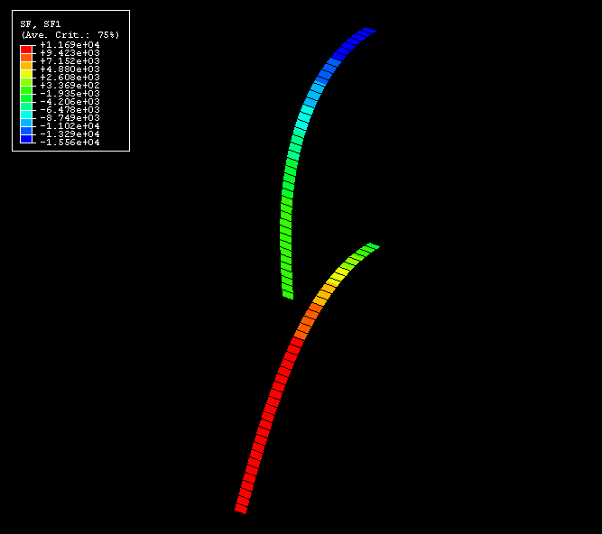
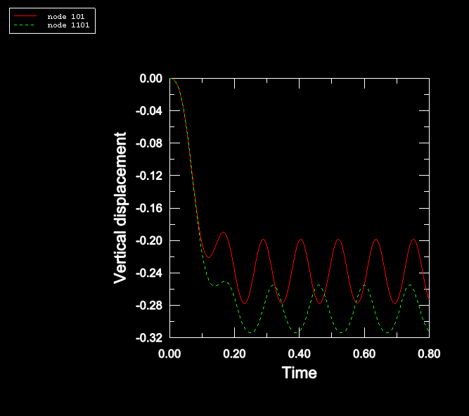

# 2.3.12 端部荷载下的壳弯曲

**产品：** Abaqus/Standard   Abaqus/Explicit

### 问题描述

该问题使用壳单元对由于端部荷载而弯曲的梁进行建模。在同一次运行中分析两根梁，第一根（BEAM1）承受跟随器荷载，第二根（BEAM2）承受恒定方向荷载（非跟随器荷载）。

每根梁在*x*方向上长400 mm，横截面为20 mm见方。沿长度方向有40个单元。因此，每根梁有40个S4R单元和82个节点。所有节点在自由度3-5上受到约束，两根梁的端部在自由度1-6上受到约束。

该问题的材料为弹性，弹性模量为1000 MPa（恒定），泊松比为0。密度为10000 kg/m³。

两根梁都在每个端部节点处承受大小为12500 N/m的负*y*方向的一般边缘牵引荷载。第一根梁上的荷载是跟随力，而第二根梁上的荷载在梁变形时不改变方向。

### 结果与讨论

[图2.3.12-1](ch02s03ach158.md#exxshellfollow-force-contours)显示了由分布力加载的两根梁的轴向膜截面力SF1的Abaqus/Explicit等值线。在梁1中，截面力在端部为零，在基部增加到最大压力。在梁2中，截面力在基部为零，在端部增加到最大拉力。[图2.3.12-2](ch02s03ach158.md#exxshellfollow-tipdeflecthist)显示了两根梁端部挠度的时间历史。

第一根梁（承受跟随器荷载）端部的预测垂直稳态位移与Abaqus/Standard的291 mm结果比较吻合。

第二根梁（承受恒定方向荷载）端部的预测垂直稳态位移与Bisshopp和Drucker（1945）给出的240 mm解析解以及Abaqus/Standard的242 mm结果比较吻合。

### 输入文件

[shellfoll_xpl_edld.inp](../eif/shellfoll_xpl_edld.inp)

两根梁的Abaqus/Explicit分析，一根承受跟随器边缘牵引荷载，另一根承受非跟随器边缘牵引荷载。

[shellfoll_std_edld.inp](../eif/shellfoll_std_edld.inp)

两根梁的Abaqus/Standard分析，一根承受跟随器边缘牵引荷载，另一根承受非跟随器边缘牵引荷载。

### 参考文献

Bisshopp, K. E., and D. C. Drucker, "Large Deflections of Cantilever Beams," Quarterly of Applied Mathematics, vol. 3, p. 272, 1945.

### 图表

**图2.3.12-1** 轴向截面力的等值线。

**图2.3.12-2** 端部挠度历史。

