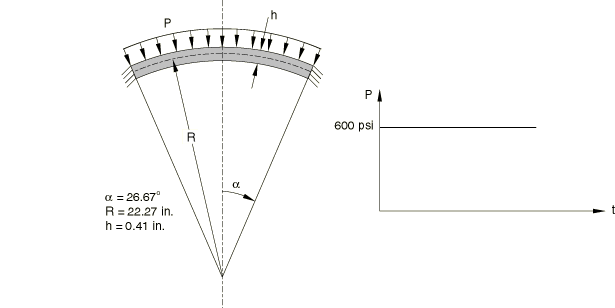
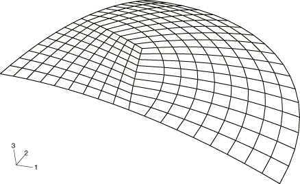
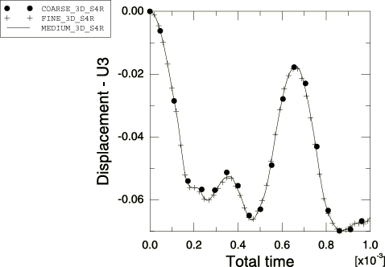
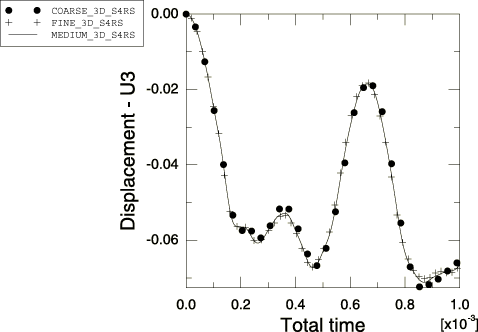
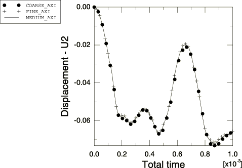
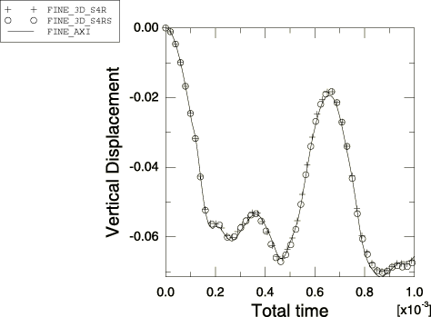
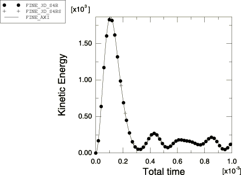

# 2.3.14 浅球壳的瞬态响应

**产品：** Abaqus/Explicit

### 问题描述

该问题评估浅球壳在均匀压力作用下的瞬态响应，如图2.3.14-1所示。球壳半径为22.27 in.，厚度为0.41 in.。球壳的响应以弯曲为主。进行了轴对称分析和三维分析。三维模型由一个象限组成，使用S4R或S4RS单元和适当的对称边界条件进行建模（见图2.3.14-2）。

材料建模为弹塑性材料，具有以下属性：

| 弹性模量 = 10.5×10⁶ psi |
| --- |
| 泊松比 = 0.3 |
| 密度 = 2.45×10⁻⁴ lb-sec²/in⁴ |
| 初始屈服应力 = 240000 psi |
| 强化模量 = 0.21×10⁶ psi |

均匀压力作为时间步函数施加在整个壳上。每种几何使用三种网格。三维分析分别使用75、147和243个S4R和S4RS单元进行；轴对称分析分别使用20、40和60个SAX1单元进行。

### 结果与讨论

图2.3.14-3和图2.3.14-4分别显示了S4R和S4RS单元的三维模型预测的球壳中心位移的时间历史。图2.3.14-5显示了一些轴对称模型的预测。图2.3.14-6比较了最细轴对称网格和最细三维网格获得的时间历史。图2.3.14-7比较了最细轴对称和三维网格获得的动能时间历史。

结果表明，SAX1单元、S4R单元和S4RS单元对于该问题是收敛的。它们与文献中的现有解比较吻合（见Bathe等，1975，以及Belytschko等，1984）。

### 输入文件

[sphr_axa_fine.inp](../eif/sphr_axa_fine.inp)

细网格的轴对称分析。

[sphr_axa_med.inp](../eif/sphr_axa_med.inp)

中等网格的轴对称分析。

[sphr_axa_coarse.inp](../eif/sphr_axa_coarse.inp)

粗网格的轴对称分析。

[sphr_coarse.inp](../eif/sphr_coarse.inp)

使用S4R单元的粗网格三维分析。

[sphr_med.inp](../eif/sphr_med.inp)

使用S4R单元的中等网格三维分析。

[sphr_fine.inp](../eif/sphr_fine.inp)

使用S4R单元的细网格三维分析。

[sphr_coarse_s4rs.inp](../eif/sphr_coarse_s4rs.inp)

使用S4RS单元的粗网格三维分析。

[sphr_med_s4rs.inp](../eif/sphr_med_s4rs.inp)

使用S4RS单元的中等网格三维分析。

[sphr_fine_s4rs.inp](../eif/sphr_fine_s4rs.inp)

使用S4RS单元的细网格三维分析。

### 参考文献

Bathe, K. J., et al., "Finite Element Formulations for Large Deformation Dynamic Analysis," International Journal for Numerical Methods in Engineering, vol. 9, pp. 353–386, 1975.

Belytschko, T. B., et al., "Explicit Algorithms for the Nonlinear Dynamics of Shells," Computational Methods in Applied Mechanics and Engineering, vol. 42, pp. 225–251, 1984.

### 图表

**图2.3.14-1** 球壳的几何特征。

**图2.3.14-2** 三维分析中使用的最细网格。

**图2.3.14-3** 使用S4R单元的球壳中心位移收敛性。

**图2.3.14-4** 使用S4RS单元的球壳中心位移收敛性。

**图2.3.14-5** 使用SAX1单元的球壳中心位移收敛性。

**图2.3.14-6** 细S4R、细S4RS和细SAX1网格的球壳中心位移时间历史比较。

**图2.3.14-7** 细S4R、细S4RS和细SAX1网格的球壳动能时间历史比较。

