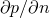
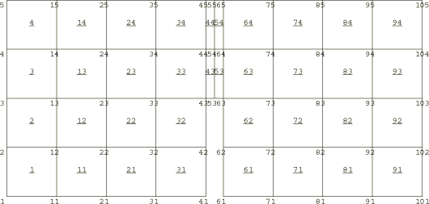
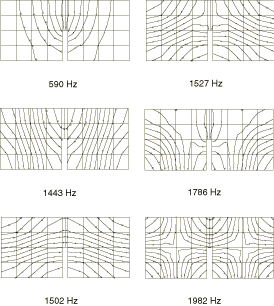
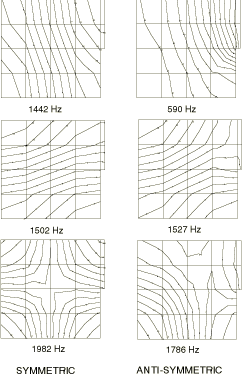

# 2.4.1 密闭空腔的声学模态

**产品：** Abaqus/Standard

在本例中，我们计算了一个封闭二维声学空腔的振动频率。声学单元提供的结果与同一问题的已发表结果进行了比较。

### 问题描述

空腔如图2.4.1-1所示。其壁是刚性的，且完全封闭。它是一个长度为236 mm、高度为113 mm的矩形空腔，中间有一个刚性壁，位于空腔较长边的中间。墙厚10 mm，从空腔一侧延伸一半到另一侧。空腔充满声学流体，密度为1.0 kg/m³，体积模量为0.1183 MPa。

使用了两个模型，一个使用一阶单元（单元类型AC2D4），一个使用二阶单元（单元类型AC2D8）。一阶单元的网格如图2.4.1-1所示。二阶单元的网格使用相同的模式，每个四个一阶单元的块被替换为单个单元。没有进行网格收敛研究，但计算频率与Petyt等（1977）给出的频率之间的高度一致表明网格是足够的。

由于声学流体完全被刚性壁封闭，声学压力在任何地方都没有被规定。这意味着解中存在一个任意的声学压力值——相当于结构问题中的刚体模式，导致零频率模式。因此，在频率过程（["自然频率提取，" Abaqus分析用户指南第6.3.5节](../usb/usb-link.md#usb-anl-afreqextraction)）中，我们引入了一个10 cycles/sec²的偏移。这消除了在特征值提取过程中必须求解的矩阵中出现奇异的困难。负偏移确保频率仍按升序提取，从零频率开始。

由于空腔是几何对称的，我们只对获得自然模态感兴趣，因此通过仅对空腔的一半进行建模，并使用几何对称平面上的对称和反对称边界条件，也可以获得结果。我们通过使用一阶模型的一半来说明这一点。该分析分两步进行。在第一步中，我们在对称平面上施加对称（自然）声学边界条件。该边界条件是压力在平面上法向的梯度为。由于对应于声学问题中的表面"载荷"，该边界条件不需要数据——它是一个无载荷表面。第二步包括在对称平面上施加反对称边界条件，。

### 结果与讨论

前六个非零频率如表2.4.1-1所示，并与Petyt等（1977）给出的计算值和实验测量值进行了比较。所有结果之间有相当接近的一致性，二阶模型提供的频率通常更高（约比一阶模型高2%）。这些前六个模态预测的压力分布如图2.4.1-2所示。

利用对称性的半模型提供相同的结果，如图2.4.1-3所示。模态2、3和6在第一步中获得，施加对称条件；模态1、4和5在第二步中获得，施加反对称条件。

### 输入文件

[acousticmodes_ac2d4.inp](../eif/acousticmodes_ac2d4.inp)

AC2D4单元。

[acousticmodes_ac2d8.inp](../eif/acousticmodes_ac2d8.inp)

AC2D8单元。

[acousticmodes_ac2d4_half.inp](../eif/acousticmodes_ac2d4_half.inp)

与acousticmodes_ac2d4.inp相同的问题，但使用适当的边界条件，因此只需对空腔的一半进行建模。

### 参考文献

Petyt, M., G. H. Koopman, and R. J. Pinnington, "Acoustic Modes of a Rectangular Cavity with a Rigid, Incomplete Partition," Journal of Sound and Vibration, vol. 53, pp. 71–82, 1977.

### 表格

**表2.4.1-1** 声学空腔的自然频率。
| 频率，Hz。 |
| --- |
| 模态 | Abaqus | Petyt等 |
| AC2D4 | AC2D8 | 计算值 | 测量值 |
| 1 | 590 | 586 | 577 | 570 |
| 2 | 1443 | 1484 | 1450 | 1470 |
| 3 | 1502 | 1548 | 1550 | 1534 |
| 4 | 527 | 1573 | 1610 | 1555 |
| 5 | 1786 | 1870 | 1860 | 1840 |
| 6 | 1982 | 2149 | 2160 | 2120 |

### 图表

**图2.4.1-1** 声学空腔，显示有限元网格。

**图2.4.1-2** 前六个模态中的压力分布。

**图2.4.1-3** 半模型中对称和反对称情况下前三个模态的压力分布。

