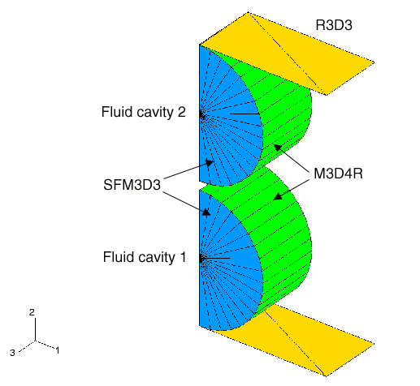
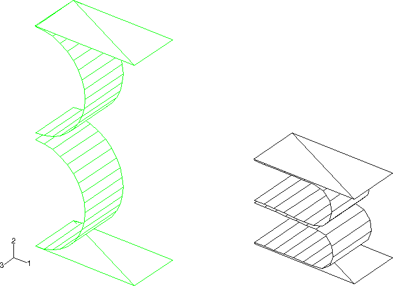
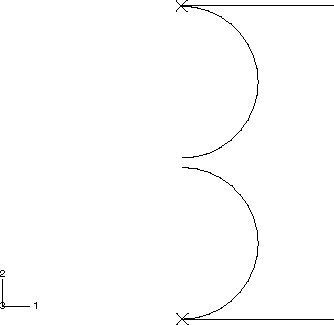
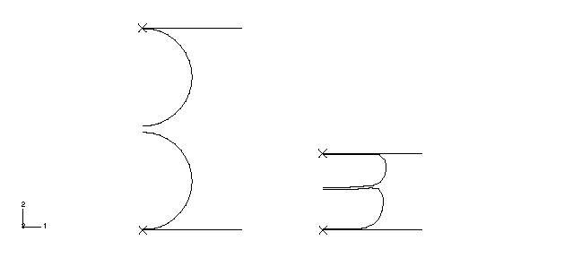
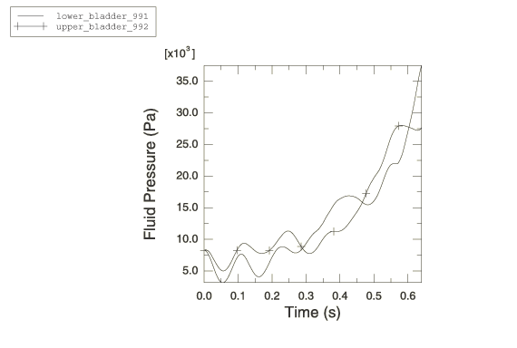
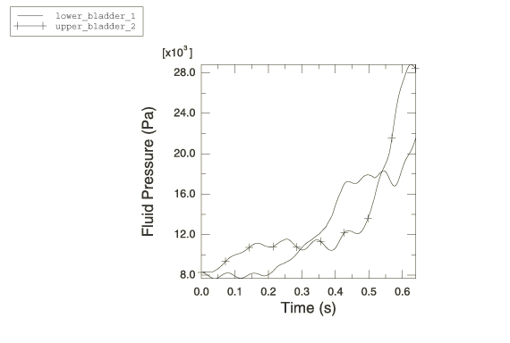

# 2.5.1 充液橡胶囊

**产品：** Abaqus/Explicit

### 问题描述

该问题涉及两个充满流体的橡胶囊，承受外部轴向压缩。两个囊之间有流体交换，因此流体可以在它们之间流动。质量转移量取决于囊之间的压力差。囊被建模为短圆柱体（使用M3D4R单元）或球体（使用SAX1单元），半径为1.0 m，壁厚为0.05 m。橡胶本构方程使用Ogden超弹性（N=3），材料系数由Abaqus根据实验应力-应变数据校准。囊中的流体被建模为流体空腔。流体空腔的参考节点必须分别位于对称平面或对称轴上。基于单元的表面的法线必须指向流体空腔内部，以获得正确的空腔体积。环境压力假定为50.0 kPa，流体被预加压至表压（附加）压力8.2736 kPa。静态平衡要求橡胶囊也承受均匀的初始应力，在M3D4R单元中沿周向为165.972 kPa，在球体中为82.736 kPa的均匀面内初始应力。

流体的转移通过使用流体交换定义并指定流体交换属性的体积粘度来建模。粘性系数和流体阻力系数分别选择为10000.0和100.0。这些阻力系数决定了在任何时刻作为两个囊之间压力差函数的 mass flow rate。

### 结果与讨论

囊系统以恒定的4.0 m/s向下速度被刚体撞击。事件的总时间为0.64秒。图2.5.1-1给出了三维模型的初始构型。图2.5.1-2显示了圆柱形橡胶囊的最终变形形状。图2.5.1-3给出了轴对称模型的初始构型。图2.5.1-4显示了球形橡胶囊的最终变形形状。两个容器内的流体压力如图2.5.1-5和图2.5.1-6所示。由于流体连接，两个囊中的压力几乎相同，如果两个囊之间存在压力差，它会驱动流体流动。由于球的相对体积变化小于圆柱体，圆柱体中的压力比球体中的压力升高更多。圆柱体和球体中的压力表现出由与球体扁平化相关的刚度引起的振荡。

### 输入文件

[fluidfilled_3d_surfcav.inp](../eif/fluidfilled_3d_surfcav.inp)

三维膜单元。

[fluidfilled_3d_gcont_surfcav.inp](../eif/fluidfilled_3d_gcont_surfcav.inp)

使用通用接触能力的三维膜单元。

[fluidfilled_ax_surfcav.inp](../eif/fluidfilled_ax_surfcav.inp)

轴对称情况，其中建模的是两个橡胶球而不是圆柱体。

### 图表

**图2.5.1-1** 三维情况的初始（未变形）构型。

**图2.5.1-2** 左侧为未变形的橡胶囊，右侧为变形的橡胶囊。囊使用M3D4R单元建模。

**图2.5.1-3** 轴对称情况的初始（未变形）构型。

**图2.5.1-4** 左侧为未变形的橡胶囊，右侧为变形的橡胶囊。囊使用SAX1单元建模。

**图2.5.1-5** 两个圆柱形橡胶囊中的流体压力。

**图2.5.1-6** 两个球形橡胶囊中的流体压力。

