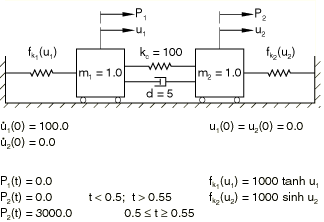
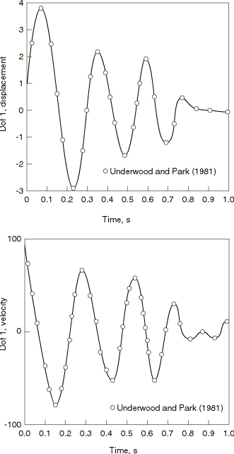
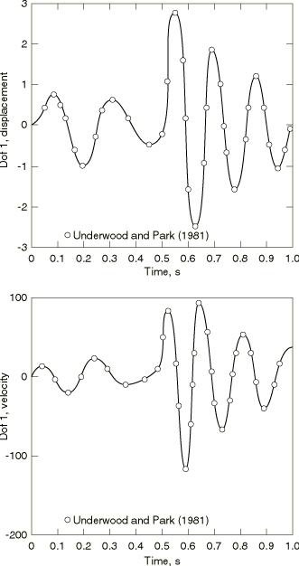

# 2.6.1 二自由度系统的动态响应

**产品：** Abaqus/Standard

本例的目的是在一个有独立解的简单示例中说明和验证非线性弹簧选项以及直接的、隐式的动态积分选项（Underwood和Park，1981）。

### 问题描述

该系统由两个非线性弹簧组成，每个弹簧将质量连接到固定点，质量和质量之间有一个线性弹簧和一个阻尼器。系统如图2.6.1-1所示。弹簧特性、初始条件和施加的函数也在图中给出。所有值都假定为一致单位。

为了与Underwood和Park（1981）的解进行直接比较，使用固定时间增量进行分析。在Underwood和Park（1981）中，时间增量0.0005对于中心差分（显式）积分算子非常准确，而时间增量0.03则不太准确。在本研究中，选择的时间增量为0.01。这给出了与Underwood和Park（1981）报告的结果非常一致的结果。

### 结果与讨论

两个质量的位移和速度历史如图2.6.1-2和图2.6.1-3所示。Underwood和Park（1981）获得的结果也在同一图中显示。吻合度相当好。

### 输入文件

[2dofdynamics.inp](../eif/2dofdynamics.inp)

动态分析。

[2dofdynamics_depend.inp](../eif/2dofdynamics_depend.inp)

与2dofdynamics.inp中所示的输入数据相同，只是使用了温度和场变量相关的弹簧和阻尼器属性。

### 参考文献

Underwood, P., and K. C. Park, "STIND/CD: A Stand-Alone Explicit Time Integration Package for Structural Dynamic Analysis," International Journal for Numerical Methods in Engineering, vol. 17, pp. 1285–1312, 1981.

### 图表

**图2.6.1-1** 二自由度非线性弹簧-质量系统。

**图2.6.1-2** 左侧质量的位移和速度历史。

**图2.6.1-3** 右侧质量的位移和速度历史。

