# 3.1.2 粘弹性板的热瞬态加载

**产品：** Abaqus/Standard   Abaqus/Explicit

本例取自Collingwood等（1985），旨在演示时域线性粘弹性材料模型与温度-时间偏移函数的结合使用。模型是在其平面内所有方向被约束的粘弹性板。我们研究板面温度突然升高至100°后板的响应。

### 问题描述

板具有单位半厚度。由于问题是一维的，板用一行平面应变连续体单元建模。在Abaqus/Standard中，使用二维8节点热传递单元DC2D8进行热传递分析，并使用相应的8节点平面应变连续体单元CPE8R进行应力分析，进行顺序热-应力分析。网格如图3.1.2-1所示。在Abaqus/Explicit中，使用一阶平面应变单元（CPE3T和CPE4RT）进行耦合热-应力分析来建模板。在Abaqus/Explicit模拟中，沿板的长度方向使用20个单元。

整个板的初始温度为0。板的外面（位于 = 1）瞬时升高至100。网格（图3.1.2-1）在 = 1处更细，预期温度梯度最高。结果的瞬态温度分布被写入结果文件，并用作后续应力分析的输入。通过在位于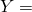 = 0和 = 1的网格两个面上设置 = 0来施加*Y*方向的平面应变。还施加了关于 = 0的对称性。

### 材料

热材料属性被任意定义（采用一致单位）：热导率（*k*）为1.0，比热（*c*）为1.0，密度（）为1.0。

粘弹性材料模型（小应变和大应变）与["承受恒定轴向荷载的粘弹性杆，" 第3.1.1节](ch03s01ach167.md)中使用的相同，只是增加了温度-时间偏移。温度-时间偏移使用Williams-Landel-Ferry近似：

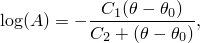

其中是给出松弛数据时的参考温度，、是在此温度获得的校准常数（关于WLF方程的更多信息，请参见["粘弹性，" Abaqus理论指南第4.8.1节](../stm/stm-link.md#stm-mat-viscoelastic)）。当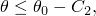时，材料行为是弹性的。在本例中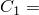 = 4.92、[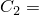 = 215.0， = 70。热膨胀系数为每度1.0×10⁻⁵。

### 分析

在Abaqus/Standard中，使用热传递过程分析瞬态热传递问题，时间周期为6秒，因此允许结构达到热平衡。Abaqus/Standard中用于瞬态热传递分析的积分过程引入了最小可用时间增量与单元尺寸和材料属性之间的关系。[Abaqus分析用户指南](../usb/usb-link.md#usb)中给出的指导原则是

其中是网格中最小单元的尺寸。如果使用小于此值的时间增量，解决方案中可能出现虚假振荡。由于网格相当粗糙，上面公式预测的最小可用时间增量为4.17×10⁻⁴秒。因此，使用建议的初始时间增量5×10⁻⁴秒。

通过设置热传递分析期间增量中允许的最大温度变化值来选择自动时间增量。对于最大温度变化不能使用较小的值，因为它们会导致小于上面描述的最小可用时间增量的时间增量。因此，热分析相当粗略。需要更细的网格来获得更准确的结果。

应力分析使用从热传递分析获得的温度分布来定义热加载。使用准静态过程（["准静态分析，" Abaqus分析用户指南第6.2.5节](../usb/usb-link.md#usb-anl-avisco)）并通过指定时间增量内蠕变应变增量最大差异的值来选择自动增量。此值设置为2.0×10⁻³，与最大弹性应变具有相同数量级。时间周期为6秒，初始建议时间增量为5.0×10⁻⁴秒，以捕获分析早期发生的高温度梯度。

在Abaqus/Explicit中，板的热和机械响应被同时确定。使用Abaqus/Explicit中可用的自动时间增量方案来确保数值稳定性并随时间推进解决方案。

### 结果与讨论

问题第一部分的温度分布在Carslaw和Yeager（1959）中给出。表3.1.2-1比较了经过一秒后的精确解与Abaqus结果。

**表3.1.2-1** 精确解与Abaqus结果的比较。
| 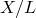 | 温度 |
| --- | --- |
| Carslaw和Yeager（1959） | Abaqus/Standard | Abaqus/Explicit |
| 0.9 | 98.2 | 97.8 | 98.3 |
| 0.7 | 95.0 | 93.5 | 95.1 |
| 0.5 | 92.2 | 89.9 | 92.3 |
| 0.2 | 89.5 | 86.4 | 89.7 |
| 0.0 | 89.2 | 85.7 | 89.1 |

Abaqus/Standard结果由于使用了相对较大的时间增量而精度有限。

解决方案过程中不同时刻的应力和应变分布如图3.1.2-2和图3.1.2-3所示。板的最终应力计算为0.0138 MPa（2 psi），最终应变为2.99×10⁻³。图3.1.2-4显示了结构中最左侧和最右侧积分点处应力随时间的变化历史。同一问题（不使用温度-时间偏移求解）的时间历史也显示在此图中。正如预期，偏移大大缩短了结构达到平衡所需的时间。

从粘弹性板应力分析获得的平衡应力和应变分布可以与对应于粘弹性材料长期属性的弹性板的应力和应变分布进行比较。粘弹性材料的伸长松弛函数为

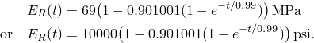

长期杨氏模量为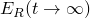，为6.83 MPa（989.99 psi）。长期泊松比可以从长期杨氏模量和体积模量计算，

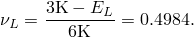

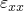和的平衡值使用线性弹性获得

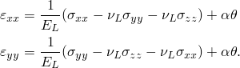

由于对称性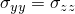，并且由于平面应变的假设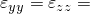 = 0。板在*X*方向不受约束，因此 = 0。这些条件导致应力和应变分布遵循温度分布，

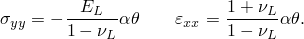

在稳态时，整个板的温度为100，因此最终应力和应变为

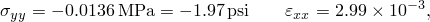

与分析中获得的稳态值一致。

### 输入文件

##### **Abaqus/Standard输入文件**

[viscoslabthermload_heat.inp](../eif/viscoslabthermload_heat.inp)

热传递分析。

[viscoslabthermload_smallstrain.inp](../eif/viscoslabthermload_smallstrain.inp)

包含温度-时间偏移的粘弹性板小应变分析。

[viscoslabthermload_largestrain.inp](../eif/viscoslabthermload_largestrain.inp)

等效大应变分析。

[viscoslabthermload_usr_utrs.inp](../eif/viscoslabthermload_usr_utrs.inp)

使用用户子程序[`UTRS`](../sub/sub-link.md#sub-xsl-utrs)定义`WLF`偏移函数的应力分析。使用用户子程序[`UTRS`](../sub/sub-link.md#sub-xsl-utrs)的解决方案与viscoslabthermload_smallstrain.inp中的作业获得的解决方案相同。

[viscoslabthermload_usr_utrs.f](../eif/viscoslabthermload_usr_utrs.f)

与viscoslabthermload_usr_utrs.inp结合使用的用户子程序[`UTRS`](../sub/sub-link.md#sub-xsl-utrs)。

[viscoslabthermload_postoutput.inp](../eif/viscoslabthermload_postoutput.inp)

[*POST OUTPUT](../key/key-link.md#usb-kws-hpostoutput)分析。

##### **Abaqus/Explicit输入文件**

[viscoslabthermload_x_cpe3t.inp](../eif/viscoslabthermload_x_cpe3t.inp)

包含温度-时间偏移的粘弹性板小应变分析；CPE3T单元。

[viscoslabthermload_x_cpe4rt.inp](../eif/viscoslabthermload_x_cpe4rt.inp)

包含温度-时间偏移的粘弹性板小应变分析；CPE4RT单元。

[viscoslabthermload_usr_cpe4rt.inp](../eif/viscoslabthermload_usr_cpe4rt.inp)

使用用户子程序[`VUTRS`](../sub/sub-link.md#sub-xsl-vutrs)定义`WLF`偏移函数的应力分析。使用用户子程序[`VUTRS`](../sub/sub-link.md#sub-xsl-vutrs)的解决方案与viscoslabthermload_x_cpe4rt.inp中的作业获得的解决方案相同。

[viscoslabthermload_usr_cpe4rt.f](../eif/viscoslabthermload_usr_cpe4rt.f)

与viscoslabthermload_usr_cpe4rt.inp结合使用的用户子程序[`VUTRS`](../sub/sub-link.md#sub-xsl-vutrs)。

[viscoslabthermload_xh_cpe3t.inp](../eif/viscoslabthermload_xh_cpe3t.inp)

包含温度-时间偏移的粘弹性板大应变分析；CPE3T单元。

[viscoslabthermload_xh_cpe4rt.inp](../eif/viscoslabthermload_xh_cpe4rt.inp)

包含温度-时间偏移的粘弹性板大应变分析；CPE4RT单元。

要运行没有偏移的应力分析，只需从[viscoslabthermload_smallstrain.inp](../eif/viscoslabthermload_smallstrain.inp)、[viscoslabthermload_largestrain.inp](../eif/viscoslabthermload_largestrain.inp)、[viscoslabthermload_x_cpe3t.inp](../eif/viscoslabthermload_x_cpe3t.inp)、[viscoslabthermload_x_cpe4rt.inp](../eif/viscoslabthermload_x_cpe4rt.inp)、[viscoslabthermload_xh_cpe3t.inp](../eif/viscoslabthermload_xh_cpe3t.inp)和[viscoslabthermload_xh_cpe4rt.inp](../eif/viscoslabthermload_xh_cpe4rt.inp)中移除[*TRS](../key/key-link.md#usb-kws-mtrs)选项及其后的一行数据。

### 参考文献

Carslaw, H. S., and J. C. Yeager, *Conduction of Heat in Solids, *Clarendon Press, Oxford, 1959.

Collingwood, G. A., E. B. Becker, and T. Miller, *User's Manual for the TEXVISC Computer Program, *Morton Thiokol, Inc., Document Numbers U-85-4550A and U-85-4550B, 1985.

### 图表

**图3.1.2-1** 粘弹性板的有限元模型（Abaqus/Standard）。

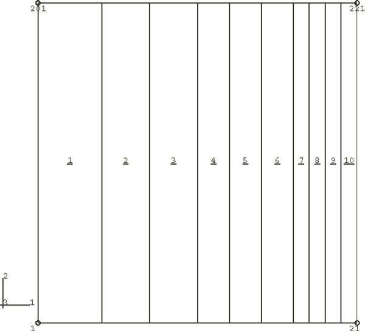

**图3.1.2-2** 不同时刻板厚度方向的应力（Abaqus/Standard）。

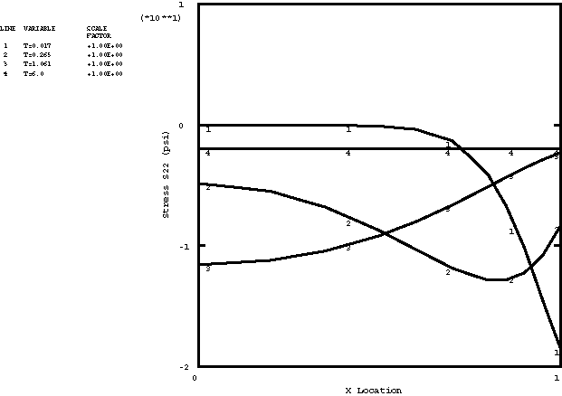

**图3.1.2-3** 不同时刻板厚度方向的应变（Abaqus/Standard）。

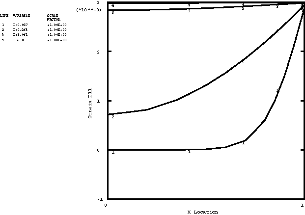

**图3.1.2-4** 有无温度-时间偏移时应力时间历史的比较（Abaqus/Standard）。

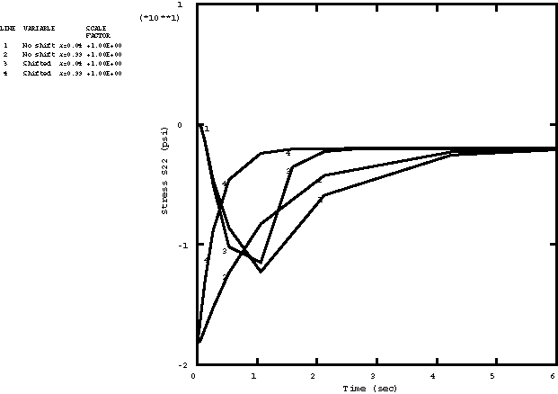

