# 3.1.5 弹性泡沫试验数据的拟合

**产品：** Abaqus/Standard

弹性泡沫是细胞材料，具有以下主要力学特性：
- 它们可以弹性变形至90%压缩。这是它们的主要变形模式。
- 它们的孔隙率允许非常大的体积变形。这与近似不可压缩的固体橡胶形成对比。

弹性泡沫材料的例子如缓冲垫、衬垫和包装材料等细胞聚合物。泡沫通常用于其优异的能量吸收特性——对于一定的应力水平，泡沫吸收的能量显著大于普通刚性弹性材料。

另一类泡沫材料是可压碎泡沫，可以承受永久（塑性）变形。这些材料使用可压碎泡沫材料模型建模。

弹性泡沫材料使用超弹性泡沫模型建模（["弹性泡沫中的超弹性行为，" Abaqus分析用户指南第22.5.2节](../usb/usb-link.md#usb-mat-chyperfoam)），这是一种非线性弹性模型。泡沫的弹性行为基于应变能函数

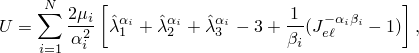

其中

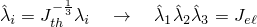

是主拉伸。弹性和热体积比，和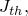，是

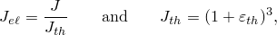

其中*J*是总体积比（当前体积除以原始体积），热应变遵循温度和各项同性热膨胀系数定义的热膨胀材料属性。通过粘弹性行为建模时间或频率相关的弹性行为。

系数与初始剪切模量相关，

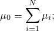

初始体积模量由下式得出

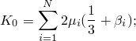

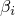与泊松比相关，

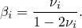

本例展示如何从一组材料测试数据推导超泡沫常数、和。

### 问题描述

对于本例，测试数据由单轴压缩和简单剪切数据组成，其名义应力-名义应变曲线如图3.1.5-1所示。单轴压缩曲线（图中标记为"1"）可分为三个阶段：
- 在小应变时（ ≤ 5%），由于细胞壁弯曲，泡沫以线性弹性方式变形。
- 随后是变形平台期，应力范围相对较小，由细胞壁的弹性屈曲引起。
- 在较高应变时，发生致密化区域，细胞壁压在一起导致压缩应力快速增加。

对于此材料，有效泊松比为零，这从没有横向位移可以看出（如图3.1.5-2所示），其中单个连续体单元说明了两种变形模式：单轴压缩和简单剪切。

简单剪切变形导致细胞壁的压缩和拉伸组合。除了剪切应力（图中标记为"2"）外，还产生了垂直于剪切方向的横向拉应力（图中标记为"3"）——这称为Poynting效应。此横向应力除了剪切应力外，还包含在测试数据中。

### 拟合过程

在Abaqus中，测试数据被指定为名义应力-名义应变数据对，使用单轴试验数据、双轴试验数据、简单剪切试验数据、平面试验数据和体积试验数据的组合，用于超弹性泡沫，材料常数由Abaqus从测试数据计算。此外，可以为超弹性泡沫指定有效泊松比。

对于每个应力-应变数据对，Abaqus生成关于拉伸和未知超泡沫常数的应力表达式。对于单轴、等双轴、平面和体积变形情况，名义应力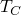是

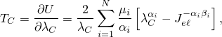

其中*U*是应变能势，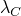是主位移方向的拉伸。

对于简单剪切情况，名义剪切应力是

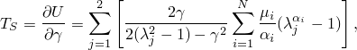

其中是剪切应变，是剪切平面中的两个主拉伸，通过

与剪切应变相关。

对于*n*个应力-应变数据对，最小化以下误差度量*E*：

其中是测试数据的应力值，是上述应力表达式之一。

由于能量势是和的非线性函数，Abaqus中使用类似于Twizell和Ogden（1983）的非线性最小二乘过程同时确定和。如果POISSON参数被指定为有效泊松比，则所有常数直接计算为

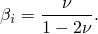

在获得一组材料常数后，Abaqus使用德鲁克稳定性准则沿主要变形模式执行材料稳定性检查：

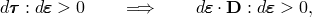

其中是由于对数应变增量引起的基尔霍夫应力增量，是切向材料刚度。为了满足稳定性准则，必须是正定的。如果失去其正定特性，从而定义可能导致不稳定材料行为的应变状态，分析输入文件处理器将发出警告消息。检查的变形模式是单轴、等双轴、平面和体积变形（拉伸和压缩）以及简单剪切模式。

#### 拟合案例1——使用单轴压缩和简单剪切数据的结果

两种类型的测试数据都用于拟合 ≥ 2阶的超泡沫常数（四个常数：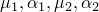；由于有效泊松比为零，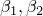常数为零）和 = 3阶（六个常数）。简单剪切数据同时使用剪切应力和横向拉应力。 = 3参数在五种变形模式下未能通过德鲁克稳定性测试，而 = 2参数预测没有不稳定性。

单个8节点连续体单元C3D8R（单位尺寸）承受边界条件，模拟如图3.1.5-2所示的两种变形模式。由于Abaqus输出真实（柯西）应力和对数应变，因此在示例末尾的数据文件列表中描述了导出名义应力-名义应变结果的方法。

对于*N*的两个值，拟合如图3.1.5-3所示，对于单轴压缩情况高达80%最大应变是准确的。对于简单剪切情况，拟合在剪切应变约50%之前是准确的；超过该值后，Abaqus剪切结果比剪切测试数据更快地 stiffens。

#### 拟合案例2——仅使用单轴压缩数据的结果

通常，用户可能只有一种类型的测试数据可用。对于本例，检查了仅使用单轴压缩数据拟合超泡沫常数的后果。 = 2和 = 3参数都通过了所有德鲁克稳定性测试。图3.1.5-4显示了两种变形模式的结果与拟合案例1的对比。

对于*N*的两个值，单轴压缩结果与测试数据非常紧密匹配，这是预期的，因为超泡沫常数仅使用单轴数据拟合。然而，在简单剪切情况下，在有限应变开始时数值和测试数据之间存在相当大的差异——拟合案例1的剪切结果明显更好。

### 结果与讨论

对于这些测试数据， = 2模型在提供紧密相关性方面似乎足够了（它是稳定的，而 = 3模型则不然）。然而，本例还说明，仅使用单轴测试数据拟合超泡沫常数时，剪切行为不能令人满意地再现。不充分性可归因于以下事实：在简单剪切中，某些方向处于拉伸状态。这种拉伸行为不能用压缩数据仅正确地表征。此观察类似于对不可压缩超弹性材料所做的观察，不能保证测试数据模式之外的变形模式可以再现到可接受的准确性。

然而，对于超弹性泡沫，丰富的可压缩性将不同的轴向变形模式（如双轴、三轴等） reduce 为不同方向的几个单轴状态的"叠加"。这对于压缩状态尤其正确，其中沿一个方向的加载下细胞壁屈曲与垂直方向的屈曲相当独立。因此，单个单轴压缩测试可能足以表征材料行为（如果应用以压缩为主）并不罕见。然而，最好使用来自不同变形模式的测试数据。

### 输入文件

[foamdatafitting_compress.inp](../eif/foamdatafitting_compress.inp)

单轴压缩模式。

[foamdatafitting_shear.inp](../eif/foamdatafitting_shear.inp)

简单剪切变形模式。

更改[*HYPERFOAM*](../key/key-link.md#usb-kws-mhyperfoam)选项的参数N的值以使用不同阶数的应变能函数。从材料定义中移除简单剪切应力-应变数据，以运行仅使用单轴压缩数据的案例。

### 参考文献

Twizell, E. H., and R. W. Ogden, "Non-Linear Optimization of the Material Constants in Ogden's Stress-Deformation Function for Incompressible Isotropic Elastic Materials," J. Austral. Math. Soc. Ser. B, vol. 24, pp. 424–434, 1983.

### 图表

**图3.1.5-1** 单轴压缩和简单剪切测试数据。

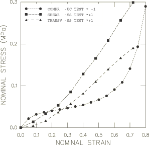

**图3.1.5-2** 单轴压缩和简单剪切变形模式。

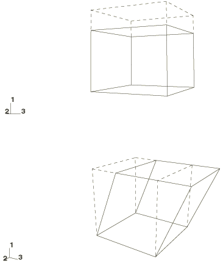

**图3.1.5-3** 使用单轴压缩和简单剪切数据的结果。实线：实验数据。虚线：Abaqus结果。

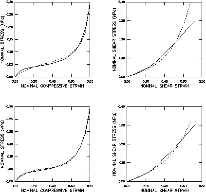

**图3.1.5-4** 仅使用单轴压缩数据的结果。实线：实验数据。虚线：Abaqus结果。

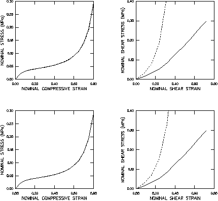

