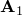
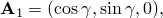
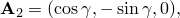
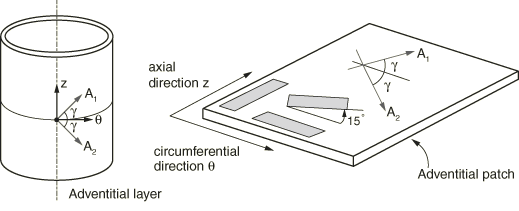
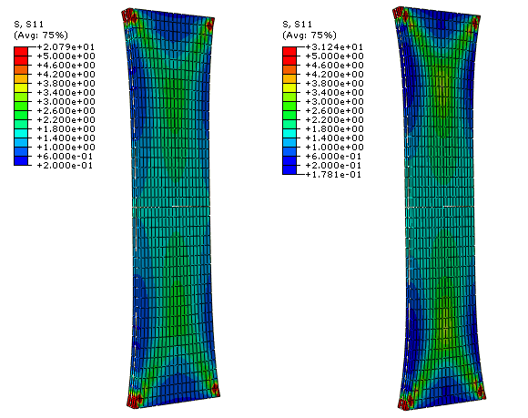
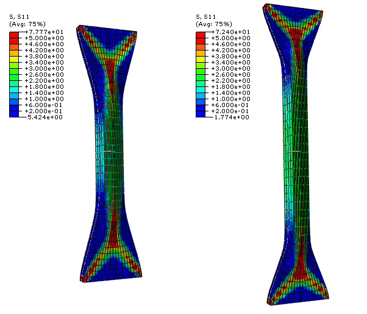
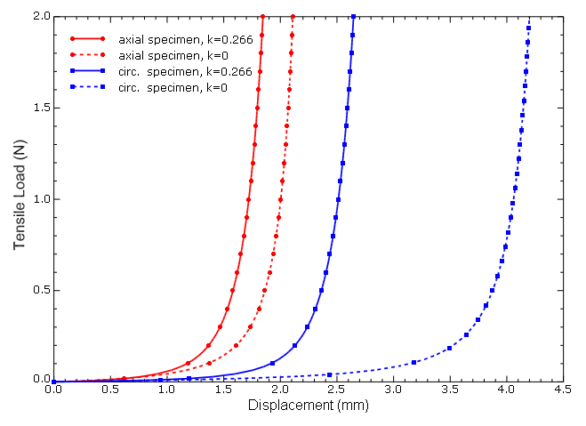
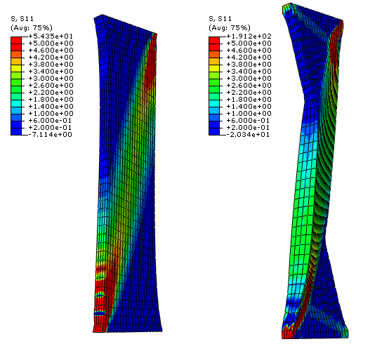
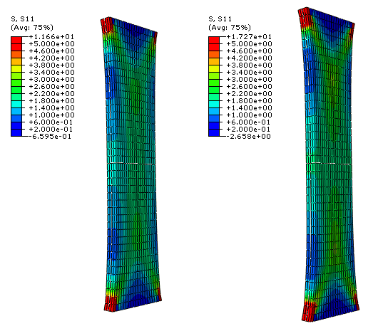
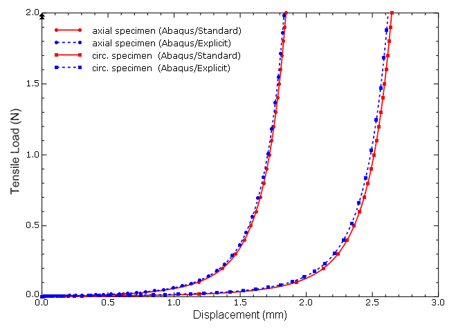

# 3.1.7 动脉层的各向异性超弹性建模

**产品：** Abaqus/Standard   Abaqus/Explicit

本问题说明了Abaqus中用于建模软生物组织的各向异性超弹性能力的应用。更具体地说，本问题展示了如何使用这些能力来建模人髂动脉外膜层的力学响应。提供了沿动脉轴向和周向切割的髂骨外膜条的简单拉伸测试的数值示例。还包括了一个相对于周向切割成15°角的样本。数值研究证明了胶原纤维取向分散性对软组织力学响应的重要影响。该问题已由Gasser、Holzapfel和Ogden（2006）进行了数值分析。

### 问题描述

我们考虑沿动脉轴向和周向切割的髂骨外膜条的简单拉伸测试的数值分析，以及相对于周向切割成15°角的样本的简单拉伸测试，如图3.1.7-1所示。根据Gasser、Holzapfel和Ogden（2006）的工作，研究中考虑的外膜条具有10.0 mm长度×3.0 mm宽度×0.5 mm厚度的参考尺寸，假定在参考构型中无应力。假定两个胶原纤维族嵌入样本中，相对于动脉的轴向和周向对称排列，在径向（厚度）方向没有分量，如图3.1.7-1所示。纤维平均取向与周向之间的角度为 = 49.98°。样本沿纵向加载，其端面不允许变形。使用适当的对称边界条件，仅当沿轴向和周向切割样本时对几何形状的八分之一进行建模。对于相对于周向切割成15°角的样本，进行全规模模拟。样本的有限元模型由20×10×2网格组成，用于考虑八分之一对称的模拟，由40×20×4网格组成，用于全规模模拟。

数值分析使用Abaqus/Standard中的静态分析过程进行。使用线性实体混合单元（C3D8H）来建模动脉层的不可压缩变形。作为比较，假设准静态加载条件，也在Abaqus/Explicit中计算解决方案。由于Abaqus/Explicit没有施加不可压缩性约束的机制，因此在Abaqus/Explicit模拟中引入了一定量的材料响应可压缩性，并使用线性实体单元（C3D8R）。

#### 材料

外膜层的力学响应使用Gasser、Holzapfel和Ogden（2006）提出的各向异性超弹性应变能函数来建模，以建模具有分布胶原纤维取向的动脉层。模型的详细信息在["Holzapfel-Gasser-Ogden形式"在"Abaqus分析用户指南第22.5.3节的各向异性超弹性行为"](../usb/usb-link.md#usb-mat-canisohyperelastic-holzapfel)；和["Holzapfel-Gasser-Ogden形式"在"Abaqus理论指南第4.6.3节的各向异性超弹性材料行为"](../stm/stm-link.md#stm-mat-anisohyperelastic-holzapfel)中给出。

假定动脉层由嵌入软不可压缩基质中的两族胶原纤维组成。纤维族具有由参考构型中的向量和表征的平均取向，但每族内纤维的取向是分散的。该模型引入了一个标量结构参数（），表征胶原取向的分散程度。当 = 0时，纤维完全对齐（无分散）。当 = 1/3时，纤维随机分布，材料变为各向同性。在数值模拟中使用 = 0.226的值。作为比较，也以理想对齐的胶原纤维（ = 0）进行数值测试。

材料属性取自Gasser、Holzapfel和Ogden（2006），如表3.1.7-1所示。它们基于Holzapfel、Sommer和Regitnig（2004）对九条髂动脉外膜条进行纵向和周向拉伸测试的最小二乘拟合。

### 加载和控制

测试机器中样本的安装通过约束条的两端来建模。样本沿拉伸方向加载，其端面不允许变形。

在Abaqus/Standard模拟中，使用静态过程，规定荷载为2.0 N。在此步中考虑几何非线性以考虑外膜条的大变形。

由于Abaqus/Explicit是一个动态分析程序，我们对问题的静态解决方案感兴趣，因此在加载外膜条时必须注意避免显著的惯性效应。使用平滑步幅曲线来规定样本的单轴位移，并在Abaqus/Explicit模拟中促进准静态解决方案。模拟以双精度运行。

### 结果与讨论

以下部分讨论Abaqus/Standard和Abaqus/Explicit分析的结果。

#### Abaqus/Standard结果

图3.1.7-2显示了轴向（左侧）和周向（右侧）样本在分布纤维（ = 0.226）情况下，2.0 N拉伸载荷下拉伸方向计算的应力。对于完美对齐的纤维（ = 0）的情况，对应结果如图3.1.7-3所示。在这种情况下，嵌入的胶原纤维在能够承受显著载荷之前需要显著地向加载方向旋转。纤维大旋转和不可压缩性约束的组合效应导致样本厚度在条的中间区域（远离约束边界）增加（且宽度减小）。条端部的过渡区域类似于机织物中观察到的变形模式。

图3.1.7-4显示了周向和轴向样本的计算载荷与位移曲线。虚线对应于理想对齐纤维的模拟，实线对应于包含分散的模拟。如图所示，材料响应在低拉伸时非常软；只需要很小的力就能实现显著延伸。一旦胶原纤维大致与加载方向对齐，材料就迅速 stiffens。这在 = 0的周向样本情况下尤为明显；对齐需要非常大的平均拉伸，且样本在约4 mm位移时 stiffens。相比之下，当在模拟中包含分散时，胶原纤维在承载之前需要旋转得 less。与理想对齐情况相比，胶原纤维分散导致样本的宏观响应更 stiff。具体而言，分散参数控制样本 stiffens时的伸长。

这些轴向和周向样本的数值结果与Gasser、Holzapfel和Ogden（2006）报道的结果一致。

图3.1.7-5显示了相对于周向切割成15°角的样本中加载方向上的应力。左侧图对应于分布纤维的情况，右侧图对应于理想对齐纤维的情况。同样，我们观察到，对于理想对齐的纤维，在它们承载之前需要明显更多的旋转。

#### Abaqus/Explicit结果

作为比较，也在Abaqus/Explicit中分析了具有分布纤维的轴向和周向样本。图3.1.7-6显示了Abaqus/Explicit模拟结束时轴向（左侧）和周向（右侧）样本在拉伸方向上的应力。如图3.1.7-7所示，Abaqus/Explicit计算的载荷-位移响应与Abaqus/Standard中获得的结果比较吻合。结果中的小差异可归因于不同单元类型的使用以及Abaqus/Explicit模拟中的一些小动态效应和一定量的材料可压缩性。

### 输入文件

##### **Abaqus/Standard输入文件**

[adventitia_axial.inp](../eif/adventitia_axial.inp)

沿轴向切割的外膜条简单拉伸；分布纤维（ = 0.226）；1/8对称模型；C3D8H单元。

[adventitia_axial_k0.inp](../eif/adventitia_axial_k0.inp)

沿轴向切割的外膜条简单拉伸；理想对齐纤维（ = 0）；1/8对称模型；C3D8H单元。

[adventitia_circ.inp](../eif/adventitia_circ.inp)

沿周向切割的外膜条简单拉伸；分布纤维（ = 0.226）；1/8对称模型；C3D8H单元。

[adventitia_circ_k0.inp](../eif/adventitia_circ_k0.inp)

沿周向切割的外膜条简单拉伸；理想对齐纤维（ = 0）；1/8对称模型；C3D8H单元。

[adventitia_15deg.inp](../eif/adventitia_15deg.inp)

相对于周向切割成15°角的外膜条简单拉伸；分布纤维（ = 0.226）；C3D8H单元。

[adventitia_15deg_k0.inp](../eif/adventitia_15deg_k0.inp)

相对于周向切割成15°角的外膜条简单拉伸；理想对齐纤维（ = 0）；C3D8H单元。

##### **Abaqus/Explicit输入文件**

[adventitia_axial_xpl.inp](../eif/adventitia_axial_xpl.inp)

沿轴向切割的外膜条简单拉伸；分布纤维（ = 0.226）；1/8对称模型；可压缩；C3D8R单元。

[adventitia_circ_xpl.inp](../eif/adventitia_circ_xpl.inp)

沿周向切割的外膜条简单拉伸；分布纤维（ = 0.226）；1/8对称模型；可压缩；C3D8R单元。

##### **未用于讨论的附加Abaqus/Standard输入文件**

[adventitia_axial_cps4r.inp](../eif/adventitia_axial_cps4r.inp)

沿轴向切割的外膜条简单拉伸；分布纤维（ = 0.226）；平面应力1/4对称模型；不可压缩；CPS4R单元。

[adventitia_axial_m3d4r.inp](../eif/adventitia_axial_m3d4r.inp)

沿轴向切割的外膜条简单拉伸；分布纤维（ = 0.226）；平面应力1/4对称模型；不可压缩；M3D4R单元。

[adventitia_axial_s4r.inp](../eif/adventitia_axial_s4r.inp)

沿轴向切割的外膜条简单拉伸；分布纤维（ = 0.226）；平面应力1/4对称模型；不可压缩；S4R单元。

##### **未用于讨论的附加Abaqus/Explicit输入文件**

[adventitia_axial_m3d4_xpl.inp](../eif/adventitia_axial_m3d4_xpl.inp)

沿轴向切割的外膜条简单拉伸；分布纤维（ = 0.226）；平面应力1/4对称模型；不可压缩；M3D4单元。

[adventitia_axial_k0_m3d4_xpl.inp](../eif/adventitia_axial_k0_m3d4_xpl.inp)

沿轴向切割的外膜条简单拉伸；理想对齐纤维（ = 0）；平面应力1/4对称模型；不可压缩；M3D4单元。

[adventitia_circ_m3d4_xpl.inp](../eif/adventitia_circ_m3d4_xpl.inp)

沿周向切割的外膜条简单拉伸；分布纤维（ = 0.226）；平面应力1/4对称模型；不可压缩；M3D4单元。

[adventitia_circ_k0_m3d4_xpl.inp](../eif/adventitia_circ_k0_m3d4_xpl.inp)

沿周向切割的外膜条简单拉伸；理想对齐纤维（ = 0）；平面应力1/4对称模型；不可压缩；M3D4单元。

[adventitia_15deg_m3d4_xpl.inp](../eif/adventitia_15deg_m3d4_xpl.inp)

相对于周向切割成15°角的外膜条简单拉伸；分布纤维（ = 0.226）；平面应力1/4对称模型；不可压缩；M3D4单元。

[adventitia_15deg_k0_m3d4_xpl.inp](../eif/adventitia_15deg_k0_m3d4_xpl.inp)

相对于周向切割成15°角的外膜条简单拉伸；理想对齐纤维（ = 0）；平面应力1/4对称模型；不可压缩；M3D4单元。

### 参考文献

Gasser, T. C., G. A. Holzapfel, and R. W. Ogden, "Hyperelastic Modelling of Arterial Layers with Distributed Collagen Fibre Orientations," Journal of the Royal Society Interface, vol. 3, pp. 15–35, 2006.

Holzapfel, G. A., T. C. Gasser, and R. W. Ogden, "A New Constitutive Framework for Arterial Wall Mechanics and a Comparative Study of Material Models," Journal of Elasticity, vol. 61, pp. 1–48, 2000.

Holzapfel, G. A., G. Sommer, and P. Regitnig, "Anisotropic Mechanical Properties of Tissue Components in Human Atherosclerotic Plaques," Journal of Biomechanical Engineering, vol. 126, pp. 657–665, 2004.

### 表格

**表3.1.7-1** 髂骨外膜层假定的材料属性。
| Holzapfel-Gasser-Ogden能函数系数： |
| --- |
|  |  = 3.82 kPa |
|  |  = 996.6 kPa |
|  |  = 524.6 |
|  |  = 0.226 |
|  |  = 0（可压缩情况为 = 1×10⁶） |
| 纤维方向（对于沿周向切割的样本）： |
|  |  |
|  |  |
|  | 其中 = 49.98°。 |

### 图表

**图3.1.7-1** 具有两个嵌入纤维族的平均取向的外膜层和（左侧）。拉伸测试的周向、轴向和15°样本的定义（右侧）。

**图3.1.7-2** 沿轴向（左侧）和周向（右侧）切割的髂骨外膜条在施加载荷方向上的应力。结果对应于2.0 N的施加载荷；包含胶原纤维的分散（ = 0.226）。

**图3.1.7-3** 沿轴向（左侧）和周向（右侧）切割的髂骨外膜条在施加载荷方向上的应力。结果对应于2.0 N的施加载荷；胶原纤维完全对齐（ = 0）。

**图3.1.7-4** 周向和轴向样本的载荷-位移响应。

**图3.1.7-5** 相对于周向切割成15°角偏移的髂骨外膜条在施加载荷方向上的应力；包含胶原纤维的分散（左侧）和无分散（右侧）。

**图3.1.7-6** 具有分布纤维（ = 0.226）的髂骨外膜条在轴向（左侧）和周向（右侧）切割的施加载荷方向上应力的Abaqus/Explicit结果。结果对应于Abaqus/Explicit模拟结束。

**图3.1.7-7** 具有分布纤维（ = 0.226）的周向和轴向样本的载荷-位移响应的Abaqus/Standard和Abaqus/Explicit结果比较。

