# 3.2.2 ORNL塑性理论在双轴加载下的测试

**产品：** Abaqus/Standard

本例旨在验证Abaqus中在平面应力双轴加载条件下的ORNL塑性理论（Oak Ridge，1981）模型。开发了精确解来验证Abaqus结果。问题涉及均匀平面应力状态，因此几何模型是单个单元，被约束为均匀响应（["ORNL——橡树岭国家实验室本构模型，" Abaqus分析用户指南第23.2.12节](../usb/usb-link.md#usb-mat-cornl)）。

### 问题描述

原始材料属性如下：

| 杨氏模量 | 207 GPa（30×10⁶ lb/in²） |
| --- | --- |
| 原始屈服应力 | 207 MPa（30000 lb/in²） |
| 原始加工硬化斜率 | 10.3 GPa（1.5×10⁶ lb/in²） |
| 第10次循环屈服应力 | 234 MPa（34000 lb/in²） |
| 第10次循环加工硬化斜率 | 10.3 GPa（1.5×10⁶ lb/in²） |

### 双轴加载

该案例使用与["均匀加载的弹塑性板，" 第3.2.1节](ch03s02ach174.md)中案例2相同的几何和原始材料模型设置。板首先沿*x*方向弹性加载到原始屈服面，然后在*x*方向的单轴拉伸中加载到塑性范围，直到应力为276 MPa（40000 lb/in²）。然后进行双轴加载，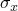和被规定，如图3.2.2-1所示，使得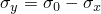。此加载通过幅值曲线定义（["幅值曲线，" Abaqus分析用户指南第34.1.2节](../usb/usb-link.md#usb-prc-pamplitude)）。Abaqus读取两个文件（ORNL2.AMP和ORNL3.AMP）的值，这些值在小程序AMP中计算（见ornlbiaxialload_ampdata.f）。

### "精确"解

"精确"解是通过首先将总应变率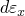和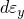定义为应力率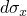和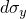的函数来开发的。然后将这些结果方程以高精度数值积分以给出参考解。

Ziegler的运动硬化在等温条件下给出

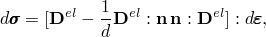

其中

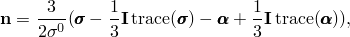

其中是屈服应力，

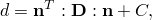

其中*C*是单轴加载条件下应力与塑性应变曲线的斜率。

在平面应力条件（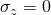）下且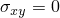，

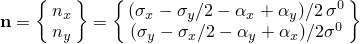

和

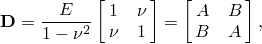

其中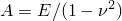和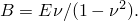

因此，

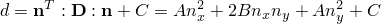

和

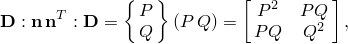

其中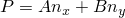、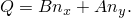

因此，应力率-应变率关系为

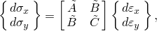

其中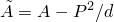、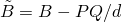和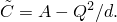

求逆这个关系给出总应变率为

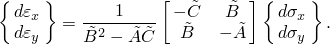

屈服面中心根据Ziegler的运动硬化规则平移，因此

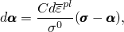

其中

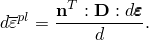

因此，

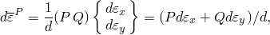

屈服面中心的平移率以分量给出为

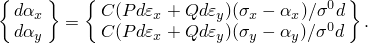

给定增量开始时变量、、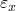、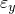、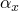和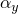的值，以及规定的应力增量和，总应变率方程和屈服面中心的平移率方程提供了、、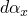和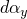的值。

用于计算所需变量的小程序在ornlbiaxialload_exact.f中给出。主程序提供规定的应力增量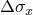和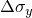，等于有限元分析中使用的值。然后将这些增量中的每一个分成1000个子增量，并将总应变率方程和屈服面中心的平移率方程在每个子增量上积分，以提供与分析中使用的和的规定值对应的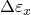、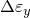、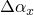和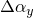的几乎精确的值。在每个子增量中，进行测试以确定是否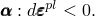。当此测试满足时，屈服面从原始属性扩展到第10次循环属性，使得从其原始值207 MPa（30000 lb/in²）增加到其第10次循环值234 MPa（34000 lb/in²）。根据ORNL塑性算法，在初始满足测试之后的每个子增量中使用此值。

### 结果与讨论

应力空间中的加载路径如图3.2.2-1所示。当应力接触点A时，屈服面开始平移，使得在点B处屈服面占据虚线所示的位置。在点B处应力路径改变方向，沿路径发生弹性加载。在点C处应力点穿透屈服面，并且由于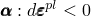，ORNL算法规定屈服面从原始属性扩展到第10次循环属性。扩展的屈服面在图3.2.2-1中由虚点和虚线曲线表示。沿路径继续加载产生弹性响应，因为点C位于第10次循环屈服面内部。在点D处应力点接触扩展的屈服面，并沿路径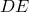发生主动塑性屈服。"精确"结果与有限元结果在表3.2.2-1和表3.2.2-2中的比较显示出非常接近的一致性。

### 输入文件

[ornlbiaxialload.inp](../eif/ornlbiaxialload.inp)

双轴加载测试。

[ornlbiaxialload_ampdata.f](../eif/ornlbiaxialload_ampdata.f)

用于为[*AMPLITUDE*](../key/key-link.md#usb-kws-mamplitude)选项生成数据记录的程序。

[ornlbiaxialload_exact.f](../eif/ornlbiaxialload_exact.f)

用于生成"精确"解的程序。

### 参考文献

Nuclear Standard NE F9–5T, "Guidelines and Procedures for Design of Class 1 Elevated Temperature Nuclear System Components," USDOE Technical Information Center, Oak Ridge, Tennessee, March 1981.

### 表格

**表3.2.2-1** 使用ORNL塑性理论的"精确"和数值结果比较——*x*方向上的应力和应变。
| 数值解 | "精确"解 | 增量 |
| --- | --- | --- |
| ，MPa（×10³ lb/in²） | (%) | ，MPa（×10³ lb/in²） | (%) | 类型 |
| 206.84 (30.00) | 0.1000 | 206.84 (30.00) | 0.1000 | 弹性 |
| 224.08 (32.50) | 0.2656 | 224.08 (32.50) | 0.2655 | 塑性 |
| 241.32 (35.00) | 0.4312 | 241.32 (35.00) | 0.4311 | 塑性 |
| 258.55 (37.50) | 0.5968 | 258.55 (37.50) | 0.5968 | 塑性 |
| 275.79 (40.00) | 0.7624 | 275.79 (40.00) | 0.7624 | 塑性 |
| 258.55 (37.50) | 0.7516 | 258.55 (37.50) | 0.7516 | 弹性 |
| 68.95 (10.00)* | 0.6324 | 68.95 (10.00) | 0.6324 | 弹性 |
| 51.71 (7.50) | 0.6216 | 51.71 (7.50) | 0.6214 | 弹性 |
| 34.48 (5.00) | 0.4702 | 34.47 (5.00) | 0.4744 | 塑性 |
| 17.24 (2.50) | 0.2999 | 17.24 (2.50) | 0.3076 | 塑性 |
| 3.65 (0.53) | 0.1191 | 0.00 (0.00) | 0.1292 | 塑性 |
| 17.24 (2.50) | 0.0709 | 17.24 (2.50) | 0.0591 | 塑性 |
| 34.48 (5.00) | 0.2687 | 34.47 (5.00) | 0.2558 | 塑性 |
| 51.71 (7.50) | 0.4731 | 51.71 (7.50) | 0.4598 | 塑性 |
| *在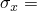 = 68.95 MPa（10000 lb/in²），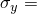 = 206.84 MPa（30000 lb/in²）处穿透屈服面。由于屈服面的扩展，下一个增量是弹性的。 |

**表3.2.2-2** 使用ORNL塑性理论的"精确"和数值结果比较——*y*方向上的应力和应变。
| 数值解 | "精确"解 | 增量 |
| --- | --- | --- |
| ，MPa（×10³ lb/in²） | (%) | ，MPa（×10³ lb/in²） | (%) | 类型 |
| 0.00 (0.00) | 0.0300 | 0.00 (0.00) | 0.0300 | 弹性 |
| 0.04 (0.01) | 0.1111 | 0.00 (0.00) | 0.1108 | 塑性 |
| 0.04 (0.01) | 0.1923 | 0.00 (0.00) | 0.1922 | 塑性 |
| 0.04 (0.01) | 0.2734 | 0.00 (0.00) | 0.2734 | 塑性 |
| 0.04 (0.01) | 0.3545 | 0.00 (0.00) | 0.3545 | 塑性 |
| 17.24 (2.50) | 0.3437 | 17.24 (2.50) | 0.3437 | 弹性 |
| 206.84 (30.00)* | 0.2245 | 206.84 (30.00) | 0.2245 | 弹性 |
| 224.08 (32.50) | 0.2137 | 224.08 (32.50) | 0.2135 | 弹性 |
| 241.32 (35.00) | 0.0313 | 241.32 (35.00) | 0.0319 | 塑性 |
| 258.55 (37.50) | 0.2914 | 258.55 (37.50) | 0.2930 | 塑性 |
| 275.79 (40.00) | 0.5537 | 275.79 (40.00) | 0.5564 | 塑性 |
| 293.03 (42.50) | 0.8172 | 293.03 (42.50) | 0.8211 | 塑性 |
| 310.26 (45.00) | 1.0811 | 310.26 (45.00) | 1.0860 | 塑性 |
| 327.51 (47.50) | 1.3450 | 327.50 (47.50) | 1.3508 | 塑性 |
| *在 = 68.95 MPa（10000 lb/in²）， = 206.84 MPa（30000 lb/in²）处穿透屈服面。由于屈服面的扩展，下一个增量是弹性的。 |

### 图表

**图3.2.2-1** ORNL塑性解的–平面中的双轴应力路径。

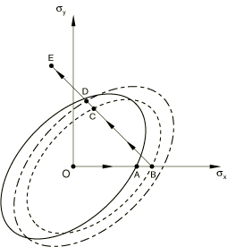

