# 3.2.3 单向钢筋混凝土板

**产品：** Abaqus/Standard   Abaqus/Explicit

本问题说明了在Abaqus/Standard中使用 smeared crack 模型和在Abaqus/Explicit中使用脆性裂缝模型来建模钢筋混凝土，包括混凝土的开裂、钢筋/混凝土相互作用使用"拉伸刚化"概念，以及钢筋屈服。建模的结构是简支板，仅沿一个方向配筋。板承受四点弯曲。混凝土开始开裂时发生的局部能量释放和钢筋-混凝土相互作用在确定结构从其初始可恢复变形到塌陷之间的响应中非常重要。该问题基于Jain和Kennedy（1974）的实验，并已由其他人进行了数值分析（Gilbert和Warner，1978，以及Crisfield，1982）。

### 问题描述

板的尺寸和配筋布局如图3.2.3-1所示。问题的对称性表明只需要对板的一半进行建模。

我们假定响应本质上是单向的，但在Abaqus/Standard中将板建模为梁、壳、连续体和连续体壳，以提供钢筋混凝土建模能力的验证。响应在板的中心区域将是均匀的，因此简单的网格就足够了。梁和壳模型在半板上使用五个单元。沿板厚度方向的混凝土积分点数设置为9个，而不是默认的5个。这在裂缝沿厚度方向扩展时提供了更平滑的响应。

实体单元模型使用二阶单元或减缩积分线性单元，因为这是一个弯曲问题，一阶完全积分单元在建模弯曲方面做得不好。沿板厚度使用两个二阶单元，因此在厚度方向有足够的应力计算点使响应相当平滑（就像梁和壳模型中一样）。沿半板再次使用五个单元。由于弯曲是主要的变形模式，需要沿模型厚度方向至少四个减缩积分线性单元（C3D8R或CPS4R）才能充分捕获响应。使用四种不同的CPS4R网格来评估结果对网格细化的敏感性：4×10网格、4×20网格、8×10网格和4×40网格。

#### 材料

材料属性取自Gilbert和Warner（1978），如表3.2.3-1所示。Abaqus/Explicit中的混凝土开裂模型允许无限抗压强度。这是一个合理的假设，因为结构的行为主要由弯曲下板中拉伸导致的开裂控制。

混凝土钢筋相互作用和开裂过程中的能量释放效应在Abaqus中间接建模，方法是在素混凝土模型中添加拉伸刚化，如图3.2.3-2所示。此方法在["混凝土的非弹性本构模型，" Abaqus理论指南第4.5.1节](../stm/stm-link.md#stm-mat-concrete)；和["混凝土 smeared 裂缝，" Abaqus分析用户指南第23.6.1节](../usb/usb-link.md#usb-mat-cconcrete)（对于Abaqus/Standard）；和["混凝土和其他脆性材料的裂缝模型，" Abaqus理论指南第4.5.3节](../stm/stm-link.md#stm-mat-cracking)；和["混凝土裂缝模型，" Abaqus分析用户指南第23.6.2节](../usb/usb-link.md#usb-mat-ccracking)（对于Abaqus/Explicit）中有详细描述。遵循Crisfield（1982），本问题使用最简单的拉伸刚化模型，即在混凝土开裂失效后拉伸强度线性降低。为了说明拉伸刚化参数对显式动态响应的影响，在Abaqus/Explicit分析中使用了三个不同的值（5×10⁻⁴、8×10⁻⁴和11×10⁻⁴）作为混凝土失去所有拉伸强度时的失效后应变。Abaqus/Standard分析使用5.7×10⁻⁴（约10倍失效应变）的值，这是标准钢筋混凝土设计的典型假设，与板的实验测量响应给出合理的匹配。为说明目的，也在没有拉伸刚化效应的情况下运行Abaqus/Standard分析，尽管这不推荐作为实际案例的模型。

由于显式动态问题涉及纯弯曲，响应由垂直于裂缝面的材料行为控制。裂缝平面内材料的剪切行为并不重要。因此，只要使用合理的值，Abaqus/Explicit中剪切 retention 的选择对结果影响很小。我们选择使用的剪切 retention 在等于拉伸刚化耗尽时的裂缝张开值的100倍时耗尽。

### 求解控制参数和加载

钢筋混凝土解决方案涉及载荷-位移响应不稳定的区域。Abaqus/Standard中的Riks过程（在["改进的Riks算法，" Abaqus理论指南第2.3.2节](../stm/stm-link.md#stm-anl-modifiedriks)中有描述）旨在克服在响应不稳定阶段获得解的困难。它假定比例加载，并通过沿载荷-位移平衡线 step 并将载荷幅度作为未知数来开发解决方案。当使用Riks方法时，数据行上给出的各种载荷的相对幅度指定加载模式。实际幅度作为解决方案的一部分计算。用户必须规定载荷并提供将对初始载荷增量给出合理估计的解决方案参数。如果响应是线性的，第一个载荷增量将是初始时间增量与时间周期之比乘以实际载荷幅度。如果响应是非线性的，初始载荷增量将有些不同，取决于非线性的程度。本分析中的终止条件通过在步中间指定最大所需位移为9 mm（0.35 in）来设置。这足以确保达到极限条件。

由于Abaqus/Explicit是一个动态分析程序，在本例中我们对静态解决方案感兴趣，因此必须注意以避免显著的惯性效应。对于此类分析，其中静态载荷-位移响应是不稳定的，如果使用力控制加载（即使力缓慢斜坡上升），可能难以使用动态过程避免惯性效应。位移控制加载通常是可行的替代方案。在本问题中，板通过在0.1秒内将速度从0.0线性增加到5.0 in/second来加载。此加载导致跨度中点挠度约0.3 in。加载足够慢以确保获得准静态解决方案。

边界条件在处对称（所有沿的节点规定了），并且对于C3D8R模型，在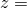 = 1.5 in处对称（所有沿 = 1.5 in的节点规定了）。所有沿底边（ = 0.75 in）在 = 15 in处的节点被给定条件。

### 结果与讨论

所有分析的结果在以下部分中讨论。

#### Abaqus/Standard结果

Abaqus/Standard分析与实验响应的比较基于板中部挠度与该截面每单位宽度上的弯矩的关系图。图3.2.3-3显示了不包括拉伸刚化的分析，图3.2.3-4显示了按照上述方式包括拉伸刚化的梁、壳和连续体模型的分析。Jain和Kennedy（1974）获得的实验数据也绘制在这些图上。在没有拉伸刚化的分析中，混凝土的初始开裂导致板强度丧失，而包括拉伸刚化则消除了载荷下降，即使混凝土正在开裂。裂缝在钢筋屈服之前迅速穿过板扩展，直到塌陷发生。所有模型都很好地预测了塌陷载荷，各种几何模型在有和没有拉伸刚化的情况下都相当一致。当比较两个图时，包括拉伸刚化获得的实际响应预测的改进是明显的，图形地说明了在模型中包含此效应的必要性。

连续体壳单元分析的结果与从S8R模型获得的结果相似。

#### Abaqus/Explicit结果

图3.2.3-5显示了Abaqus/Explicit分析中使用的4×20网格。图3.2.3-6显示了 = 0.1时的变形形状，这是完全加载应用的点。

使用拉伸刚化值为8×10⁻⁴和CPS4R单元的四种不同网格密度的板的载荷-挠度响应如图3.2.3-7所示。沿长度有10个单元的网格预测的极限载荷略高于沿长度有20个单元的网格。沿板长度有40个单元的网格给出的结果与沿长度有20个单元的网格给出的结果几乎相同。因此，接下来描述的拉伸刚化研究使用4×20网格进行。

使用4×20网格的CPS4R单元的三种不同拉伸刚化值的结果与实验数据在图3.2.3-8中比较。很明显，使用的拉伸刚化越少，在混凝土开裂期间载荷-挠度响应就越软。拉伸刚化的中间值似乎与实验数据最匹配。在分析后半部分期间，载荷-挠度响应几乎完全由钢筋中的屈服控制，因此几乎与拉伸刚化无关。

使用4×20网格的C3D8R单元与各种拉伸刚化值的结果与实验数据在图3.2.3-9中比较。使用2×10网格的S4R单元与各种拉伸刚化值的结果与实验数据在图3.2.3-10中比较。C3D8R和S4R单元的结果与使用CPS4R单元获得的结果相似。

### 输入文件

##### **Abaqus/Standard输入文件**

[onewayconcreteslab_b21.inp](../eif/onewayconcreteslab_b21.inp)

板建模为带拉伸刚化的梁。

[onewayconcreteslab_s8r.inp](../eif/onewayconcreteslab_s8r.inp)

板使用S8R型壳单元建模，带拉伸刚化。

[onewayconcreteslab_cps8.inp](../eif/onewayconcreteslab_cps8.inp)

板使用CPS8单元类型（平面应力）带拉伸刚化。

[onewayconcreteslab_cpe8.inp](../eif/onewayconcreteslab_cpe8.inp)

板使用CPE8单元类型（平面应变）带拉伸刚化。

[onewayconcreteslab_c3d20.inp](../eif/onewayconcreteslab_c3d20.inp)

板使用C3D20单元类型带拉伸刚化。

[onewayconcreteslab_sc8r.inp](../eif/onewayconcreteslab_sc8r.inp)

板使用SC8R型壳单元建模，不带拉伸刚化。

##### **Abaqus/Explicit输入文件**

[jainkennedy1.inp](../eif/jainkennedy1.inp)

板使用40个CPS4R单元（4×10网格）建模，拉伸刚化值为8.0×10⁻⁴。

[jainkennedy2.inp](../eif/jainkennedy2.inp)

板使用80个CPS4R单元（4×20网格）建模，拉伸刚化值为8×10⁻⁴。

[jainkennedy3.inp](../eif/jainkennedy3.inp)

板使用80个CPS4R单元（8×10网格）建模，拉伸刚化值为8×10⁻⁴。

[jainkennedy4.inp](../eif/jainkennedy4.inp)

板使用80个CPS4R单元（4×20网格）建模，拉伸刚化值为5×10⁻⁴。

[jainkennedy5.inp](../eif/jainkennedy5.inp)

板使用80个CPS4R单元（4×20网格）建模，拉伸刚化值为11×10⁻⁴。

[jainkennedy6.inp](../eif/jainkennedy6.inp)

板使用80个C3D8R单元（4×20网格）建模，拉伸刚化值为5×10⁻⁴。

[jainkennedy7.inp](../eif/jainkennedy7.inp)

板使用80个C3D8R单元（4×20网格）建模，拉伸刚化值为8×10⁻⁴。

[jainkennedy8.inp](../eif/jainkennedy8.inp)

板使用80个C3D8R单元（4×20网格）建模，拉伸刚化值为11×10⁻⁴。

[jainkennedy9.inp](../eif/jainkennedy9.inp)

板使用160个CPS4R单元（4×40网格）建模，拉伸刚化值为8×10⁻⁴。

[jainkennedy10.inp](../eif/jainkennedy10.inp)

板使用20个S4R单元（2×10网格）建模，拉伸刚化值为5×10⁻⁴。

[jainkennedy11.inp](../eif/jainkennedy11.inp)

板使用20个S4R单元（2×10网格）建模，拉伸刚化值为8×10⁻⁴。

[jainkennedy12.inp](../eif/jainkennedy12.inp)

板使用20个S4R单元（2×10网格）建模，拉伸刚化值为11×10⁻⁴。

### 参考文献

Crisfield, M. A., "Variable Step-Lengths for Nonlinear Structural Analysis," Report 1049, Transport and Road Research Lab, Crowthorne, England, 1982.

Gilbert, R. J., and R. F. Warner, "Tension Stiffening in Reinforced Concrete Slabs," Journal of Structural Division, American Society of Civil Engineering, vol. 104, ST12, pp. 1885–1900, 1978.

Jain, S. C., and J. B. Kennedy, "Yield Criterion for Reinforced Concrete Slabs," Journal of Structural Division, American Society of Civil Engineering, vol. 100, ST3, pp. 631–644, 1974.

### 表格

**表3.2.3-1** 单向板假定的材料属性。配筋率（钢材体积：混凝土体积）7.2×10⁻³。
| 混凝土属性 |
| --- |
| 杨氏模量： | 29 GPa（4.2×10⁶ lb/in²） |
| 泊松比： | 0.18 |
| 屈服应力： | 18.4 MPa（2670 lb/in²） |
| 失效应力： | 32 MPa（4640 lb/in²） |
| 失效时的塑性应变： | 1.3×10⁻³ |
| 单轴拉伸与压缩失效应力之比： | 6.25×10⁻² |
| 密度： | 2400 kg/m³（2.246×10⁻⁴ lbf s²/in⁴） |
| 开裂失效应力： | 2 MPa（290 lb/in²） |
| 在Abaqus/Explicit分析中，"拉伸刚化"假定为在直接开裂应变为5×10⁻⁴、8×10⁻⁴或11×10⁻⁴时应力线性降至零。 |
| 钢材（钢筋）属性 |
| 杨氏模量： | 200 GPa（29×10⁶ lb/in²） |
| 屈服应力： | 220 MPa（31900 lb/in²）（理想塑性） |

### 图表

**图3.2.3-1** 单向钢筋混凝土板。

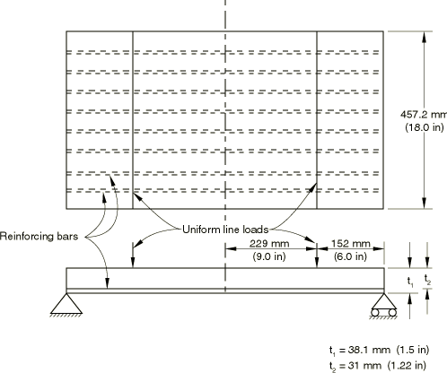

**图3.2.3-2** 拉伸刚化效应。

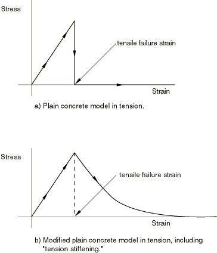

**图3.2.3-3** 无拉伸刚化时的弯矩-挠度响应（Abaqus/Standard）。

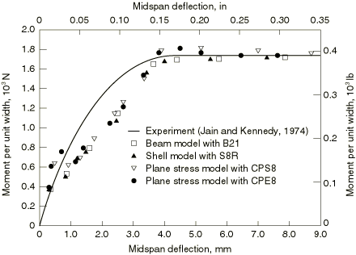

**图3.2.3-4** 带拉伸刚化时的弯矩-挠度响应（Abaqus/Standard）。

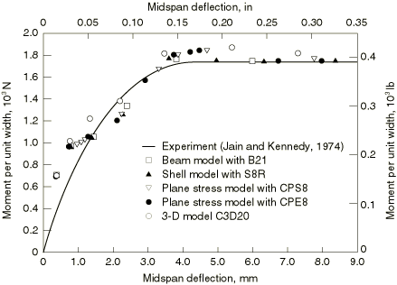

**图3.2.3-5** 未变形的CPS4R 4×20网格（Abaqus/Explicit）。

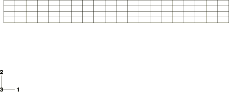

**图3.2.3-6** 变形的CPS4R网格（Abaqus/Explicit）。变形放大5倍。

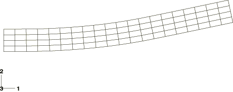

**图3.2.3-7** Jain和Kennedy板的弯矩-挠度响应；网格细化的影响。CPS4R单元（Abaqus/Explicit）。

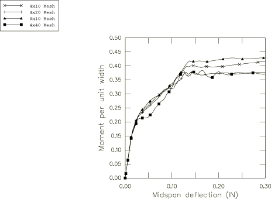

**图3.2.3-8** Jain和Kennedy板的弯矩-挠度响应；4×20网格上拉伸刚化的影响。CPS4R单元（Abaqus/Explicit）。

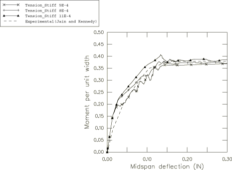

**图3.2.3-9** Jain和Kennedy板的弯矩-挠度响应；4×20网格上拉伸刚化的影响。C3D8R单元（Abaqus/Explicit）。

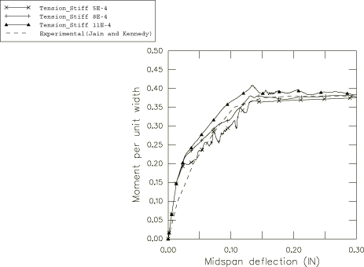

**图3.2.3-10** Jain和Kennedy板的弯矩-挠度响应；2×10网格上拉伸刚化的影响。S4R单元（Abaqus/Explicit）。

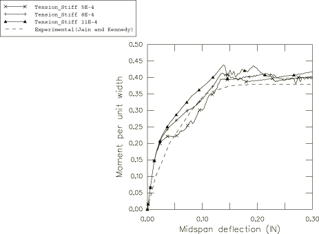

