# 3.2.4 饱和粘土的三轴测试

**产品：** Abaqus/Standard

本例是Abaqus中提供的改进Cam-clay塑性模型的简单演示。Cam-clay理论对饱和粘土的实验观察行为提供了合理的匹配，属于由Roscoe及其同事开发的关键状态塑性模型系列（见Roscoe和Burland——1968——以及Schofield和Wroth——1968）。

Abaqus中的Cam-clay模型允许原始Roscoe模型的两个扩展：在关键状态湿润侧的屈服椭圆的"capping"，以及在屈服函数中考虑第三个应力不变量。改进Cam-clay理论的这两个扩展在["非金属塑性，" Abaqus理论指南第4.4节](../stm/stm-link.md#stmnonmetalchap)中有记录。它们都包含在本例中。

Abaqus中使用的一般改进Cam-clay屈服函数为

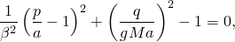

其中三个应力不变量是等效压力应力，由下式给出

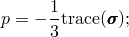

等效剪切应力，由下式给出

其中是偏应力（）；以及第三个应力不变量，

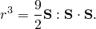

函数中的其他参数是*a*，即关键状态时的等效压力应力值；*M*，定义关键状态线斜率的材料参数；，用于在关键状态湿润侧提供不同形状屈服椭圆的"capping"参数；以及*g*，依赖于第三个应力不变量的函数，用于定义压缩和扩展中不同的屈服面尺寸：

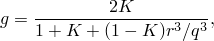

其中*K*是材料参数。

"标准"Cam-clay屈服函数有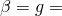 ≥ 1。在屈服面表达式中包含这些参数将表达式推广到允许在各种加载条件下更紧密地匹配数据。

### 问题描述

本例使用的材料参数如下：

弹性：

| 对数体积模量，： | 0.026 |
| --- | --- |
| 泊松比，： | 0.3 |

塑性：

| 对数硬化模量，： | 0.174 |
| --- | --- |
| 关键状态比，*M*： | 1.0 |
| 湿润capping参数，： | 0.5 |
| 第三应力不变量参数，*K*： | 0.75 |
| 初始超固结参数，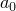： | 58.3 kN/m²（8.455 lb/in²） |

本例研究一个简单的三轴测试：一个轴对称土样，包含在两个光滑压板之间，其中一个固定，另一个有规定的垂直运动，正为伸长，负为压缩。首先通过恒压加载土样。然后移动上压板，向下测试三轴压缩或向上测试三轴扩展。图3.2.4-1定义了问题几何。分析旨在模拟排水三轴测试；因此，可以使用Abaqus中的纯位移单元运行。

由于假定压板是光滑的且土是均匀的，应力在整个模型中将恒定。为简单起见，忽略大位移效应。

### 结果与讨论

对于两种情况，初始压力应力通过初始条件给出，并包括初始地应力步（["地应力状态，" Abaqus分析用户指南第6.8.2节](../usb/usb-link.md#usb-anl-ageostatstress)），其中围压施加于样本的外表面。在具有初始应力的土分析开始时，Abaqus检查规定的应力是否违反初始屈服面。如果违反，则修改硬化值（上述屈服面定义中的*a*）以使屈服面与应力状态一致。为了测试代码的此部分，在本例中，当使用"标准"Cam-clay塑性理论时初始应力状态位于初始屈服面内，但当使用"capped"塑性理论时，它违反了给定初始超固结参数的屈服准则。值的调整如图3.2.4-2所示。

建议在土分析开始时始终包括地应力过程，以确保最初规定的应力状态与初始加载之间的兼容性。

#### 排水三轴样本的压缩

在本例中，在分析的第二步中，上压板向下移动了土样高度的一半。材料响应如图3.2.4-3所示。根据使用的理论，材料随着位移增加而或多或少地逐渐屈服，直到达到关键状态（即当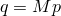时：见 图3.2.4-2），此时响应是理想塑性的。"Capping"对材料响应有强烈影响：对于规定的加载路径（图3.2.4-2上的线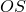），"capped"理论预测在归一化垂直位移为0.18时将达到关键状态，而"标准"Cam-clay理论预测直到土样高度减少一半才会达到关键状态。应该强调的是，这些结果是使用小位移假设获得的；虽然应力-应变响应是准确的，但载荷-位移响应不准确，因为应变远远超出了线性化应变-位移关系合理的范围。

#### 排水三轴样本的扩展

在本例中，在第二步中上压板向上移动。这降低了土中的围压，因此比压缩情况更低的等效剪切应力值达到关键状态。这在图3.2.4-3中清楚可见。这里感兴趣的是第三个应力不变量对塑性解决方案的影响：这种依赖性通过参数*K*指定（完整的讨论见[Abaqus理论指南](../stm/stm-link.md#stm)）。由于本例是纯三轴扩展，临界状态条件变为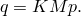。如图3.2.4-4所见，这通过在*p*–*q*空间中压平屈服面来降低可达到的等效剪切应力状态。对于这里规定的加载路径，对于"标准"Cam-clay理论，解决方案沿图3.2.4-4上的线，对于包括第三个应力不变量依赖的情况，沿线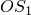。

### 输入文件

[triaxialtestclay_cax8r.inp](../eif/triaxialtestclay_cax8r.inp)

使用"标准"改进Cam-clay理论建模的排水三轴土样本的压缩。本模型使用单个CAX8R单元。

[triaxialtestclay_caxa8r1.inp](../eif/triaxialtestclay_caxa8r1.inp)

使用CAXA元素的相同分析。使用单个CAXA8R1单元。

本例中描述的其他情况的输入文件通过在Cam-clay模型定义中包含参数和*K*来创建。

### 参考文献

Roscoe, K. H., and J. B. Burland, *Stress-strain Behavior of `Wet Clay', *Engineering Plasticity, J. Heyman and F. A. Leckie, Editors, Cambridge University Press, 1968.

Schofield, A., and C. P. Wroth, *Critical State Soil Mechanics, *McGraw-Hill, 1968.

### 图表

**图3.2.4-1** 带光滑压板的三轴测试。

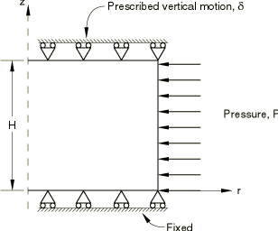

**图3.2.4-2** 三轴压缩解的屈服面轮廓。

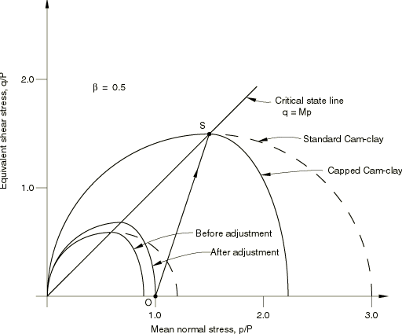

**图3.2.4-3** 改进Cam-clay塑性响应。

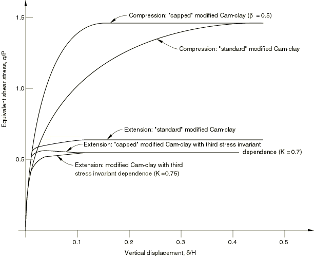

**图3.2.4-4** 三轴扩展解的屈服面轮廓。

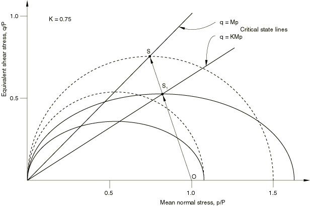

