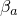
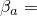
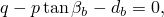
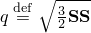
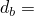
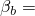
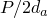
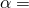
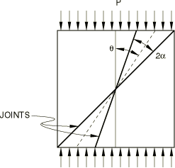
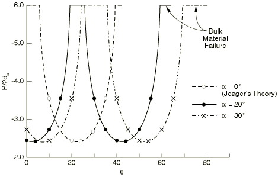

# 3.2.5 节理材料的单轴测试

**产品：** Abaqus/Standard

本例说明了Abaqus中节理材料模型获得的基本材料行为。我们构建了一个包含两组节理并承受单轴应力条件的材料的失效包络。模型的完整描述在["节理材料的本构模型，" Abaqus理论指南第4.5.4节](../stm/stm-link.md#stm-mat-jointedmat)中给出。

### 问题描述

我们考虑一个承受单轴压缩/拉伸的材料样本。材料有两组包含角度为2的弱点平面。我们寻求构建材料的失效包络，其中弱点平面的取向（，如图3.2.5-1所示）变化。

在Abaqus模型中，滑动在节理系统上的失效面定义为

其中是穿过节理的压力应力，是节理中的剪切应力大小，是节理的摩擦角， = 1000（单位不重要）， = 45°，并且节理中的塑性流动是相关的。

块体材料的行为基于Drucker-Prager失效准则

其中是Mises等效偏应力（这里是偏应力），是等效压力应力，是块体材料的摩擦角，是块体材料的内聚力。对于本问题，我们假定 = 8000， = 45，并且块体材料的塑性流动是相关的。

当所有节理都闭合时，材料假定为各向同性线性弹性，杨氏模量为3×10⁵，泊松比为0.3。当节理张开时，材料假定对于穿过节理系统的直接应变或与该方向相关的剪切没有弹性刚度。因此，敞开的节理创建各向异性弹性响应。

本例中执行的每个测试都使用单位尺寸的立方体（一个C3D8单元）进行。在立方体的节点上规定位移以模拟均匀变形和应力条件。

### 结果与讨论

图3.2.5-2显示了压缩失效应力随（节理平分线与加载方向形成的角度）的变化。为 = 0、20、30°开发了压缩失效包络。显然，对于节理相对于加载方向的某些取向范围，沿弱点平面的失效变得越来越不可能，块体材料的失效首先发生。可以注意到，当 = 0时对应于Jeager（1960）提出的单弱点平面理论。

当加载为拉伸时，材料不能承受任何应力，因为节理容易张开。

### 输入文件

[jointedmat_comp_alpha20thete0.inp](../eif/jointedmat_comp_alpha20thete0.inp)

压缩测试， = 20°且 = 0°。

[jointedmat_comp_alpha20thete20.inp](../eif/jointedmat_comp_alpha20thete20.inp)

压缩测试， = 20°且 = 20°。

[jointedmat_tens_alpha0theta10.inp](../eif/jointedmat_tens_alpha0theta10.inp)

拉伸测试， = 0°且 = 10°。

[jointedmat_tens_alpha20theta20.inp](../eif/jointedmat_tens_alpha20theta20.inp)

拉伸测试， = 20°且 = 20°。

[jointedmat_comp_pert.inp](../eif/jointedmat_comp_pert.inp)

jointedmat_comp_alpha20thete0.inp的版本，包括线性摄动步。

[jointedmat_tens_pert.inp](../eif/jointedmat_tens_pert.inp)

jointedmat_tens_alpha0theta10.inp的版本，包括线性摄动步。

本例问题中分析的其他情况可以通过改变节理的取向生成。

### 参考文献

Jeager, J. C., "Shear Failure of Anisotropic Rocks," Geological Magazine, vol. 97, pp. 65–72, 1960.

### 图表

**图3.2.5-1** 问题几何。

**图3.2.5-2** 单轴压缩失效包络。

