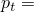
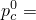
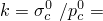
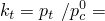
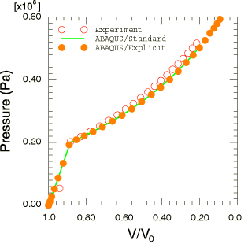
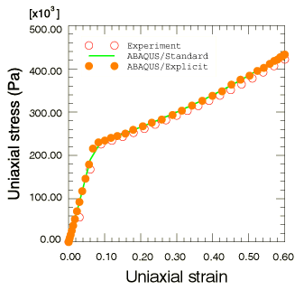
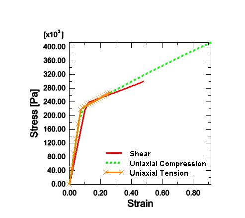
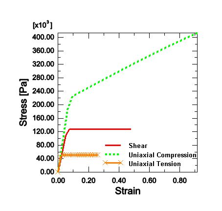

# 3.2.7 可压碎泡沫试件的简单测试

**产品：** Abaqus/Standard  Abaqus/Explicit

本示例有两个目的：说明Abaqus中可压碎泡沫塑性模型获得的基本材料行为，并概述泡沫材料参数的简单校准程序。["可压碎泡沫塑性模型，" Abaqus分析用户指南第23.3.5节](../usb/usb-link.md#usb-mat-ccrushfoam)，包含模型的摘要，完整描述见["可压碎泡沫模型，" Abaqus理论指南第4.4.6节](../stm/stm-link.md#stm-mat-crushfoams)。

### 问题描述

本示例中的简单测试使用单位尺寸的立方体（Abaqus/Standard使用一个C3D8单元，Abaqus/Explicit使用一个C3D8R单元）进行。在立方体的节点上规定位移以模拟均匀变形和应力条件。使用Abaqus/Standard分析了四种不同的载荷情况：静水压缩、单轴压缩、单轴拉伸和纯剪切。这些载荷情况使用体积强化和各向同性强化模型进行分析。由于泡沫材料发生非常大的变形，在该大变形分析中考虑几何非线性。由于泡沫模型假定非关联流动，因此激活非对称存储和求解方案。单轴压缩和静水压缩情况也分别使用Abaqus/Explicit体积强化模型和各向同性强化模型进行分析。

### 材料参数的校准

弹性由杨氏模量*E*和弹性泊松比定义。对于具有体积强化的可压碎泡沫模型，初始屈服面由*k*定义，即单轴压缩屈服应力与静水压缩屈服应力的比值（这是的初始值）；以及，即静水拉伸屈服应力与静水压缩屈服应力的比值。对于各向同性强化模型，初始屈服面仅由*k*定义，但用户需要提供塑性泊松比，即单轴压缩时横向塑性应变与纵向塑性应变的比值。屈服面的演化由单轴压缩时的屈服应力与塑性应变曲线定义。对于率相关版本的模型，我们还需要逆粘度*D*和粘性幂律系数*p*。

该模型针对泡沫（Dytherm 2.5）进行校准，我们只有慢（静态）应变率下的静水压缩和单轴压缩数据。率无关校准如下进行。杨氏模量和弹性泊松比可从实验数据轻松获得。从静水压缩测试中，我们立即获得初始屈服压力。从单轴压缩测试中，我们获得单轴压缩初始屈服应力。对于体积强化模型，我们还需要静水拉伸强度。在没有拉伸测试数据的情况下，我们假定拉伸强度是静水压缩屈服强度的十分之一。对于各向同性强化模型，我们根据实验观察选择零塑性泊松比，即样本的单轴压缩几乎没有横向应变。后续屈服面由使用单轴压缩数据表征的硬化曲线定义。上述校准为Dytherm 2.5产生以下材料参数：
-  3.0 MPa
-  0.2
-  0.22 MPa
-  0.02 MPa
-  0.2 MPa（这是的初始值）
-  1.1
-  0.1（用于体积强化模型）
-  0（用于各向同性强化模型）

要校准率相关参数*D*和*p*，需要在不同应变率下进行多次类似配置的测试。目前没有该材料的此类数据。

### 结果与讨论

使用上述校准获得的结果与Bilkhu（1987）的静态实验在[图3.2.7-1](ch03s02ach180.md#sxmcrushfoam-hydrostatic)（静水压缩）和[图3.2.7-2](ch03s02ach180.md#sxmcrushfoam-uniaxial)（单轴压缩）中进行比较。上面显示的Abaqus/Explicit结果从体积强化模型获得。两种测试都观察到良好的一致性。[图3.2.7-3](ch03s02ach180.md#sxmcrushfoam-volcomp)和[图3.2.7-4](ch03s02ach180.md#sxmcrushfoam-isocomp)分别显示了体积强化模型和各向同性强化模型对三种不同单调加载路径响应的比较：单轴压缩、纯剪切和单轴拉伸。应变轴表示主直接应力方向的变形。体积强化模型正确预测纯剪切的完全塑性响应，以及任何产生负压力应力状态（如单轴拉伸）的加载条件，而对任何产生正压力应力状态的加载条件发生硬化。另一方面，各向同性强化模型预测所有加载条件下的硬化行为。

### 输入文件

[crushablefoam_hydrostatic.inp](../eif/crushablefoam_hydrostatic.inp)

使用体积强化模型的Abaqus/Standard静水压缩测试。

[crushablefoam_unicomp.inp](../eif/crushablefoam_unicomp.inp)

使用体积强化模型的Abaqus/Standard单轴压缩测试。

[crushablefoam_unitens.inp](../eif/crushablefoam_unitens.inp)

使用体积强化模型的Abaqus/Standard单轴拉伸测试。

[crushablefoam_shear.inp](../eif/crushablefoam_shear.inp)

使用体积强化模型的Abaqus/Standard纯剪切测试。

[crushablefoam_iso_hydrostatic.inp](../eif/crushablefoam_iso_hydrostatic.inp)

使用各向同性强化模型的Abaqus/Standard静水压缩测试。

[crushablefoam_iso_unicomp.inp](../eif/crushablefoam_iso_unicomp.inp)

使用各向同性强化模型的Abaqus/Standard单轴压缩测试。

[crushablefoam_iso_unitens.inp](../eif/crushablefoam_iso_unitens.inp)

使用各向同性强化模型的Abaqus/Standard单轴拉伸测试。

[crushablefoam_iso_shear.inp](../eif/crushablefoam_iso_shear.inp)

使用各向同性强化模型的Abaqus/Standard纯剪切测试。

[crushfoamvol_hydro.inp](../eif/crushfoamvol_hydro.inp)

使用体积强化模型的Abaqus/Explicit静水压缩测试。

[crushfoamvol_ucomp.inp](../eif/crushfoamvol_ucomp.inp)

使用体积强化模型的Abaqus/Explicit单轴压缩测试。

[crushfoamiso_hydro.inp](../eif/crushfoamiso_hydro.inp)

使用各向同性强化模型的Abaqus/Explicit静水压缩测试。

[crushfoamiso_ucomp.inp](../eif/crushfoamiso_ucomp.inp)

使用各向同性强化模型的Abaqus/Explicit单轴压缩测试。

[crushfoamvol_hydro_c3d8.inp](../eif/crushfoamvol_hydro_c3d8.inp)

使用体积强化模型的Abaqus/Explicit静水压缩测试，仅用于测试C3D8单元的性能。

[crushfoamvol_ucomp_c3d8.inp](../eif/crushfoamvol_ucomp_c3d8.inp)

使用体积强化模型的Abaqus/Explicit单轴压缩测试，仅用于测试C3D8单元的性能。

[crushfoamiso_hydro_c3d8.inp](../eif/crushfoamiso_hydro_c3d8.inp)

使用各向同性强化模型的Abaqus/Explicit静水压缩测试，仅用于测试C3D8单元的性能。

[crushfoamiso_ucomp_c3d8.inp](../eif/crushfoamiso_ucomp_c3d8.inp)

使用各向同性强化模型的Abaqus/Explicit单轴压缩测试，仅用于测试C3D8单元的性能。

[crushfoamvol_hydro_c3d8i.inp](../eif/crushfoamvol_hydro_c3d8i.inp)

使用体积强化模型的Abaqus/Explicit静水压缩测试，仅用于测试C3D8I单元的性能。

[crushfoamvol_ucomp_c3d8i.inp](../eif/crushfoamvol_ucomp_c3d8i.inp)

使用体积强化模型的Abaqus/Explicit单轴压缩测试，仅用于测试C3D8I单元的性能。

[crushfoamiso_hydro_c3d8i.inp](../eif/crushfoamiso_hydro_c3d8i.inp)

使用各向同性强化模型的Abaqus/Explicit静水压缩测试，仅用于测试C3D8I单元的性能。

[crushfoamiso_ucomp_c3d8i.inp](../eif/crushfoamiso_ucomp_c3d8i.inp)

使用各向同性强化模型的Abaqus/Explicit单轴压缩测试，仅用于测试C3D8I单元的性能。

### 参考文献

Bilkhu, S., Private Communication, 1987.

### 图表

**图3.2.7-1** 静水压缩测试。

**图3.2.7-2** 单轴压缩测试。

**图3.2.7-3** 三种不同加载路径的体积强化模型响应比较。

**图3.2.7-4** 三种不同加载路径的各向同性强化模型响应比较。

